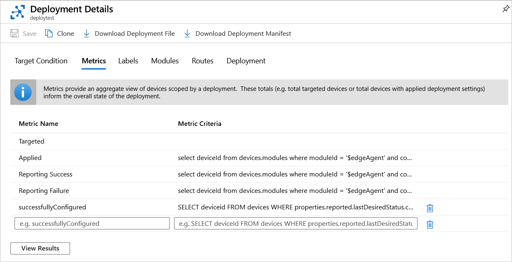
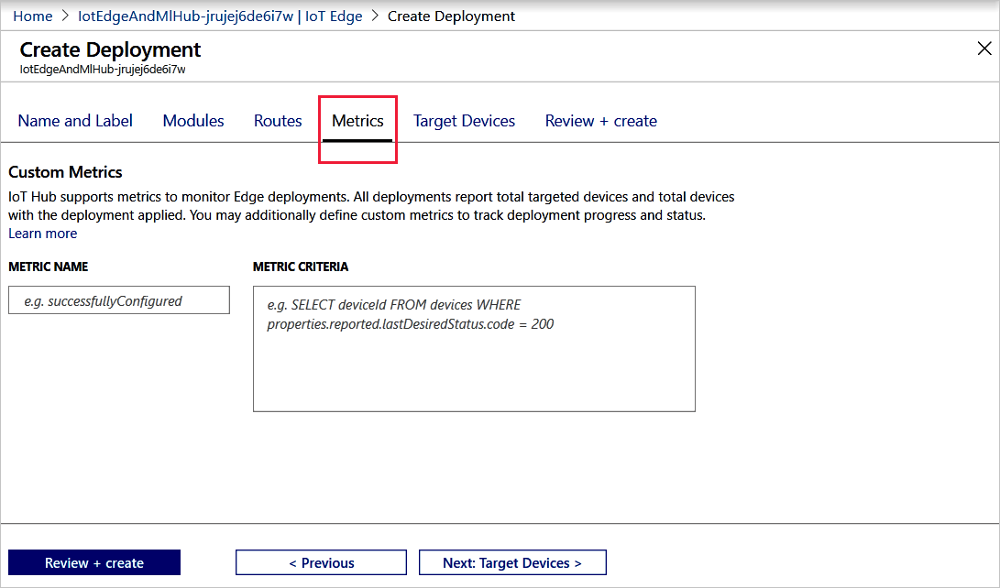

# Monitor IoT Edge deployments

Azure IoT Edge provides reporting that let you monitor real-time information on the modules deployed to your IoT Edge devices. The IoT Hub service retrieves status from the IoT Edge devices and makes them available to the operator. In addition to the need to monitor deployments made to individual devices, monitoring is important for [deployments made at scale](module-deployment-monitoring.md) that include automatic deployments and layered deployments.

You must know the connectivity state for the devices and the status of their modules, also their versions and the times  devices connected and disconnected. This information is provided by the edgeHub runtime module and should satisfy the needs for monitoring single device deployments.

Automatic deployments are deployments made to devices that satisfy a target condition. Target conditions are configured using tags specified in the device twin.

Layered deployments have addition criterion such as to overwrite a module if a particular criterion is satisfied. This criteria is configured by adding desired properties in the module twin.

The IoT Hub service collects the data reported by device and module twins and provides summary counts of the various states that devices may have in the deployment configuration. This data is organized into four groups of metrics:

| Type | Description |
| --- | ---|
| Targeted | Shows the IoT Edge devices that match the Deployment targeting condition. |
| Applied | Shows the targeted IoT Edge devices that are not targeted by another deployment of higher priority. |
| Reporting Success | Shows the IoT Edge devices that have reported that the modules have been deployed successfully. |
| Reporting Failure | Shows the IoT Edge devices that have reported that one or more modules haven't been deployed successfully. To further investigate the error, connect remotely to those devices and view the log files. |

You can also define your own custom metrics.

The IoT Hub service makes this data available in the Azure portal and in the Azure CLI.

## Monitor a deployment in the Azure portal

To view the details of a deployment and monitor the devices running it, use the following steps:

1. Sign in to the [Azure portal](https://portal.azure.com) and navigate to your IoT Hub.
1. Select **IoT Edge** from the left pane menu.
1. Select the **IoT Edge deployments** tab.
1. Inspect the deployment list. For each deployment, you can view the following details:

    | Column | Description |
    | --- | --- |
    | ID | The name of the deployment. |
    | Type | The type of deployment, either **Deployment** or **Layered Deployment** |
    | Target Condition | The tag used to define targeted devices. |
    | Priority | The priority number assigned to the deployment. |
    | System metrics | Specifies the number of device twins in IoT Hub that match the targeting condition, and **Applied** specifies the number of devices that have had the deployment content applied to their module twins in IoT Hub. |
    | Device Metrics | The number of IoT Edge devices in the deployment  |reporting success or errors from the IoT Edge client runtime. |
    | Custom Metrics | The number of IoT Edge devices in the deployment  |reporting data for any metrics that you defined for the deployment. |
    | Creation Time | The timestamp from when the deployment was created. This timestamp is used to break ties when two deployments have the same priority. |

1. Select the deployment that you want to monitor.  
1. On the **Deployment Details** page, scroll down to the bottom section and select the **Metrics** tab. Use the **Select Metric** drop-down to choose a specific metric. When a metric is selected, the **View** button appears that will list the IoT Edge devices that match the condition for the selected metric.

   

1. Select the **Edit Metrics** button to view and edit the criteria for each metric. Every deployment has four default metrics. In addition, the custom metric `successfullyConfigured` is included for the current deployment.


    | successfullyConfigured | Custom | Shows the number of devices that have a successful status. |

   

### Define a custom metric

You can define custom metrics in the Azure portal when you create a deployment.

1. In your IoT hub, select **IoT Edge** from the left pane menu.
1. Select **Create Deployment** from the upper menu bar.
1. Complete the wizard, and on the **Metrics** tab you can define a custom metric using the example syntax as a guide.

   

## Monitor a deployment with Azure CLI

Use the [az iot edge deployment show](https://docs.microsoft.com/cli/azure/ext/azure-cli-iot-ext/iot/edge/deployment?view=azure-cli-latest#ext-azure-cli-iot-ext-az-iot-edge-deployment-show) command to display the details of a single deployment:

```cli
az iot edge deployment show --deployment-id [deployment id] --hub-name [hub name]
```

The deployment show command takes the following parameters:

* **--deployment-id** - The name of the deployment that exists in the IoT hub. Required parameter.
* **--hub-name** - Name of the IoT hub in which the deployment exists. The hub must be in the current subscription. Switch to the desired subscription with the command `az account set -s [subscription name]`

Inspect the deployment in the command window. The **metrics** property lists a count for each metric that is evaluated by each hub:

* **targetedCount** - A system metric that specifies the number of device twins in IoT Hub that match the targeting condition.
* **appliedCount** - A system metric specifies the number of devices that have had the deployment content applied to their module twins in IoT Hub.
* **reportedSuccessfulCount** - A device metric that specifies the number of IoT Edge devices in the deployment reporting success from the IoT Edge client runtime.
* **reportedFailedCount** - A device metric that specifies the number of IoT Edge devices in the deployment reporting failure from the IoT Edge client runtime.

You can show a list of device IDs or objects for each of the metrics by using the [az iot edge deployment show-metric](https://docs.microsoft.com/cli/azure/ext/azure-cli-iot-ext/iot/edge/deployment?view=azure-cli-latest#ext-azure-cli-iot-ext-az-iot-edge-deployment-show-metric) command:

```cli
az iot edge deployment show-metric --deployment-id [deployment id] --metric-id [metric id] --hub-name [hub name]
```

The deployment show-metric command takes the following parameters:

* **--deployment-id** - The name of the deployment that exists in the IoT hub.
* **--metric-id** - The name of the metric for which you want to see the list of device IDs, for example `reportedFailedCount`.
* **--hub-name** - Name of the IoT hub in which the deployment exists. The hub must be in the current subscription. Switch to the desired subscription with the command `az account set -s [subscription name]`.

## Next steps

Learn how [communicate with EdgeAgent using built-in direct methods](how-to-edgeagent-direct-method.md).
