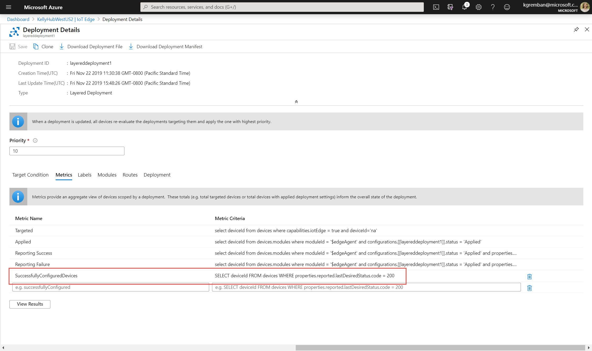

# Monitor IoT Edge deployments

Azure IoT Edge provides metrics that let you monitor real time information on the performance of the modules deployed to your IoT edge devices. You can monitor these metrics in two ways:

* IoT Hub in the Azure portal

* Azure CLI

## Monitor a deployment in the Azure portal

To view the details of a deployment and monitor the devices running it, use the following steps:

1. Sign in to the [Azure portal](https://portal.azure.com) and navigate to your IoT Hub.
1. Select **IoT Edge**.
1. Select the **IoT Edge deployments** tab.

   

1. Inspect the deployment list. For each deployment, you can view the following details:
   * **ID** - the name of the deployment.
   * **Type** - the type of deployment, either **Deployment** or **Layered Deployment**.
   * **Target Condition** - the tag used to define targeted devices.
   * **Priority** - the priority number assigned to the deployment.
   * **System metrics** - **Targeted** specifies the number of device twins in IoT Hub that match the targeting condition, and **Applied** specifies the number of devices that have had the deployment content applied to their module twins in IoT Hub.
   * **Device Metrics** - the number of IoT Edge devices in the deployment reporting success or errors from the IoT Edge client runtime.
   * **Custom Metrics** - the number of IoT Edge devices in the deployment reporting data for any metrics that you defined for the deployment.
   * **Creation Time** - the timestamp from when the deployment was created. This timestamp is used to break ties when two deployments have the same priority.
1. Select the deployment that you want to monitor.  
1. Inspect the deployment details. You can use tabs to review the details of the deployment.

   

By default, all deployments report on four metrics:

* Targeted shows the IoT Edge devices that match the Deployment targeting condition.
* Applied shows the targeted IoT Edge devices that are not targeted by another deployment of higher priority.
* Reporting Success shows the IoT Edge devices that have reported that the modules have been deployed successfully.
* Reporting Failure shows the IoT Edge devices that have reported that one or more modules haven't been deployed successfully. 

To further investigate the error, connect remotely to those devices and view the log files. Metrics provide summary counts of the various states that devices may report back as a result of applying a deployment configuration. Metrics can query edgeHub module twin reported properties, like lastDesiredStatus or lastConnectTime. For example:

```SQL
SELECT deviceId FROM devices
  WHERE properties.reported.lastDesiredStatus.code = 200
```

Adding your own metrics is optional, and doesn't impact the actual configuration of IoT Edge devices.

IoT Edge provides a set of desired and reported properties that are summarized in this article. For a complete reference see [Properties of the IoT Edge agent and IoT Edge hub module twins](module-edgeagent-edgehub.md).

## Monitor a deployment with Azure CLI

Use the [az iot edge deployment show](https://docs.microsoft.com/cli/azure/ext/azure-cli-iot-ext/iot/edge/deployment?view=azure-cli-latest#ext-azure-cli-iot-ext-az-iot-edge-deployment-show) command to display the details of a single deployment:

```cli
az iot edge deployment show --deployment-id [deployment id] --hub-name [hub name]
```

The deployment show command takes the following parameters:

* **--deployment-id** - The name of the deployment that exists in the IoT hub. Required parameter.
* **--hub-name** - Name of the IoT hub in which the deployment exists. The hub must be in the current subscription. Switch to the desired subscription with the command `az account set -s [subscription name]`

Inspect the deployment in the command window. The **metrics** property lists a count for each metric that is evaluated by each hub:

* **targetedCount** - A system metric that specifies the number of device twins in IoT Hub that match the targeting condition.
* **appliedCount** - A system metric specifies the number of devices that have had the deployment content applied to their module twins in IoT Hub.
* **reportedSuccessfulCount** - A device metric that specifies the number of IoT Edge devices in the deployment reporting success from the IoT Edge client runtime.
* **reportedFailedCount** - A device metric that specifies the number of IoT Edge devices in the deployment reporting failure from the IoT Edge client runtime.

You can show a list of device IDs or objects for each of the metrics by using the [az iot edge deployment show-metric](https://docs.microsoft.com/cli/azure/ext/azure-cli-iot-ext/iot/edge/deployment?view=azure-cli-latest#ext-azure-cli-iot-ext-az-iot-edge-deployment-show-metric) command:

```cli
az iot edge deployment show-metric --deployment-id [deployment id] --metric-id [metric id] --hub-name [hub name]
```

The deployment show-metric command takes the following parameters:

* **--deployment-id** - The name of the deployment that exists in the IoT hub.
* **--metric-id** - The name of the metric for which you want to see the list of device IDs, for example `reportedFailedCount`.
* **--hub-name** - Name of the IoT hub in which the deployment exists. The hub must be in the current subscription. Switch to the desired subscription with the command `az account set -s [subscription name]`.

## Next steps

Learn how [communicate with edgeAgent using built-in direct methods](how-to-edgeagent-direct-method.md).
