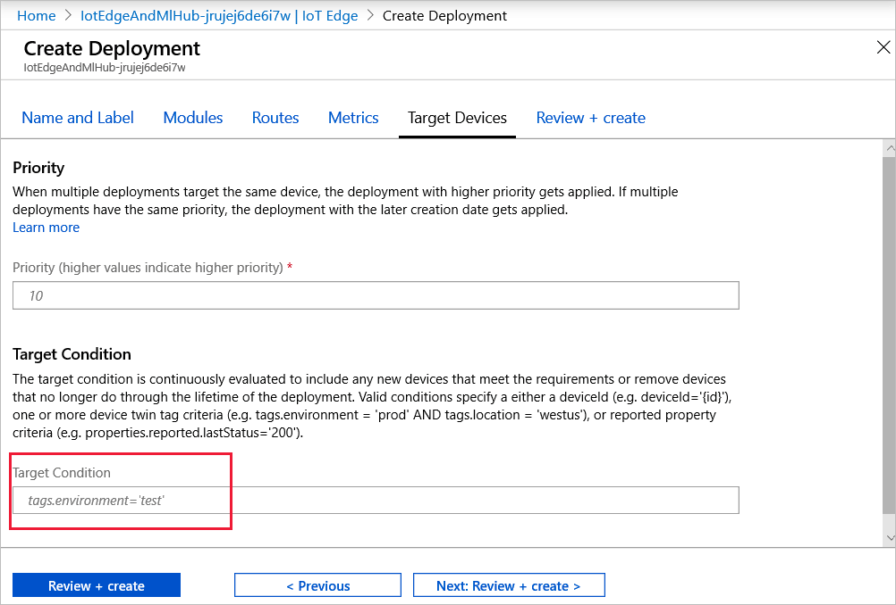
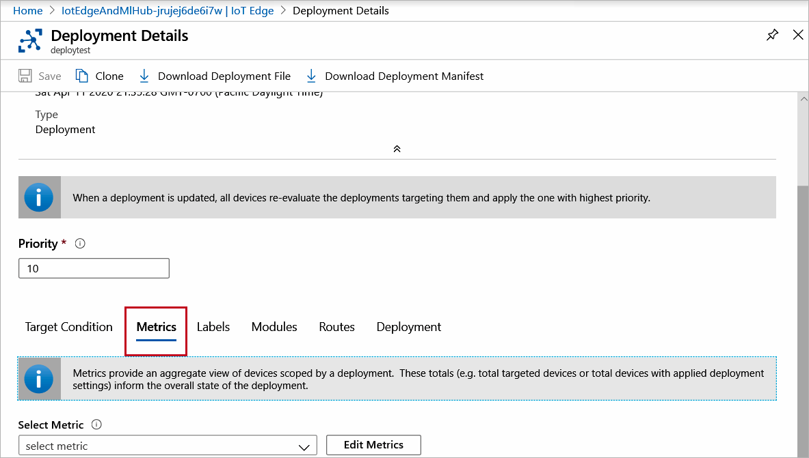

# Monitor IoT Edge deployments

Azure IoT Edge provides reporting that lets you monitor real-time information on the modules deployed to your IoT Edge devices. The IoT Hub service retrieves the status from the devices and makes them available to the operator. Monitoring is also important for [deployments made at scale](module-deployment-monitoring.md) that include automatic deployments and layered deployments.

Both devices and modules have similar data, such as connectivity, so values are obtained according to the device ID or the module ID.

The IoT Hub service collects data reported by device and module twins and provides counts of the various states that devices may have. The IoT Hub service organizes this data into four groups of metrics:

| Type | Description |
| --- | ---|
| Targeted | Shows the IoT Edge devices that match the deployment targeting condition. |
| Applied | Shows the targeted IoT Edge devices that are not targeted by another deployment of higher priority. |
| Reporting Success | Shows the IoT Edge devices that have reported that the modules have been deployed successfully. |
| Reporting Failure | Shows the IoT Edge devices that have reported that one or more modules haven't been deployed successfully. To further investigate the error, connect remotely to those devices and view the log files. |

The IoT Hub service makes this data available for you to monitor in the Azure portal and in the Azure CLI.

## Monitor a deployment in the Azure portal

To view the details of a deployment and monitor the devices running it, use the following steps:

1. Sign in to the [Azure portal](https://portal.azure.com) and navigate to your IoT Hub.
1. Select **IoT Edge** from the left pane menu.
1. Select the **IoT Edge deployments** tab.
1. Inspect the deployment list. For each deployment, you can view the following details:

    | Column | Description |
    | --- | --- |
    | ID | The name of the deployment. |
    | Type | The type of deployment, either **Deployment** or **Layered Deployment**. |
    | Target Condition | The tag used to define targeted devices. |
    | Priority | The priority number assigned to the deployment. |
    | System metrics | The number of device twins in IoT Hub that match the targeting condition. **Applied** specifies the number of devices that have had the deployment content applied to their module twins in IoT Hub. |
    | Device Metrics | The number of IoT Edge devices reporting success or errors from the IoT Edge client runtime. |
    | Custom Metrics | The number of IoT Edge devices reporting data for any metrics that you defined for the deployment. |
    | Creation Time | The timestamp from when the deployment was created. This timestamp is used to break ties when two deployments have the same priority. |

1. Select the deployment that you want to monitor.  
1. On the **Deployment Details** page, scroll down to the bottom section and select the **Target Condition** tab. Select **View** to list the devices that match the target condition. You can change the condition and also the **Priority**. Select **Save** if you made changes.

   

1. Select the **Metrics** tab. If you choose a metric from the **Select Metric** drop-down, a **View** button appears for you to display the results. You can also select **Edit Metrics** to adjust the criteria for any custom metrics that you have defined. Select **Save** if you made changes.

   


To make changes to your deployment, see [Modify a deployment](how-to-deploy-at-scale.md#modify-a-deployment).

## Monitor a deployment with Azure CLI

Use the [az IoT Edge deployment show](https://docs.microsoft.com/cli/azure/ext/azure-iot/iot/edge/deployment?view=azure-cli-latest#ext-azure-iot-az-iot-edge-deployment-show) command to display the details of a single deployment:

```cli
az iot edge deployment show --deployment-id [deployment id] --hub-name [hub name]
```

The deployment show command takes the following parameters:

* **--deployment-id** - The name of the deployment that exists in the IoT hub. Required parameter.
* **--hub-name** - Name of the IoT hub in which the deployment exists. The hub must be in the current subscription. Switch to the desired subscription with the command `az account set -s [subscription name]`

Inspect the deployment in the command window. The **metrics** property lists a count for each metric that is evaluated by each hub:

* **targetedCount** - A system metric that specifies the number of device twins in IoT Hub that match the targeting condition.
* **appliedCount** - A system metric specifies the number of devices that have had the deployment content applied to their module twins in IoT Hub.
* **reportedSuccessfulCount** - A device metric that specifies the number of IoT Edge devices in the deployment reporting success from the IoT Edge client runtime.
* **reportedFailedCount** - A device metric that specifies the number of IoT Edge devices in the deployment reporting failure from the IoT Edge client runtime.

You can show a list of device IDs or objects for each of the metrics with the [az IoT Edge deployment show-metric](https://docs.microsoft.com/cli/azure/ext/azure-iot/iot/edge/deployment?view=azure-cli-latest#ext-azure-iot-az-iot-edge-deployment-show-metric) command:

```cli
az iot edge deployment show-metric --deployment-id [deployment id] --metric-id [metric id] --hub-name [hub name]
```

The deployment show-metric command takes the following parameters:

* **--deployment-id** - The name of the deployment that exists in the IoT hub.
* **--metric-id** - The name of the metric for which you want to see the list of device IDs, for example `reportedFailedCount`.
* **--hub-name** - Name of the IoT hub in which the deployment exists. The hub must be in the current subscription. Switch to the desired subscription with the command `az account set -s [subscription name]`.

To make changes to your deployment, see [Modify a deployment](how-to-deploy-cli-at-scale.md#modify-a-deployment).

## Next steps

Learn how to [monitor module twins](how-to-monitor-module-twins.md), primarily the IoT Edge Agent and IoT Edge Hub runtime modules, for the connectivity and health of your IoT Edge deployments.
