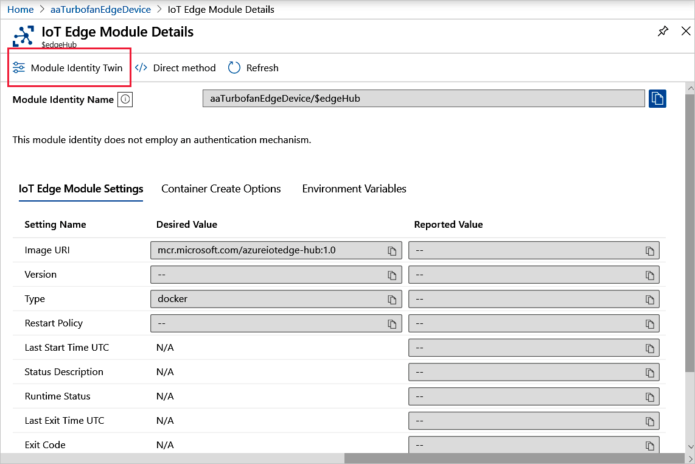

# Monitor module twins

The module twins in the Azure IoT Hub provide pertinent information for monitoring the connectivity and health of your IoT Edge deployments. These module twins include the [IoT Edge agent](iot-edge-runtime.md#iot-edge-agent) and [IoT Edge hub](iot-edge-runtime.md#iot-edge-hub) runtime modules, as well as module twins for the custom modules in your deployment.

The JSON in the module twins contains the pertinent information that you need to look for to monitor connectivity and health status. This article describes how to review them in the Azure portal, Azure CLI, and Visual Studio Code.

For guidance how to monitor which devices received a deployment according to your target conditions, see [Monitor IoT Edge deployments](how-to-monitor-iot-edge-deployments.md). For in-depth overviews on module twins, see [Understand and use module twins in IoT Hub](../iot-hub/iot-hub-devguide-module-twins.md).

## Monitor runtime module twins

To troubleshoot deployment connectivity issues, review the IoT Edge Agent and IoT Edge Hub runtime module twins first and then drill down into other modules.

The IoT Edge Agent is responsible for deploying the modules, monitoring them, and reporting connection status to IoT Hub. To monitor that data, examine the `$edgeAgent` module twin.

The IoT Edge hub is responsible for processing the communications between the Azure IoT Hub and the IoT Edge devices and modules. To monitor that data, examine the `$edgeHub` module twin.

### Monitor IoT Edge Agent module twin

The following JSON depicts the `$edgeAgent` module twin in Visual Studio Code with most of the JSON sections collapsed.

```json
{
  "deviceId": "Windows109",
  "moduleId": "$edgeAgent",
  "etag": "AAAAAAAAAAU=",
  "deviceEtag": "NzgwNjA1MDUz",
  "status": "enabled",
  "statusUpdateTime": "0001-01-01T00:00:00Z",
  "connectionState": "Disconnected",
  "lastActivityTime": "0001-01-01T00:00:00Z",
  "cloudToDeviceMessageCount": 0,
  "authenticationType": "sas",
  "x509Thumbprint": {
    "primaryThumbprint": null,
    "secondaryThumbprint": null
  },
  "version": 53,
  "properties": {
    "desired": { ···
    },
    "reported": {
      "schemaVersion": "1.0",
      "version": { ···
      },
      "lastDesiredStatus": {
      },
      "runtime": { ···
      },
      "systemModules": {
        "edgeAgent": { ···
        },
        "edgeHub": { ···
        }
      },
      "lastDesiredVersion": 5,
      "modules": {
        "SimulatedTemperatureSensor": { ···
        }
      },
      "$metadata": { ···
      },
      "$version": 48
    }
  }
}
```

The JSON can be described in the following sections, starting from the top:

* Metadata - Metadata populated by IoT Hub about the IoT Edge Agent connectivity. Interestingly, the connection state is always in a disconnected state: `"connectionState": "Disconnected"`. The reason being the connection state pertains to device-to-cloud (D2C) messages and the edgeAgent does not send D2C messages. However, you can still determine its connection status.

> [!TIP]
> To determine connection status for the IoT Edge Agent, run the [ping](how-to-edgeagent-direct-method.md#ping) built-in direct method to get the edgeAgent status.

* Version - The version of the edgeAgent runtime module.
* Properties - Contains the `desired` and `reported` subsections.
* Properties.Desired (Collapsed) - Expected property values set by the IoT Edge runtime or by a custom module.
* Properties.Reported - Latest property values reported by IoT Hub.

Both the `properties.desired` and `properties.reported` sections have a similar structure and contain additional metadata for schema, version, and runtime information. Also included is the `modules` section for any custom modules (such as `SimulatedTemperatureSensor`), and the `systemModules` section for `$edgeAgent` and the `$edgeHub` runtime modules.

By comparing the reported property values against the desired values, you can ascertain discrepancies and identify disconnections that can help you troubleshoot issues. In doing these comparisons, check the `$lastUpdated` reported value for the property you are investigating in the `metadata` section.

The following properties are important to examine for troubleshooting:

* **exitcode** - Any value other than zero indicates that the module stopped with a failure. However, error codes 137 or 143 are used when a module was set to stopped status because otherwise the failure will trigger SIGKILL or SIGTERM.

* **lastStartTimeUtc** - Shows the **DateTime** that the container was last started. This value is 0001-01-01T00:00:00Z if the container was not started.

* **lastExitTimeUtc** - Shows the **DateTime** that the container last finished. This value is 0001-01-01T00:00:00Z if the container is running and was never stopped.

* **runtimeStatus** - Can be one of the following values:

    | Value | Description |
    | --- | --- |
    | unknown | Default state until deployment is created. |
    | backoff | The module is scheduled to be started but is not currently running. This value is useful when we have a failing module that is undergoing state changes as part of the implementation of its restart policy. For example, when a failing module is awaiting restart during the cool-off period as dictated by the exponential back-off restart strategy, the module will be in this backoff state. |
    | running | Indicates that module is currently running. |
    | unhealthy | Indicates a health-probe check failed or timed out. |
    | stopped | Indicates that the module exited successfully (with a zero exit code). |
    | failed | Indicates that the module exited with a failure exit code (non-zero). The module can transition back to backoff from this state depending on the restart policy in effect. This state can indicate that the module has experienced an unrecoverable error. This happens when the Microsoft Monitoring Agent (MMA) has given up on trying to resuscitate the module and user action is required to update its configuration in order for it to work again that would mean that a new deployment is required. |

See [EdgeAgent reported properties](module-edgeagent-edgehub.md#edgeagent-reported-properties) for details for a complete listing.

### Monitor IoT Edge Hub module twin

The following JSON depicts the `$edgeAgent` module twin in Visual Studio code with most of the JSON sections collapsed.

```json
{
  "deviceId": "Windows109",
  "moduleId": "$edgeHub",
  "etag": "AAAAAAAAAAU=",
  "deviceEtag": "NzgwNjA1MDU2",
  "status": "enabled",
  "statusUpdateTime": "0001-01-01T00:00:00Z",
  "connectionState": "Disconnected",
  "lastActivityTime": "0001-01-01T00:00:00Z",
  "cloudToDeviceMessageCount": 0,
  "authenticationType": "sas",
  "x509Thumbprint": {
    "primaryThumbprint": null,
    "secondaryThumbprint": null
  },
  "version": 102,
  "properties": {
   "desired": { ···
    },
    "reported": {
     "schemaVersion": "1.0",
     "version": { ···
     },
    "lastDesiredVersion": 5,
    "lastDesiredStatus": { ···
     },
    "clients": {
      "Windows109/SimulatedTemperatureSensor": {
        "status": "Disconnected",
        "lastConnectedTimeUtc": "2020-04-08T21:42:42.1743956Z",
        "lastDisconnectedTimeUtc": "2020-04-09T07:02:42.1398325Z"
      }
    },
    "$metadata", { ···
    },
    "$version": 97
  }
}

```

The JSON can be described in the following sections, starting from the top:

* Metadata - Contains metadata populated by IoT Hub about the IoT Edge Hub connectivity. The connection state is always in a disconnected state: `"connectionState": "Disconnected"`. The reason is that the connection state pertains to device to cloud (D2C) messages and the edgeHub does not send D2C messages. However, you can still determine its connection status.

> [!TIP]
> To determine connection status for the IoT Edge Hub, run the [ping](how-to-edgeagent-direct-method.md#ping) built-in direct method to get the edgeHub status.

* Version - The version of the edgeHub runtime module.
* Properties - Contains the `desired` and `reported` subsections.
* Properties.Desired (Collapsed) - Expected property values set by the IoT Edge runtime or by a custom module.
* Properties.Reported - Latest property values reported by IoT Hub.

The IoT Edge Hub twin module processes the communications between the Azure IoT Hub and the IoT Edge devices and modules. If you are experiencing issues with your downstream devices, examining this data would be a good place to start.

## Monitor custom module twins

The JSON for the module twins for your modules does not provide connectivity and health data, but has reported property values that can show if your code modules are operating as expected. The desired properties that you defined in your deployment.template.json file are reflected in the module twin in IoT Hub for your custom module.

You can also monitor how the reported properties in IoT Hub by defining custom metrics, such as described in [Monitor a deployment in the Azure portal](how-to-monitor-iot-edge-deployments.md#monitor-a-deployment-in-the-azure-portal).

You can also programmatically edit the module twin based on your solution code. For an example, see [Develop a C# IoT Edge module for Windows devices](tutorial-csharp-module-windows.md#edit-the-module-twin).

## Access the module twins

You can review the JSON for module twins in the Azure IoT Hub, in Visual Studio Code, and with Azure CLI.

### Monitor in Azure IoT Hub

To view the JSON for the module twin:

1. Sign in to the [Azure portal](https://portal.azure.com) and navigate to your IoT hub.
1. Select **IoT Edge** from the left pane menu.
1. On the **IoT Edge devices** tab, select the **Device ID** of device with the modules you want to monitor.
1. Select the module name from the **Modules** tab and then select **Module Identity Twin** from the upper menu bar.



If you see the message "A module identity does not exist for this module", this error indicates that the back-end solution is no longer available that originally created the identity.

### Monitor module twins in Visual Studio Code

In Visual Studio Code, use the following commands in the **View** > **Command Palette** to view the JSON for the device and module twins:

### Monitor module twins in Azure CLI

The [az iot hub module-twin](https://docs.microsoft.com/cli/azure/ext/azure-cli-iot-ext/iot/hub/module-twin) structure provides these commands:

* **az iot hub module-twin** - Show a module twin definition.
* **az iot hub module-twin** - Update a module twin definition.
* **az iot hub module-twin** - Replace a module twin definition with target json.

## Next steps

Learn how to [communicate with EdgeAgent using built-in direct methods](how-to-edgeagent-direct-method.md).
