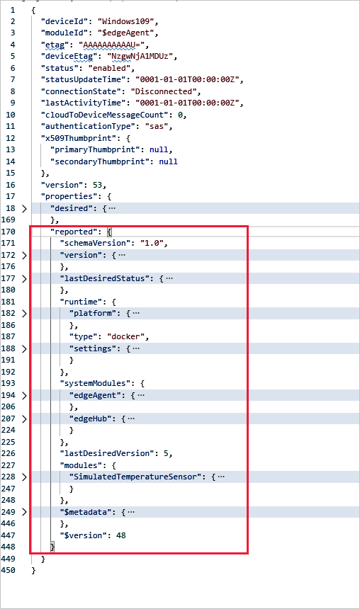

# Monitor module twins

The Azure IoT Hub provides reporting on the data collected from the module twins on the various states of their deployment, as described in [Monitor IoT Edge deployments](how-to-monitor-iot-edge-deployments.md). This information helps you monitor which devices received a deployment according to your target conditions.

You also need to connectivity and health status information by examining the JSON for the [IoT Edge agent](iot-edge-runtime.md#iot-edge-agent) and [IoT Edge hub](iot-edge-runtime.md#iot-edge-hub) runtime modules. This article describes what pertinent information to look for in the JSON files, followed by how you can review and edit their JSON in the Azure portal, Azure CLI, and Visual Studio Code.

For in-depth overviews on these twins, see [Understand and use module twins in IoT Hub](../iot-hub/iot-hub-devguide-module-twins.md).

## Monitor runtime module twins

To troubleshoot deployment connectivity issues, review the Edge Agent and Edge Hub runtime module twins first and then drill down into other modules. The IoT Edge Agent is responsible for deploying the modules, monitoring them, and reporting connection status to the IoT Hub. To monitor that data, examine the edgeAgent module twin.

The IoT Edge hub is responsible for processing the communications between the Azure IoT Hub and the IoT Edge devices and modules. To monitor that data, examine the edgeHub module twin.

### Monitor edgeAgent

The following illustration shows the edgeAgent module twin in Visual Studio code with most of the JSON sections collapsed so that we can review its major nodes.

The top of the file contains metadata populated by the IoT Hub and the connection status of the Edge Agent itself. Interestingly, when you examine the module identity twin for the edgeAgent runtime module, the connection is always in a disconnected state: `"connectionState": "Disconnected"`. The reason is that the connection state pertains to device to cloud (D2C) messages and the edgeAgent does not send D2C messages. However, you can run the [ping](how-to-edgeagent-direct-method.md#ping) built-in direct method to get the edgeAgent status.

The reported properties node is where you need to look to determine the status of the modules currently running on the device, as reported by the IoT Edge agent. You can compare these property values to their expected values in the desired properties node.  

The reported properties provide data for the edgeAgent and edgeHub modules, the `systemModules`, as well as the values for your custom modules. The following properties are first ones to examine for troubleshooting. See [EdgeAgent reported properties] for details for a complete listing.

*  , which can be one of the following values:

    | runtimeStatus value | Description |
    | --- | --- |
    | unknown | Default state until deployment is created. |
    | backoff | The module is scheduled to be started but is not currently running. This value is useful when we have a failing module that is undergoing state changes as part of the implementation of its restart policy. For example, when a failing module is awaiting restart during the cool-off period as dictated by the exponential back-off restart strategy, the module will be in this backoff state. |
    | running | Indicates that module is currently running. |
    | unhealthy | Indicates a health-probe check failed or timed out. |
    | stopped | Indicates that the module exited successfully (with a zero exit code). |
    | failed | Indicates that the module exited with a failure exit code (non-zero). The module can transition back to backoff from this state depending on the restart policy in effect. This state can indicate that the module has experienced an unrecoverable error. This happens when the MMA has given up on trying to resuscitate the module and user action is required to update its configuration in order for it to work again that would mean that a new deployment is required. |

* `exitcode` - This value is zero whether the module is running or not. If not zero, it indicates that the module stopped with a failure. There are two codes that are not actually failures, but they are reported as failures at the moment: 137 or 143 that are used when a module was set to stopped status because this failure will trigger SIGKILL or SIGTERM.

* `lastStartTimeUtc` Shows the **DateTime** that the container was last started. This value is 0001-01-01T00:00:00Z if the container was not started.

* `lastExitTimeUtc` Shows the **DateTime** that the container last finished. This value is 0001-01-01T00:00:00Z if the container is running and was never stopped.

### Monitor edgeHub

### Monitor custom module twins

The data in provided in the module twins for custom modules (other than edgeAgent and edgeHub) is pertinent to the deployment of the modules and the performances of their applications as opposed to connectivity and health. See [Monitor IoT Edge deployments](how-to-monitor-iot-edge-deployments.md) for readily accessing this information.

## Access the module twins

To view the JSON for the module twin:

1. Sign in to the [Azure portal](https://portal.azure.com) and navigate to your IoT hub.
1. Select **IoT Edge** from the left pane menu.
1. On the **IoT Edge devices** tab, select the **Device ID** of device with the modules you want to monitor.
1. Select the module name from the **Modules** tab and then select **Module Identity Twin** from the upper menu bar.

        

    If you see the message "A module identity does not exist for this module", this error indicates that the back-end solution is no longer available that originally created the identity.

## Monitor module twins in Visual Studio Code

In Visual Studio Code, use the following commands in the **View** > **Command Palette** to view the JSON for the device and module twins:

## Monitor module twins in Azure CLI

## Next steps

Learn how to [communicate with EdgeAgent using built-in direct methods](how-to-edgeagent-direct-method.md).
