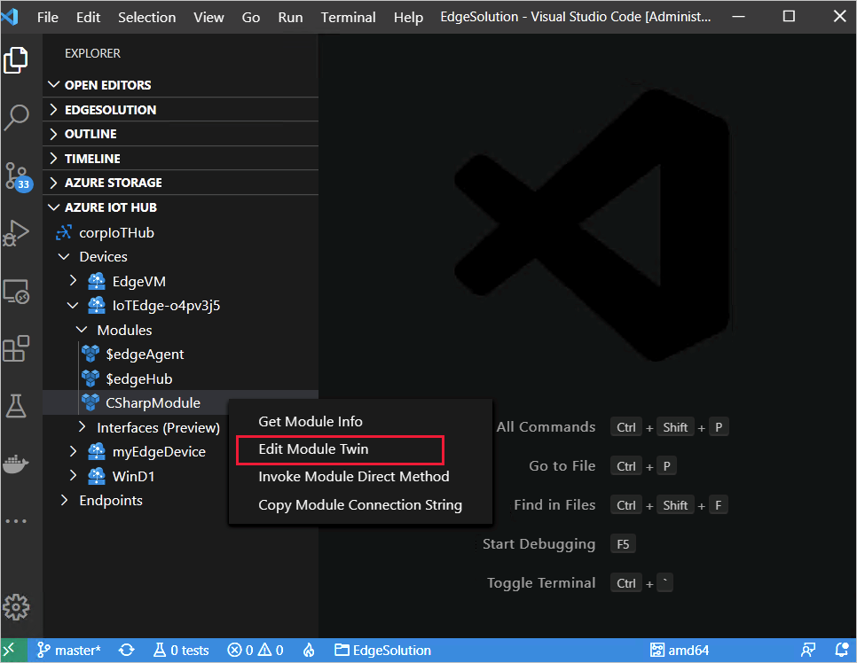
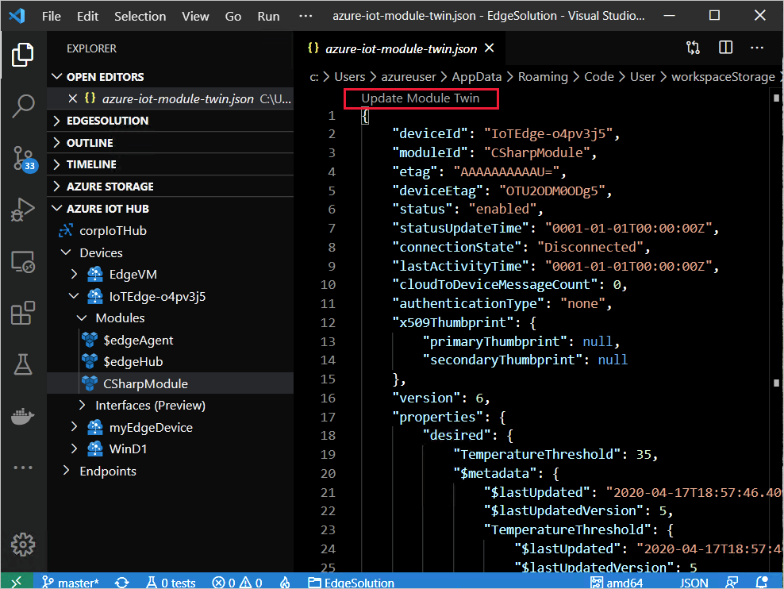

# Monitor module twins

The Azure IoT Hub module twins enable monitoring the connectivity of your IoT Edge deployments. They include the [IoT Edge Agent](iot-edge-runtime.md#iot-edge-agent) and [IoT Edge Hub](iot-edge-runtime.md#iot-edge-hub) runtime modules. Also included are any custom module twins. This article describes how to review them in the Azure portal, Azure CLI, and in Visual Studio Code.

For information on monitoring how the devices receive the deployments, see [Monitor IoT Edge deployments](how-to-monitor-iot-edge-deployments.md) and [Understand and use module twins in IoT Hub](../iot-hub/iot-hub-devguide-module-twins.md).

## Monitor runtime module twins

To troubleshoot deployment connectivity issues, review the IoT Edge Agent and IoT Edge Hub runtime module twins and then drill down into other modules.

The IoT Edge Agent is responsible for deploying the modules, monitoring them, and reporting connection status to IoT Hub. To monitor that data, examine the `$edgeAgent` module twin.

IoT Edge Hub is responsible for processing the communications between the Azure IoT Hub and the IoT Edge devices and modules. To monitor that data, examine the `$edgeHub` module twin.

### Monitor IoT Edge Agent module twin

The following JSON shows the `$edgeAgent` module twin in Visual Studio Code with most of the JSON sections collapsed.

```json
{
  "deviceId": "Windows109",
  "moduleId": "$edgeAgent",
  "etag": "AAAAAAAAAAU=",
  "deviceEtag": "NzgwNjA1MDUz",
  "status": "enabled",
  "statusUpdateTime": "0001-01-01T00:00:00Z",
  "connectionState": "Disconnected",
  "lastActivityTime": "0001-01-01T00:00:00Z",
  "cloudToDeviceMessageCount": 0,
  "authenticationType": "sas",
  "x509Thumbprint": {
    "primaryThumbprint": null,
    "secondaryThumbprint": null
  },
  "version": 53,
  "properties": {
    "desired": { ···
    },
    "reported": {
      "schemaVersion": "1.0",
      "version": { ···
      },
      "lastDesiredStatus": {
      },
      "runtime": { ···
      },
      "systemModules": {
        "edgeAgent": { ···
        },
        "edgeHub": { ···
        }
      },
      "lastDesiredVersion": 5,
      "modules": {
        "SimulatedTemperatureSensor": { ···
        }
      },
      "$metadata": { ···
      },
      "$version": 48
    }
  }
}
```

The JSON can be described in the following sections, starting from the top:

* Metadata - The top section of connectivity metadata is populated by IoT Hub. Interestingly, the connection state is always in a disconnected state: `"connectionState": "Disconnected"`. The reason being the connection state pertains to device-to-cloud (D2C) messages and the IoT Edge Agent doesn't send D2C messages. However, you can use [Azure CLI](#monitor-module-twins-in-azure-cli) to ping its status.

* Version - The version of the edgeAgent runtime module.
* Properties - Contains the `desired` and `reported` subsections.
* Properties. Desired - (shown collapsed) Expected property values set by the IoT Edge runtime or by a custom module.
* Properties.Reported - Latest property values reported by IoT Hub.

Both the `properties.desired` and `properties.reported` sections have a similar structure and contain additional metadata for schema, version, and runtime information. Also included is the `modules` section for any custom modules (such as `SimulatedTemperatureSensor`), and the `systemModules` section for `$edgeAgent` and the `$edgeHub` runtime modules.

By comparing the reported property values against the desired values, you can determine discrepancies and identify disconnections that can help you troubleshoot issues. In doing these comparisons, check the `$lastUpdated` reported value for the property you're investigating in the `metadata` section.

The following properties are important to examine for troubleshooting:

* **exitcode** - Any value other than zero indicates that the module stopped with a failure. However, error codes 137 or 143 are used if a module was intentionally set to a stopped status.

* **lastStartTimeUtc** - Shows the **DateTime** that the container was last started. This value is 0001-01-01T00:00:00Z if the container wasn't started.

* **lastExitTimeUtc** - Shows the **DateTime** that the container last finished. This value is 0001-01-01T00:00:00Z if the container is running and was never stopped.

* **runtimeStatus** - Can be one of the following values:

    | Value | Description |
    | --- | --- |
    | unknown | Default state until deployment is created. |
    | backoff | The module is scheduled to start but isn't currently running. This value is useful for a module undergoing state changes in restarting. When a failing module is awaiting restart during the cool-off period, the module will be in a backoff state. |
    | running | Indicates that the module is currently running. |
    | unhealthy | Indicates a health-probe check failed or timed out. |
    | stopped | Indicates that the module exited successfully (with a zero exit code). |
    | failed | Indicates that the module exited with a failure exit code (non-zero). The module can transition back to backoff from this state depending on the restart policy in effect. This state can indicate that the module has experienced an unrecoverable error. Failure occurs when the Microsoft Monitoring Agent (MMA) can no longer resuscitate the module, requiring a new deployment. |

See [EdgeAgent reported properties](module-edgeagent-edgehub.md#edgeagent-reported-properties) for details for a complete listing.

### Monitor IoT Edge Hub module twin

The following JSON shows the `$edgeHub` module twin in Visual Studio code with most of the JSON sections collapsed.

```json
{
  "deviceId": "Windows109",
  "moduleId": "$edgeHub",
  "etag": "AAAAAAAAAAU=",
  "deviceEtag": "NzgwNjA1MDU2",
  "status": "enabled",
  "statusUpdateTime": "0001-01-01T00:00:00Z",
  "connectionState": "Disconnected",
  "lastActivityTime": "0001-01-01T00:00:00Z",
  "cloudToDeviceMessageCount": 0,
  "authenticationType": "sas",
  "x509Thumbprint": {
    "primaryThumbprint": null,
    "secondaryThumbprint": null
  },
  "version": 102,
  "properties": {
   "desired": { ···
    },
    "reported": {
     "schemaVersion": "1.0",
     "version": { ···
     },
    "lastDesiredVersion": 5,
    "lastDesiredStatus": { ···
     },
    "clients": {
      "Windows109/SimulatedTemperatureSensor": {
        "status": "Disconnected",
        "lastConnectedTimeUtc": "2020-04-08T21:42:42.1743956Z",
        "lastDisconnectedTimeUtc": "2020-04-09T07:02:42.1398325Z"
      }
    },
    "$metadata", { ···
    },
    "$version": 97
  }
}

```

The JSON can be described in the following sections, starting from the top:

* Metadata - The top section of connectivity metadata is populated by IoT Hub. The connection state is always in a disconnected state: `"connectionState": "Disconnected"`. The reason is that the connection state pertains to device to cloud (D2C) messages. IoT Edge Hub doesn't send D2C messages. However, you can use [Azure CLI](#monitor-module-twins-in-azure-cli) to ping its status.

* Version - The version of the edgeHub runtime module.
* Properties - Contains the `desired` and `reported` subsections.
* Properties.Desired - (shown collapsed) Expected property values set by the IoT Edge runtime or by a custom module.
* Properties.Reported - Latest property values reported by IoT Hub.

If you're experiencing issues with your downstream devices, examining this data would be a good place to start.

## Monitor custom module twins

The custom module twins don't provide connectivity and health data. However they provide reported property values that show if your modules are operating as expected. The desired properties you defined in your deployment.template.json file are reflected in the module twin.

You can also monitor reported properties in IoT Hub by defining custom metrics, such as described in [Monitor a deployment in the Azure portal](how-to-monitor-iot-edge-deployments.md#monitor-a-deployment-in-the-azure-portal).

You can also programmatically edit the module twin based on your solution code. For an example, see [Develop a C# IoT Edge module for Windows devices](tutorial-csharp-module-windows.md#edit-the-module-twin).

## Access the module twins

You can review the JSON for module twins in the Azure IoT Hub, in Visual Studio Code, and with Azure CLI.

### Monitor in Azure IoT Hub

To view the JSON for the module twin:

1. Sign in to the [Azure portal](https://portal.azure.com) and navigate to your IoT hub.
1. Select **IoT Edge** from the left pane menu.
1. On the **IoT Edge devices** tab, select the **Device ID** of the device with the modules you want to monitor.
1. Select the module name from the **Modules** tab and then select **Module Identity Twin** from the upper menu bar.

  

If you see the message "A module identity doesn't exist for this module", this error indicates that the back-end solution is no longer available that originally created the identity.

### Monitor module twins in Visual Studio Code

To review and edit a module twin:

1. If not already installed, install the [Azure IoT Device Workbench](https://marketplace.visualstudio.com/items?itemName=vsciot-vscode.vscode-iot-workbench) extension for Visual Studio Code.
1. In the **Explorer**, expand the **Azure IoT Hub**, and then expand the device with the module you want to monitor.
1. Right-click the module and select **Edit Module Twin**. A temporary file of the module twin downloaded to your computer and displayed in Visual Studio Code.

  

If you make changes, select **Update Module Twin** above the code in the editor to save changes to your IoT hub.

  

### Monitor module twins in Azure CLI

To see if IoT Edge is running, use the [az iot hub invoke-module-method](how-to-edgeagent-direct-method.md#ping) with **ping**. You can ping the IoT Edge Agent, IoT Edge Hub, or other modules on a device.

The [az iot hub module-twin](https://docs.microsoft.com/cli/azure/ext/azure-cli-iot-ext/iot/hub/module-twin) structure provides these commands:

* **az iot hub module-twin show** - Show a module twin definition.
* **az iot hub module-twin update** - Update a module twin definition.
* **az iot hub module-twin replace** - Replace a module twin definition with a target JSON.

## Next steps

Learn how to [communicate with EdgeAgent using built-in direct methods](how-to-edgeagent-direct-method.md).
