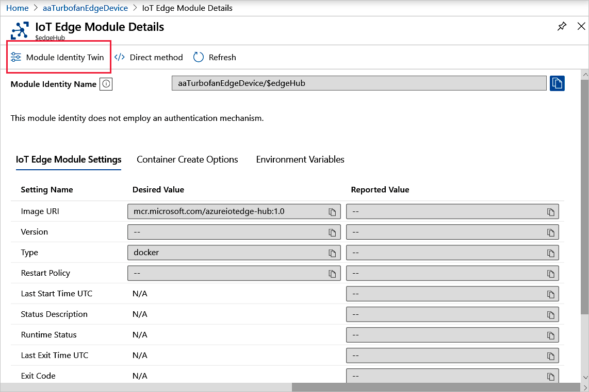

# Monitor using device and module twins

Azure IoT Edge provides reporting on the data collected from the device and module twins on the various states that devices and modules may have, as described in [Monitor IoT Edge deployments](how-to-monitor-iot-edge-deployments.md). This information enables you to monitor the status, conditions, and configurations you set for modules be deployed to IoT Edge devices and how reported property values compare with their desired property counterparts.

For in-depth overviews on these twins, see [Understand and use device twins in IoT Hub](../iot-hub/iot-hub-devguide-device-twins.md) and [Understand and use module twins in IoT Hub](../iot-hub/iot-hub-devguide-module-twins.md).

## Monitor the edgeAgent module twin for connectivity and health

The [IoT Edge agent](iot-edge-runtime.md#iot-edge-agent) is particularly important to monitor, as it is responsible for instantiating modules, ensuring their operations, and reporting connection and status data to IoT Hub. Interestingly, When you examine the module identity twin for the edgeAgent runtime module, the connection is always in a disconnected state: `"connectionState": "Disconnected"`. The reason is that the connection state pertains to device cloud (D2C) messages and the edgeAgent does not send D2C messages. However, you can [ping](how-to-edgeagent-direct-method.md#ping) built-in direct method to get the edgeAgent status.

To determine the connectivity of your custom code modules, check their status in the `modules` section of the edgeAgent module twin.

| Status | Description |
| --- | --- |
| unknown | Default state until deployment is created. |
| backoff | The module is scheduled to be started but is not currently running. This value is useful when we have a failing module that is undergoing state changes as part of the implementation of its restart policy. For example, when a failing module is awaiting restart during the cool-off period as dictated by the exponential back-off restart strategy, the module will be in this backoff state. |
| running | Indicates that module is currently running. |
| unhealthy | Indicates a health-probe check failed or timed out. |
| stopped | Indicates that the module exited successfully (with a zero exit code). |
| failed | Indicates that the module exited with a failure exit code (non-zero). The module can transition back to backoff from this state depending on the restart policy in effect. This state can indicate that the module has experienced an unrecoverable error. This happens when the MMA has given up on trying to resuscitate the module and user action is required to update its configuration in order for it to work again that would mean that a new deployment is required. |

## Monitor the custom code module twin for connectivity and health

You can obtain more granular status information by checking the following values in the module twin for the modules themselves. If the module has been deployed, the JSON in the module twin will have the following data at the top of the file:

* **exitcode**

    Value is 0 if the module is running or the module ended running (no foreground process), a value different than 0 if the module stopped with a failure. Please note that there are two codes which are not actually failures, but they are reported as failures at the moment: 137 or 143 which are used when a module was set to stopped status because this failure will trigger SIGKILL or SIGTERM.

* **lastStartTimeUtc**

    The datetime that the container was last started (which can be 0001-01-01T00:00:00Z if the container was not started).

* **lastExitTimeUtc**

    The datetime that the container last finished at (which can be 0001-01-01T00:00:00Z if the container is running and was never stopped)

## Monitor device and module twins in the Azure portal

To view the JSON for the device and module twins:

1. Sign in to the [Azure portal](https://portal.azure.com) and navigate to your IoT hub.
1. Select **IoT Edge** from the left pane menu.
1. On the **IoT Edge devices** tab, select the **Device ID** of device with the modules you want to monitor.

    * To view the device twin, select **Device Twin** from the upper menu bar.

        

    * To view the module twin, select the module name from the **Modules** tab and then select **Module Identity Town** from the upper menu bar.

        

    If you see the message "A module identity does not exist for this module", this error indicates that the back-end solution is no longer available that originally created the identity.

## Monitor device and module twins in Visual Studio code

In Visual Studio Code, use the following commands in the **View** > **Command Palette** to view the JSON for the device and module twins:

## Monitor device and module twins in Azure CLI

## Next steps

Learn how to [communicate with EdgeAgent using built-in direct methods](how-to-edgeagent-direct-method.md).
