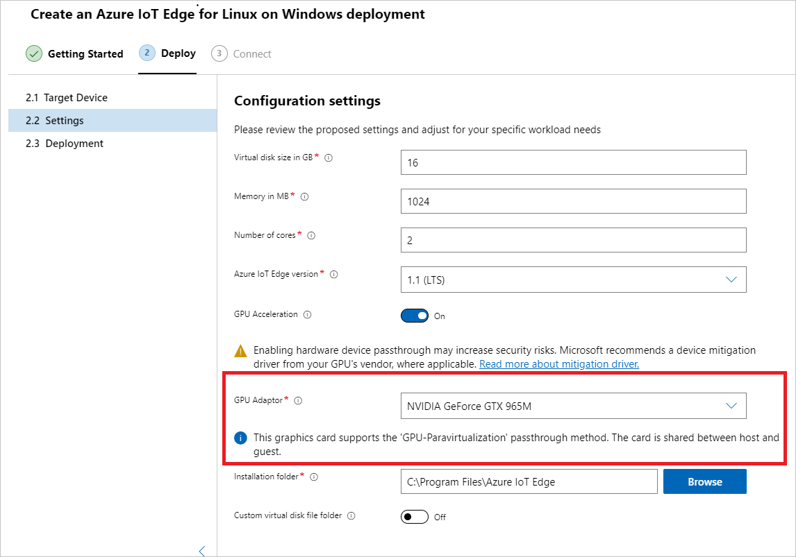

# Create and provision an IoT Edge for Linux on Windows device at-scale using a TPM

[!INCLUDE [iot-edge-version-201806](../../includes/iot-edge-version-201806.md)]

This article provides end-to-end instructions for auto-provisioning an IoT Edge for Linux on Windows device using a Trusted Platform Module (TPM). You can automatically provision Azure IoT Edge devices with the [Azure IoT Hub Device Provisioning Service](../iot-dps/index.yml) (DPS). If you're unfamiliar with the process of auto-provisioning, review the [provisioning overview](../iot-dps/about-iot-dps.md#provisioning-process) before continuing.

This article outlines two methodologies. Select your preference based on the architecture of your solution:

1. Auto-provision a Linux on Windows device with physical TPM hardware.
1. Auto-provision a Linux on Windows device using a simulated TPM. This methodology is recommended only as a testing scenario, because a simulated TPM does not offer the same security as a physical TPM.

The tasks are as follows:

# [Physical TPM](#tab/physical-tpm)

* Install IoT Edge for Linux on Windows.
* Retrieve the TPM information from your device.
* Create an individual enrollment for the device.
* Provision your device with its TPM information.

# [Simulated TPM](#tab/simulated-tpm)

* Install IoT Edge for Linux on Windows.
* Set up your simulated TPM and retrieve its provisioning information.
* Create an individual enrollment for the device.
* Provision your device with its TPM information.

---

## Prerequisites

Cloud resources:

* An active IoT Hub.
* An instance of the IoT Hub Device Provisioning Service in Azure, linked to your IoT hub.
  * If you don't have a Device Provisioning Service instance, you can follow the instructions in the [Create a new IoT Hub Device Provisioning Service](../iot-dps/quick-setup-auto-provision.md#create-a-new-iot-hub-device-provisioning-service) and [Link the IoT hub and your Device Provisioning Service](../iot-dps/quick-setup-auto-provision.md#link-the-iot-hub-and-your-device-provisioning-service) sections of the IoT Hub Device Provisioning Service quickstart.
  * After you have the Device Provisioning Service running, copy the value of **ID Scope** from the overview page. You use this value when you configure the IoT Edge runtime.

A development machine:

* A Windows device with the following minimum system requirements:
  * Windows 10 Version 1809 or later; build 17763 or later
  * Professional, Enterprise, or Server editions
  * Minimum Free Memory: 1 GB
  * Minimum Free Disk Space: 10 GB
  * Virtualization support
    * On Windows 10, enable Hyper-V. For more information, see [Install Hyper-V on Windows 10](/virtualization/hyper-v-on-windows/quick-start/enable-hyper-v).
    * On Windows Server, install the Hyper-V role and create a default network switch. For more information, see [Nested virtualization for Azure IoT Edge for Linux on Windows](nested-virtualization.md).
    * On a virtual machine, configure nested virtualization. For more information, see [nested virtualization](nested-virtualization.md).
  * Networking support
    * Windows Server does not come with a default switch. Before you can deploy EFLOW to a Windows Server device, you need to create a virtual switch.  For more information, see [Create virtual switch for Linux on Windows](how-to-create-virtual-switch.md).
    * Windows Desktop versions come with a default switch that can be used for EFLOW installation. If needed, you can create your own custom virtual switch.

   > [!TIP]
   > If you want to use **GPU-accelerated Linux modules** in your Azure IoT Edge for Linux on Windows deployment, there are several configuration options to consider. You will need to install the correct drivers depending on your GPU architecture, and you may need access to a Windows Insider Program build. To determine your configuration needs and satisfy these prerequisites, see [GPU acceleration for Azure IoT Edge for Linux on Windows](gpu-acceleration.md).

You can use either **PowerShell** or **Windows Admin Center** to manage your IoT Edge devices. Each utility has its own prerequisites:

# [PowerShell](#tab/powershell)

If you want to use PowerShell, use the following steps to prepare your target device for the installation of Azure IoT Edge for Linux on Windows and the deployment of the Linux virtual machine:

1. Set the execution policy on the target device to `AllSigned`. You can check the current execution policy in an elevated PowerShell prompt using the following command:

   ```powershell
   Get-ExecutionPolicy -List
   ```

   If the execution policy of `local machine` is not `AllSigned`, you can set the execution policy using:

   ```powershell
   Set-ExecutionPolicy -ExecutionPolicy AllSigned -Force
   ```

For more information on the Azure IoT Edge for Linux on Windows PowerShell module, see the [PowerShell functions reference](reference-iot-edge-for-linux-on-windows-functions.md).

# [Windows Admin Center](#tab/windowsadmincenter)

If you want to use Windows Admin Center, use the following steps to download and install Windows Admin Center and install the Windows Admin Center Azure IoT Edge extension:

   1. Download and run the [Windows Admin Center installer](https://aka.ms/wacdownload). Follow the install wizard prompts to install Windows Admin Center.

   1. Once installed, use a supported browser to open Windows Admin Center. Supported browsers include Microsoft Edge (Windows 10, version 1709 or later), Google Chrome, and Microsoft Edge Insider.

   1. On the first use of Windows Admin Center, you will be prompted to select a certificate to use. Select **Windows Admin Center Client** as your certificate.

   1. Install the Azure IoT Edge extension. Select the gear icon in the top right of the Windows Admin Center dashboard.

      

   1. On the **Settings** menu, under **Gateway**, select **Extensions**.

   1. On the **Available extensions** tab, find **Azure IoT Edge** in the list of extensions. Choose it, and select the **Install** prompt above the list of extensions.

   1. After the installation completes, you should see Azure IoT Edge in the list of installed extensions on the **Installed extensions** tab.

---

> [!NOTE]
> TPM 2.0 is required when using TPM attestation with DPS.
>
> You can only create individual, not group, DPS enrollments when using a TPM.

## Install IoT Edge

Deploy Azure IoT Edge for Linux on Windows on your target device.

# [PowerShell](#tab/powershell)

Install IoT Edge for Linux on Windows onto your target device.

> [!NOTE]
> The following PowerShell process outlines how to deploy IoT Edge for Linux on Windows onto the local device. To deploy to a remote target device using PowerShell, you can use [Remote PowerShell](/powershell/module/microsoft.powershell.core/about/about_remote) to establish a connection to a remote device and run these commands remotely on that device.

1. In an elevated PowerShell session, run each of the following commands to download IoT Edge for Linux on Windows.

   ```powershell
   $msiPath = $([io.Path]::Combine($env:TEMP, 'AzureIoTEdge.msi'))
   $ProgressPreference = 'SilentlyContinue'
   Invoke-WebRequest "https://aka.ms/AzEflowMSI" -OutFile $msiPath
   ```

1. Install IoT Edge for Linux on Windows on your device.

   ```powershell
   Start-Process -Wait msiexec -ArgumentList "/i","$([io.Path]::Combine($env:TEMP, 'AzureIoTEdge.msi'))","/qn"
   ```

   You can specify custom IoT Edge for Linux on Windows installation and VHDX directories by adding `INSTALLDIR="<FULLY_QUALIFIED_PATH>"` and `VHDXDIR="<FULLY_QUALIFIED_PATH>"` parameters to the install command.

1. Set the execution policy on the target device to `AllSigned` if it is not already. See the PowerShell prerequisites for commands to check the current execution policy and set the execution policy to `AllSigned`.

1. Create the IoT Edge for Linux on Windows deployment. The deployment creates your Linux virtual machine and installs the IoT Edge runtime for you.

   ```powershell
   Deploy-Eflow
   ```

   >[!TIP]
   >By default, the `Deploy-Eflow` command creates your Linux virtual machine with 1 GB of RAM, 1 vCPU core, and 16 GB of disk space. However, the resources your VM needs are highly dependent on the workloads you deploy. If your VM does not have sufficient memory to support your workloads, it will fail to start.
   >
   >You can customize the virtual machine's available resources using the `Deploy-Eflow` command's optional parameters.
   >
   >For example, the command below creates a virtual machine with 4 vCPU cores, 4 GB of RAM, and 20 GB of disk space:
   >
   >   ```powershell
   >   Deploy-Eflow -cpuCount 4 -memoryInMB 4096 -vmDiskSize 20
   >   ```
   >
   >For information about all the optional parameters available, see [PowerShell functions for IoT Edge for Linux on Windows](reference-iot-edge-for-linux-on-windows-functions.md#deploy-eflow).

   You can assign a GPU to your deployment to enable GPU-accelerated Linux modules. To gain access to these features, you will need to install the prerequisites detailed in [GPU acceleration for Azure IoT Edge for Linux on Windows](gpu-acceleration.md).

   To use a GPU passthrough, add the **gpuName**, **gpuPassthroughType**, and **gpuCount** parameters to your `Deploy-Eflow` command. For information about all the optional parameters available, see [PowerShell functions for IoT Edge for Linux on Windows](reference-iot-edge-for-linux-on-windows-functions.md#deploy-eflow).

   >[!WARNING]
   >Enabling hardware device passthrough may increase security risks. Microsoft recommends a device mitigation driver from your GPU's vendor, when applicable. For more information, see [Deploy graphics devices using discrete device assignment](/windows-server/virtualization/hyper-v/deploy/deploying-graphics-devices-using-dda).

1. Enter 'Y' to accept the license terms.

1. Enter 'O' or 'R' to toggle **Optional diagnostic data** on or off, depending on your preference.

1. Once the deployment is complete, the PowerShell window reports **Deployment successful**.

   

Once your deployment is complete, you are ready to provision your device.

# [Windows Admin Center](#tab/windowsadmincenter)

>[!NOTE]
>The Azure IoT Edge extension for Windows Admin Center is currently in [public preview](https://azure.microsoft.com/support/legal/preview-supplemental-terms/). Installation and management processes may be different than for generally available features.

Install Azure IoT Edge for Linux on Windows on your device.

1. Download the [Azure IoT Edge for Linux on Windows installer](https://aka.ms/AzEflowMSI).

1. Once you have installed Azure IoT Edge for Linux on Windows, open Windows Admin Center.

   On the Windows Admin Center start page, under the list of connections, you will see a local host connection representing the PC where you are running Windows Admin Center. Any additional servers, PCs, or clusters that you manage will also show up here.

   You can use Windows Admin Center to install and manage Azure IoT Edge for Linux on Windows on either your local device or remote managed devices. In this guide, the local host connection will serve as the target device for the deployment of Azure IoT Edge for Linux on Windows.

1. Confirm that your local device is listed under **All connections**, like shown below.

   

   If you want to deploy to a remote target device instead of your local device and you do not see your desired target device in the list, follow the [instructions to add your device](/windows-server/manage/windows-admin-center/use/get-started#connecting-to-managed-nodes-and-clusters).

1. Select **+ Add** to begin creating your deployment. The deployment creates your Linux virtual machine and installs the IoT Edge runtime for you.

1. On the **Add or create resources** pane, locate the **Azure IoT Edge** tile. Select **Create new** to install a new instance of Azure IoT Edge for Linux on Windows on a device.

   If you already have IoT Edge for Linux on Windows running on a device, you could select **Add** to connect to that existing IoT Edge device and manage it with Windows Admin Center.

   

1. The **Create an Azure IoT Edge for Linux on Windows deployment** pane will open. On the **1. Getting Started** tab, review the minimum requirements and select **Next**.

1. Review the license terms, check **I Accept**, and select **Next**.

1. You can toggle **Optional diagnostic data** on or off, depending on your preference.

1. Select **Next: Deploy**.

   

1. On the **2. Deploy** tab, under **Select a target device**, click on your listed device to validate it meets the minimum requirements. Once its status is confirmed as supported, select **Next**.

   

1. On the **2.2 Settings** tab, review the configuration settings of your deployment.

   >[!NOTE]
   >IoT Edge for Linux on Windows uses a default switch, which assigns the Linux virtual machine an internal IP address. This internal IP address cannot be reached from outside the Windows machine. You can connect to the virtual machine locally while logged onto the Windows machine.
   >
   >If you are using Windows Server, [set up a default switch](how-to-create-virtual-switch.md) before deploying IoT Edge for Linux on Windows.

   You can assign a GPU to your deployment to enable GPU-accelerated Linux modules. To gain access to these features, you will need to install the prerequisites detailed in [GPU acceleration for Azure IoT Edge for Linux on Windows](gpu-acceleration.md). If you are only installing these prerequisites at this point in the deployment process, you will need to start again from the beginning.

   There are two options for GPU passthrough available: **Direct Device Assignment (DDA)** and **GPU Paravirtualization (GPU-PV)**, depending on the GPU adaptor you assign to your deployment. Examples of each method are shown below.

   For the direct device assignment method, select the number of GPU processors to allocate to your Linux virtual machine.

   

   For the paravirtualization method, no additional settings are needed.

   

   >[!WARNING]
   >Enabling hardware device passthrough may increase security risks. Microsoft recommends a device mitigation driver from your GPU's vendor, when applicable. For more information, see [Deploy graphics devices using discrete device assignment](/windows-server/virtualization/hyper-v/deploy/deploying-graphics-devices-using-dda).

   Once you are satisfied with the settings, select **Next**.

1. On the **2.3 Deployment** tab, you can watch the progress of the deployment. The full process includes downloading the Azure IoT Edge for Linux on Windows package, installing the package, configuring the host device, and setting up the Linux virtual machine. This process may take several minutes to complete. A successful deployment is pictured below.

   

1. Once your deployment is complete, you are ready to provision your device. Select **Next: Connect** to proceed to the **3. Connect** tab, which handles Azure IoT Edge device provisioning.

Stop following the deployment wizard on the **Provisioning** page, as there are some steps to take to prepare your device for provisioning with TPM before you can continue. Keep the Windows Admin Center window open, as you'll return at the end of this article to complete the provisioning steps.

---

## Enable TPM passthrough

The IoT Edge for Linux on Windows virtual machine has a TPM feature that can be enabled or disabled. By default, it's disabled. When this feature is enabled, the virtual machine can access the host machine's TPM.

1. Open PowerShell in an elevated session.

1. If you haven't already, set the execution policy on your device to `AllSigned` so that you can run the IoT Edge for Linux on Windows PowerShell functions.

   ```powershell
   Set-ExecutionPolicy -ExecutionPolicy AllSigned -Force
   ```

1. Turn on the TPM feature.

   ```powershell
   Set-EflowVmFeature -feature 'DpsTpm' -enable
   ```

## Retrieve the TPM information from your device

# [Physical TPM](#tab/physical-tpm)

To provision your device, you need to gather information from your TPM chip and provide it to your instance of the Device Provisioning Service (DPS) so that the service can recognize your device when it tries to connect.

First, you need to determine the **Endorsement key**, which is unique to each TPM chip and is obtained from the TPM chip manufacturer associated with it. Then, you need to provide a **Registration ID** for your device. You can derive a unique registration ID for your TPM device by, for example, creating an SHA-256 hash of the endorsement key.

IoT Edge for Linux on Windows provides a PowerShell script to help retrieve this information from your TPM. To use the script, follow these steps on your device:

1. Open PowerShell in an elevated session.

1. Clone the [iotedge-eflow](https://github.com/Azure/iotedge-eflow) repository.

   ```powershell
   git clone https://github.com/Azure/iotedge-eflow.git
   ```

1. Import the downloaded module.

   ```powershell
   Import-Module <path>\iotedge-eflow\samples\scripts\EflowTpmProvisioningInfo.ps1
   ```

1. Run the command.

   ```powershell
   Get-EflowVmTpmProvisioningInformation
   ```

# [Simulated TPM](#tab/simulated-tpm)

If you don't have a physical TPM available and want to test this provisioning method, you can simulate a TPM on your device.

IoT Hub Device Provisioning Service provides samples that simulate a TPM and return the **Endorsement key** and **Registration ID** for you.

1. Choose one of the samples from the following list, based on your preferred language.
1. Stop following the DPS sample steps once you have the simulated TPM running and have collected the **Endorsement key** and **Registration ID**. Do not press *Enter* to run registration in the sample application.
1. Keep the window hosting the simulated TPM running until you're finished testing this scenario.
1. Return to this article to create a DPS enrollment and configure your device.

Simulated TPM samples:

* [C](../iot-dps/quick-create-simulated-device.md)
* [Java](../iot-dps/quick-create-simulated-device-tpm-java.md)
* [C#](../iot-dps/quick-create-simulated-device-tpm-csharp.md)
* [Node.js](../iot-dps/quick-create-simulated-device-tpm-node.md)
* [Python](../iot-dps/quick-create-simulated-device-tpm-python.md)

---

## Create a DPS enrollment

Use your TPM's provisioning information to create an individual enrollment in the Device Provisioning Service.

When you create an enrollment in DPS, you have the opportunity to declare an **Initial Device Twin State**. In the device twin, you can set tags to group devices by any metric you need in your solution, like region, environment, location, or device type. These tags are used to create [automatic deployments](how-to-deploy-at-scale.md).

> [!TIP]
> The steps in this article are for the Azure portal, but you can also create individual enrollments using the Azure CLI. For more information, see [az iot dps enrollment](/cli/azure/iot/dps/enrollment). As part of the CLI command, use the **edge-enabled** flag to specify that the enrollment is for an IoT Edge device.

1. In the [Azure portal](https://portal.azure.com), navigate to your instance of the IoT Hub Device Provisioning Service.

1. Under **Settings**, select **Manage enrollments**.

1. Select **Add individual enrollment**, then complete the following steps to configure the enrollment:

   1. For **Mechanism**, select **TPM**.

   1. Provide the **Endorsement key** and **Registration ID** that you copied from your virtual machine or physical device.

   1. Provide an ID for your device if you'd like. If you don't provide a device ID, the registration ID is used.

   1. Select **True** to declare that your virtual machine or physical device is an IoT Edge device.

   1. Choose the linked IoT hub that you want to connect your device to, or select **Link to new IoT Hub**. You can choose multiple hubs, and the device will be assigned to one of them according to the selected assignment policy.

   1. Add a tag value to the **Initial Device Twin State** if you'd like. You can use tags to target groups of devices for module deployment. For more information, see [Deploy IoT Edge modules at scale](how-to-deploy-at-scale.md).

   1. Select **Save**.

Now that an enrollment exists for this device, the IoT Edge runtime can provision it.

## Configure the device with provisioning information

# [PowerShell](#tab/powershell)

1. Open an elevated PowerShell session on the Windows device.

1. Provision your device using the **Scope ID** that you collected from your instance of Device Provisioning Service.

   ```powershell
   Provision-EflowVM -provisioningType "DpsTpm" -scopeId "<scope id>"
   ```

# [Windows Admin Center](#tab/windowsadmincenter)

1. On the **Connect** step, provision your device.

   1. Select the **DpsTpm** provisioning method.
   1. Provide the **Scope ID** that you retrieve from your instance of the Device Provisioning Service.

   

1. Select **Provisioning with the selected method**.

1. Once IoT Edge has successfully been installed and provisioned on your device, select **Finish** to exit the deployment wizard.

---

## Verify successful configuration

Verify that IoT Edge for Linux on Windows was successfully installed and configured on your IoT Edge device.

If the runtime started successfully, you can go into your IoT Hub and start deploying IoT Edge modules to your device.

You can verify that the individual enrollment that you created in Device Provisioning Service was used. Navigate to your Device Provisioning Service instance in the Azure portal. Open the enrollment details for the individual enrollment that you created. Notice that the status of the enrollment is **assigned** and the device ID is listed.

# [PowerShell](#tab/powershell)

Use the following commands on your device to verify that the IoT Edge installed and started successfully.

1. Connect to your IoT Edge for Linux on Windows virtual machine using the following command in your PowerShell session:

   ```powershell
   Connect-EflowVm
   ```

   >[!NOTE]
   >The only account allowed to SSH to the virtual machine is the user that created it.

1. Once you are logged in, you can check the list of running IoT Edge modules using the following Linux command:

   ```bash
   sudo iotedge list
   ```

1. If you need to troubleshoot the IoT Edge service, use the following Linux commands.

    1. If you need to troubleshoot the service, retrieve the service logs.

       ```bash
       sudo journalctl -u iotedge
       ```

    2. Use the `check` tool to verify configuration and connection status of the device.

       ```bash
       sudo iotedge check
       ```

# [Windows Admin Center](#tab/windowsadmincenter)

1. Select your IoT Edge device from the list of connected devices in Windows Admin Center to connect to it.

1. The device overview page displays some information about the device:

   * The **IoT Edge Module List** section shows running modules on the device. When the IoT Edge service starts for the first time, you should only see the **edgeAgent** module running. The edgeAgent module runs by default and helps to install and start any additional modules that you deploy to your device.

   * The **IoT Edge Status** section shows the service status, and should be reporting **active (running)**.

---

## Next steps

The Device Provisioning Service enrollment process lets you set the device ID and device twin tags at the same time as you provision the new device. You can use those values to target individual devices or groups of devices using automatic device management. Learn how to [Deploy and monitor IoT Edge modules at scale using the Azure portal](how-to-deploy-at-scale.md) or [using Azure CLI](how-to-deploy-cli-at-scale.md)