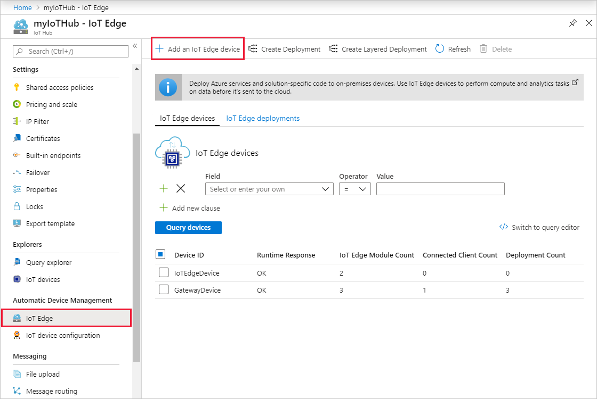

# Create and provision an IoT Edge for Linux on Windows device using symmetric keys

[!INCLUDE [iot-edge-version-201806](../../includes/iot-edge-version-201806.md)]

This article provides end-to-end instructions for registering and provisioning an IoT Edge for Linux on Windows device.

Every device that connects to an IoT hub has a device ID that's used to track cloud-to-device or device-to-cloud communications. You configure a device with its connection information, which includes the IoT hub hostname, the device ID, and the information the device uses to authenticate to IoT Hub.

The steps in this article walk through a process called manual provisioning, where you connect a single device to its IoT hub. For manual provisioning, you have two options for authenticating IoT Edge devices:

* **Symmetric keys**: When you create a new device identity in IoT Hub, the service creates two keys. You place one of the keys on the device, and it presents the key to IoT Hub when authenticating.

  This authentication method is faster to get started, but not as secure.

* **X.509 self-signed**: You create two X.509 identity certificates and place them on the device. When you create a new device identity in IoT Hub, you provide thumbprints from both certificates. When the device authenticates to IoT Hub, it presents one certificate and IoT Hub verifies that the certificate matches its thumbprint.

  This authentication method is more secure and recommended for production scenarios.

This article covers using symmetric keys as your authentication method. If you want to use X.509 certificates, see [Create and provision an IoT Edge for Linux on Windows device using X.509 certificates](how-to-provision-single-device-linux-on-windows-x509.md).

> [!NOTE]
> If you have many devices to set up and don't want to manually provision each one, use one of the following articles to learn how IoT Edge works with the IoT Hub Device Provisioning Service:
>
> * [Create and provision IoT Edge devices at scale using X.509 certificates](how-to-provision-devices-at-scale-linux-on-windows-x509.md)
> * [Create and provision IoT Edge devices at scale with a TPM](how-to-auto-provision-tpm-linux-on-windows.md)
> * [Create and provision IoT Edge devices at scale using symmetric keys](how-to-provision-devices-at-scale-linux-on-windows-symmetric.md)

## Prerequisites

This article covers registering your IoT Edge device and installing IoT Edge for Linux on Windows. These tasks have different prerequisites and utilities used to accomplish them. Make sure you have all the prerequisites covered before proceeding.

### Device registration

You can use the **Azure portal**, **Visual Studio Code**, or **Azure CLI** for the steps to register you device. Each utility has its own prerequisites:

# [Portal](#tab/azure-portal)

A free or standard [IoT hub](../iot-hub/iot-hub-create-through-portal.md) in your Azure subscription.

# [Visual Studio Code](#tab/visual-studio-code)

* A free or standard [IoT hub](../iot-hub/iot-hub-create-through-portal.md) in your Azure subscription
* [Visual Studio Code](https://code.visualstudio.com/)
* [Azure IoT Tools](https://marketplace.visualstudio.com/items?itemName=vsciot-vscode.azure-iot-tools) for Visual Studio Code

> [!NOTE]
> Currently, the Azure IoT extension for Visual Studio Code doesn't support device registration with X.509 certificates.

# [Azure CLI](#tab/azure-cli)

* A free or standard [IoT hub](../iot-hub/iot-hub-create-using-cli.md) in your Azure subscription.
* [Azure CLI](/cli/azure/install-azure-cli) in your environment. At a minimum, your Azure CLI version must be 2.0.70 or newer. Use `az --version` to validate. This version supports az extension commands and introduces the Knack command framework.

---

### IoT Edge for Linux on Windows installation

A Windows device with the following minimum system requirements:

* Windows 10 Version 1809 or later; build 17763 or later

* Professional, Enterprise, or Server editions

* Minimum Free Memory: 1 GB

* Minimum Free Disk Space: 10 GB

* Virtualization support
  * On Windows 10, enable Hyper-V. For more information, see [Install Hyper-V on Windows 10](/virtualization/hyper-v-on-windows/quick-start/enable-hyper-v).
  * On Windows Server, install the Hyper-V role and create a default network switch. For more information, see [Nested virtualization for Azure IoT Edge for Linux on Windows](nested-virtualization.md).
  * On a virtual machine, configure nested virtualization. For more information, see [nested virtualization](nested-virtualization.md).

* Networking support
  * Windows Server does not come with a default switch. Before you can deploy EFLOW to a Windows Server device, you need to create a virtual switch.  For more information, see [Create virtual switch for Linux on Windows](how-to-create-virtual-switch.md).
  * Windows Desktop versions come with a default switch that can be used for EFLOW installation. If needed, you can create your own custom virtual switch.

> [!TIP]
> If you want to use **GPU-accelerated Linux modules** in your Azure IoT Edge for Linux on Windows deployment, there are several configuration options to consider. You will need to install the correct drivers depending on your GPU architecture, and you may need access to a Windows Insider Program build. To determine your configuration needs and satisfy these prerequisites, see [GPU acceleration for Azure IoT Edge for Linux on Windows](gpu-acceleration.md).

You can use either **PowerShell** or **Windows Admin Center** to manage your IoT Edge devices. Each utility has its own prerequisites:

# [PowerShell](#tab/powershell)

If you want to use PowerShell, use the following steps to prepare your target device for the installation of Azure IoT Edge for Linux on Windows and the deployment of the Linux virtual machine:

1. Set the execution policy on the target device to `AllSigned`. You can check the current execution policy in an elevated PowerShell prompt using the following command:

   ```powershell
   Get-ExecutionPolicy -List
   ```

   If the execution policy of `local machine` is not `AllSigned`, you can set the execution policy using:

   ```powershell
   Set-ExecutionPolicy -ExecutionPolicy AllSigned -Force
   ```

For more information on the Azure IoT Edge for Linux on Windows PowerShell module, see the [PowerShell functions reference](reference-iot-edge-for-linux-on-windows-functions.md).

# [Windows Admin Center](#tab/windowsadmincenter)

If you want to use Windows Admin Center, use the following steps to download and install Windows Admin Center and install the Windows Admin Center Azure IoT Edge extension:

   1. Download and run the [Windows Admin Center installer](https://aka.ms/wacdownload). Follow the install wizard prompts to install Windows Admin Center.

   1. Once installed, use a supported browser to open Windows Admin Center. Supported browsers include Microsoft Edge (Windows 10, version 1709 or later), Google Chrome, and Microsoft Edge Insider.

   1. On the first use of Windows Admin Center, you will be prompted to select a certificate to use. Select **Windows Admin Center Client** as your certificate.

   1. Install the Azure IoT Edge extension. Select the gear icon in the top right of the Windows Admin Center dashboard.

      

   1. On the **Settings** menu, under **Gateway**, select **Extensions**.

   1. On the **Available extensions** tab, find **Azure IoT Edge** in the list of extensions. Choose it, and select the **Install** prompt above the list of extensions.

   1. After the installation completes, you should see Azure IoT Edge in the list of installed extensions on the **Installed extensions** tab.

---

## Register your device

You can use the **Azure portal**, **Visual Studio Code**, or **Azure CLI** to register your device, depending on your preference.

# [Portal](#tab/azure-portal)

In your IoT hub in the Azure portal, IoT Edge devices are created and managed separately from IoT devices that are not edge enabled.

1. Sign in to the [Azure portal](https://portal.azure.com) and navigate to your IoT hub.

1. In the left pane, select **IoT Edge** from the menu, then select **Add an IoT Edge device**.

   

1. On the **Create a device** page, provide the following information:

   * Create a descriptive device ID. Make a note of this device ID, as you'll use it later.
   * Select **Symmetric key** as the authentication type.
   * Use the default settings to auto-generate authentication keys and connect the new device to your hub.

1. Select **Save**.

# [Visual Studio Code](#tab/visual-studio-code)

### Sign in to access your IoT hub

You can use the Azure IoT extensions for Visual Studio Code to perform operations with your IoT hub. For these operations to work, you need to sign in to your Azure account and select your hub.

1. In Visual Studio Code, open the **Explorer** view.
1. At the bottom of the Explorer, expand the **Azure IoT Hub** section.

   

1. Click on the **...** in the **Azure IoT Hub** section header. If you don't see the ellipsis, click on or hover over the header.
1. Choose **Select IoT Hub**.
1. If you aren't signed in to your Azure account, follow the prompts to do so.
1. Select your Azure subscription.
1. Select your IoT hub.

### Register a new device with Visual Studio Code

1. In the Visual Studio Code Explorer, expand the **Azure IoT Hub** section.
1. Click on the **...** in the **Azure IoT Hub** section header. If you don't see the ellipsis, click on or hover over the header.
1. Select **Create IoT Edge Device**.
1. In the text box that opens, give your device an ID.

In the output screen, you see the result of the command. The device info is printed, which includes the **deviceId** that you provided and the **connectionString** that you can use to connect your physical device to your IoT hub.

# [Azure CLI](#tab/azure-cli)

Use the [az iot hub device-identity create](/cli/azure/iot/hub/device-identity) command to create a new device identity in your IoT hub. For example:

   ```azurecli
   az iot hub device-identity create --device-id [device id] --hub-name [hub name] --edge-enabled
   ```

This command includes three parameters:

* `--device-id` or `-d`: Provide a descriptive name that's unique within your IoT hub.
* `--hub-name` or `-n`: Provide the name of your IoT hub.
* `--edge-enabled` or `--ee`: Declare that the device is an IoT Edge device.

   

---

Now that you have a device registered in IoT Hub, retrieve the information that you use to complete installation and provisioning of the IoT Edge runtime.

## View registered devices and retrieve provisioning information

Devices that use symmetric key authentication need their connection strings to complete installation and provisioning of the IoT Edge runtime.

# [Portal](#tab/azure-portal)

All the edge-enabled devices that connect to your IoT hub are listed on the **IoT Edge** page.


When you're ready to set up your device, you need the connection string that links your physical device with its identity in the IoT hub.

Devices that authenticate with symmetric keys have their connection strings available to copy in the portal.

1. From the **IoT Edge** page in the portal, click on the device ID from the list of IoT Edge devices.
2. Copy the value of either **Primary Connection String** or **Secondary Connection String**.

# [Visual Studio Code](#tab/visual-studio-code)

All the devices that connect to your IoT hub are listed in the **Azure IoT Hub** section of the Visual Studio Code Explorer. IoT Edge devices are distinguishable from non-Edge devices with a different icon, and the fact that the **$edgeAgent** and **$edgeHub** modules are deployed to each IoT Edge device.


When you're ready to set up your device, you need the connection string that links your physical device with its identity in the IoT hub.

1. Right-click on the ID of your device in the **Azure IoT Hub** section.
1. Select **Copy Device Connection String**.

   The connection string is copied to your clipboard.

You can also select **Get Device Info** from the right-click menu to see all the device info, including the connection string, in the output window.

# [Azure CLI](#tab/azure-cli)

Use the [az iot hub device-identity list](/cli/azure/iot/hub/device-identity) command to view all devices in your IoT hub. For example:

   ```azurecli
   az iot hub device-identity list --hub-name [hub name]
   ```

Any device that is registered as an IoT Edge device will have the property **capabilities.iotEdge** set to **true**.

When you're ready to set up your device, you need the connection string that links your physical device with its identity in the IoT hub. Use the [az iot hub device-identity connection-string show](/cli/azure/iot/hub/device-identity/connection-string) command to return the connection string for a single device:

   ```azurecli
   az iot hub device-identity connection-string show --device-id [device id] --hub-name [hub name]
   ```

>[!TIP]
>The `connection-string show` command was introduced in version 0.9.8 of the Azure IoT extension, replacing the deprecated `show-connection-string` command. If you get an error running this command, make sure your extension version is updated to 0.9.8 or later. For more information and the latest updates, see [Microsoft Azure IoT extension for Azure CLI](https://github.com/Azure/azure-iot-cli-extension).

The value for the `device-id` parameter is case-sensitive.

When copying the connection string to use on a device, don't include the quotation marks around the connection string.

---

## Install IoT Edge for Linux on Windows

You can use either **PowerShell** or **Windows Admin Center** to install IoT Edge for Linux on Windows.

# [PowerShell](#tab/powershell)

Install IoT Edge for Linux on Windows onto your target device.

> [!NOTE]
> The following PowerShell process outlines how to deploy IoT Edge for Linux on Windows onto the local device. To deploy to a remote target device using PowerShell, you can use [Remote PowerShell](/powershell/module/microsoft.powershell.core/about/about_remote) to establish a connection to a remote device and run these commands remotely on that device.

1. In an elevated PowerShell session, run each of the following commands to download IoT Edge for Linux on Windows.

   ```powershell
   $msiPath = $([io.Path]::Combine($env:TEMP, 'AzureIoTEdge.msi'))
   $ProgressPreference = 'SilentlyContinue'
   Invoke-WebRequest "https://aka.ms/AzEflowMSI" -OutFile $msiPath
   ```

1. Install IoT Edge for Linux on Windows on your device.

   ```powershell
   Start-Process -Wait msiexec -ArgumentList "/i","$([io.Path]::Combine($env:TEMP, 'AzureIoTEdge.msi'))","/qn"
   ```

   You can specify custom IoT Edge for Linux on Windows installation and VHDX directories by adding `INSTALLDIR="<FULLY_QUALIFIED_PATH>"` and `VHDXDIR="<FULLY_QUALIFIED_PATH>"` parameters to the install command.

1. Set the execution policy on the target device to `AllSigned` if it is not already. See the PowerShell prerequisites for commands to check the current execution policy and set the execution policy to `AllSigned`.

1. Create the IoT Edge for Linux on Windows deployment. The deployment creates your Linux virtual machine and installs the IoT Edge runtime for you.

   ```powershell
   Deploy-Eflow
   ```

   >[!TIP]
   >By default, the `Deploy-Eflow` command creates your Linux virtual machine with 1 GB of RAM, 1 vCPU core, and 16 GB of disk space. However, the resources your VM needs are highly dependent on the workloads you deploy. If your VM does not have sufficient memory to support your workloads, it will fail to start.
   >
   >You can customize the virtual machine's available resources using the `Deploy-Eflow` command's optional parameters.
   >
   >For example, the command below creates a virtual machine with 4 vCPU cores, 4 GB of RAM, and 20 GB of disk space:
   >
   >   ```powershell
   >   Deploy-Eflow -cpuCount 4 -memoryInMB 4096 -vmDiskSize 20
   >   ```
   >
   >For information about all the optional parameters available, see [PowerShell functions for IoT Edge for Linux on Windows](reference-iot-edge-for-linux-on-windows-functions.md#deploy-eflow).

   You can assign a GPU to your deployment to enable GPU-accelerated Linux modules. To gain access to these features, you will need to install the prerequisites detailed in [GPU acceleration for Azure IoT Edge for Linux on Windows](gpu-acceleration.md).

   To use a GPU passthrough, add the **gpuName**, **gpuPassthroughType**, and **gpuCount** parameters to your `Deploy-Eflow` command. For information about all the optional parameters available, see [PowerShell functions for IoT Edge for Linux on Windows](reference-iot-edge-for-linux-on-windows-functions.md#deploy-eflow).

1. Enter 'Y' to accept the license terms.

1. Enter 'O' or 'R' to toggle **Optional diagnostic data** on or off, depending on your preference.

1. Once the deployment is complete, the PowerShell window reports **Deployment successful**.

   

Once your deployment is complete, you are ready to provision your device.

# [Windows Admin Center](#tab/windowsadmincenter)

>[!NOTE]
>The Azure IoT Edge extension for Windows Admin Center is currently in [public preview](https://azure.microsoft.com/support/legal/preview-supplemental-terms/). Installation and management processes may be different than for generally available features.

Install Azure IoT Edge for Linux on Windows on your device.

1. Download the [Azure IoT Edge for Linux on Windows installer](https://aka.ms/AzEflowMSI).

1. Once you have installed Azure IoT Edge for Linux on Windows, open Windows Admin Center.

   On the Windows Admin Center start page, under the list of connections, you will see a local host connection representing the PC where you are running Windows Admin Center. Any additional servers, PCs, or clusters that you manage will also show up here.

   You can use Windows Admin Center to install and manage Azure IoT Edge for Linux on Windows on either your local device or remote managed devices. In this guide, the local host connection will serve as the target device for the deployment of Azure IoT Edge for Linux on Windows.

1. Confirm that your local device is listed under **All connections**, like shown below.

   

   If you want to deploy to a remote target device instead of your local device and you do not see your desired target device in the list, follow the [instructions to add your device](/windows-server/manage/windows-admin-center/use/get-started#connecting-to-managed-nodes-and-clusters).

1. Select **+ Add** to begin creating your deployment. The deployment creates your Linux virtual machine and installs the IoT Edge runtime for you.

1. On the **Add or create resources** pane, locate the **Azure IoT Edge** tile. Select **Create new** to install a new instance of Azure IoT Edge for Linux on Windows on a device.

   If you already have IoT Edge for Linux on Windows running on a device, you could select **Add** to connect to that existing IoT Edge device and manage it with Windows Admin Center.

   

1. The **Create an Azure IoT Edge for Linux on Windows deployment** pane will open. On the **1. Getting Started** tab, review the minimum requirements and select **Next**.

1. Review the license terms, check **I Accept**, and select **Next**.

1. You can toggle **Optional diagnostic data** on or off, depending on your preference.

1. Select **Next: Deploy**.

   

1. On the **2. Deploy** tab, under **Select a target device**, click on your listed device to validate it meets the minimum requirements. Once its status is confirmed as supported, select **Next**.

   

1. On the **2.2 Settings** tab, review the configuration settings of your deployment.

   >[!NOTE]
   >IoT Edge for Linux on Windows uses a default switch, which assigns the Linux virtual machine an internal IP address. This internal IP address cannot be reached from outside the Windows machine. You can connect to the virtual machine locally while logged onto the Windows machine.
   >
   >If you are using Windows Server, [set up a default switch](how-to-create-virtual-switch.md) before deploying IoT Edge for Linux on Windows.

   You can assign a GPU to your deployment to enable GPU-accelerated Linux modules. To gain access to these features, you will need to install the prerequisites detailed in [GPU acceleration for Azure IoT Edge for Linux on Windows](gpu-acceleration.md). If you are only installing these prerequisites at this point in the deployment process, you will need to start again from the beginning.

   There are two options for GPU passthrough available: **Direct Device Assignment (DDA)** and **GPU Paravirtualization (GPU-PV)**, depending on the GPU adaptor you assign to your deployment. Examples of each method are shown below.

   For the direct device assignment method, select the number of GPU processors to allocate to your Linux virtual machine.

   

   For the paravirtualization method, no additional settings are needed.

   

   >[!WARNING]
   >Enabling hardware device passthrough may increase security risks. Microsoft recommends a device mitigation driver from your GPU's vendor, when applicable. For more information, see [Deploy graphics devices using discrete device assignment](/windows-server/virtualization/hyper-v/deploy/deploying-graphics-devices-using-dda).

   Once you are satisfied with the settings, select **Next**.

1. On the **2.3 Deployment** tab, you can watch the progress of the deployment. The full process includes downloading the Azure IoT Edge for Linux on Windows package, installing the package, configuring the host device, and setting up the Linux virtual machine. This process may take several minutes to complete. A successful deployment is pictured below.

   

Once your deployment is complete, you are ready to provision your device. Select **Next: Connect** to proceed to the **3. Connect** tab, which handles Azure IoT Edge device provisioning.

---

## Configure the device with provisioning information

You're ready to set up your device with its cloud identity and authentication information.

To provision your device using symmetric keys, you will need your device's **connection string**.

You can use the Windows Admin Center or an elevated PowerShell session to provision your devices.

# [PowerShell](#tab/powershell)

Run the following command in an elevated PowerShell session on your target device. Replace the placeholder text with your own values.

```powershell
Provision-EflowVm -provisioningType ManualConnectionString -devConnString "<CONNECTION_STRING_HERE>"​
```

For more information about the `Provision-EflowVM` command, see [PowerShell functions for IoT Edge for Linux on Windows](reference-iot-edge-for-linux-on-windows-functions.md#provision-eflowvm).

# [Windows Admin Center](#tab/windowsadmincenter)

1. On the **Azure IoT Edge device provisioning** pane, select **Connection String (Manual)** from the provisioning method dropdown.

1. Provide the **Device connection string** that you retrieved from IoT Hub after registering the device.

1. Select **Provisioning with the selected method**.

   

1. Once the provisioning is complete, select **Finish**. You will be taken back to the main dashboard. Now, you should see a new device listed with the type `IoT Edge Devices`. You can select the IoT Edge device to connect to it. Once on its **Overview** page, you can view the **IoT Edge Module List** and **IoT Edge Status** of your device.

---

## Verify successful configuration

Verify that IoT Edge for Linux on Windows was successfully installed and configured on your IoT Edge device.

# [PowerShell](#tab/powershell)

1. Log in to your IoT Edge for Linux on Windows virtual machine using the following command in your PowerShell session:

   ```powershell
   Connect-EflowVm
   ```

   >[!NOTE]
   >The only account allowed to SSH to the virtual machine is the user that created it.

1. Once you are logged in, you can check the list of running IoT Edge modules using the following Linux command:

   ```bash
   sudo iotedge list
   ```

1. If you need to troubleshoot the IoT Edge service, use the following Linux commands.

    1. Retrieve the service logs.

       ```bash
       sudo journalctl -u iotedge
       ```

    2. Use the `check` tool to verify configuration and connection status of the device.

       ```bash
       sudo iotedge check
       ```

# [Windows Admin Center](#tab/windowsadmincenter)

1. Select your IoT Edge device from the list of connected devices in Windows Admin Center to connect to it.

1. The device overview page displays some information about the device:

   * The **IoT Edge Module List** section shows running modules on the device. When the IoT Edge service starts for the first time, you should only see the **edgeAgent** module running. The edgeAgent module runs by default and helps to install and start any additional modules that you deploy to your device.

   * The **IoT Edge Status** section shows the service status, and should be reporting **active (running)**.

---

When you create a new IoT Edge device, it will display the status code `417 -- The device's deployment configuration is not set` in the Azure portal. This status is normal, and means that the device is ready to receive a module deployment.

## Next steps

* Continue to [deploy IoT Edge modules](how-to-deploy-modules-portal.md) to learn how to deploy modules onto your device.
* Learn how to [manage certificates on your IoT Edge for Linux on Windows virtual machine](how-to-manage-device-certificates.md) and transfer files from the host OS to your Linux virtual machine.
* Learn how to [configure your IoT Edge devices to communicate through a proxy server](how-to-configure-proxy-support.md).
