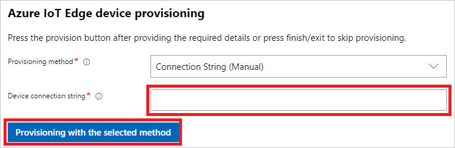

# Create and provision an IoT Edge for Linux on Windows device using symmetric keys

[!INCLUDE [iot-edge-version-1.1-or-1.4](./includes/iot-edge-version-1.1-or-1.4.md)]

This article provides end-to-end instructions for registering and provisioning an IoT Edge for Linux on Windows device.

<!-- iotedge-2020-11 -->
:::moniker range=">=iotedge-2020-11"
>[!NOTE]
>The latest version of [Azure IoT Edge for Linux on Windows continuous release (EFLOW CR)](./version-history.md), based on IoT Edge version 1.2, is in [public preview](https://azure.microsoft.com/support/legal/preview-supplemental-terms/). A clean installation may be required for devices going into production use once the general availability (GA) release is available. For more information, see [EFLOW continuous release](https://github.com/Azure/iotedge-eflow/wiki/EFLOW-Continuous-Release).
:::moniker-end
<!-- end iotedge-2020-11 -->

Every device that connects to an IoT hub has a device ID that's used to track cloud-to-device or device-to-cloud communications. You configure a device with its connection information, which includes the IoT hub hostname, the device ID, and the information the device uses to authenticate to IoT Hub.

The steps in this article walk through a process called manual provisioning, where you connect a single device to its IoT hub. For manual provisioning, you have two options for authenticating IoT Edge devices:

* **Symmetric keys**: When you create a new device identity in IoT Hub, the service creates two keys. You place one of the keys on the device, and it presents the key to IoT Hub when authenticating.

  This authentication method is faster to get started, but not as secure.

* **X.509 self-signed**: You create two X.509 identity certificates and place them on the device. When you create a new device identity in IoT Hub, you provide thumbprints from both certificates. When the device authenticates to IoT Hub, it presents one certificate and IoT Hub verifies that the certificate matches its thumbprint.

  This authentication method is more secure and recommended for production scenarios.

This article covers using symmetric keys as your authentication method. If you want to use X.509 certificates, see [Create and provision an IoT Edge for Linux on Windows device using X.509 certificates](how-to-provision-single-device-linux-on-windows-x509.md).

> [!NOTE]
> If you have many devices to set up and don't want to manually provision each one, use one of the following articles to learn how IoT Edge works with the IoT Hub device provisioning service:
>
> * [Create and provision IoT Edge devices at scale using X.509 certificates](how-to-provision-devices-at-scale-linux-on-windows-x509.md)
> * [Create and provision IoT Edge devices at scale with a TPM](how-to-provision-devices-at-scale-linux-on-windows-tpm.md)
> * [Create and provision IoT Edge devices at scale using symmetric keys](how-to-provision-devices-at-scale-linux-on-windows-symmetric.md)

## Prerequisites

This article covers registering your IoT Edge device and installing IoT Edge for Linux on Windows. These tasks have different prerequisites and utilities used to accomplish them. Make sure you have all the prerequisites covered before proceeding.

<!-- Device registration prerequisites H3 and content -->
[!INCLUDE [iot-edge-prerequisites-register-device.md](../../includes/iot-edge-prerequisites-register-device.md)]

<!-- IoT Edge for Linux on Windows installation prerequisites H3 and content -->
[!INCLUDE [iot-edge-prerequisites-linux-on-windows.md](../../includes/iot-edge-prerequisites-linux-on-windows.md)]

<!-- Register your device and View provisioning information H2s and content -->
[!INCLUDE [iot-edge-register-device-symmetric.md](../../includes/iot-edge-register-device-symmetric.md)]

<!-- Install IoT Edge for Linux on Windows H2 and content -->
[!INCLUDE [install-iot-edge-linux-on-windows.md](../../includes/iot-edge-install-linux-on-windows.md)]

## Provision the device with its cloud identity

You're ready to set up your device with its cloud identity and authentication information.

To provision your device using symmetric keys, you will need your device's **connection string**.

<!-- 1.1 -->
:::moniker range="iotedge-2018-06"

You can use the Windows Admin Center or an elevated PowerShell session to provision your devices.

# [PowerShell](#tab/powershell)

Run the following command in an elevated PowerShell session on your target device. Replace the placeholder text with your own values.

```powershell
Provision-EflowVm -provisioningType ManualConnectionString -devConnString "PASTE_DEVICE_CONNECTION_STRING_HERE"
```

For more information about the `Provision-EflowVM` command, see [PowerShell functions for IoT Edge for Linux on Windows](reference-iot-edge-for-linux-on-windows-functions.md#provision-eflowvm).

# [Windows Admin Center](#tab/windowsadmincenter)

1. On the **Azure IoT Edge device provisioning** pane, select **Connection String (Manual)** from the provisioning method dropdown.

1. Provide the **Device connection string** that you retrieved from IoT Hub after registering the device.

1. Select **Provisioning with the selected method**.

   

1. Once the provisioning is complete, select **Finish**. You will be taken back to the main dashboard. Now, you should see a new device listed with the type `IoT Edge Devices`. You can select the IoT Edge device to connect to it. Once on its **Overview** page, you can view the **IoT Edge Module List** and **IoT Edge Status** of your device.

---

:::moniker-end
<!-- end 1.1 -->

<!-- iotedge-2020-11 -->
:::moniker range=">=iotedge-2020-11"

Run the following command in an elevated PowerShell session on your target device. Replace the placeholder text with your own values.

```powershell
Provision-EflowVm -provisioningType ManualConnectionString -devConnString "PASTE_DEVICE_CONNECTION_STRING_HERE"
```

For more information about the `Provision-EflowVM` command, see [PowerShell functions for IoT Edge for Linux on Windows](reference-iot-edge-for-linux-on-windows-functions.md#provision-eflowvm).

:::moniker-end
<!-- end iotedge-2020-11 -->

## Verify successful configuration

Verify that IoT Edge for Linux on Windows was successfully installed and configured on your IoT Edge device.

<!-- 1.1 -->
:::moniker range="iotedge-2018-06"

# [PowerShell](#tab/powershell)

1. Log in to your IoT Edge for Linux on Windows virtual machine using the following command in your PowerShell session:

   ```powershell
   Connect-EflowVm
   ```

   >[!NOTE]
   >The only account allowed to SSH to the virtual machine is the user that created it.

1. Once you are logged in, you can check the list of running IoT Edge modules using the following Linux command:

   ```bash
   sudo iotedge list
   ```

1. If you need to troubleshoot the IoT Edge service, use the following Linux commands.

    1. Retrieve the service logs.

       ```bash
       sudo journalctl -u iotedge
       ```

    2. Use the `check` tool to verify configuration and connection status of the device.

       ```bash
       sudo iotedge check
       ```

    >[!NOTE]
    >On a newly provisioned device, you may see an error related to IoT Edge Hub:
    >
    >**× production readiness: Edge Hub's storage directory is persisted on the host filesystem - Error**
    >
    >**Could not check current state of edgeHub container**
    >
    >This error is expected on a newly provisioned device because the IoT Edge Hub module isn't running. To resolve the error, in IoT Hub, set the modules for the device and create a deployment. Creating a deployment for the device starts the modules on the device including the IoT Edge Hub module.

# [Windows Admin Center](#tab/windowsadmincenter)

1. Select your IoT Edge device from the list of connected devices in Windows Admin Center to connect to it.

1. The device overview page displays some information about the device:

   * The **IoT Edge Module List** section shows running modules on the device. When the IoT Edge service starts for the first time, you should only see the **edgeAgent** module running. The edgeAgent module runs by default and helps to install and start any additional modules that you deploy to your device.

   * The **IoT Edge Status** section shows the service status, and should be reporting **active (running)**.

---

:::moniker-end
<!-- end 1.1 -->

<!-- iotedge-2020-11 -->
:::moniker range=">=iotedge-2020-11"

1. Log in to your IoT Edge for Linux on Windows virtual machine using the following command in your PowerShell session:

   ```powershell
   Connect-EflowVm
   ```

   >[!NOTE]
   >The only account allowed to SSH to the virtual machine is the user that created it.

1. Once you are logged in, you can check the list of running IoT Edge modules using the following Linux command:

   ```bash
   sudo iotedge list
   ```

1. If you need to troubleshoot the IoT Edge service, use the following Linux commands.

    1. Retrieve the service logs.

       ```bash
       sudo iotedge system logs
       ```

    2. Use the `check` tool to verify configuration and connection status of the device.

       ```bash
       sudo iotedge check
       ```

    >[!NOTE]
    >On a newly provisioned device, you may see an error related to IoT Edge Hub:
    >
    >**× production readiness: Edge Hub's storage directory is persisted on the host filesystem - Error**
    >
    >**Could not check current state of edgeHub container**
    >
    >This error is expected on a newly provisioned device because the IoT Edge Hub module isn't running. To resolve the error, in IoT Hub, set the modules for the device and create a deployment. Creating a deployment for the device starts the modules on the device including the IoT Edge Hub module.


:::moniker-end
<!-- end iotedge-2020-11 -->

When you create a new IoT Edge device, it will display the status code `417 -- The device's deployment configuration is not set` in the Azure portal. This status is normal, and means that the device is ready to receive a module deployment.

<!-- Uninstall IoT Edge for Linux on Windows H2 and content -->
[!INCLUDE [uninstall-iot-edge-linux-on-windows.md](../../includes/iot-edge-uninstall-linux-on-windows.md)]

## Next steps

* Continue to [deploy IoT Edge modules](how-to-deploy-modules-portal.md) to learn how to deploy modules onto your device.
* Learn how to [manage certificates on your IoT Edge for Linux on Windows virtual machine](how-to-manage-device-certificates.md) and transfer files from the host OS to your Linux virtual machine.
* Learn how to [configure your IoT Edge devices to communicate through a proxy server](how-to-configure-proxy-support.md).