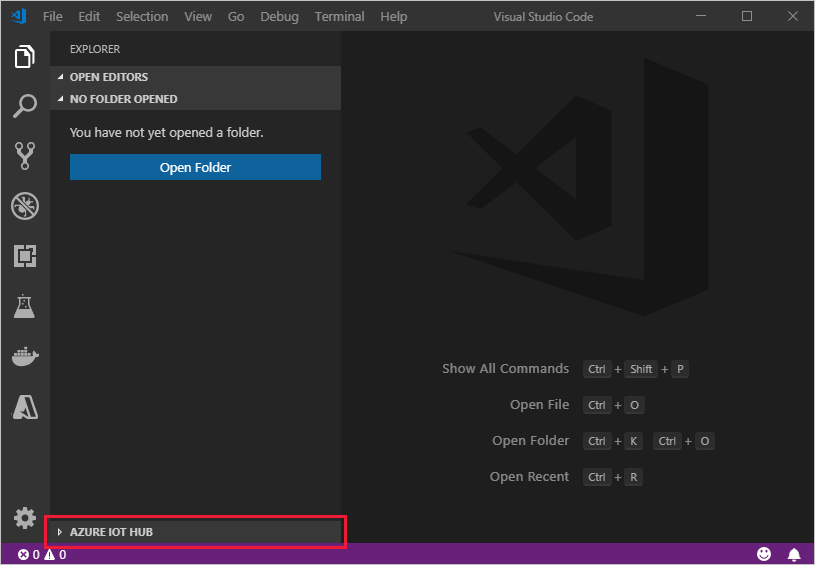

# Create and provision an IoT Edge device on Windows using symmetric keys

[!INCLUDE [iot-edge-version-201806](../../includes/iot-edge-version-201806.md)]

This article provides end-to-end instructions for registering and provisioning a Windows IoT Edge device.

>[!NOTE]
>Azure IoT Edge with Windows containers will not be supported starting with version 1.2 of Azure IoT Edge.
>
>Consider using the new method for running IoT Edge on Windows devices, [Azure IoT Edge for Linux on Windows](iot-edge-for-linux-on-windows.md).

Every device that connects to an IoT hub has a device ID that's used to track cloud-to-device or device-to-cloud communications. You configure a device with its connection information, which includes the IoT hub hostname, the device ID, and the information the device uses to authenticate to IoT Hub.

The steps in this article walk through a process called manual provisioning, where you connect a single device to its IoT hub. For manual provisioning, you have two options for authenticating IoT Edge devices:

* **Symmetric keys**: When you create a new device identity in IoT Hub, the service creates two keys. You place one of the keys on the device, and it presents the key to IoT Hub when authenticating.

  This authentication method is faster to get started, but not as secure.

* **X.509 self-signed**: You create two X.509 identity certificates and place them on the device. When you create a new device identity in IoT Hub, you provide thumbprints from both certificates. When the device authenticates to IoT Hub, it presents one certificate and IoT Hub verifies that the certificate matches its thumbprint.

  This authentication method is more secure and recommended for production scenarios.

This article covers using symmetric keys as your authentication method. If you want to use X.509 certificates, see [Create and provision an IoT Edge device on Windows using X.509 certificates](how-to-provision-single-device-windows-x509.md).

> [!NOTE]
> If you have many devices to set up and don't want to manually provision each one, use one of the following articles to learn how IoT Edge works with the IoT Hub Device Provisioning Service:
>
> * [Create and provision IoT Edge devices at scale using X.509 certificates](how-to-provision-devices-at-scale-windows-x509.md)
> * [Create and provision IoT Edge devices at scale with a TPM](how-to-auto-provision-simulated-device-windows.md)
> * [Create and provision IoT Edge devices at scale using symmetric keys](how-to-provision-devices-at-scale-windows-symmetric.md)

## Prerequisites

This article covers registering your IoT Edge device and installing IoT Edge on it. These tasks have different prerequisites and utilities used to accomplish them. Make sure you have all the prerequisites covered before proceeding.

### Device registration

You can use the **Azure portal**, **Visual Studio Code**, or **Azure CLI** for the steps to register you device. Each utility has its own prerequisites:

# [Portal](#tab/azure-portal)

A free or standard [IoT hub](../iot-hub/iot-hub-create-through-portal.md) in your Azure subscription.

# [Visual Studio Code](#tab/visual-studio-code)

* A free or standard [IoT hub](../iot-hub/iot-hub-create-through-portal.md) in your Azure subscription
* [Visual Studio Code](https://code.visualstudio.com/)
* [Azure IoT Tools](https://marketplace.visualstudio.com/items?itemName=vsciot-vscode.azure-iot-tools) for Visual Studio Code

> [!NOTE]
> Currently, the Azure IoT extension for Visual Studio Code doesn't support device registration with X.509 certificates.

# [Azure CLI](#tab/azure-cli)

* A free or standard [IoT hub](../iot-hub/iot-hub-create-using-cli.md) in your Azure subscription.
* [Azure CLI](/cli/azure/install-azure-cli) in your environment. At a minimum, your Azure CLI version must be 2.0.70 or newer. Use `az --version` to validate. This version supports az extension commands and introduces the Knack command framework.

---

### IoT Edge installation

A Windows device

IoT Edge with Windows containers requires Windows version 1809/build 17763, which is the latest [Windows long term support build](/windows/release-information/). Be sure to review the [supported systems list](support.md#operating-systems) for a list of supported SKUs.

## Register your device

You can use the **Azure portal**, **Visual Studio Code**, or **Azure CLI** to register your device, depending on your preference.

# [Portal](#tab/azure-portal)

In your IoT hub in the Azure portal, IoT Edge devices are created and managed separately from IoT devices that are not edge enabled.

1. Sign in to the [Azure portal](https://portal.azure.com) and navigate to your IoT hub.

1. In the left pane, select **IoT Edge** from the menu, then select **Add an IoT Edge device**.

   

1. On the **Create a device** page, provide the following information:

   * Create a descriptive device ID. Make a note of this device ID, as you'll use it later.
   * Select **Symmetric key** as the authentication type.
   * Use the default settings to auto-generate authentication keys and connect the new device to your hub.

1. Select **Save**.

# [Visual Studio Code](#tab/visual-studio-code)

### Sign in to access your IoT hub

You can use the Azure IoT extensions for Visual Studio Code to perform operations with your IoT hub. For these operations to work, you need to sign in to your Azure account and select your hub.

1. In Visual Studio Code, open the **Explorer** view.
1. At the bottom of the Explorer, expand the **Azure IoT Hub** section.

   

1. Click on the **...** in the **Azure IoT Hub** section header. If you don't see the ellipsis, click on or hover over the header.
1. Choose **Select IoT Hub**.
1. If you aren't signed in to your Azure account, follow the prompts to do so.
1. Select your Azure subscription.
1. Select your IoT hub.

### Register a new device with Visual Studio Code

1. In the Visual Studio Code Explorer, expand the **Azure IoT Hub** section.
1. Click on the **...** in the **Azure IoT Hub** section header. If you don't see the ellipsis, click on or hover over the header.
1. Select **Create IoT Edge Device**.
1. In the text box that opens, give your device an ID.

In the output screen, you see the result of the command. The device info is printed, which includes the **deviceId** that you provided and the **connectionString** that you can use to connect your physical device to your IoT hub.

# [Azure CLI](#tab/azure-cli)

Use the [az iot hub device-identity create](/cli/azure/iot/hub/device-identity) command to create a new device identity in your IoT hub. For example:

   ```azurecli
   az iot hub device-identity create --device-id [device_id] --hub-name [hub_name] --edge-enabled
   ```

This command includes three parameters:

* `--device-id` or `-d`: Provide a descriptive name that's unique within your IoT hub.
* `--hub-name` or `-n`: Provide the name of your IoT hub.
* `--edge-enabled` or `--ee`: Declare that the device is an IoT Edge device.

   

---

Now that you have a device registered in IoT Hub, retrieve the information that you use to complete installation and provisioning of the IoT Edge runtime.

## View registered devices and retrieve provisioning information

Devices that use symmetric key authentication need their connection strings to complete installation and provisioning of the IoT Edge runtime.

# [Portal](#tab/azure-portal)

All the edge-enabled devices that connect to your IoT hub are listed on the **IoT Edge** page.


When you're ready to set up your device, you need the connection string that links your physical device with its identity in the IoT hub.

Devices that authenticate with symmetric keys have their connection strings available to copy in the portal.

1. From the **IoT Edge** page in the portal, click on the device ID from the list of IoT Edge devices.
2. Copy the value of either **Primary Connection String** or **Secondary Connection String**.

# [Visual Studio Code](#tab/visual-studio-code)

All the devices that connect to your IoT hub are listed in the **Azure IoT Hub** section of the Visual Studio Code Explorer. IoT Edge devices are distinguishable from non-Edge devices with a different icon, and the fact that the **$edgeAgent** and **$edgeHub** modules are deployed to each IoT Edge device.


When you're ready to set up your device, you need the connection string that links your physical device with its identity in the IoT hub.

1. Right-click on the ID of your device in the **Azure IoT Hub** section.
1. Select **Copy Device Connection String**.

   The connection string is copied to your clipboard.

You can also select **Get Device Info** from the right-click menu to see all the device info, including the connection string, in the output window.

# [Azure CLI](#tab/azure-cli)

Use the [az iot hub device-identity list](/cli/azure/iot/hub/device-identity) command to view all devices in your IoT hub. For example:

   ```azurecli
   az iot hub device-identity list --hub-name [hub_name]
   ```

Any device that is registered as an IoT Edge device will have the property **capabilities.iotEdge** set to **true**.

When you're ready to set up your device, you need the connection string that links your physical device with its identity in the IoT hub. Use the [az iot hub device-identity connection-string show](/cli/azure/iot/hub/device-identity/connection-string) command to return the connection string for a single device:

   ```azurecli
   az iot hub device-identity connection-string show --device-id [device_id] --hub-name [hub_name]
   ```

>[!TIP]
>The `connection-string show` command was introduced in version 0.9.8 of the Azure IoT extension, replacing the deprecated `show-connection-string` command. If you get an error running this command, make sure your extension version is updated to 0.9.8 or later. For more information and the latest updates, see [Microsoft Azure IoT extension for Azure CLI](https://github.com/Azure/azure-iot-cli-extension).

The value for the `device-id` parameter is case-sensitive.

When copying the connection string to use on a device, don't include the quotation marks around the connection string.

---

## Install IoT Edge

In this section, you prepare your Windows device for IoT Edge. Then, you install IoT Edge.

Azure IoT Edge relies on an OCI-compatible container runtime. [Moby](https://github.com/moby/moby), a Moby-based engine, is included in the installation script, which means there are no additional steps to install the engine.

To install the IoT Edge runtime:

1. Run PowerShell as an administrator.

   Use an AMD64 session of PowerShell, not PowerShell(x86). If you're unsure which session type you're using, run the following command:

   ```powershell
   (Get-Process -Id $PID).StartInfo.EnvironmentVariables["PROCESSOR_ARCHITECTURE"]
   ```

2. Run the [Deploy-IoTEdge](reference-windows-scripts.md#deploy-iotedge) command, which performs the following tasks:

   * Checks that your Windows machine is on a supported version.
   * Turns on the containers feature.
   * Downloads the moby engine and the IoT Edge runtime.

   ```powershell
   . {Invoke-WebRequest -useb https://aka.ms/iotedge-win} | Invoke-Expression; `
   Deploy-IoTEdge
   ```

3. Restart your device if prompted.

When you install IoT Edge on a device, you can use additional parameters to modify the process including:

* Direct traffic to go through a proxy server
* Point the installer to a local directory for offline installation.

For more information about these additional parameters, see [PowerShell scripts for IoT Edge with Windows containers](reference-windows-scripts.md).

## Provision the device with its cloud identity

Now that the container engine and the IoT Edge runtime are installed on your device, you're ready for the next step, which is to set up the device with its cloud identity and authentication information.

1. On the IoT Edge device, run PowerShell as an administrator.

2. Use the [Initialize-IoTEdge](reference-windows-scripts.md#initialize-iotedge) command to configure the IoT Edge runtime on your machine. The command defaults to manual provisioning with Windows containers.

   ```powershell
   . {Invoke-WebRequest -useb https://aka.ms/iotedge-win} | Invoke-Expression; `
   Initialize-IoTEdge -ManualConnectionString -ContainerOs Windows
   ```

   * If you downloaded the IoTEdgeSecurityDaemon.ps1 script onto your device for offline or specific version installation, be sure to reference the local copy of the script.

      ```powershell
      . <path>/IoTEdgeSecurityDaemon.ps1
      Initialize-IoTEdge -ManualConnectionString -ContainerOs Windows
      ```

3. When prompted, provide the device connection string that you retrieved in the previous section. The device connection string associates the physical device with a device ID in IoT Hub and provides authentication information.

   The device connection string takes the following format, and should not include quotation marks: `HostName={IoT_hub_name}.azure-devices.net;DeviceId={device_name};SharedAccessKey={key}`

When you provision a device manually, you can use additional parameters to modify the process including:

* Direct traffic to go through a proxy server
* Declare a specific edgeAgent container image, and provide credentials if it's in a private registry

For more information about these additional parameters, see [PowerShell scripts for IoT Edge with Windows containers](reference-windows-scripts.md).

## Offline or specific version installation (optional)

The steps in this section are for scenarios not covered by the standard installation steps. This may include:

* Install IoT Edge while offline
* Install a release candidate version
* Install a version other than the latest

During installation three files are downloaded:

* A PowerShell script, which contains the installation instructions
* Microsoft Azure IoT Edge cab, which contains the IoT Edge security daemon (iotedged), Moby container engine, and Moby CLI
* Visual C++ redistributable package (VC runtime) installer

If your device will be offline during installation, or if you want to install a specific version of IoT Edge, you can download these files ahead of time to the device. When it's time to install, point the installation script at the directory that contains the downloaded files. The installer checks that directory first, and then only downloads components that aren't found. If all the files are available offline, you can install with no internet connection.

1. For the latest IoT Edge installation files along with previous versions, see [Azure IoT Edge releases](https://github.com/Azure/azure-iotedge/releases).

2. Find the version that you want to install, and download the following files from the **Assets** section of the release notes onto your IoT device:

   * IoTEdgeSecurityDaemon.ps1
   * Microsoft-Azure-IoTEdge-amd64.cab from 1.1 release channel.

   It's important to use the PowerShell script from the same release as the .cab file that you use because the functionality changes to support the features in each release.

3. If the .cab file you downloaded has an architecture suffix on it, rename the file to just **Microsoft-Azure-IoTEdge.cab**.

4. Optionally, download an installer for Visual C++ redistributable. For example, the PowerShell script uses this version: [vc_redist.x64.exe](https://download.microsoft.com/download/0/6/4/064F84EA-D1DB-4EAA-9A5C-CC2F0FF6A638/vc_redist.x64.exe). Save the installer in the same folder on your IoT device as the IoT Edge files.

5. To install with offline components, [dot source](/powershell/module/microsoft.powershell.core/about/about_scripts#script-scope-and-dot-sourcing) the local copy of the PowerShell script.

6. Run the [Deploy-IoTEdge](reference-windows-scripts.md#deploy-iotedge) command with the `-OfflineInstallationPath` parameter. Provide the absolute path to the file directory. For example,

   ```powershell
   . <path>\IoTEdgeSecurityDaemon.ps1
   Deploy-IoTEdge -OfflineInstallationPath <path>
   ```

   The deployment command will use any components found in the local file directory provided. If either the .cab file or the Visual C++ installer is missing, it will attempt to download them.

## Uninstall IoT Edge

If you want to remove the IoT Edge installation from your device, use the following commands.

If you want to remove the IoT Edge installation from your Windows device, use the [Uninstall-IoTEdge](reference-windows-scripts.md#uninstall-iotedge) command from an administrative PowerShell window. This command removes the IoT Edge runtime, along with your existing configuration and the Moby engine data.

```powershell
. {Invoke-WebRequest -useb aka.ms/iotedge-win} | Invoke-Expression; `
Uninstall-IoTEdge
```

For more information about uninstallation options, use the command `Get-Help Uninstall-IoTEdge -full`.

## Next steps

Continue to [deploy IoT Edge modules](how-to-deploy-modules-portal.md) to learn how to deploy modules onto your device.
