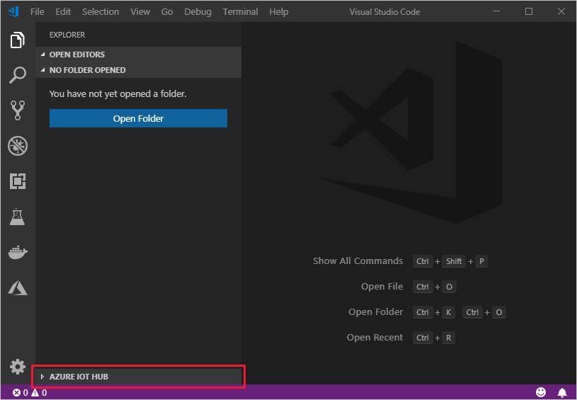
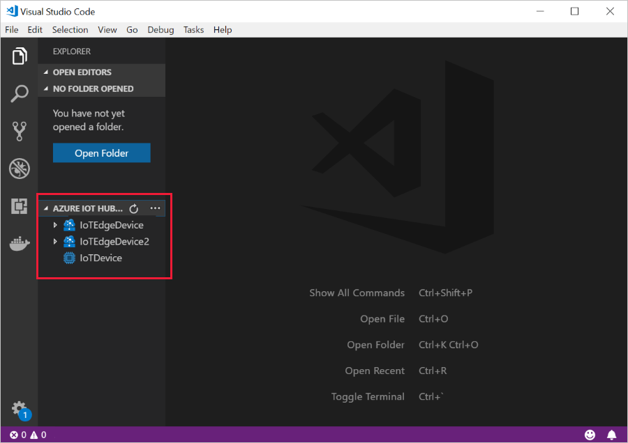

# Register a new Azure IoT Edge device from Visual Studio Code

Before you can use your IoT devices with Azure IoT Edge, you need to register them with your IoT hub. Once you register a device, you receive a connection string that can be used to set up your device for IoT Edge workloads.

This article shows how to register a new IoT Edge device using Visual Studio Code (VS Code). There are multiple ways to perform most operations in VS Code. This article uses the Explorer, but you can also use the Command Palette to run the steps.

## Prerequisites

* An [IoT hub](../iot-hub/iot-hub-create-through-portal.md) in your Azure subscription
* [Visual Studio Code](https://code.visualstudio.com/)
* [Azure IoT Tools](https://marketplace.visualstudio.com/items?itemName=vsciot-vscode.azure-iot-tools) for Visual Studio Code

## Sign in to access your IoT hub

You can use the Azure IoT extensions for Visual Studio Code to perform operations with your IoT hub. For these operations to work, you need to sign in to your Azure account and select your IoT hub.

1. In Visual Studio Code, open the **Explorer** view.

1. At the bottom of the Explorer, expand the **Azure IoT Hub** section.

   

1. Click on the **...** in the **Azure IoT Hub** section header. If you don't see the ellipsis, click on or hover over the header.

1. Choose **Select IoT Hub**.

1. If you aren't signed in to your Azure account, follow the prompts to do so.

1. Select your Azure subscription.

1. Select your IoT hub.

## Create a device

1. In the VS Code Explorer, expand the **Azure IoT Hub Devices** section.

1. Click on the **...** in the **Azure IoT Hub Devices** section header. If you don't see the ellipsis, click on or hover over the header.

1. Select **Create IoT Edge Device**.

1. In the text box that opens, give your device an ID.

In the output screen, you see the result of the command. The device info is printed, which includes the **deviceId** that you provided and the **connectionString** that you can use to connect your physical device to your IoT hub.

## View all devices

All the devices that connect to your IoT hub are listed in the **Azure IoT Hub** section of the Visual Studio Code Explorer. IoT Edge devices are distinguishable from non-Edge devices with a different icon, and the fact that the **$edgeAgent** and **$edgeHub** modules are deployed to each IoT Edge device.

   

## Retrieve the connection string

When you're ready to set up your device, you need the connection string that links your physical device with its identity in the IoT hub.

1. Right-click on the ID of your device in the **Azure IoT Hub** section.

1. Select **Copy Device Connection String**.

   The connection string is copied to your clipboard.

You can also select **Get Device Info** from the right-click menu to see all the device info, including the connection string, in the output window.

## Next steps

Learn how to [Deploy modules to a device with Visual Studio Code](how-to-deploy-modules-vscode.md).
