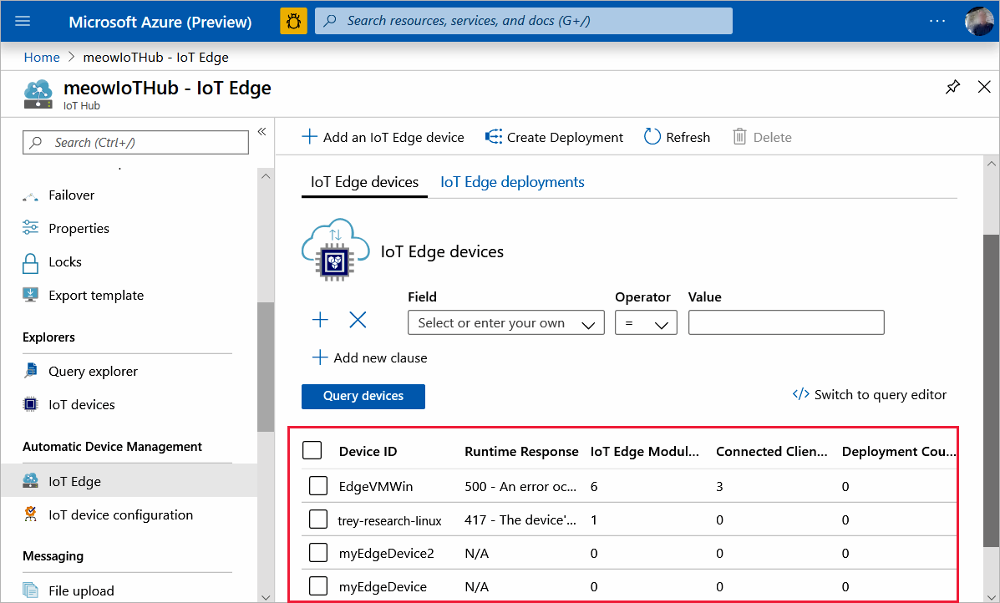
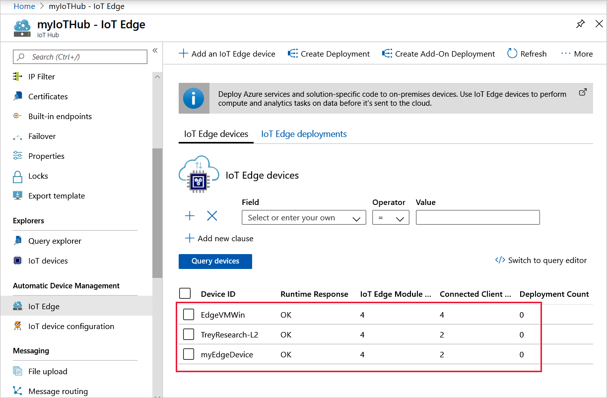

# Register an Azure IoT Edge device

Before you can use your IoT devices with Azure IoT Edge, you must register them with your IoT hub. Once a device is registered, you can retrieve a connection string to set up your device for IoT Edge workloads.

You have the choice of registering by using one of the following tools:

* [Register a device in the Azure portal](#register-in-the-azure-portal) if you prefer a graphical user interface to create, view, and manage Azure resources.
* [Register a device with Visual Studio Code](#register-with-visual-studio-code) if you prefer to manage Azure IoT resources in the same place where you develop your IoT solutions.
* [Register a device with the Azure CLI](#register-with-the-azure-cli) if you prefer command-line tools for managing Azure resources, or intend to automate tasks.

## Register in the Azure portal

You can perform all registration tasks in the Azure portal.

### Prerequisites for the Azure portal

A free or standard [IoT hub](../iot-hub/iot-hub-create-through-portal.md) in your Azure subscription.

### Create an IoT Edge device in the Azure portal

In your IoT Hub in the Azure portal, IoT Edge devices are created and managed separately from IOT devices that are not edge enabled.

1. Sign in to the [Azure portal](https://portal.azure.com) and navigate to your IoT hub.
2. In the left pane, select **IoT Edge** from the menu.
3. Select **Add an IoT Edge device**.
4. Provide a descriptive device ID. Use the default settings to auto-generate authentication keys and connect the new device to your hub.
5. Select **Save**.

### View IoT Edge devices in the Azure portal

All the edge-enabled devices that connect to your IoT hub are listed on the **IoT Edge** page.



### Retrieve the connection string in the Azure portal

When you're ready to set up your device, you need the connection string that links your physical device with its identity in the IoT hub.

1. From the **IoT Edge** page in the portal, click on the device ID from the list of IoT Edge devices.
2. Copy the value of either **Primary Connection String** or **Secondary Connection String**.

## Register with Visual Studio Code

There are multiple ways to perform most operations in VS Code. This article uses the Explorer, but you can also use the Command Palette to run the steps.

### Prerequisites for Visual Studio Code

* An [IoT hub](../iot-hub/iot-hub-create-through-portal.md) in your Azure subscription
* [Visual Studio Code](https://code.visualstudio.com/)
* [Azure IoT Tools](https://marketplace.visualstudio.com/items?itemName=vsciot-vscode.azure-iot-tools) for Visual Studio Code

### Sign in to access your IoT hub

You can use the Azure IoT extensions for Visual Studio Code to perform operations with your IoT Hub. For these operations to work, you need to sign in to your Azure account and select your IoT Hub.

1. In Visual Studio Code, open the **Explorer** view.
1. At the bottom of the Explorer, expand the **Azure IoT Hub** section.

   

1. Click on the **...** in the **Azure IoT Hub** section header. If you don't see the ellipsis, click on or hover over the header.
1. Choose **Select IoT Hub**.
1. If you aren't signed in to your Azure account, follow the prompts to do so.
1. Select your Azure subscription.
1. Select your IoT hub.

### Create an IoT Edge device with Visual Studio Code

1. In the VS Code Explorer, expand the **Azure IoT Hub Devices** section.
1. Click on the **...** in the **Azure IoT Hub Devices** section header. If you don't see the ellipsis, click on or hover over the header.
1. Select **Create IoT Edge Device**.
1. In the text box that opens, give your device an ID.

In the output screen, you see the result of the command. The device info is printed, which includes the **deviceId** that you provided and the **connectionString** that you can use to connect your physical device to your IoT hub.

In the output screen, you see the result of the command. The device info is printed, which includes the **deviceId** that you provided and the **connectionString** that you can use to connect your physical device to your IoT hub.

### View IoT Edge devices with Visual Studio Code

All the devices that connect to your IoT hub are listed in the **Azure IoT Hub** section of the Visual Studio Code Explorer. IoT Edge devices are distinguishable from non-Edge devices with a different icon, and the fact that the **$edgeAgent** and **$edgeHub** modules are deployed to each IoT Edge device.


### Retrieve the connection string with Visual Studio Code

When you're ready to set up your device, you need the connection string that links your physical device with its identity in the IoT hub.

1. Right-click on the ID of your device in the **Azure IoT Hub** section.
1. Select **Copy Device Connection String**.

   The connection string is copied to your clipboard.

You can also select **Get Device Info** from the right-click menu to see all the device info, including the connection string, in the output window.

## Register with the Azure CLI

The [Azure CLI](https://docs.microsoft.com/cli/azure?view=azure-cli-latest) is an open-source cross platform command-line tool for managing Azure resources such as IoT Edge. It enables you to manage Azure IoT Hub resources, device provisioning service instances, and linked-hubs out of the box. The IoT extension enriches Azure CLI with features such as device management and full IoT Edge capability.

### Prerequisites for the Azure CLI

* An [IoT hub](../iot-hub/iot-hub-create-using-cli.md) in your Azure subscription.
* [Azure CLI](https://docs.microsoft.com/cli/azure/install-azure-cli) in your environment. At a minimum, your Azure CLI version must be 2.0.70 or above. Use `az --version` to validate. This version supports az extension commands and introduces the Knack command framework.
* The [IoT extension for Azure CLI](https://github.com/Azure/azure-iot-cli-extension).

### Create an IoT Edge device with the Azure CLI

Use the [az iot hub device-identity create](https://docs.microsoft.com/cli/azure/ext/azure-iot/iot/hub/device-identity?view=azure-cli-latest#ext-azure-iot-az-iot-hub-device-identity-create) command to create a new device identity in your IoT hub. For example:

   ```azurecli
   az iot hub device-identity create --device-id [device id] --hub-name [hub name] --edge-enabled
   ```

This command includes three parameters:

* **device-id**: Provide a descriptive name that's unique to your IoT hub.
* **hub-name**: Provide the name of your IoT hub.
* **edge-enabled**: This parameter declares that the device is for use with IoT Edge.

   

### View IoT Edge devices with the Azure CLI

Use the [az iot hub device-identity list](https://docs.microsoft.com/cli/azure/ext/azure-iot/iot/hub/device-identity?view=azure-cli-latest#ext-azure-iot-az-iot-hub-device-identity-list) command to view all devices in your IoT hub. For example:

   ```azurecli
   az iot hub device-identity list --hub-name [hub name]
   ```

Any device that is registered as an IoT Edge device will have the property **capabilities.iotEdge** set to **true**.

### Retrieve the connection string with the Azure CLI

When you're ready to set up your device, you need the connection string that links your physical device with its identity in the IoT hub. Use the [az iot hub device-identity show-connection-string](https://docs.microsoft.com/cli/azure/ext/azure-iot/iot/hub/device-identity?view=azure-cli-latest#ext-azure-iot-az-iot-hub-device-identity-show-connection-string) command to return the connection string for a single device:

   ```azurecli
   az iot hub device-identity show-connection-string --device-id [device id] --hub-name [hub name]
   ```

The value for the `device-id` parameter is case-sensitive. Don't copy the quotation marks around the connection string.

## Next steps

Now that you have a device identity registered in your IoT hub, you're ready to install the IoT Edge runtime on your devices. Install the runtime according to the device's operating system:

* [Install Azure IoT Edge on Windows](how-to-install-iot-edge-windows.md)
* [Install the Azure IoT Edge runtime on Linux](how-to-install-iot-edge-linux.md)
