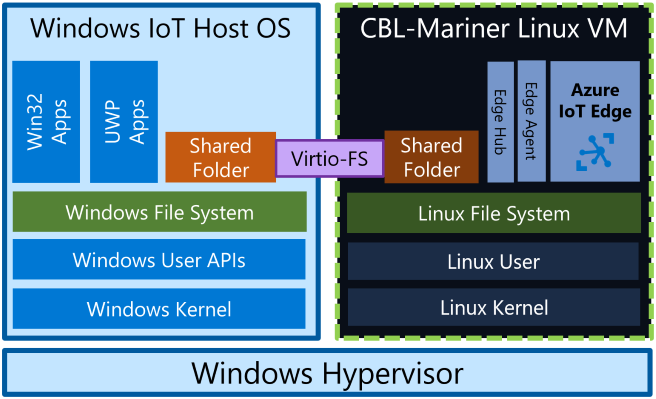

# Share a Windows folder with Azure IoT Edge for Linux on Windows

[!INCLUDE [iot-edge-version-all-supported](../../includes/iot-edge-version-all-supported.md)]

Azure IoT Edge for Linux on Windows (EFLOW) virtual machine is isolated from the Windows host OS, so the virtual machine doesn't have access to the host file system. By default, the EFLOW virtual machine has its own file system and has no access to the folder or files on the host computer. The EFLOW file/folder sharing mechanism provides a way to share Windows files and folders to the CBL-Mariner Linux EFLOW VM.  

This article shows you how to enable the folder sharing between the Windows host OS and the EFLOW virtual machine. 

## Prerequisites
- Azure IoT Edge for Linux on Windows 1.2.11 update or higher. For more information about EFLOW release notes, see [EFLOW Releases](https://aka.ms/AzEFLOW-Releases).

If you don't have a device ready, you should create one before continuing with this guide. Follow the steps in [Create and provision an IoT Edge for Linux on Windows device using symmetric keys](./how-to-provision-single-device-linux-on-windows-symmetric.md) to install, deploy and provision EFLOW.

## How it works?

Azure IoT Edge for Linux on Windows file & folder sharing mechanism is implemented using [virtiofs](https://virtio-fs.gitlab.io/) technology. Virtiofs is a shared file system that lets virtual machines access a directory tree on the host OS. Unlike other approaches, it's designed to offer local file system semantics and performance. Virtiofs isn't a network file system repurposed for virtualization, it's designed to take advantage of the locality of virtual machines and the hypervisor. It takes advantage of the virtual machine’s co-location with the hypervisor to avoid overheads associated with network file systems.



It's important to highlight that only Windows folders can be shared to the EFLOW Linux VM, but the other way it's not supported. Also, for security reasons, when setting the folder sharing mechanism, the user must provide a _root folder_ and all the shared folders must be inside that _root folder_. 

Before starting with the adding/removing share mechanisms, let's define three concepts:

- **Root folder**: Windows folder that will be the root path to all the other folders that are allowed to be shared to the EFLOW VM. This folder it's not shared to the EFLOW VM. 
- **Shared folder**: Windows folder that it's inside the _root folder_ and aims to be shared with the EFLOW VM. All the content inside this folder will be shared with the EFLOW VM.
- **Mounting point**: Path inside the EFLOW VM where the Windows folder content will be placed. 
- **Mounting option**: Read-Only or Read and write. This is how the folder is mounted inside the EFLOW VM. 

## Add shared folder
The following steps in this section provide sample EFLOW PowerShell cmdlets to share a Windows host OS folder with the EFLOW virtual machine. 

1. Open an elevated _PowerShell_ session by starting with **Run as Administrator**.

2. Check that the Windows folder is available and is under the _shared root_ folder. 
    ```powershell
    Test-Path -Path shared_root_folder_path/shared_folder
    ```

3. Make sure that the mounting inside the EFLOW VM it's not already being used - Execute the PowerShell cmdlet below and check the output.
    ```powershell
    Invoke-EflowVmCommand "[ -d <mounting-point-path> ] && echo 'Error - The folder is already created inside the EFLOW VM' || echo 'Mounting point available'"
    ```

4. Create the shared folder assignation to the EFLOW VM. 


## Next steps
Follow the steps in [Install and provision Azure IoT Edge for Linux on a Windows device](how-to-provision-single-device-linux-on-windows-symmetric.md) to set up a device with IoT Edge for Linux on Windows.
