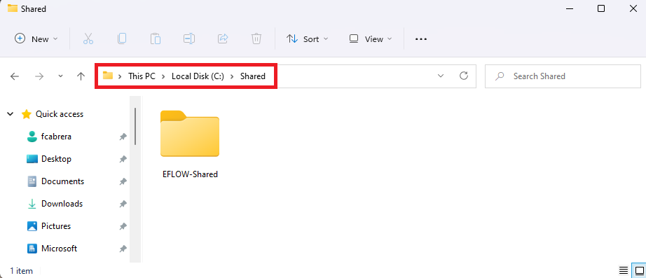
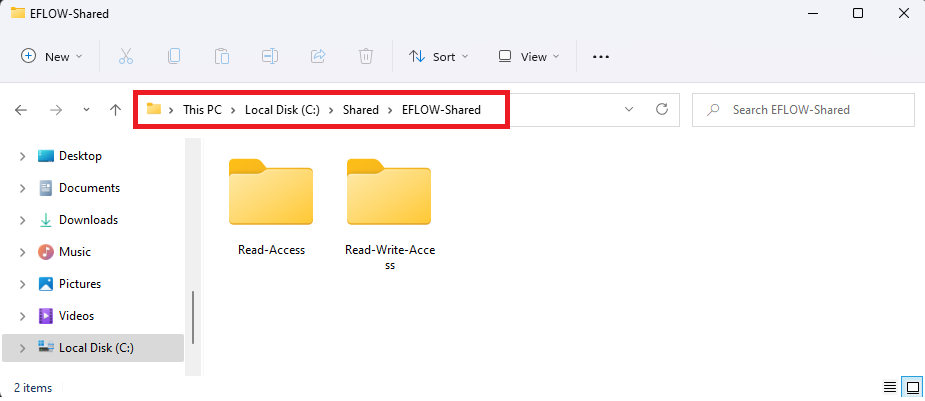

# Share a Windows folder with Azure IoT Edge for Linux on Windows

[!INCLUDE [iot-edge-version-all-supported](../../includes/iot-edge-version-all-supported.md)]

Azure IoT Edge for Linux on Windows (EFLOW) virtual machine is isolated from the Windows host OS, so the virtual machine doesn't have access to the host file system. By default, the EFLOW virtual machine has its own file system and has no access to the folder or files on the host computer. The EFLOW file/folder sharing mechanism provides a way to share Windows files and folders to the CBL-Mariner Linux EFLOW VM.  

This article shows you how to enable the folder sharing between the Windows host OS and the EFLOW virtual machine. 

## Prerequisites
- Azure IoT Edge for Linux on Windows 1.2.11 update or higher. For more information about EFLOW release notes, see [EFLOW Releases](https://aka.ms/AzEFLOW-Releases).

If you don't have a device ready, you should create one before continuing with this guide. Follow the steps in [Create and provision an IoT Edge for Linux on Windows device using symmetric keys](how-to-provision-single-device-linux-on-windows-symmetric.md) to install, deploy and provision EFLOW.

## How it works?

Azure IoT Edge for Linux on Windows file & folder sharing mechanism is implemented using [virtiofs](https://virtio-fs.gitlab.io/) technology. Virtiofs is a shared file system that lets virtual machines access a directory tree on the host OS. Unlike other approaches, it's designed to offer local file system semantics and performance. Virtiofs isn't a network file system repurposed for virtualization, it's designed to take advantage of the locality of virtual machines and the hypervisor. It takes advantage of the virtual machine’s co-location with the hypervisor to avoid overheads associated with network file systems.


It's important to highlight that only Windows folders can be shared to the EFLOW Linux VM, but the other way it's not supported. Also, for security reasons, when setting the folder sharing mechanism, the user must provide a _root folder_ and all the shared folders must be inside that _root folder_. 

Before starting with the adding/removing share mechanisms, let's define four concepts:

- **Root folder**: Windows folder that will be the root path to all the other folders that are allowed to be shared to the EFLOW VM. This folder it's not shared to the EFLOW VM. 
- **Shared folder**: Windows folder that it's inside the _root folder_ and will be shared with the EFLOW VM. All the content inside this folder will be shared with the EFLOW VM.
- **Mounting point**: Path inside the EFLOW VM where the Windows folder content will be placed. 
- **Mounting option**: Read-Only or Read and write. This is how the folder is mounted inside the EFLOW VM. 

## Add shared folders
The following steps in this section provide sample EFLOW PowerShell cmdlets to share one or more Windows host OS folders with the EFLOW virtual machine. 

1. Start by creating a new root shared folder. Go to **File Explorer** -> Move to the parent location of the **Root folder** and create the folder. 

    For example, the **Root Folder** name will be _EFLOW-Shared_ and be inside _C:\Shared_.

    

1. Create one or more **Shared folders** to be shared with the EFLOW virtual machine. Both folders should be created inside the **Root folder** created in the previous step. 

    For example, create two folders, one named _Read-Access_ and the other one named _Read-Write-Access_. 

    

1. Move to the _Read-Access_ shared folder, and create a file that we'll later read inside the EFLOW virtual machine.

    For example, using NotePad or any other text editor, create a file named _Hello-World.txt_ inside _Read-Access_ folder, and write some content on the file.

1. Using your preferred text editor, create the shared folder configuration file. This file will contain the information of the folders to be shared with the EFLOW VM, the mounting points and the mounting options. For more information about the JSON configuration file, see [PowerShell functions for IoT Edge for Linux on Windows](reference-iot-edge-for-linux-on-windows-functions.md).

    Following the example above, we'll share the two **Shared folders** that we created inside the **Root folder**. 
    - _Read-Access_ shared folder will be mounted in the EFLOW virtual machine under the path _/tmp/host-read-access_ with Read-Only access.
    - _Read-Write-Access_ shared folder will be mounted in the EFLOW virtual machine under the path _/tmp/host-read-write-access_ with Read and Write access.

    The JSON configuration file name _sharedFolders.json_ should be created inside the **Root folder** and the content should be the following:

    ```json
    [
        {
            "sharedFolderRoot": "C:\\Shared\\EFLOW-Shared",
            "sharedFolders": [
                {   
                    "hostFolderPath": "Read-Access", 
                    "readOnly": true, 
                    "targetFolderOnGuest": "/tmp/host-read-access" 
                },
                {   
                    "hostFolderPath": "Read-Write-Access", 
                    "readOnly": false, 
                    "targetFolderOnGuest": "/tmp/host-read-write-access" 
                },
            ]
        }
    ]
    ```

1. Open an elevated _PowerShell_ session by starting with **Run as Administrator**.

1. Create the shared folder assignation using the configuration file (_sharedFolders.json_) previously created.
    ```powershell
    Add-EflowVmSharedFolder -sharedFoldersJsonPath "C:\Shared\EFLOW-Shared\sharedFolders.json"
    ```  

1. Once the cmdlet finished, the EFLOW virtual machine should have access to the shared folders. Connect to the EFLOW virtual machine and check the folders are correctly shared.
    ```powershell
    Connect-EflowVm
    ``` 

1. Move to the _Read-Access_ shared folder (mounted under _/tmp/host-read-access_) and check the content of the _Hello-World.txt_ file.
    ```bash
    cd /tmp/host-read-access
    cat Hello-World.txt
    ```
If everything was successful, you should be able to see the content of the _Hello-World.txt_ file inside the EFLOW virtual machine. You can check the write access by writing a file inside the _/tmp/host-read-write-access_ and then checking the content of the new created file inside the _Read-Write-Access_ Windows host folder. 

## Check shared folders
The following steps in this section provide sample EFLOW PowerShell cmdlets to check the Windows shared folders with the EFLOW virtual machine, and the shared options (access permissions and mounting point). 

1. Open an elevated _PowerShell_ session by starting with **Run as Administrator**.

1. List the information of the Windows shared folders under the **Root folder**.
    For example, following the example in the previous section, we can list the information of both _Read-Access_ and _Read-Write-Access_ shared folders. 
    ```powershell
    Get-EflowVmSharedFolder -sharedfolderRoot "C:\Shared\EFLOW-Shared" -hostFolderPath @("Read-Access", "Read-Write-Access")
    ``` 

For more information about the `Get-EflowVmSharedFolder` cmdlet, see [PowerShell functions for IoT Edge for Linux on Windows](reference-iot-edge-for-linux-on-windows-functions.md).


## Remove shared folders
The following steps in this section provide sample EFLOW PowerShell cmdlets to stop sharing a Windows shared folder with the EFLOW virtual machine. 

1. Open an elevated _PowerShell_ session by starting with **Run as Administrator**.

1. Stop sharing the folder named _Read-Access_ under the **Root folder** with the EFLOW virtual machine.
    ```powershell
    Remove-EflowVmSharedFolder -sharedfolderRoot "C:\Shared\EFLOW-Shared" -hostFolderPath "Read-Access"
    ``` 

For more information about the `Remove-EflowVmSharedFolder` cmdlet, see [PowerShell functions for IoT Edge for Linux on Windows](reference-iot-edge-for-linux-on-windows-functions.md).

## Next steps
Follow the steps in [Common issues and resolutions for Azure IoT Edge for Linux on Windows](troubleshoot-iot-edge-for-linux-on-windows-common-errors.md) to troubleshoot any issue encountered with setting up IoT Edge for Linux on Windows. 
s