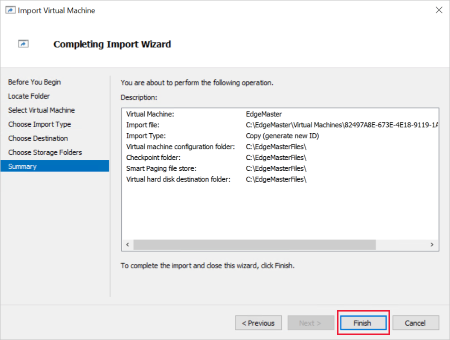
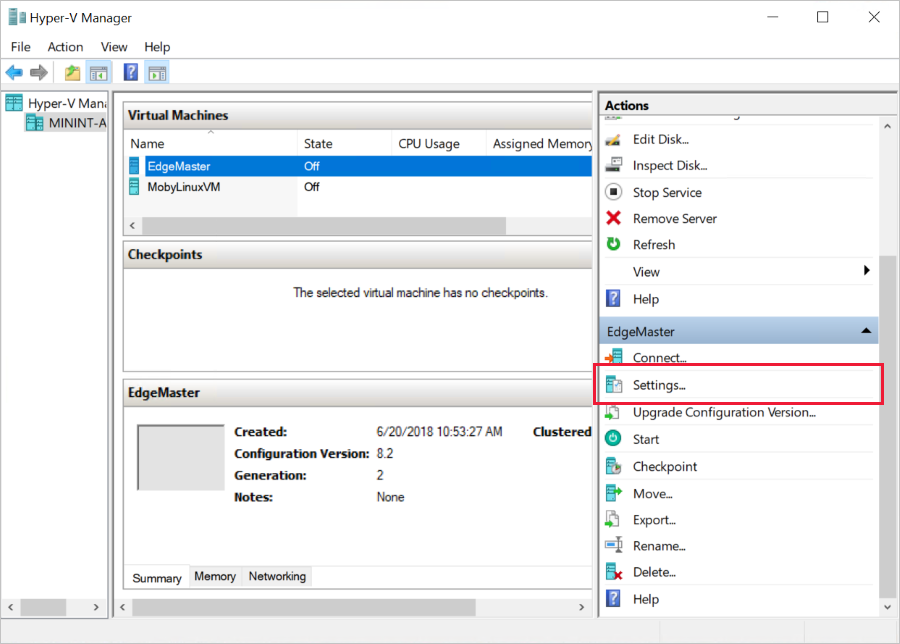

# Create and provision a simulated TPM Edge device on Linux

Azure IoT Edge devices can be auto-provisioned using the [Device Provisionin Service](../iot-dps/index.yml) just like devices that are not edge enabled. If you're unfamiliar with the process of auto-provisioning, review the [auto-provisioning concepts](../iot-dps/concepts-auto-provisioning.md) before continuing. 

This article shows you how to test auto-provisioning on a simulated Edge device with the following steps: 

* Create a Linux virtual machine (VM) in Hyper-V with a simulated Trusted Platform Module (TPM) for hardware security.
* Create an individual enrollment for the device
* Install the IoT Edge runtime and connect the device to IoT Hub

## Prerequisites

* A Windows development machine with [Hyper-V enabled](https://docs.microsoft.com/virtualization/hyper-v-on-windows/quick-start/enable-hyper-v). This article uses Windows 10. 
* [IoT Hub Device Provisioning Service](https://docs.microsoft.com/en-us/azure/iot-dps/quick-setup-auto-provision.md) linked to your IoT hub.

## Simulate TPM device

In this section, you create a new Linux virtual machine on Hyper-V that has a simulated TPM so that you can use it for testing how auto-provisioning works with IoT Edge. 

### Create a virtual switch

A virtual switch enables your virtual machine to connect to a physical network.

1. Open Hyper-V on your windows machine. 

2. In the **Actions** menu, select **Virtual Switch Manager**. 

3. Choose an **External** virtual switch, then select **Create Virtual Switch**. 

4. Give your new virtual switch a name, for example **EdgeSwitch**. Make sure that the connection type is set to **External network**, then select **Ok**.

   

5. A pop-up warns you that network connectivity may be disrupted. Select **Yes** to continue. 

If you see errors while creating the new virtual switch, ensure that no other switches are using the ethernet adaptor, and that no other switches use the same name. 

### Import the virtual machine

Download a pre-built image, and use it to create a new virtual machine. Then, enable a Trusted Platform Module on your VM. 

1. Download the virtual machine image from https://azureiotedgepreview.blob.core.windows.net/shared/ubuntu-tpm-vm/EdgeMaster.zip. Save it locally and extract the files from the zipped folder. 

2. Create an empty folder on your machine where the VM files can be stored, for example **C:\EdgeMasterFiles**.

3. Open Hyper-V again. In the **Actions** menu, select **Import Virtual Machine**. 

4. Complete the following steps for each page of the import wizard:

   1. **Before You Begin**: Click **Next** to start the import setup. 

   2. **Locate Folder**: Browse to the **EdgeMaster** folder that you extracted from the .zip file.

      If you get an error that Hyper-V did not find virtual machines to import, ensure that you selected the folder that contains *Snapshots*, *Virtual Hard Disks*, and *Virtual Machines*. Not a folder level higher or lower.

   3. **Select Virtual Machine**: Select the **EdgeMaster** virtual machine. 

   4. **Choose Import Type**: Select **Copy the virtual machine (create a new unique ID)**. 

   5. **Choose Destination**: Select **Store the virtual machine in a different location**. Browse to the empty folder that you created for the VM files. Use that folder for all three entries on the page. 

      

   6. **Choose Storage Folders**: Browse to the same folder that you used in the previous step. 

   7. **Summary**: Review the description of your import, then click **Finish** to complete the wizard. 

      

      It may take a view minutes to create the new VM. 

5. When the VM is created, open its settings in Hyper-V.

   

6. In the **Hardware** menu, select **Security**. 

7. Check the box for **Enable Trusted Platform Module** then click **OK**. 

8. Start the virtual machine, then click **Connect**. 

9. Sign in with username **edge** and password **edge**. 

   >[!IMPORTANT]
   >This VM image is for testing only. If you use this image for more than the scope of this article, you should change the username and password to be more secure. 

10. Run `ifconfig` in the terminal.

11. Copy the value of **inet addr** from the Ethernet connection. This is the public IP address that you use to access the virtual machine for the rest of these instructions. 

## Create a DPS enrollment

Retrieve the provisioning information from your virtual machine, and use that to create an individual enrollment in Device Provisioning Service. When you create the individual enrollment, you add a tag to the device twin which enables you to create [IoT Edge deployments](module-deployment-monitoring.md) that target multiple devices. 

1. Using your preferred method, SSH into your VM using the IP address that you retrieved in the previous section and **edge** as both the username and password.  

2. Run the following command: 

   ```bash
   sudo ./tpm_device_provision
   ```

3. Copy the values for **Registration ID** and **Endorsement Key**. 

4. Sign in to the [Azure portal](https://portal.azure.com) and navigate to your instance of IoT Hub Device Provisioning Service. 

5. Under **Settings**, select **Manage enrollments**. 

6. Select **Add individual enrollment** then complete the following steps to configure the enrollment:  

   1. For **Mechanism**, select **TPM**. 
   2. Insert the **Endorsement key** and **Registration ID** that you copied from your virtual machine.
   3. Select **Enable** to declare that this virtual machine is an IoT Edge device. 
   4. Choose the linked **IoT Hub** that you want to connect your device to. 
   5. Provide an ID for your device if you'd like. Device IDs are one way to target an individual device for module deployment. 
   6. Add a tag valie to the **Initial Device Twin State**. You can use tags to target groups of devices for module deployment. For example:

      ```json
      {
          "tags": {
              "hardwareSec": "tpm"
          },
          "properties": {
              "desired": {}
          }
      }
      ```
    
   7. Select **Save**. 

7. Navigate to the **Overview** page of your Device Provisioning Service instance.

8. Copy the value of **ID Scope**. You use this value to configure the IoT Edge runtime in the next section. 

## Install the IoT Edge runtime

Since this article uses a Linux virtual machine as a simulated IoT Edge device, the installation instructions in this section apply to Linux devices. If you're using a different device, refer to the guidance for your operation system. 

1. Open the program that you used to SSH into your virtual machine. 

2. Install a container registry on your device. 

   ```bash
   curl https://conteng.blob.core.windows.net/mby/moby_0.1-0-ubuntu_amd64.deb -o moby_0.1.deb && sudo apt-get install ./moby_0.1.deb
   ``` 

3. Install a version of **hsmlib** that enables the security daemon to interact with the device's hardware security:

   ```bash
   wget https://azureiotedgepreview.blob.core.windows.net/shared/edgelet-amd64-14210794/libiothsm-std_0.1.1-14210794_amd64.deb && sudo apt-get install ./libiothsm-std_0.1.1-14210794_amd64.deb
   ```

4. Download and install the IoT Edge Security Daemon. The package installs the daemon as a system service so IoT Edge starts every time your device boots.

   ```bash
   wget https://azureiotedgepreview.blob.core.windows.net/shared/edgelet-amd64-14210794/iotedge_0.1.0-14210794_amd64.deb && sudo apt-get install ./iotedge_0.1.0-14210794_amd64.deb 
   ```

2. Open the IoT Edge `config.yaml` file. It is a protected file so you may have to use elevated privileges to access it.
   
   ```bash
   sudo nano /etc/iotedge/config.yaml
   ```

3. Scroll to the **Provisioning mode and settings** section.

4. Comment out the lines for manual provisioning, and uncomment the lines for DPS provisioning. 

   

5. Update the **scope_id** field with the value that you copied from Device Provisioning Service, and update the **registration_id** field with the value that you copied from your virtual machine. 

   >[!IMPORTANT]
   >**BUG BASH ONLY**
   >Replace the edgeAgent info with the following image and registry info. This is a yaml file so whitespace is important. Indentations are two spaces, not tabs. 
   >
   >```yaml
   >agent:
   >  name: "edgeAgent"
   >  type: "docker"
   >  env: {}
   >  config: 
   >    image: "edgeshared.azurecr.io/microsoft/azureiotedge-agent:14256026-linux-amd64"
   >    create_options: ""
   >    auth:
   >      serveraddress: "edgeshared.azurecr.io"
   >      username: "EdgeShared"
   >      password: "WPruG6Zt4OBs4hZySY9VQAp2dKEM/pDn"
   >```

6. Save and close the `config.yaml` file. 

## Give IoT Edge access to the TPM

In order for the IoT Edge runtime to automatically provision your device, it needs access to the TPM. 

1. Find the hardware module on your device. 

   ```bash
   sudo find /sys -name dev -print | fgrep tpm
   ```

   The output should be a file path that ends with **tpm/tpm0/dev**. Copy that file path except for the **/dev** at the end. 

2. Verify that this is the tpm location.

   ```bash
   /bin/udevadm info -a -q all -p <tpm filepath>
   ```

   

3. Navigate to the `rules.d` directory. 

   ```bash
   cd /etc/udev/rules.d
   ```

4. Create a new rule that will give the IoT Edge runtime access to tpm0. 

   ```bash
   sudo touch tpmaccess.rules
   ```

5. Open the new rule file. 

   ```bash
   sudo nano tpmaccess.rules
   ```

6. Add the access information. 

   ```input 
   # allow iotedge access to tpm0
   KERNAL=="tpm0", SUBSYSTEM=="tpm", GROUP="iotedge", MODE="0660"
   ```

7. Save and exit the file. 

8. Trigger the udev system to evaluate the new rule. 

   ```bash
   /bin/udevadm trigger <tpm filepath>
   ```

9. Open the IoT Edge runtime overrides file. 

   ```bash
   sudo systemctl edit iotedge.service
   ```

10. Add the following code to establish a TPM environment variable.

   ```input
   [Service]
   Environment=IOTEDGE_USE_TPM_DEVICE=ON
   ```

11. Verify the overrides.

   ```bash
   sudo systemctl cat iotedge.service
   ```

12. Reload the settings.

   ```bash
   sudo systemctl daemon-reload
   ```

## Restart the IoT Edge runtime

Restart the IoT Edge runtime so that it picks up all the configuration changes that you made on the device. 

   ```bash
   sudo systemctl restart iotedge
   ```

Check to see that the IoT Edge runtime is running. 

   ```bash
   sudo systemctl status iotedge
   ```

If the runtime started successfully, you can go into your IoT Hub and see that your new device was automatically provisioned and is ready to run IoT Edge modules. 