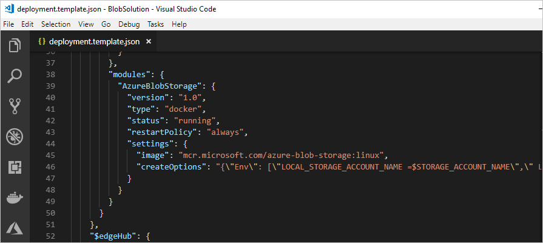

# Store data at the edge with Azure Blob Storage on IoT Edge (preview)

Azure Blog Storage on IoT Edge provides a block blob storage solution at the edge. A blob storage module on your IoT Edge device behaves like an Azure blob service, but the block blobs are stored locally on your IoT Edge device. You can access your blobs using the same Azure storage SDK methods or block blob API calls that you're already used to. 

This article provides instructions for deploying an Azure Blob Storage on IoT Edge container that runs a blob service on your IoT Edge device. 

>[!NOTE]
>Azure Blob Storage on IoT Edge is in [public preview](https://azure.microsoft.com/support/legal/preview-supplemental-terms/). 

## Prerequisites

An Azure IoT Edge device:

* You can use your development machine or a virtual machine as an Edge device by following the steps in the quickstart for [Linux](quickstart-linux.md) or [Windows devices](quickstart.md).
* The Azure Blob Storage on IoT Edge module supports the following device configurations:

   | Operating system | Architecture |
   | ---------------- | ------------ |
   | Ubuntu Server 16.04 | AMD64 |
   | Ubuntu Server 18.04 | AMD64 |
   | Windows 10 IoT Core (October update) | AMD64 |
   | Windows 10 IoT Enterprise (October update) | AMD64 |
   | Windows Server 2019 | AMD64 |
   | Raspbian Stretch | ARM32 |

Cloud resources:

* A standard-tier [IoT Hub](../iot-hub/iot-hub-create-through-portal.md) in Azure. 


## Deploy blob storage to your device

Azure Blob Storage on IoT Edge provides three standard container images, two for Linux containers (AMD64 and ARM32 architectures) and one for Windows containers (AMD64). When you use one of these module images to deploy blob storage to your IoT Edge device, you provide three pieces of information to configure the module instance for your device:

* An **account name** and **account key**. To stay consistent with Azure Storage, blob storage modules use account names and account keys to manage access. Account names should be three to twenty-four characters long, with lowercase letters and numbers. Account keys should be base64 encoded and 64 bytes in length. You can generate a key with tools like [GeneratePlus](https://generate.plus/en/base64).
* A **local storage option**. The blob storage module stores blobs locally on the IoT Edge device, so that the blobs persist if the module stops or restarts. Declare an existing [volume](https://docs.docker.com/storage/volumes
) or local folder path where the blobs should be stored on your device. 

There are several ways to deploy modules to an IoT Edge device, and all of them work for Azure Blob Storage on IoT Edge modules. The two simplest methods are to use the Azure portal or Visual Studio Code templates. 

### Azure portal

To deploy blob storage through the Azure portal, follow the steps in [Deploy Azure IoT Edge modules from the Azure portal](how-to-deploy-modules-portal.md). Before you go to deploy your module, copy the image URI and prepare the container create options based on your container operating system. Use these values in the **Configure a deployment manifest** section of the deployment article. 

Provide the image URI for the blob storage module: **mcr.microsoft.com/azure-blob-storage:latest**. 
   
Use the following JSON template for the **Container Create Options** field. Configure the JSON with your storage account name, storage account key, and storage directory bind.  
   
   ```json
   {
       "Env":[
           "LOCAL_STORAGE_ACCOUNT_NAME=<your storage account name>",
           "LOCAL_STORAGE_ACCOUNT_KEY=<your storage account key>"
       ],
       "HostConfig":{
           "Binds":[
               "<storage directory bind>"
           ],
           "PortBindings":{
               "11002/tcp":[{"HostPort":"11002"}]
           }
       }
   }
   ```   
   
In the create options JSON, update `\<your storage account name\>` with any name. Update `\<your storage account key\>` with a 64-byte base64 key. You can generate a key with tools like [GeneratePlus](https://generate.plus/en/base64?gp_base64_base[length]=64) which allows you to select your byte length. You'll use these credentials to access the blob storage from other modules.

In the create options JSON, update `<storage directory bind>` depending on your container operating system. Provide the name of a [volume](https://docs.docker.com/storage/volumes/) or the absolute path to a directory on your IoT Edge device where you want the blob module to store its data.  

   * Linux containers: **\<storage path>:/blobroot**. For example, /srv/containerdata:/blobroot. Or, my-volume:/blobroot. 
   * Windows containers: **\<storage path>:C:/BlobRoot**. For example, C:/ContainerData:C:/BlobRoot. Or, my-volume:C:/blobroot.
   
   > [!CAUTION]
   > Do not change the "/blobroot" for Linux and "C:/BlobRoot" for Windows, for **\<Storage directory bind>** values.

You don't need to provide registry credentials to access Azure Blob Storage on IoT Edge, and you don't need to declare any routes for your deployment. 

### Visual Studio Code templates

Azure IoT Edge provides templates in Visual Studio Code to help you develop edge solutions. These steps require that you have [Visual Studio Code](https://code.visualstudio.com/) installed on your development machine, and configured with the [Azure IoT Edge extension](https://marketplace.visualstudio.com/items?itemName=vsciot-vscode.azure-iot-edge).

Use the following steps to create a new IoT Edge solution with a blob storage module, and configure the deployment manifest. 

1. Select **View** > **Command Palette**. 

2. In the command palette, enter and run the command **Azure IoT Edge: New IoT Edge Solution**. 

3. Follow the prompts to create a new solution: 

   1. **Select Folder** - Browse to the folder where you want to create the new solution.  
   
   2. **Provide a solution name** - Enter a name for your solution, or accept the default.
   
   3. **Select module template** - Choose **Existing Module (Enter full image URL)**.
   
   4. **Provide a module name** - Enter a recognizable name for your module, like **azureBlobStorage**.
   
   5. **Provide Docker image for the module** - Provide the image URI: **mcr.microsoft.com/azure-blob-storage:latest**

VS Code takes the information you provided, creates an IoT Edge solution, and then loads it in a new window. 

The solution template creates a deployment manifest template that includes your blob storage module image, but you need to configure the module's create options. 

1. Open **deployment.template.json** in your new solution workspace and find the **modules** section. 

2. Delete the **tempSensor** module, as it's not necessary for this deployment. 

3. Copy and paste the following code into the **createOptions** field of your blob storage module: 

   ```json
   {\"Env\": [\"LOCAL_STORAGE_ACCOUNT_NAME=$STORAGE_ACCOUNT_NAME\",\" LOCAL_STORAGE_ACCOUNT_KEY=$STORAGE_ACCOUNT_KEY\"],\"HostConfig\": {\"Binds\": [\"<storage directory bind>\"],\"PortBindings\": {\"11002/tcp\": [{\"HostPort\":\"11002\"}]}}}
   ```

   

4. In the create options JSON, update `<storage directory bind>` depending on your container operating system. Provide the name of a [volume](https://docs.docker.com/storage/volumes/) or the absolute path to a directory on your IoT Edge device where you want the blob module to store its data.  

   * Linux containers: **\<storage path>:/blobroot**. For example, /srv/containerdata:/blobroot. Or, my-volume:/blobroot.
   * Windows containers: **\<storage path>:C:/BlobRoot**. For example, C:/ContainerData:C:/BlobRoot. Or, my-volume:C:/blobroot.
   
   > [!CAUTION]
   > Do not change the "/blobroot" for Linux and "C:/BlobRoot" for Windows, for **\<Storage directory bind>** values.

5. Save **deployment.template.json**.

6. Open **.env** in your solution workspace. 

7. You don't have to enter any container registry values for the blob storage image since it's publicly available. Instead, add two new environment variables: 

   ```env
   STORAGE_ACCOUNT_NAME=
   STORAGE_ACCOUNT_KEY=
   ```

8. Provide any name for the storage account name, and provide a 64-byte base64 key for the storage account key. You can generate a key with tools like [GeneratePlus](https://generate.plus/en/base64?gp_base64_base[length]=64). You'll use these credentials to access the blob storage from other modules. 

9. Save **.env**. 

10. Right-click **deployment.template.json** and select **Generate IoT Edge deployment manifest**. 

Visual Studio Code takes the information that you provided in deployment.template.json and .env and uses it to create a new deployment manifest file. The deployment manifest is created in a new **config** folder in your solution workspace. Once you have that file, you can follow the steps in [Deploy Azure IoT Edge modules from Visual Studio Code](how-to-deploy-modules-vscode.md) or [Deploy Azure IoT Edge modules with Azure CLI 2.0](how-to-deploy-modules-cli.md).

## Connect to your blob storage module

You can use the account name and account key that you configured for your module to access the blob storage on your IoT Edge device. 

Specify your IoT Edge device as the blob endpoint for any storage requests that you make to it. You can [Create a connection string for an explicit storage endpoint](../storage/common/storage-configure-connection-string.md#create-a-connection-string-for-an-explicit-storage-endpoint) using the IoT Edge device information and the account name that you configured. 

1. For modules which are deployed on the same edge device where "Azure Blob Storage on IoT Edge" is running, the blob endpoint is: `http://<Module Name>:11002/<account name>`. 
2. For modules which are deployed on different edge device, than the edge device where "Azure Blob Storage on IoT Edge" is running, then depending upon your setup the blob endpoint is: `http://<device IP >:11002/<account name>` or `http://<IoT Edge device hostname>:11002/<account name>` or `http://<FQDN>:11002/<account name>`

## Logs

You can find the logs inside the container, under: 
* For Linux:  /blobroot/logs/platformblob.log

## Deploy multiple instances

If you want to deploy multiple instances of Azure Blob Storage on IoT Edge, you only need to change the HostPort that the module binds to. The blob storage modules always expose port 11002 in the container, but you can declare which port it's bound to on the host. 

Edit the module create options to change the HostPort value:

```json
\"PortBindings\": {\"11002/tcp\": [{\"HostPort\":\"<port number>\"}]}
```

When you connect to additional blob storage modules, change the endpoint to point to the updated host port. 

### Try it out

The Azure Blob Storage documentation includes quickstarts that provide sample code in several languages. You can run these samples to test Azure Blob Storage on IoT Edge by changing the blob endpoint to point to your blob storage module.

The following quickstarts use languages that are also supported by IoT Edge, so you could deploy them as IoT Edge modules alongside the blob storage module:

* [.NET](../storage/blobs/storage-quickstart-blobs-dotnet.md)
* [Java](../storage/blobs/storage-quickstart-blobs-java.md)
* [Python](../storage/blobs/storage-quickstart-blobs-python.md)
* [Node.js](../storage/blobs/storage-quickstart-blobs-nodejs.md)

## Supported storage operations

Blob storage modules on IoT Edge use the same Azure Storage SDKs, and are consistent with the 2018-03-28 version of the Azure Storage API for block blob endpoints. Later releases are dependent on customer needs. 

Not all Azure Blob Storage operations are supported by Azure Blob Storage on IoT Edge. The following sections detail which operations are an are not supported. 

### Account

Supported: 
* List containers

Unsupported: 
* Get and set blob service properties
* Preflight blob request
* Get blob service stats
* Get account information

### Containers

Supported: 
* Create and delete container
* Get container properties and metadata
* List blobs

Unsupported: 
* Get and set container ACL
* Lease container
* Set container metadata

### Blobs

Supported: 
* Put, get, and delete blob
* Get and set blob properties
* Get and set blob metadata

Unsupported: 
* Lease blob
* Snapshot blob
* Copy and abort copy blob
* Undelete blob
* Set blob tier

### Block blobs

Supported: 
* Put block :- The block must be less than or equal to 4 MB in size
* Put and get block list

Unsupported:
* Put block from URL

## Next steps

Learn more about [Azure Blob Storage](../storage/blobs/storage-blobs-introduction.md)

