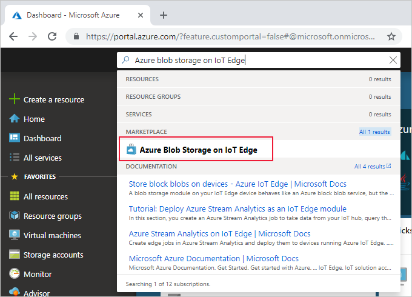
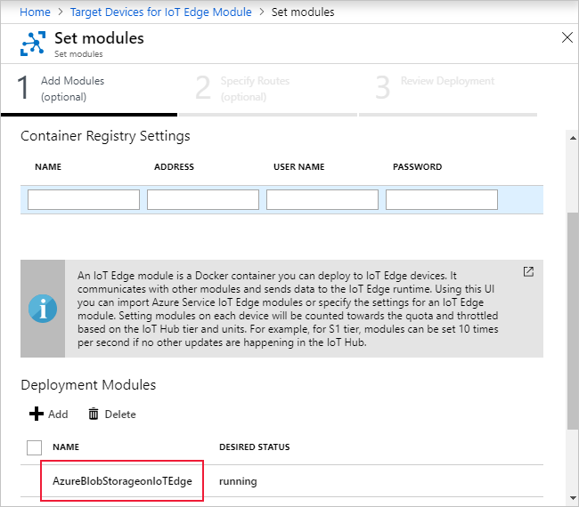

# Store data at the edge with Azure Blob Storage on IoT Edge (preview)

Azure Blob Storage on IoT Edge provides a [block blob](https://docs.microsoft.com/rest/api/storageservices/understanding-block-blobs--append-blobs--and-page-blobs#about-block-blobs) storage solution at the edge. A blob storage module on your IoT Edge device behaves like an Azure block blob service, but the block blobs are stored locally on your IoT Edge device. You can access your blobs using the same Azure storage SDK methods or block blob API calls that you're already used to. 

Scenarios where data like videos, images, finance data, hospital data, or any data that needs to be stored locally, later which could be processed locally or transferred to the cloud are good examples to use this module.

This article provides instructions for deploying an Azure Blob Storage on IoT Edge container that runs a blob service on your IoT Edge device. 

>[!NOTE]
>Azure Blob Storage on IoT Edge is in [public preview](https://azure.microsoft.com/support/legal/preview-supplemental-terms/). 

## Prerequisites

An Azure IoT Edge device:

* You can use your development machine or a virtual machine as an Edge device by following the steps in the quickstart for [Linux](quickstart-linux.md) or [Windows devices](quickstart.md).
* The Azure Blob Storage on IoT Edge module supports the following device configurations:

   | Operating system | Architecture |
   | ---------------- | ------------ |
   | Ubuntu Server 16.04 | AMD64 |
   | Ubuntu Server 18.04 | AMD64 |
   | Windows 10 IoT Core (October update) | AMD64 |
   | Windows 10 IoT Enterprise (October update) | AMD64 |
   | Windows Server 2019 | AMD64 |
   | Raspbian Stretch | ARM32 |

Cloud resources:

* A standard-tier [IoT Hub](../iot-hub/iot-hub-create-through-portal.md) in Azure. 


## Deploy blob storage to your device

There are several ways to deploy modules to an IoT Edge device, and all of them work for Azure Blob Storage on IoT Edge modules. The two simplest methods are to use the Azure portal or Visual Studio Code templates. 

### Azure portal

The Azure Marketplace provides IoT Edge modules that can be deployed directly to your IoT Edge devices, including Azure Blob Storage on IoT Edge. Follow these steps to deploy the module from the Azure portal.

1. In the [Azure portal](https://portal.azure.com), search for "Azure Blob Storage on IoT Edge". And **select** the search result from the Marketplace.

   

2. Choose an IoT Edge device to receive this module. On the **Target Devices for IoT Edge Module** page, provide the following information:

   1. Select the **Subscription** that contains the IoT hub you're using.

   2. Select your **IoT Hub**.

   3. If you know your **IoT Edge Device Name**, enter that in the text box. Or, select **Find Device** to choose from a list of IoT Edge devices in your IoT hub. 
   
   4. Select **Create**.

   Now that you've chosen an IoT Edge module from the Azure Marketplace, and chosen an IoT Edge device to receive the module, you're taken to a three-step wizard that helps you define exactly how the module will be deployed.

3. In the **Add Modules** step of the set modules wizard, notice that the **AzureBlobStorageonIoTEdge** module is already listed under **Deployment Modules**. 

2. Select the blob storage module from the list of deployment modules to open the module details. 

   

3. On the **IoT Edge custom modules** page, update the Azure Blob Storage on IoT Edge module with the following steps:

   1. Change the module **Name** to be lowercase. You can rename the module if you like, or use `azureblobstorageoniotedge`. 

      >[!IMPORTANT]
      >Azure IoT Edge is case-sensitive when you make calls to modules, and the Storage SDK defaults to lowercase. To ensure that your connections to the Azure Blob Storage on IoT Edge module aren't interrupted, give it a lowercase name. 

   2. The default **Container Create Options** the port bindings that your container needs, but you also need to add your storage account information and a bind for the storage directory on your device. Overwrite the JSON in the portal with the JSON below:
    
      ```json
      {
          "Env":[
              "LOCAL_STORAGE_ACCOUNT_NAME=<your storage account name>",
              "LOCAL_STORAGE_ACCOUNT_KEY=<your storage account key>"
          ],
          "HostConfig":{
              "Binds":[
                  "<storage directory bind>"
              ],
              "PortBindings":{
                  "11002/tcp":[{"HostPort":"11002"}]
              }
          }
      }
      ```   
   3. Update the JSON that you copied with the following information: 

      * Replace `<your storage account name>` with a name that you can remember. Account names should be three to twenty-four characters long, with lowercase letters and numbers.
      * Replace `<your storage account key>` with a 64-byte base64 key. You can generate a key with tools like [GeneratePlus](https://generate.plus/en/base64?gp_base64_base[length]=64). You'll use these credentials to access the blob storage from other modules.
      * Replace `<storage directory bind>` depending on your container operating system. Provide the name of a [volume](https://docs.docker.com/storage/volumes/) or the absolute path to a directory on your IoT Edge device where you want the blob module to store its data. The storage directory bind maps a location on your device that you provide to a set location in the module. 

         * Linux containers: **\<storage path>:/blobroot**. For example, /srv/containerdata:/blobroot. Or, my-volume:/blobroot. 
         * Windows containers: **\<storage path>:C:/BlobRoot**. For example, C:/ContainerData:C:/BlobRoot. Or, my-volume:C:/blobroot.
   
      > [!IMPORTANT]
      > Do not change the second half of the storage directory bind value, which points to a specific location in the module. The storage directory bind should always end with **:/blobroot** for Linux containers and **:C:/BlobRoot** for Windows containers.

      

   4. Select **Save**.

4. Select **Next** to continue to the next step of the wizard.
5. In the **Specify Routes** step of the wizard, select **Next**.
6. In the **Review Deployment** step of the wizard, select **Submit**.
7. After you submit the deployment, you return to the **IoT Edge** page of your IoT hub. Select the IoT Edge device that you targeted with the deployment to open its details. 
8. In the device details, verify that the blob storage module is listed as both **Specified in deployment** and **Reported by device**. It may take a few moments for the module to be started on the device and then reported back to IoT Hub. Refresh the page to see an updated status. 

### Visual Studio Code templates

Azure IoT Edge provides templates in Visual Studio Code to help you develop edge solutions. These steps require that you have [Visual Studio Code](https://code.visualstudio.com/) installed on your development machine, and configured with the [Azure IoT Tools](https://marketplace.visualstudio.com/items?itemName=vsciot-vscode.azure-iot-tools).

Use the following steps to create a new IoT Edge solution with a blob storage module, and configure the deployment manifest. 

1. Select **View** > **Command Palette**. 

2. In the command palette, enter and run the command **Azure IoT Edge: New IoT Edge solution**. Follow the prompts in the command palette to create your solution.

   | Field | Value |
   | ----- | ----- |
   | Select folder | Choose the location on your development machine for VS Code to create the solution files. |
   | Provide a solution name | Enter a descriptive name for your solution or accept the default **EdgeSolution**. |
   | Select module template | Choose **Existing Module (Enter full image URL)**. |
   | Provide a module name | Enter an all-lowercase name for your module, like **azureblobstorage**.<br><br>It's important to use a lowercase name for the Azure Blob Storage on IoT Edge module. IoT Edge is case-sensitive when referring to modules, and the Storage SDK defaults to lowercase. |
   | Provide Docker image for the module | Provide the image URI: **mcr.microsoft.com/azure-blob-storage:latest** |

   VS Code takes the information you provided, creates an IoT Edge solution, and then loads it in a new window. The solution template creates a deployment manifest template that includes your blob storage module image, but you need to configure the module's create options. 

3. Open **deployment.template.json** in your new solution workspace and find the **modules** section. Make the following configuration changes:

   1. Delete the **tempSensor** module, as it's not necessary for this deployment. 

   2. Copy and paste the following code into the **createOptions** field of your blob storage module: 

      ```json
      "Env": [
        "LOCAL_STORAGE_ACCOUNT_NAME=$STORAGE_ACCOUNT_NAME","LOCAL_STORAGE_ACCOUNT_KEY=$STORAGE_ACCOUNT_KEY"
      ],
      "HostConfig":{
        "Binds": ["<storage directory bind>"],
        "PortBindings":{
          "11002/tcp": [{"HostPort":"11002"}]
        }
      }
      ```

      

4. In the create options JSON, update `<storage directory bind>` depending on your container operating system. Provide the name of a [volume](https://docs.docker.com/storage/volumes/) or the absolute path to a directory on your IoT Edge device where you want the blob module to store its data. The storage directory bind maps a location on your device that you provide to a set location in the module.  

   * Linux containers: **\<storage path>:/blobroot**. For example, /srv/containerdata:/blobroot. Or, my-volume:/blobroot.
   * Windows containers: **\<storage path>:C:/BlobRoot**. For example, C:/ContainerData:C:/BlobRoot. Or, my-volume:C:/blobroot.
   
   > [!IMPORTANT]
   > Do not change the second half of the storage directory bind value, which points to a specific location in the module. The storage directory bind should always end with **:/blobroot** for Linux containers and **:C:/BlobRoot** for Windows containers.

5. Save the **deployment.template.json** file.

6. Open the **.env** file in your solution workspace. 

7. The .env file is set up to receive container registry credentials, but you don't need that for the blob storage image since it's publicly available. Instead, replace the file with two new environment variables: 

   ```env
   STORAGE_ACCOUNT_NAME=
   STORAGE_ACCOUNT_KEY=
   ```

8. Provide a value for `STORAGE_ACCOUNT_NAME`, account names should be three to twenty-four characters long, with lowercase letters and numbers. Provide a 64-byte base64 key for the `STORAGE_ACCOUNT_KEY`. You can generate a key with tools like [GeneratePlus](https://generate.plus/en/base64?gp_base64_base[length]=64). You'll use these credentials to access the blob storage from other modules. 

   Don't include spaces or quotation marks around the values you provide. 

9. Save the **.env** file. 

10. Right-click **deployment.template.json** and select **Generate IoT Edge deployment manifest**. 

11. Visual Studio Code takes the information that you provided in deployment.template.json and .env and uses it to create a new deployment manifest file. The deployment manifest is created in a new **config** folder in your solution workspace. Once you have that file, you can follow the steps in [Deploy Azure IoT Edge modules from Visual Studio Code](how-to-deploy-modules-vscode.md) or [Deploy Azure IoT Edge modules with Azure CLI 2.0](how-to-deploy-modules-cli.md).

## Connect to your blob storage module

You can use the account name and account key that you configured for your module to access the blob storage on your IoT Edge device. 

Specify your IoT Edge device as the blob endpoint for any storage requests that you make to it. You can [Create a connection string for an explicit storage endpoint](../storage/common/storage-configure-connection-string.md#create-a-connection-string-for-an-explicit-storage-endpoint) using the IoT Edge device information and the account name that you configured. 

1. For modules which are deployed on the same edge device where "Azure Blob Storage on IoT Edge" is running, the blob endpoint is: `http://<module name>:11002/<account name>`. 
2. For modules which are deployed on different edge device, than the edge device where "Azure Blob Storage on IoT Edge" is running, then depending upon your setup the blob endpoint is: `http://<device IP >:11002/<account name>` or `http://<IoT Edge device hostname>:11002/<account name>` or `http://<FQDN>:11002/<account name>`

## Logs

You can find the logs inside the container, under: 
* For Linux:  /blobroot/logs/platformblob.log

## Deploy multiple instances

If you want to deploy multiple instances of Azure Blob Storage on IoT Edge, you only need to change the HostPort that the module binds to. The blob storage modules always expose port 11002 in the container, but you can declare which port it's bound to on the host. 

Edit the module create options to change the HostPort value:

```json
\"PortBindings\": {\"11002/tcp\": [{\"HostPort\":\"<port number>\"}]}
```

When you connect to additional blob storage modules, change the endpoint to point to the updated host port. 

## Try it out

The Azure Blob Storage documentation includes quickstarts that provide sample code in several languages. You can run these samples to test Azure Blob Storage on IoT Edge by changing the blob endpoint to point to your blob storage module.

The following quickstarts use languages that are also supported by IoT Edge, so you could deploy them as IoT Edge modules alongside the blob storage module:

* [.NET](../storage/blobs/storage-quickstart-blobs-dotnet.md)
* [Java](../storage/blobs/storage-quickstart-blobs-java.md)
* [Python](../storage/blobs/storage-quickstart-blobs-python.md)
* [Node.js](../storage/blobs/storage-quickstart-blobs-nodejs.md)

## Supported storage operations

Blob storage modules on IoT Edge use the same Azure Storage SDKs, and are consistent with the 2018-03-28 version of the Azure Storage API for block blob endpoints. Later releases are dependent on customer needs. 

Not all Azure Blob Storage operations are supported by Azure Blob Storage on IoT Edge. The following sections detail which operations are an are not supported. 

### Account

Supported: 
* List containers

Unsupported: 
* Get and set blob service properties
* Preflight blob request
* Get blob service stats
* Get account information

### Containers

Supported: 
* Create and delete container
* Get container properties and metadata
* List blobs

Unsupported: 
* Get and set container ACL
* Lease container
* Set container metadata

### Blobs

Supported: 
* Put, get, and delete blob
* Get and set blob properties
* Get and set blob metadata

Unsupported: 
* Lease blob
* Snapshot blob
* Copy and abort copy blob
* Undelete blob
* Set blob tier

### Block blobs

Supported: 
* Put block :- The block must be less than or equal to 4 MB in size
* Put and get block list

Unsupported:
* Put block from URL

## Next steps

Learn more about [Azure Blob Storage](../storage/blobs/storage-blobs-introduction.md)

