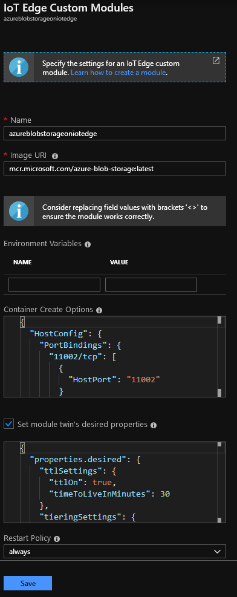
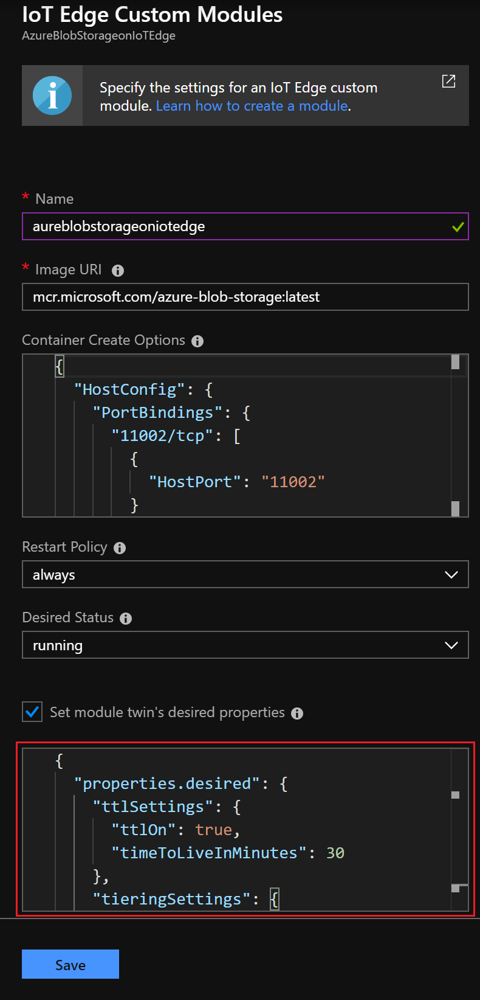
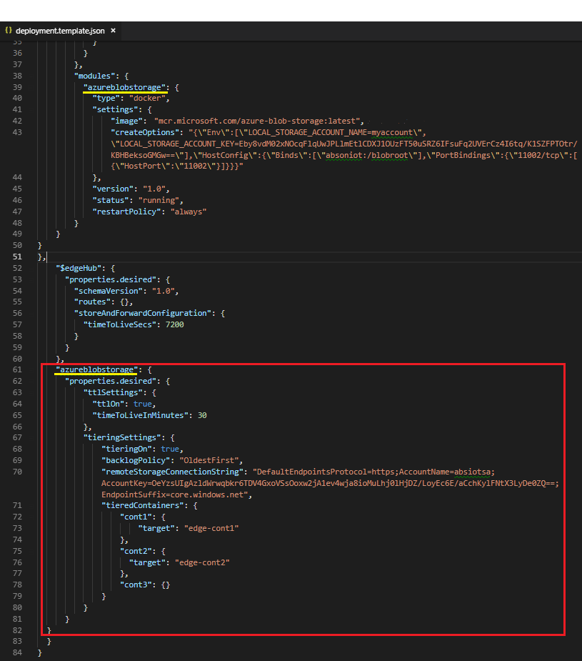

# Store data at the edge with Azure Blob Storage on IoT Edge (preview)

Azure Blob Storage on IoT Edge provides a [block blob](https://docs.microsoft.com/rest/api/storageservices/understanding-block-blobs--append-blobs--and-page-blobs#about-block-blobs) storage solution at the edge. A blob storage module on your IoT Edge device behaves like an Azure block blob service, but the block blobs are stored locally on your IoT Edge device. You can access your blobs using the same Azure storage SDK methods or block blob API calls that you're already used to.

This module comes with **tiering** and **time-to-live** features.

> [!NOTE]
> Currently tiering and time-to-live functionality are only available in Linux AMD64 and Linux ARM32.

**Tiering** is a configurable functionality, which allows you to automatically upload the data from your local blob storage to Azure with intermittent internet connectivity support. It allows you to:

- Turn ON/OFF the tiering feature
- Choose the order in which the data is copied to Azure like NewestFirst or OldestFirst
- Specify the Azure Storage account to which you want your data uploaded.
- Specify the containers you want to upload to Azure. This module allows you to specify both source and target container names.
- Do full blob tiering (using `Put Blob` operation) and block level tiering (using `Put Block` and `Put Block List` operations).

This module uses block level tiering, when your blob consists of blocks. Here are some of the common scenarios:

- Your application updates some blocks of a previously uploaded blob, this module uploads only the updated blocks and not the whole blob.
- The module is uploading blob and internet connection goes away, when the connectivity is back again it uploads only the remaining blocks and not the whole blob.

If an unexpected process termination (like power failure) happens during a blob upload, all blocks that were due for the upload will be uploaded again, when the module comes back online.

**Time-to-live** (TTL) is a configurable functionality where the module automatically deletes your blobs from the local storage when the specified duration (measured in minutes) expires. TTL allows you to:

- Turn ON/OFF the tiering feature
- Specify the TTL in minutes

Scenarios where data like videos, images, finance data, hospital data, or any data that needs to be stored locally, later that could be processed locally or transferred to the cloud are good examples to use this module.

This article provides instructions for deploying an Azure Blob Storage on IoT Edge container that runs a blob service on your IoT Edge device.

> [!NOTE]
> Azure Blob Storage on IoT Edge is in [public preview](https://azure.microsoft.com/support/legal/preview-supplemental-terms/).

Watch the video for quick introduction
> [!VIDEO https://www.youtube.com/embed/wkprcfVidyM]

> [!NOTE]
> The terms "auto-tiering" and "auto-expiration" used in the video have been replaced by "tiering" and "time-to-live".

## Prerequisites

An Azure IoT Edge device:

- You can use your development machine or a virtual machine as an Edge device by following the steps in the quickstart for [Linux](quickstart-linux.md) or [Windows devices](quickstart.md).
- The Azure Blob Storage on IoT Edge module supports the following device configurations:

   | Operating system | Architecture |
   | ---------------- | ------------ |
   | Ubuntu Server 16.04 | AMD64 |
   | Ubuntu Server 18.04 | AMD64 |
   | Windows 10 IoT Core (October update) | AMD64 |
   | Windows 10 IoT Enterprise (October update) | AMD64 |
   | Windows Server 2019 | AMD64 |
   | Raspbian Stretch | ARM32 |

Cloud resources:

A standard-tier [IoT Hub](../iot-hub/iot-hub-create-through-portal.md) in Azure.

## Module-specific deployment details

If you're already comfortable deploying IoT Edge modules, there are just a few details you need to know to successfully deploy Azure Blob Storage on IoT Edge. Where there are differences unique to a particular deployment method, we've described two of the simplest methods: the Azure portal and Visual Studio Code templates.

For detailed instructions on deploying from the Azure portal or Visual Studio Code, see [Deploy the Azure Blob Storage on IoT Edge module to your device](how-to-deploy-blob.md).

- Module name: **azureblobstorageoniotedge**
  > [!NOTE]
  > Azure IoT Edge is case-sensitive when you make calls to modules, and the Storage SDK also defaults to lowercase. Although the name of the module in the [Azure Marketplace](how-to-deploy-modules-portal.md#deploy-modules-from-azure-marketplace) is **AzureBlobStorageonIoTEdge**, changing the name to lowercase helps to ensure that your connections to the Azure Blob Storage on IoT Edge module aren't interrupted.

- Image URI: **mcr.microsoft.com/azure-blob-storage:latest**

- Container create options: See [Container create options](#container-create-options), below, for details on the JSON used to specify your local storage name, account key, and storage directory binding.

- Module twin desired properties: See [Module twin desired properties](#module-twin-desired-properties), below, for details on the JSON used to specify desired tiering and TTL values.



### Container create options

These steps reflect differences between the operating system of your container as well as between deployment paths.

- Azure portal: Replace the default JSON for **Container Create Options** with the JSON below.

  ```json
  {
    "Env":[
      "LOCAL_STORAGE_ACCOUNT_NAME=<your storage account name>",
      "LOCAL_STORAGE_ACCOUNT_KEY=<your storage account key>"
    ],
    "HostConfig":{
      "Binds":[
          "<storage directory bind>"
      ],
    "PortBindings":{
      "11002/tcp":[{"HostPort":"11002"}]
      }
    }
  }
  ```

- Visual Studio Code template: Copy this JSON into the **createOptions** field.

  ```json
  "Env": [
    "LOCAL_STORAGE_ACCOUNT_NAME=$STORAGE_ACCOUNT_NAME","LOCAL_STORAGE_ACCOUNT_KEY=$STORAGE_ACCOUNT_KEY"
  ],
  "HostConfig":{
    "Binds": ["<storage directory bind>"],
    "PortBindings":{
      "11002/tcp": [{"HostPort":"11002"}]
    }
  }
  ```

Provide the following details for the local storage account:

- The local storage account name is any name that you can remember. Account names should be 3 to 24 characters long, with lowercase letters and numbers. No spaces.
- The storage account key is a 64-byte base64 key. You can generate a key with tools like [GeneratePlus](https://generate.plus/en/base64?gp_base64_base[length]=64). You'll use these credentials to access the blob storage from other modules.

If you're deploying from the Azure portal, you can replace `<your storage account name>` and `<your storage account key>` in the JSON you copied and pasted.

If you're deploying from Visual Studio Code, you edit the *.env* file in your solution workspace to supply this information. Create two environment variables to match what's defined in the JSON you pasted earlier and then enter your account name and account key:

```env
STORAGE_ACCOUNT_NAME=
STORAGE_ACCOUNT_KEY=
```

> [!TIP]
> Don't include spaces or quotation marks around the values you provide.

For both deployment types, you also need to replace `<storage directory bind>` according to your container operating system. Provide the name of a [volume](https://docs.docker.com/storage/volumes/) or the absolute path to a directory on your IoT Edge device where you want the blob module to store its data. The storage directory bind maps a location on your device that you provide to a set location in the module.  

- For Linux containers, the format is *\<storage path>:/blobroot*. For example, **/srv/containerdata:/blobroot** or **my-volume:/blobroot**.
- For Windows containers, the format is *\<storage path>:C:/BlobRoot*. For example, **C:/ContainerData:C:/BlobRoot** or **my-volume:C:/blobroot**.

> [!IMPORTANT]
> Do not change the second half of the storage directory bind value, which points to a specific location in the module. The storage directory bind should always end with **:/blobroot** for Linux containers and **:C:/BlobRoot** for Windows containers.

### Module twin desired properties

See the list of [tiering](how-to-store-data-blob.md#tiering-properties) and [time-to-live](how-to-store-data-blob.md#time-to-live-properties) properties and their possible values, and then define them for your deployment path:

- Azure portal: Set tiering and time-to-live for your module by copying the following JSON and pasting it into the **Set module twin's desired properties** box. Configure each property with an appropriate value, save it, and continue with the deployment.

  ```json
  {
    "properties.desired": {
      "ttlSettings": {
        "ttlOn": <true, false>,
        "timeToLiveInMinutes": <timeToLiveInMinutes>
      },
      "tieringSettings": {
        "tieringOn": <true, false>,
        "backlogPolicy": "<NewestFirst, OldestFirst>",
        "remoteStorageConnectionString": "DefaultEndpointsProtocol=https;AccountName=<your Azure Storage Account Name>;AccountKey=<your Azure Storage Account Key>;EndpointSuffix=<your end point suffix>",
        "tieredContainers": {
          "<source container name1>": {
            "target": "<target container name1>"
          }
        }
      }
    }
  }

  ```

  

- Visual Studio Code template: Configure tiering and time-to-live for your module by adding the following JSON to the *deployment.template.json* file. Configure each property with an appropriate value and save the file.

  ```json
  "<your azureblobstorageoniotedge module name>":{
    "properties.desired": {
      "ttlSettings": {
        "ttlOn": <true, false>,
        "timeToLiveInMinutes": <timeToLiveInMinutes>
      },
      "tieringSettings": {
        "tieringOn": <true, false>,
        "backlogPolicy": "<NewestFirst, OldestFirst>",
        "remoteStorageConnectionString": "DefaultEndpointsProtocol=https;AccountName=<your Azure Storage Account Name>;AccountKey=<your Azure Storage Account Key>;EndpointSuffix=<your end point suffix>",
        "tieredContainers": {
          "<source container name1>": {
            "target": "<target container name1>"
          }
        }
      }
    }
  }

  ```

  

For more information about container create options, restart policy, and desired status, see [EdgeAgent desired properties](module-edgeagent-edgehub.md#edgeagent-desired-properties).

## Tiering and time-to-live properties and configuration

Use desired properties to set tiering and time-to-live properties. They can be set during deployment or changed later by editing the module twin without the need to redeploy. We recommend checking the "Module Twin" for `reported configuration` and `configurationValidation` to make sure values are correctly propagated.

### Tiering properties

The name of this setting is `tieringSettings`

| Field | Possible Values | Explanation |
| ----- | ----- | ---- |
| tieringOn | true, false | By default it is set to `false`, if you want to turn it On set it to `true`|
| backlogPolicy | NewestFirst, OldestFirst | Allows you to choose the order in which the data is copied to Azure. By default it is set to `OldestFirst`. The order is determined by last modified time of Blob |
| remoteStorageConnectionString |  | `"DefaultEndpointsProtocol=https;AccountName=<your Azure Storage Account Name>;AccountKey=<your Azure Storage Account Key>;EndpointSuffix=<your end point suffix>"` is a connection string that allows you to specify the Azure Storage account to which you want your data uploaded. Specify `Azure Storage Account Name`, `Azure Storage Account Key`, `End point suffix`. Add appropriate EndpointSuffix of Azure where data will be uploaded, it varies for Global Azure, Government Azure, and Microsoft Azure Stack. |
| tieredContainers | `"<source container name1>": {"target": "<target container name>"}`,<br><br> `"<source container name1>": {"target": "%h-%d-%m-%c"}`, <br><br> `"<source container name1>": {"target": "%d-%c"}` | Allows you to Specify the container names you want to upload to Azure. This module allows you to specify both source and target container names. If you don't specify the target container name, it will automatically assign the container name as `<IoTHubName>-<IotEdgeDeviceName>-<ModuleName>-<ContainerName>`. You can create template strings for target container name, check out the possible values column. <br>* %h -> IoT Hub Name (3-50 characters). <br>* %d -> IoT device ID (1 to 129 characters). <br>* %m -> Module Name (1 to 64 characters). <br>* %c -> Source Container Name (3 to 63 characters). <br><br>Maximum size of the container name is 63 characters, while automatically assigning the target container name if the size of container exceeds 63 characters it will trim each section (IoTHubName, IotEdgeDeviceName, ModuleName, ContainerName) to 15 characters. |

### Time-to-live properties

The name of this setting is `ttlSettings`

| Field | Possible Values | Explanation |
| ----- | ----- | ---- |
| ttlOn | true, false | By default it is set to `false`, if you want to turn it On set it to `true`|
| timeToLiveInMinutes | `<minutes>` | Specify the TTL in minutes. The module will automatically delete your blobs from local storage when TTL expires |

## Supported storage operations

Blob storage modules on IoT Edge use the same Azure Storage SDKs, and are consistent with the 2017-04-17 version of the Azure Storage API for block blob endpoints. Later releases are dependent on customer needs.

Because not all Azure Blob Storage operations are supported by Azure Blob Storage on IoT Edge, this section lists the status of each.

### Account

Supported:

- List containers

Unsupported:

- Get and set blob service properties
- Preflight blob request
- Get blob service stats
- Get account information

### Containers

Supported:

- Create and delete container
- Get container properties and metadata
- List blobs
- Get and set container ACL
- Set container metadata

Unsupported:

- Lease container

### Blobs

Supported:

- Put, get, and delete blob
- Get and set blob properties
- Get and set blob metadata

Unsupported:

- Lease blob
- Snapshot blob
- Copy and abort copy blob
- Undelete blob
- Set blob tier

### Block blobs

Supported:

- Put block
- Put and get block list

Unsupported:

- Put block from URL

## Connect to your blob storage module

You can use the account name and account key that you configured for your module to access the blob storage on your IoT Edge device.

Specify your IoT Edge device as the blob endpoint for any storage requests that you make to it. You can [Create a connection string for an explicit storage endpoint](../storage/common/storage-configure-connection-string.md#create-a-connection-string-for-an-explicit-storage-endpoint) using the IoT Edge device information and the account name that you configured.

- For modules that are deployed on the same device as where the Azure Blob Storage on IoT Edge module is running, the blob endpoint is: `http://<module name>:11002/<account name>`.
- For modules that are deployed on a different device than where the Azure Blob Storage on IoT Edge module is running, then depending upon your setup the blob endpoint is one of:
  - `http://<device IP >:11002/<account name>`
  - `http://<IoT Edge device hostname>:11002/<account name>`
  - `http://<fully qualified domain name>:11002/<account name>`

## Azure Storage Explorer

You can use **Azure Storage Explorer** to connect to your local storage account. It works with [Azure Storage Explorer version 1.5.0](https://github.com/Microsoft/AzureStorageExplorer/releases/tag/v1.5.0).

> [!NOTE]
> You might encounter errors while performing the following steps, such as adding a connection to a local storage account, or creating containers in local storage account. Please ignore and refresh.

1. Download and install Azure Storage Explorer

1. Connect to Azure Storage using a connection string

1. Provide connection string: `DefaultEndpointsProtocol=http;BlobEndpoint=http://<host device name>:11002/<your local account name>;AccountName=<your local account name>;AccountKey=<your local account key>;`

1. Go through the steps to connect.

1. Create container inside your local storage account

1. Start uploading files as Block blobs.
   > [!NOTE]
   > Clear the checkbox to upload it as page blobs. This module does not support page blobs. You will get this prompt while uploading files like .iso, .vhd, .vhdx or any big files.

1. You can choose to connect your Azure storage accounts where you are uploading the data. It gives you a single view for both your local storage account and Azure storage account

## Feedback

Your feedback is important to us to make this module and its features useful and easy to use. Please share your feedback and let us know how we can improve.

You can reach us at absiotfeedback@microsoft.com

## Next steps

The Azure Blob Storage documentation includes quickstarts that provide sample code in several languages. You can run these samples to test Azure Blob Storage on IoT Edge by changing the blob endpoint to [connect to your blob storage module](#connect-to-your-blob-storage-module).

The following quickstarts use languages that are also supported by IoT Edge, so you could deploy them as IoT Edge modules alongside the blob storage module:

- [.NET](../storage/blobs/storage-quickstart-blobs-dotnet.md)
- [Java](../storage/blobs/storage-quickstart-blobs-java.md)
- [Python](../storage/blobs/storage-quickstart-blobs-python.md)
- [Node.js](../storage/blobs/storage-quickstart-blobs-nodejs.md)

Learn more about [Azure Blob Storage](../storage/blobs/storage-blobs-introduction.md)
