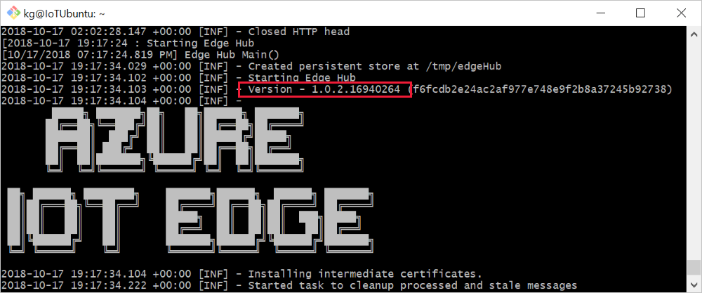
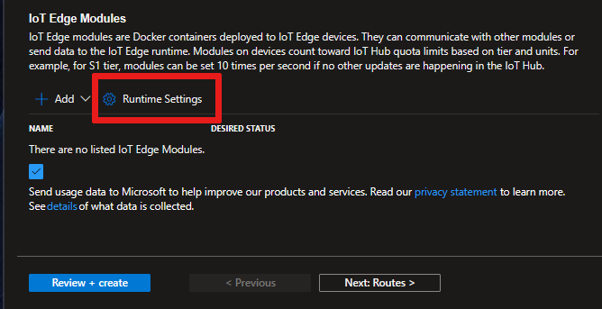
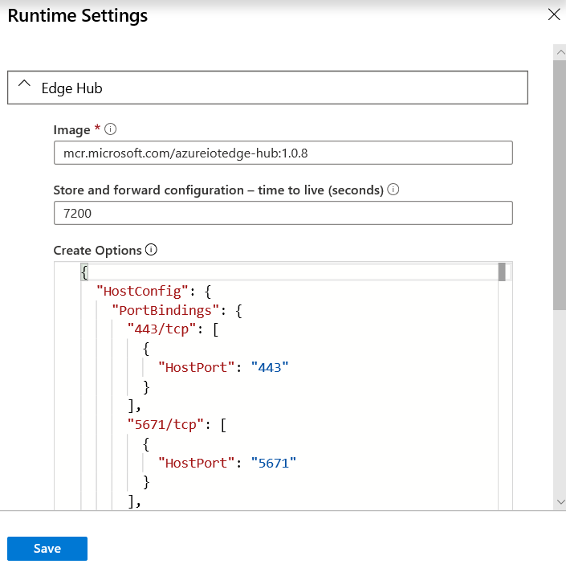
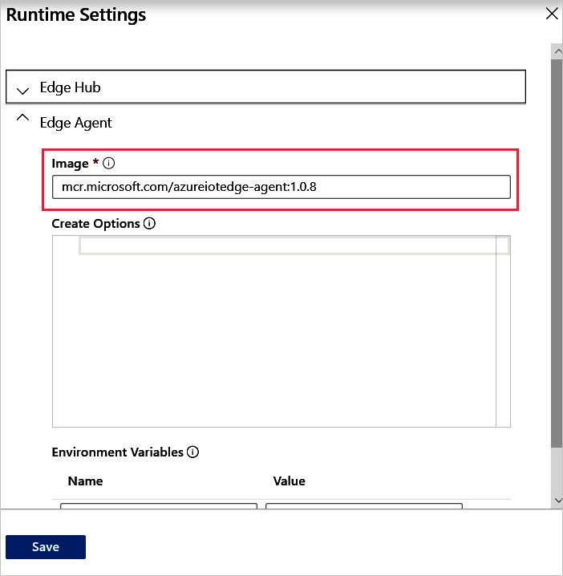

# Update the IoT Edge security daemon and runtime

As the IoT Edge service releases new versions, you'll want to update your IoT Edge devices for the latest features and security improvements. This article provides information about how to update your IoT Edge devices when a new version is available.

Two components of an IoT Edge device need to be updated if you want to move to a newer version. The first is the security daemon, which runs on the device and starts the runtime modules when the device starts. Currently, the security daemon can only be updated from the device itself. The second component is the runtime, made up of the IoT Edge hub and IoT Edge agent modules. Depending on how you structure your deployment, the runtime can be updated from the device or remotely.

To find the latest version of Azure IoT Edge, see [Azure IoT Edge releases](https://github.com/Azure/azure-iotedge/releases).

## Update the security daemon

The IoT Edge security daemon is a native component that needs to be updated using the package manager on the IoT Edge device.

Check the version of the security daemon running on your device by using the command `iotedge version`.

### Linux devices

On Linux x64 devices, use apt-get or your appropriate package manager to update the security daemon to the latest version.

```bash
apt-get update
apt-get install libiothsm iotedge
```

If you want to update to a specific version of the security daemon, find the version you want to target from [IoT Edge releases](https://github.com/Azure/azure-iotedge/releases). In that version, locate the appropriate **libiothsm-std** and **iotedge** files for your device. For each file, right-click the file link and copy the link address. Use the link address to install the specific versions of those components:

```bash
curl -L <libiothsm-std link> -o libiothsm-std.deb && sudo dpkg -i ./libiothsm-std.deb
curl -L <iotedge link> -o iotedge.deb && sudo dpkg -i ./iotedge.deb
```

### Windows devices

On Windows devices, use the PowerShell script to update the security daemon. The script automatically pulls the latest version of the security daemon.

```powershell
. {Invoke-WebRequest -useb aka.ms/iotedge-win} | Invoke-Expression; Update-IoTEdge -ContainerOs <Windows or Linux>
```

Running the Update-IoTEdge command removes and updates the security daemon from your device, along with the two runtime container images. The config.yaml file is kept on the device, as well as data from the Moby container engine (if you're using Windows containers). Keeping the configuration information means that you don't have to provide the connection string or Device Provisioning Service information for your device again during the update process.

If you want to update to a specific version of the security daemon, find the version you want to target from [IoT Edge releases](https://github.com/Azure/azure-iotedge/releases). In that version, download the **Microsoft-Azure-IoTEdge.cab** file. Then, use the `-OfflineInstallationPath` parameter to point to the local file location. For example:

```powershell
. {Invoke-WebRequest -useb aka.ms/iotedge-win} | Invoke-Expression; Update-IoTEdge -ContainerOs <Windows or Linux> -OfflineInstallationPath <absolute path to directory>
```

>[!NOTE]
>The `-OfflineInstallationPath` parameter looks for a file named **Microsoft-Azure-IoTEdge.cab** in the directory provided. Starting with IoT Edge version 1.0.9-rc4, there are two .cab files available to use, one for AMD64 devices and one for ARM32. Download the correct file for your device, then rename the file to remove the architecture suffix.

For more information about update options, use the command `Get-Help Update-IoTEdge -full` or refer to [all installation parameters](how-to-install-iot-edge-windows.md#all-installation-parameters).

## Update the runtime containers

The way that you update the IoT Edge agent and IoT Edge hub containers depends on whether you use rolling tags (like 1.0) or specific tags (like 1.0.7) in your deployment.

Check the version of the IoT Edge agent and IoT Edge hub modules currently on your device using the commands `iotedge logs edgeAgent` or `iotedge logs edgeHub`.

  

### Understand IoT Edge tags

The IoT Edge agent and IoT Edge hub images are tagged with the IoT Edge version that they are associated with. There are two different ways to use tags with the runtime images:

* **Rolling tags** - Use only the first two values of the version number to get the latest image that matches those digits. For example, 1.0 is updated whenever there's a new release to point to the latest 1.0.x version. If the container runtime on your IoT Edge device pulls the image again, the runtime modules are updated to the latest version. This approach is suggested for development purposes. Deployments from the Azure portal default to rolling tags.

* **Specific tags** - Use all three values of the version number to explicitly set the image version. For example, 1.0.7 won't change after its initial release. You can declare a new version number in the deployment manifest when you're ready to update. This approach is suggested for production purposes.

### Update a rolling tag image

If you use rolling tags in your deployment (for example, mcr.microsoft.com/azureiotedge-hub:**1.0**) then you need to force the container runtime on your device to pull the latest version of the image.

Delete the local version of the image from your IoT Edge device. On Windows machines, uninstalling the security daemon also removes the runtime images, so you don't need to take this step again.

```bash
docker rmi mcr.microsoft.com/azureiotedge-hub:1.0
docker rmi mcr.microsoft.com/azureiotedge-agent:1.0
```

You may need to use the force `-f` flag to remove the images.

The IoT Edge service will pull the latest versions of the runtime images and automatically start them on your device again.

### Update a specific tag image

If you use specific tags in your deployment (for example, mcr.microsoft.com/azureiotedge-hub:**1.0.8**) then all you need to do is update the tag in your deployment manifest and apply the changes to your device.

1. In the IoT Hub in the Azure portal, select your IoT Edge device, and select **Set Modules**.

1. In the **IoT Edge Modules** section, select **Runtime Settings**.

   

1. In **Runtime Settings**, update the **Image** value for **Edge Hub** with the desired version. Don't select **Save** just yet.

   

1. Collapse the **Edge Hub** settings, or scroll down, and update the **Image** value for **Edge Agent** with the same desired version.

   

1. Select **Save**.

1. Select **Review + create**, review the deployment, and select **Create**.

## Update offline or to a specific version

If you want to update a device offline, or update to a specific version of IoT Edge rather than the most recent version, you can do so with the `-OfflineInstallationPath` parameter.

Two components are used to update an IoT Edge device:

* A PowerShell script, which contains the installation instructions
* Microsoft Azure IoT Edge cab, which contains the IoT Edge security daemon (iotedged), Moby container engine, and Moby CLI

1. For the latest IoT Edge installation files along with previous versions, see [Azure IoT Edge releases](https://github.com/Azure/azure-iotedge/releases).

2. Find the version that you want to install, and download the following files from the **Assets** section of the release notes onto your IoT device:

   * IoTEdgeSecurityDaemon.ps1
   * Microsoft-Azure-IoTEdge-amd64.cab from releases 1.0.9 or newer, or Microsoft-Azure-IoTEdge.cab from releases 1.0.8 and older.

   Microsoft-Azure-IotEdge-arm32.cab is also available beginning in 1.0.9 for testing purposes only. IoT Edge is not currently supported on Windows ARM32 devices.

   It's important to use the PowerShell script from the same release as the .cab file that you use because the functionality changes to support the features in each release.

3. If the .cab file you downloaded has an architecture suffix on it, rename the file to just **Microsoft-Azure-IoTEdge.cab**.

4. To update with offline components, [dot source](https://docs.microsoft.com/powershell/module/microsoft.powershell.core/about/about_scripts?view=powershell-7#script-scope-and-dot-sourcing) the local copy of the PowerShell script. Then, use the `-OfflineInstallationPath` parameter as part of the `Update-IoTEdge` command and provide the absolute path to the file directory. For example,

   ```powershell
   . <path>\IoTEdgeSecurityDaemon.ps1
   Update-IoTEdge -OfflineInstallationPath <path>
   ```

## Update to a release candidate version

Azure IoT Edge regularly releases new versions of the IoT Edge service. Before each stable release, there is one or more release candidate (RC) versions. RC versions include all the planned features for the release, but are still going through testing and validation. If you want to test a new feature early, you can install an RC version and provide feedback through GitHub.

Release candidate versions follow the same numbering convention of releases, but have **-rc** plus an incremental number appended to the end. You can see the release candidates in the same list of [Azure IoT Edge releases](https://github.com/Azure/azure-iotedge/releases) as the stable versions. For example, find **1.0.7-rc1** and **1.0.7-rc2**, the two release candidates that came before **1.0.7**. You can also see that RC versions are marked with **pre-release** labels.

The IoT Edge agent and hub modules have RC versions that are tagged with the same convention. For example, **mcr.microsoft.com/azureiotedge-hub:1.0.7-rc2**.

As previews, release candidate versions aren't included as the latest version that the regular installers target. Instead, you need to manually target the assets for the RC version that you want to test. For the most part, installing or updating to an RC version is the same as targeting any other specific version of IoT Edge.

Use the sections in this article to learn how to update an IoT Edge device to a specific version of the security daemon or runtime modules.

If you're installing IoT Edge on a new machine, use the following links to learn how to install a specific version depending on your device operating system:

* [Linux](how-to-install-iot-edge-linux.md#install-a-specific-runtime-version)
* [Windows](how-to-install-iot-edge-windows.md#offline-or-specific-version-installation)

## Next steps

View the latest [Azure IoT Edge releases](https://github.com/Azure/azure-iotedge/releases).

Stay up-to-date with recent updates and announcement in the [Internet of Things blog](https://azure.microsoft.com/blog/topics/internet-of-things/)
