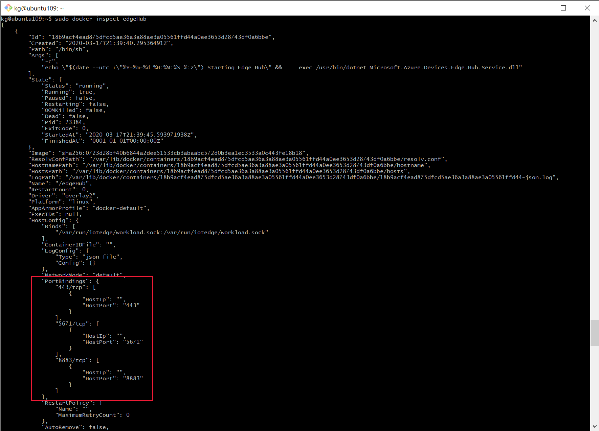

# How to write createOptions for IoT Edge modules

The **createOptions** parameter in the deployment manifest enables you to configure the module containers at runtime. This parameter expands your control over the modules and allows for tasks like passing environment variables to the module, allowing or restricting the module's access to the host device's resources, or configuring networking.

IoT Edge modules are implemented as Docker-compatible containers on your IoT Edge device. Docker offers many options for creating containers, and those options apply to IoT Edge modules, too. For more information, see [Docker create options](https://docs.docker.com/engine/api/v1.32/#operation/ContainerCreate).

## Format createOptions

The IoT Edge deployment manifest accepts createOptions formatted as JSON. For example, take the createOptions that are automatically included for every edgeHub module:

```json
"createOptions": {
  "HostConfig": {
    "PortBindings": {
      "5671/tcp": [
        {
          "HostPort": "5671"
        }
      ],
      "8883/tcp": [
        {
          "HostPort": "8883"
        }
      ],
      "443/tcp": [
        {
          "HostPort": "443"
        }
      ]
    }
  }
}
```

This edgeHub example uses the **HostConfig.PortBindings** parameter to map exposed ports on the container to a port on the host device.

If you use the Azure IoT Tools extensions for Visual Studio or Visual Studio Code, you can write the createOptions in JSON format in the **deployment.template.json** file. Then, when you use the extension to build the IoT Edge solution or generate the deployment manifest, it will stringify the JSON for you in the format that the IoT Edge runtime expects. For example:

```json
"createOptions": "{\"HostConfig\":{\"PortBindings\":{\"5671/tcp\":[{\"HostPort\":\"5671\"}],\"8883/tcp\":[{\"HostPort\":\"8883\"}],\"443/tcp\":[{\"HostPort\":\"443\"}]}}}"
```

Another tip for formatting createOptions is to use the `docker inspect` command. As part of your development process, run the module locally using `docker run <container name>`. Once you have the module working the way you want it, run `docker inspect <container name>`. This command outputs the module details in JSON format. Find the parameters that you configured, and copy the JSON formatting. For example:


