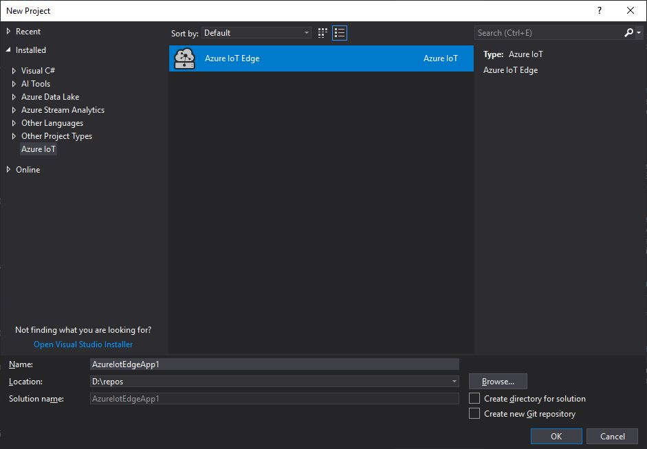
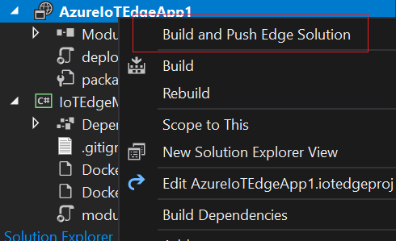

# Use Visual Studio 2017 to develop and debug C# modules for Azure IoT Edge (Preview)

You can turn your business logic into modules for Azure IoT Edge. This article shows you how to use Visual Studio 2017 as the main tool to develop and debug C# modules.

The Azure IoT Edge Tools for Visual Studio provides the following benefits:

- Create, edit, build, run and debug Azure IoT Edge solutions and modules on your local development computer.
- Deploy your Azure IoT Edge solution to Azure IoT Edge device via Azure IoT Hub.
- Code your Azure IoT modules in C# while having all of the benefits of Visual Studio development.
- Manage Azure IoT Edge devices and modules with UI. 

This article shows you how to use the Azure IoT Edge Tools for Visual Studio 2017 to develop your IoT Edge modules in C#. You also learn how to deploy your project to your Azure IoT Edge device.

## Prerequisites
This article assumes that you use a computer or virtual machine running Windows as your development machine. Your IoT Edge device can be another physical device.

Because this article uses Visual Studio 2017 as the main development tool, install Visual Studio. And make sure you include **Azure development workload** in your Visual Studio 2017 installation. You can [Modify Visual Studio 2017](https://docs.microsoft.com/visualstudio/install/modify-visual-studio?view=vs-2017) and add Azure development workload.

After your Visual Studio 2017 is ready, you also need:

- Download and install [Azure IoT Edge extension](https://marketplace.visualstudio.com/items?itemName=vsc-iot.azureiotedgetools) from Visual Studio marketplace to create IoT Edge project in Visual Studio 2017.
- [Docker Community Edition](https://docs.docker.com/install/) on your development machine to build and run your module images. You need to properly set the Docker CE running in Linux container mode or Windows container mode.
- To set up local development environment to debug, run, and test your IoT Edge solution, you need [Azure IoT EdgeHub Dev Tool](https://pypi.org/project/iotedgehubdev/). Install [Python (2.7/3.6) and Pip](https://www.python.org/). Then install **iotedgehubdev** by running below command in your terminal. Make sure your Azure IoT EdgeHub Dev Tool version is greater than 0.3.0.

   ```cmd
   pip install --upgrade iotedgehubdev
   ```

- [Azure Container Registry](https://docs.microsoft.com/azure/container-registry/) or [Docker Hub](https://docs.docker.com/docker-hub/repos/#viewing-repository-tags)
   - You can use a local Docker registry for prototype and testing purposes instead of a cloud registry. 

- To test your module, you need an active IoT hub with at least one IoT Edge device ID created. If you are running IoT Edge security daemon on development machine, you might need to stop EdgeHub and EdgeAgent before you start development in Visual Studio. 

### Check your tools version

1. From the **Tools** menu, choose **Extensions and Updates**. Expand **Installed > Tools** and you can find **Azure IoT Edge** and **Cloud Explorer**.

2. Note the installed version. You can compare this version with the latest version on Visual Studio Marketplace ([Cloud Explorer](https://marketplace.visualstudio.com/items?itemName=ms-azuretools.CloudExplorerForVS), [Azure IoT Edge](https://marketplace.visualstudio.com/items?itemName=vsc-iot.azureiotedgetools))

3. If your version is older, update your tools in Visual Studio as shown in the following section.

### Update your tools

1. In the **Extensions and Updates** dialog, expand **Updates > Visual Studio Marketplace**, choose **Azure IoT Edge** or **Cloud Explorer** and select **Update**.

2. After the tools update is downloaded, close Visual Studio to trigger the tools update using the VSIX installer.

3. In the installer, choose **OK** to start and then Modify to update the tools.

4. After the update is complete, choose Close and restart Visual Studio.

### Create an Azure IoT Edge project

The Azure IoT Edge project template in Visual Studio creates a project that can be deployed to Azure IoT Edge devices in Azure IoT Hub. First you create an Azure IoT Edge solution, and then you generate the first C# module in that solution. Each IoT Edge solution can contain more than one module. 

1. In Visual Studio, select **New** > **Project** from the **File** menu.

2. In the **New Project** dialog, select **Installed**, expand **Visual C# > Cloud**, select **Azure IoT Edge**, type a **Name** for your project and specify the location, and click **OK**. The default project name is **AzureIoTEdgeApp1**. 

   

3. In the **IoT Edge Module Configuration** window, select **C# Module** type and specify your module name and module image repository.  VS autopopulates the module name with **localhost:5000**. Replace it with your own registry information. If you use a local Docker registry for testing, then localhost is fine. If you use Azure Container Registry, then use the login server from your registry's settings. The login server looks like **<registry name>.azurecr.io**. Only replace the localhost part of the string, don't delete your module name. The default module name is **IoTEdgeModule1**

4. Click **OK** to create the Azure IoT Edge project with a C# module.

Now you have an **AzureIoTEdgeApp1** project and an **IoTEdgeModule1** project in our solution. The **AzureIoTEdgeApp1** project has a **deployment.template.json** file. This file defines the modules you want to build and deploy for your IoT Edge solution, and defines the routes between modules. The default solution has a **tempSensor** module and a **IoTEdgeModule1** module. The **tempSensor** module generates simulated data to **IoTEdgeModule1** module, while the default code in **IoTEdgeModule1** module is a pipe message module, which directly pipe received messages to IoT Hub.

The **IoTEdgeModule1** project is a .Net Core 2.1 console application. It contains required **Dockerfiles** you need for your IoT Edge device running with Windows container or Linux container. The **module.json** file describes the metadata of a module. The **program.cs** is the actual module code, which takes Azure IoT Device SDK as a dependency.

## Develop your module

The default C# module code that comes with the solution is located at **IoTEdgeModule1** > **Program.cs**. The module and the deployment.template.json file are set up so that you can build the solution, push it to your container registry, and deploy it to a device to start testing without touching any code. The module is built to simply take input from a source (in this case, the tempSensor module that simulates data) and pipe it to IoT Hub. 

When you're ready to customize the C# template with your own code, use the [Azure IoT Hub SDKs](../iot-hub/iot-hub-devguide-sdks.md) to build modules that address the key needs for IoT solutions such as security, device management, and reliability. 

## Build and debug single C# module

Typically, we want to test/debug each module before we make it running within an entire solution with multiple modules.

1. Select **IoTEdgeModule1** as the start-up project in the context menu.

   

2. Press **F5** or click the button below to run the module, it may take 10~20 seconds for the first time.

   


3. You should see a .Net Core console app started if the module has been initialized successfully.

   

4. Now you can set a breakpoint in **PipeMessage** in **Program.cs**, then sending message by running the following command in your **Git Bash** or **WSL Bash** (do not run it in CMD or Powershell) (you can also find this command in the VS Output window):

    ```cmd
    curl --header "Content-Type: application/json" --request POST --data '{"inputName": "input1","data":"hello world"}' http://localhost:53000/api/v1/messages
    ```

   

    The breakpoint should be triggered. You can watch variables in Visual Studio Locals window.

   > [!TIP]
   > You can also use [PostMan](https://www.getpostman.com/) or other API tools to send messages through instead of `curl`.

5. Press **Ctrl + F5** or click the stop button to stop debugging.

## Build and debug IoT Edge solution with multiple modules

After we finish developing single module, next, we want to run and debug the entire solution with multiple modules.

1. Add your second C# module into the solution. Right-click **AzureIoTEdgeApp1** and select **Add** -> **New IoT Edge Module**. The default name of the second module is **IoTEdgeModule2** and it is still a pipe module.

2. Navigate to **deployment.template.json**. You will see **IoTEdgeModule2** has been added in **modules** section. Replace the **routes** section with the following. If you have customized your module names, make sure you update the names in the following after replacement.

    ```json
        "routes": {
          "IoTEdgeModule1ToIoTHub": "FROM /messages/modules/IoTEdgeModule1/outputs/* INTO $upstream",
          "sensorToIoTEdgeModule1": "FROM /messages/modules/tempSensor/outputs/temperatureOutput INTO BrokeredEndpoint(\"/modules/IoTEdgeModule1/inputs/input1\")",
          "IoTEdgeModule2ToIoTHub": "FROM /messages/modules/IoTEdgeModule2/outputs/* INTO $upstream",
          "sensorToIoTEdgeModule2": "FROM /messages/modules/tempSensor/outputs/temperatureOutput INTO BrokeredEndpoint(\"/modules/IoTEdgeModule2/inputs/input1\")"
        },
    ```

3. Set **AzureIoTEdgeApp1** project as Start-Up project in the context menu.

4. Set breakpoints and press F5, then you could run and debug multiple modules simultaneously. You should see multiple .Net Core console app windows, each window indicates your C# module. 

   

5. Press **Ctrl + F5** or click the stop button to stop debugging.

## Build and push images

1. Make sure **AzureIoTEdgeApp1** is your Start-Up project. Select **Debug** or **Release** configuration for your module images to build.

    > [!NOTE]
    > When choosing **Debug**, VS will use `Dockerfile.debug` to build Docker images. This includes the .NET Core command-line debugger VSDBG in your container image while building it. We recommend that you use **Release** configuration which uses `Dockerfile` without VSDBG for production-ready IoT Edge modules.

2. If you are using private registry like Azure Container Registry, run Docker log in with the following command in your terminal. If you are using local registry, you can [Run a local registry](https://docs.docker.com/registry/deploying/#run-a-local-registry).

    ```cmd
    docker login -u <ACR username> -p <ACR password> <ACR login server> 
    ```

3. If you are using private registry like Azure Container Registry, you need to put registry username and password in `deployment.template.json` under runtime settings with the following content. Remember to replace the placeholder with your actual admin username and password.

    ```json
          "settings": {
            "minDockerVersion": "v1.25",
            "loggingOptions": "",
            "registryCredentials": {
              "registry1": {
                "username": "<username>",
                "password": "<password>",
                "address": "<registry name>.azurecr.io"
              }
            }
          }
    ```

4. Right click **AzureIoTEdgeApp1** and choose context menu item **Build and Push Edge Solution**, it will build and push docker image for each module.

   


## Deploy the solution

In the quickstart article that you used to set up your IoT Edge device, you deployed a module by using the Azure portal. You can also deploy modules using the Cloud Explorer for Visual Studio. You already have a deployment manifest prepared for your scenario, the `deployment.json` file. All you need to do now is select a device to receive the deployment.

1. Open **Cloud Explorer** by clicking **View** > **Cloud Explorer**. Make sure you've logged in Visual Studio 2017 with your account.

2. In **Cloud Explorer**, expand your subscription, find your Azure IoT Hub and the Azure IoT Edge device you want to deploy.

3. Right-click on IoT Edge device to create deployment for it, you need to choose the deployment manifest file under the `$AzureIoTEdgeApp1\config\Debug|Release\deployment.json`.

4. Click the refresh button. You should see the new modules running along with the **TempSensor** module and the **$edgeAgent** and **$edgeHub**.

## View generated data

1. To monitor the D2C message for a specific device, click the device in the list, and click **Start Monitoring D2C Messages** in **Action** window.

2. To stop monitoring data, click the device in the list, and select **Stop Monitoring D2C Messages** in **Action** window.

## Next steps

To develop modules for your IoT Edge devices, [Understand and use Azure IoT Hub SDKs](../iot-hub/iot-hub-devguide-sdks.md).
