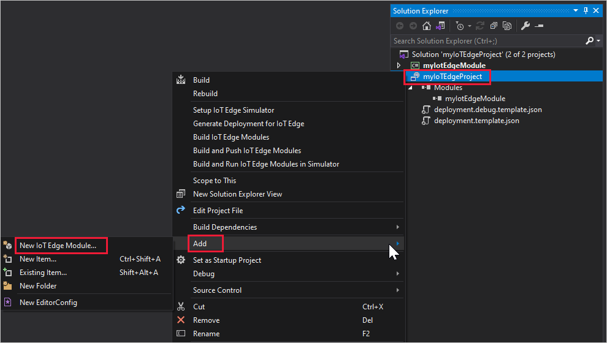

# Use Visual Studio 2019 to develop and debug modules for Azure IoT Edge

[!INCLUDE [iot-edge-version-all-supported](../../includes/iot-edge-version-all-supported.md)]

This article shows you how to use Visual Studio 2019 to develop and debug Azure IoT Edge modules.

The Azure IoT Edge Tools for Visual Studio extension provides the following benefits:

* Create, edit, build, run, and debug IoT Edge solutions and modules on your local development computer.
* Deploy your IoT Edge solution to an IoT Edge device via Azure IoT Hub.
* Code your Azure IoT modules in C or C# while having all of the benefits of Visual Studio development.
* Manage IoT Edge devices and modules with UI.

This article shows you how to use the Azure IoT Edge Tools for Visual Studio 2019 to develop your IoT Edge modules. You also learn how to deploy your project to an IoT Edge device. Currently, Visual Studio 2019 provides support for modules written in C and C#. The supported device architectures are Windows X64 and Linux X64 or ARM32. For more information about supported operating systems, languages, and architectures, see [Language and architecture support](module-development.md#language-and-architecture-support).
  
## Prerequisites

This article assumes that you use a machine running Windows as your development machine. On Windows computers, you can develop either Windows or Linux modules.

* To develop modules with **Windows containers**, use a Windows computer running version 1809/build 17763 or newer.
* To develop modules with **Linux containers**, use a Windows computer that meets the [requirements for Docker Desktop](https://docs.docker.com/docker-for-windows/install/#what-to-know-before-you-install).

Install Visual Studio on your development machine. Make sure you include the **Azure development** and **Desktop development with C++** workloads in your Visual Studio 2019 installation. You can [Modify Visual Studio 2019](/visualstudio/install/modify-visual-studio?view=vs-2019&preserve-view=true) to add the required workloads.

After your Visual Studio 2019 is ready, you also need the following tools and components:

* Download and install [Azure IoT Edge Tools](https://marketplace.visualstudio.com/items?itemName=vsc-iot.vs16iotedgetools) from the Visual Studio marketplace to create an IoT Edge project in Visual Studio 2019.

  > [!TIP]
  > If you are using Visual Studio 2017, download and install [Azure IoT Edge Tools for VS 2017](https://marketplace.visualstudio.com/items?itemName=vsc-iot.vsiotedgetools) from the Visual Studio marketplace

* Download and install [Docker Community Edition](https://docs.docker.com/install/) on your development machine to build and run your module images. You'll need to set Docker CE to run in either Linux container mode or Windows container mode, depending on the type of modules you are developing.

* Set up your local development environment to debug, run, and test your IoT Edge solution by installing the [Azure IoT EdgeHub Dev Tool](https://pypi.org/project/iotedgehubdev/). Install [Python (2.7/3.6+) and Pip](https://www.python.org/) and then install the **iotedgehubdev** package by running the following command in your terminal. Make sure your Azure IoT EdgeHub Dev Tool version is greater than 0.3.0.

   ```cmd
   pip install --upgrade iotedgehubdev
   ```

* Install the Vcpkg library manager, and then install the **azure-iot-sdk-c package** for Windows.

  ```cmd
  git clone https://github.com/Microsoft/vcpkg
  cd vcpkg
  bootstrap-vcpkg.bat
  ```

  ```cmd
  vcpkg.exe install azure-iot-sdk-c:x64-windows
  vcpkg.exe --triplet x64-windows integrate install
  ```

* Create an instance of [Azure Container Registry](../container-registry/index.yml) or [Docker Hub](https://docs.docker.com/docker-hub/repos/#viewing-repository-tags) to store your module images.

  > [!TIP]
  > You can use a local Docker registry for prototype and testing purposes instead of a cloud registry.

* To test your module on a device, you'll need an active IoT hub with at least one IoT Edge device. To quickly create an IoT Edge device for testing, follow the steps in the quickstart for [Linux](quickstart-linux.md) or [Windows](quickstart.md). If you are running IoT Edge daemon on your development machine, you might need to stop EdgeHub and EdgeAgent before you start development in Visual Studio.

### Check your tools version

1. From the **Extensions** menu, select **Manage Extensions**. Expand **Installed > Tools** and you can find **Azure IoT Edge Tools for Visual Studio** and **Cloud Explorer for Visual Studio**.

1. Note the installed version. You can compare this version with the latest version on Visual Studio Marketplace ([Cloud Explorer](https://marketplace.visualstudio.com/items?itemName=ms-azuretools.CloudExplorerForVS2019), [Azure IoT Edge](https://marketplace.visualstudio.com/items?itemName=vsc-iot.vs16iotedgetools))

1. If your version is older than what's available on Visual Studio Marketplace, update your tools in Visual Studio as shown in the following section.

### Update your tools

1. In the **Manage Extensions** window, expand **Updates > Visual Studio Marketplace**, select **Azure IoT Edge Tools** or **Cloud Explorer for Visual Studio** and select **Update**.

1. After the tools update is downloaded, close Visual Studio to trigger the tools update using the VSIX installer.

1. In the installer, select **OK** to start and then **Modify** to update the tools.

1. After the update is complete, select **Close** and restart Visual Studio.

## Create an Azure IoT Edge project

The IoT Edge project template in Visual Studio creates a solution that can be deployed to IoT Edge devices. First you create an Azure IoT Edge solution, and then you generate the first module in that solution. Each IoT Edge solution can contain more than one module.

> [!TIP]
> The IoT Edge project structure created by Visual Studio is not the same as in Visual Studio Code.

1. In Visual Studio, create a new project.

1. On the **Create a new project** page, search for **Azure IoT Edge**. Select the project that matches the platform and architecture for your IoT Edge device, and click **Next**.

   

1. On the **Configure your new project** page, enter a name for your project and specify the location, then select **Create**.

1. On the **Add Module** window, select the type of module you want to develop. You can also select **Existing module** to add an existing IoT Edge module to your deployment. Specify your module name and module image repository.

   Visual Studio autopopulates the repository URL with **localhost:5000/<module name\>**. If you use a local Docker registry for testing, then **localhost** is fine. If you use Azure Container Registry, then replace **localhost:5000** with the login server from your registry's settings. The login server looks like **_\<registry name\>_.azurecr.io**.The final result should look like **\<*registry name*\>.azurecr.io/_\<module name\>_**.

   Select **Add** to add your module to the project.

   

Now you have an IoT Edge project and an IoT Edge module in your Visual Studio solution.

The module folder contains a file for your module code, named either `program.cs` or `main.c` depending on the language you chose. This folder also contains a file named `module.json` that describes the metadata of your module. Various Docker files provide the information needed to build your module as a Windows or Linux container.

The project folder contains a list of all the modules included in that project. Right now it should show only one module, but you can add more. For more information about adding modules to a project, see the [Build and debug multiple modules](#build-and-debug-multiple-modules) section later in this article.

The project folder also contains a file named `deployment.template.json`. This file is a template of an IoT Edge deployment manifest, which defines all the modules that will run on a device along with how they will communicate with each other. For more information about deployment manifests, see [Learn how to deploy modules and establish routes](module-composition.md). If you open this deployment template, you see that the two runtime modules, **edgeAgent** and **edgeHub** are included, along with the custom module that you created in this Visual Studio project. A fourth module named **SimulatedTemperatureSensor** is also included. This default module generates simulated data that you can use to test your modules, or delete if it's not necessary. To see how the simulated temperature sensor works, view the [SimulatedTemperatureSensor.csproj source code](https://github.com/Azure/iotedge/tree/master/edge-modules/SimulatedTemperatureSensor).

## Develop your module

When you add a new module, it comes with default code that is ready to be built and deployed to a device so that you can start testing without touching any code. The module code is located within the module folder in a file named `Program.cs` (for C#) or `main.c` (for C).

The default solution is built so that the simulated data from the **SimulatedTemperatureSensor** module is routed to your module, which takes the input and then sends it to IoT Hub.

When you're ready to customize the module template with your own code, use the [Azure IoT Hub SDKs](../iot-hub/iot-hub-devguide-sdks.md) to build modules that address the key needs for IoT solutions such as security, device management, and reliability.

## Set up the iotedgehubdev testing tool

The IoT edgeHub dev tool provides a local development and debug experience. The tool helps start IoT Edge modules without the IoT Edge runtime so that you can create, develop, test, run, and debug IoT Edge modules and solutions locally. You don't have to push images to a container registry and deploy them to a device for testing.

For more information, see [Azure IoT EdgeHub Dev Tool](https://pypi.org/project/iotedgehubdev/).

To initialize the tool, provide an IoT Edge device connection string from IoT Hub.

1. Retrieve the connection string of an IoT Edge device from the Azure portal, the Azure CLI, or the Visual Studio Cloud Explorer. 

1. From the **Tools** menu, select **Azure IoT Edge Tools** > **Setup IoT Edge Simulator**.

1. Paste the connection string and click **OK**.

> [!NOTE]
> You need to follow these steps only once on your development computer as the results are automatically applied to all subsequent Azure IoT Edge solutions. This procedure can be followed again if you need to change to a different connection string.

## Build and debug a single module

Typically, you'll want to test and debug each module before running it within an entire solution with multiple modules.

1. In **Solution Explorer**, right-click the module folder and select **Set as StartUp Project** from the menu.

   

1. Press **F5** or click the run button in the toolbar to run the module. It may take 10&ndash;20 seconds the first time you do so.

   

1. You should see a .NET Core console app start if the module has been initialized successfully.

1. Set a breakpoint to inspect the module.

   * If developing in C#, set a breakpoint in the `PipeMessage()` function in **Program.cs**.
   * If using C, set a breakpoint in the `InputQueue1Callback()` function in **main.c**.

1. Test the module by sending a message by running the following command in a **Git Bash** or **WSL Bash** shell. (You cannot run the `curl` command from a PowerShell or command prompt.)

    ```bash
    curl --header "Content-Type: application/json" --request POST --data '{"inputName": "input1","data":"hello world"}' http://localhost:53000/api/v1/messages
    ```

   

   The breakpoint should be triggered. You can watch variables in the Visual Studio **Locals** window.

   > [!TIP]
   > You can also use [PostMan](https://www.getpostman.com/) or other API tools to send messages instead of `curl`.

1. Press **Ctrl + F5** or click the stop button to stop debugging.

## Build and debug multiple modules

After you're done developing a single module, you might want to run and debug an entire solution with multiple modules.

1. In **Solution Explorer**, add a second module to the solution by right-clicking the project folder. On the menu, select **Add** > **New IoT Edge Module**.

   

1. Open the file `deployment.template.json` and you'll see that the new module has been added in the **modules** section. A new route was also added to the **routes** section to send messages from the new module to IoT Hub. If you want to send data from the simulated temperature sensor to the new module, add another route like the following example: 

    ```json
   "sensorTo<NewModuleName>": "FROM /messages/modules/SimulatedTemperatureSensor/outputs/temperatureOutput INTO BrokeredEndpoint(\"/modules/<NewModuleName>/inputs/input1\")"
    ```

1. Right-click the project folder and select **Set as StartUp Project** from the context menu.

1. Create your breakpoints and then press **F5** to run and debug multiple modules simultaneously. You should see multiple .NET Core console app windows, which each window representing a different module.

   

1. Press **Ctrl + F5** or select the stop button to stop debugging.

## Build and push images

1. Make sure the IoT Edge project is the start-up project, not one of the individual modules. Select either **Debug** or **Release** as the configuration to build for your module images.

    > [!NOTE]
    > When choosing **Debug**, Visual Studio uses `Dockerfile.(amd64|windows-amd64).debug` to build Docker images. This includes the .NET Core command-line debugger VSDBG in your container image while building it. For production-ready IoT Edge modules, we recommend that you use the **Release** configuration, which uses `Dockerfile.(amd64|windows-amd64)` without VSDBG.

1. If you're using a private registry like Azure Container Registry (ACR), use the following Docker command to sign in to it.  You can get the username and password from the **Access keys** page of your registry in the Azure portal. If you're using local registry, you can [run a local registry](https://docs.docker.com/registry/deploying/#run-a-local-registry).

    ```cmd
    docker login -u <ACR username> -p <ACR password> <ACR login server>
    ```

1. If you're using a private registry like Azure Container Registry, you need to add your registry login information to the runtime settings found in the file `deployment.template.json`. Replace the placeholders with your actual ACR admin username, password, and registry name.

    ```json
          "settings": {
            "minDockerVersion": "v1.25",
            "loggingOptions": "",
            "registryCredentials": {
              "registry1": {
                "username": "<username>",
                "password": "<password>",
                "address": "<registry name>.azurecr.io"
              }
            }
          }
    ```

   >[!NOTE]
   >This article uses admin login credentials for Azure Container Registry, which are convenient for development and test scenarios. When you're ready for production scenarios, we recommend a least-privilege authentication option like service principals. For more information, see [Manage access to your container registry](production-checklist.md#manage-access-to-your-container-registry).

1. In **Solution Explorer**, right-click the project folder and select **Build and Push IoT Edge Modules** to build and push the Docker image for each module.

## Deploy the solution

In the quickstart article that you used to set up your IoT Edge device, you deployed a module by using the Azure portal. You can also deploy modules using the Cloud Explorer for Visual Studio. You already have a deployment manifest prepared for your scenario, the `deployment.json` file and all you need to do is select a device to receive the deployment.

1. Open **Cloud Explorer** by clicking **View** > **Cloud Explorer**. Make sure you've logged in to Visual Studio 2019.

1. In **Cloud Explorer**, expand your subscription, find your Azure IoT Hub and the Azure IoT Edge device you want to deploy.

1. Right-click on the IoT Edge device to create a deployment for it. Navigate to the deployment manifest configured for your platform located in the **config** folder in your Visual Studio solution, such as `deployment.arm32v7.json`.

1. Click the refresh button to see the new modules running along with the **SimulatedTemperatureSensor** module and **$edgeAgent** and **$edgeHub**.

## View generated data

1. To monitor the D2C message for a specific IoT Edge device, select it in your IoT hub in **Cloud Explorer** and then click **Start Monitoring Built-in Event Endpoint** in the **Action** window.

1. To stop monitoring data, select **Stop Monitoring Built-in Event Endpoint** in the **Action** window.

## Next steps

To develop custom modules for your IoT Edge devices, [Understand and use Azure IoT Hub SDKs](../iot-hub/iot-hub-devguide-sdks.md).
