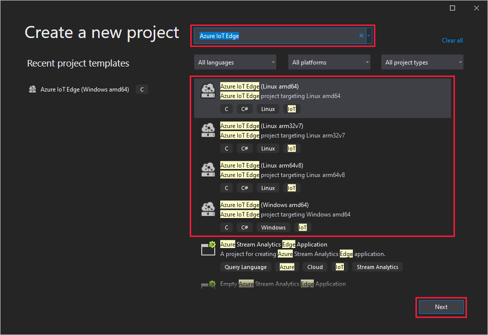
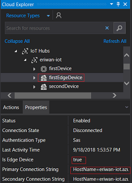
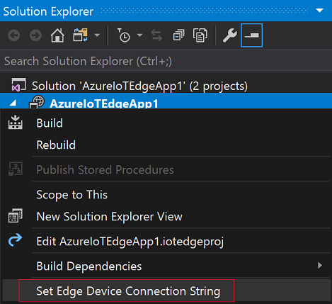
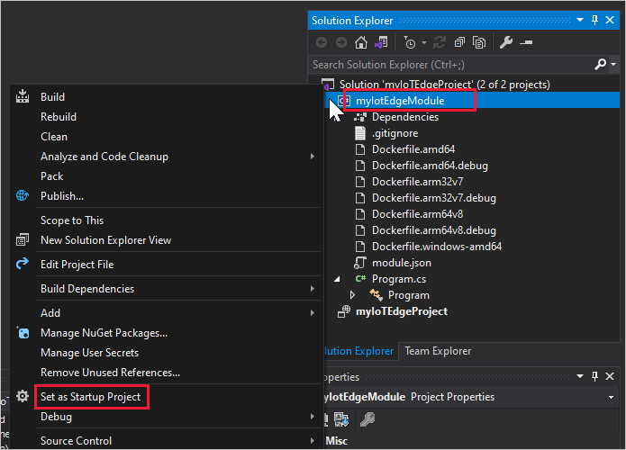
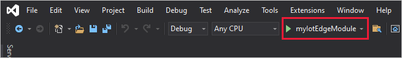
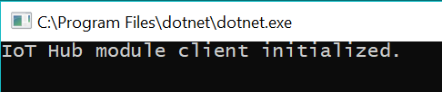
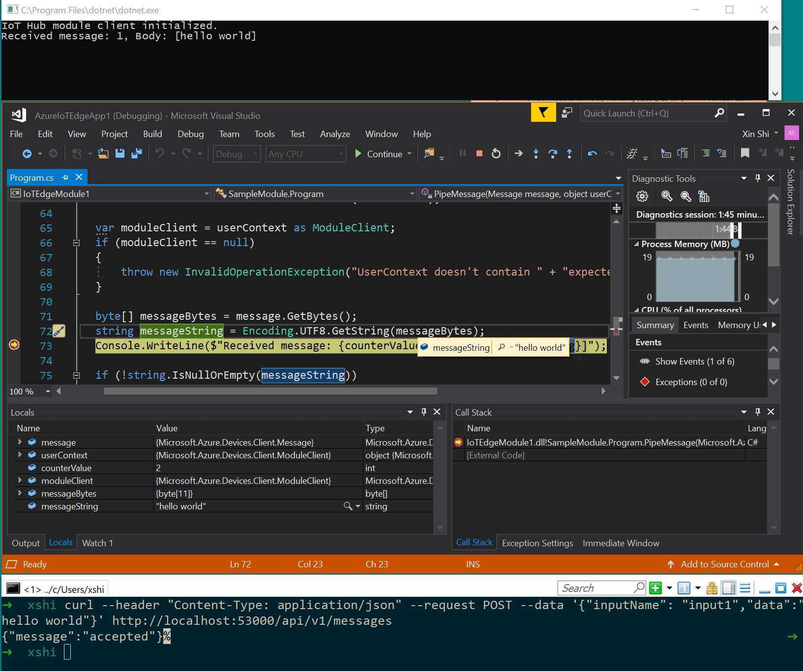
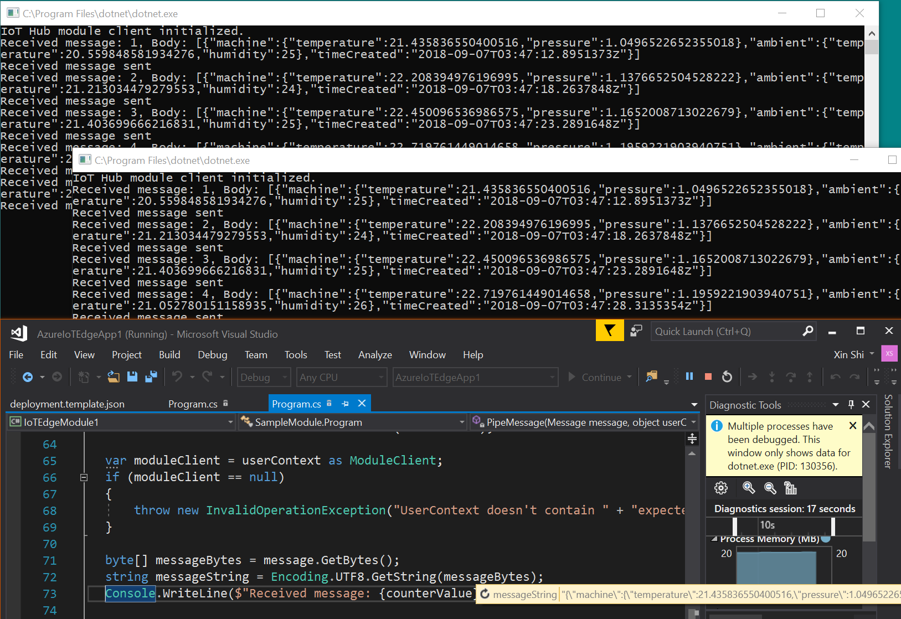

# Use Visual Studio 2019 to develop and debug modules for Azure IoT Edge

You can turn your business logic into modules for Azure IoT Edge. This article shows you how to use Visual Studio 2019 as the main tool to develop and debug modules.

The Azure IoT Edge Tools for Visual Studio provides the following benefits:

- Create, edit, build, run, and debug Azure IoT Edge solutions and modules on your local development computer.
- Deploy your Azure IoT Edge solution to Azure IoT Edge device via Azure IoT Hub.
- Code your Azure IoT modules in C or C# while having all of the benefits of Visual Studio development.
- Manage Azure IoT Edge devices and modules with UI.

This article shows you how to use the Azure IoT Edge Tools for Visual Studio 2019 to develop your IoT Edge modules. You also learn how to deploy your project to your Azure IoT Edge device. Currently, Visual Studio 2019 provides support for modules written in C and C#. The supported device architectures are Windows X64 and Linux X64 or ARM32. For more information about supported operating systems, languages, and architectures, see [Language and architecture support](module-development.md#language-and-architecture-support).
  
## Prerequisites

This article assumes that you use a computer or virtual machine running Windows as your development machine. On Windows computers, you can develop either Windows or Linux modules. To develop Windows modules, use a Windows computer running version 1809/build 17763 or newer. To develop Linux modules, use a Windows computer that meets the [requirements for Docker Desktop](https://docs.docker.com/docker-for-windows/install/#what-to-know-before-you-install).

Because this article uses Visual Studio 2019 as the main development tool, install Visual Studio. Make sure you include the **Azure development** and **Desktop development with C++** workloads in your Visual Studio 2019 installation. You can [Modify Visual Studio 2019](https://docs.microsoft.com/visualstudio/install/modify-visual-studio?view=vs-2019) to add the required workloads.

After your Visual Studio 2019 is ready, you also need the following tools and components:

- Download and install [Azure IoT Edge Tools](https://marketplace.visualstudio.com/items?itemName=vsc-iot.vs16iotedgetools) from the Visual Studio marketplace to create an IoT Edge project in Visual Studio 2019.

> [!TIP]
> If you are using Visual Studio 2017, please download and install [Azure IoT Edge Tools](https://marketplace.visualstudio.com/items?itemName=vsc-iot.vsiotedgetools) for VS 2017 from the Visual Studio marketplace

- Download and install [Docker Community Edition](https://docs.docker.com/install/) on your development machine to build and run your module images. You'll need to set Docker CE to run in either Linux container mode or Windows container mode.

- Set up your local development environment to debug, run, and test your IoT Edge solution by installing the [Azure IoT EdgeHub Dev Tool](https://pypi.org/project/iotedgehubdev/). Install [Python (2.7/3.6+) and Pip](https://www.python.org/) and then install the **iotedgehubdev** package by running the following command in your terminal. Make sure your Azure IoT EdgeHub Dev Tool version is greater than 0.3.0.

   ```cmd
   pip install --upgrade iotedgehubdev
   ```

- Clone the repository and install the Vcpkg library manager, and then install the **azure-iot-sdk-c package** for Windows.

  ```cmd
  git clone https://github.com/Microsoft/vcpkg
  cd vcpkg
  bootstrap-vcpkg.bat
  ```

  ```cmd
  vcpkg.exe install azure-iot-sdk-c:x64-windows
  vcpkg.exe --triplet x64-windows integrate install
  ```

- [Azure Container Registry](https://docs.microsoft.com/azure/container-registry/) or [Docker Hub](https://docs.docker.com/docker-hub/repos/#viewing-repository-tags).

  > [!TIP]
  > You can use a local Docker registry for prototype and testing purposes instead of a cloud registry.

- To test your module on a device, you'll need an active IoT hub with at least one IoT Edge device. To use your computer as an IoT Edge device, follow the steps in the quickstart for [Linux](quickstart-linux.md) or [Windows](quickstart.md). If you are running IoT Edge daemon on your development machine, you might need to stop EdgeHub and EdgeAgent before you start development in Visual Studio.

### Check your tools version

1. From the **Extensions** menu, select **Manage Extensions**. Expand **Installed > Tools** and you can find **Azure IoT Edge Tools for Visual Studio** and **Cloud Explorer for Visual Studio**.

1. Note the installed version. You can compare this version with the latest version on Visual Studio Marketplace ([Cloud Explorer](https://marketplace.visualstudio.com/items?itemName=ms-azuretools.CloudExplorerForVS2019), [Azure IoT Edge](https://marketplace.visualstudio.com/items?itemName=vsc-iot.vs16iotedgetools))

1. If your version is older than what's available on Visual Studio Marketplace, update your tools in Visual Studio as shown in the following section.

### Update your tools

1. In the **Manage Extensions** window, expand **Updates > Visual Studio Marketplace**, select **Azure IoT Edge Tools** or **Cloud Explorer for Visual Studio** and select **Update**.

1. After the tools update is downloaded, close Visual Studio to trigger the tools update using the VSIX installer.

1. In the installer, select **OK** to start and then **Modify** to update the tools.

1. After the update is complete, select **Close** and restart Visual Studio.

### Create an Azure IoT Edge project

The Azure IoT Edge project template in Visual Studio creates a project that can be deployed to Azure IoT Edge devices in Azure IoT Hub. First you create an Azure IoT Edge solution, and then you generate the first module in that solution. Each IoT Edge solution can contain more than one module.

> [!TIP]
> The IoT Edge project structure created by Visual Studio is not the same as in Visual Studio Code.

1. In Visual Studio new project dialog, search and select **Azure IoT Edge** project and click **Next**. In project configuration window, enter a name for your project and specify the location, and then select **Create**. The default project name is **AzureIoTEdgeApp1**.

   

1. In the **Add IoT Edge Application and Module** window, select either **C# Module** or **C Module** and then specify your module name and module image repository. Visual Studio autopopulates the module name with **localhost:5000/<your module name\>**. Replace it with your own registry information. If you use a local Docker registry for testing, then **localhost** is fine. If you use Azure Container Registry, then use the login server from your registry's settings. The login server looks like **_\<registry name\>_.azurecr.io**. Only replace the **localhost:5000** part of the string so that the final result looks like **\<*registry name*\>.azurecr.io/_\<your module name\>_**. The default module name is **IotEdgeModule1**

   

1. Select **OK** to create the Azure IoT Edge solution with a module that uses either C# or C.

Now you have an **AzureIoTEdgeApp1.Linux.Amd64** project or an **AzureIoTEdgeApp1.Windows.Amd64** project, and also an **IotEdgeModule1** project in your solution. Each **AzureIoTEdgeApp1** project has a `deployment.template.json` file, which defines the modules you want to build and deploy for your IoT Edge solution, and also defines the routes between modules. The default solution has a **SimulatedTemperatureSensor** module and a **IotEdgeModule1** module. The **SimulatedTemperatureSensor** module generates simulated data to the **IotEdgeModule1** module, while the default code in the **IotEdgeModule1** module directly pipes received messages to Azure IoT Hub.

To see how the simulated temperature sensor works, view the [SimulatedTemperatureSensor.csproj source code](https://github.com/Azure/iotedge/tree/master/edge-modules/SimulatedTemperatureSensor).

The **IotEdgeModule1** project is a .NET Core 2.1 console application if it's a C# module. It contains required Docker files you need for your IoT Edge device running with either a Windows container or Linux container. The `module.json` file describes the metadata of a module. The actual module code, which takes Azure IoT Device SDK as a dependency, is found in the `Program.cs` or `main.c` file.

## Develop your module

The default module code that comes with the solution is located at **IotEdgeModule1** > **Program.cs** (for C#) or **main.c** (C). The module and the `deployment.template.json` file are set up so that you can build the solution, push it to your container registry, and deploy it to a device to start testing without touching any code. The module is built to take input from a source (in this case, the **SimulatedTemperatureSensor** module that simulates data) and pipe it to Azure IoT Hub.

When you're ready to customize the module template with your own code, use the [Azure IoT Hub SDKs](../iot-hub/iot-hub-devguide-sdks.md) to build modules that address the key needs for IoT solutions such as security, device management, and reliability.

## Initialize iotedgehubdev with IoT Edge device connection string

1. Copy the connection string of any IoT Edge device from **Primary Connection String** in the Visual Studio Cloud Explorer. Be sure not to copy the connection string of a non-Edge device, as the icon of an IoT Edge device is different from the icon of a non-Edge device.

   

1. From the **Tools** menu, select **Azure IoT Edge Tools** > **Setup IoT Edge Simulator**, paste the connection string and click **OK**.

   

1. Enter the connection string from the first step and then select **OK**.

> [!NOTE]
> You need to follow these steps only once on your development computer as the results are automatically applied to all subsequent Azure IoT Edge solutions. This procedure can be followed again if you need to change to a different connection string.

## Build and debug single module

Typically, you'll want to test and debug each module before running it within an entire solution with multiple modules.

1. In **Solution Explorer**, right-click **IotEdgeModule1** and select **Set as StartUp Project** from the context menu.

   

1. Press **F5** or click the button below to run the module; it may take 10&ndash;20 seconds the first time you do so.

   

1. You should see a .NET Core console app start if the module has been initialized successfully.

   

1. If developing in C#, set a breakpoint in the `PipeMessage()` function in **Program.cs**; if using C, set a breakpoint in the `InputQueue1Callback()` function in **main.c**. You can then test it by sending a message by running the following command in a **Git Bash** or **WSL Bash** shell. (You cannot run the `curl` command from a PowerShell or command prompt.)

    ```bash
    curl --header "Content-Type: application/json" --request POST --data '{"inputName": "input1","data":"hello world"}' http://localhost:53000/api/v1/messages
    ```

   

    The breakpoint should be triggered. You can watch variables in the Visual Studio **Locals** window.

   > [!TIP]
   > You can also use [PostMan](https://www.getpostman.com/) or other API tools to send messages instead of `curl`.

1. Press **Ctrl + F5** or click the stop button to stop debugging.

## Build and debug IoT Edge solution with multiple modules

After you're done developing a single module, you might want to run and debug an entire solution with multiple modules.

1. In **Solution Explorer**, add a second module to the solution by right-clicking **AzureIoTEdgeApp1** and selecting **Add** > **New IoT Edge Module**. The default name of the second module is **IotEdgeModule2** and will act as another pipe module.

1. Open the file `deployment.template.json` and you'll see **IotEdgeModule2** has been added in the **modules** section. Replace the **routes** section with the following. If you have customized your module names, make sure you update these names to match.

    ```json
        "routes": {
          "IotEdgeModule1ToIoTHub": "FROM /messages/modules/IotEdgeModule1/outputs/* INTO $upstream",
          "sensorToIotEdgeModule1": "FROM /messages/modules/SimulatedTemperatureSensor/outputs/temperatureOutput INTO BrokeredEndpoint(\"/modules/IotEdgeModule1/inputs/input1\")",
          "IotEdgeModule2ToIoTHub": "FROM /messages/modules/IotEdgeModule2/outputs/* INTO $upstream",
          "sensorToIotEdgeModule2": "FROM /messages/modules/SimulatedTemperatureSensor/outputs/temperatureOutput INTO BrokeredEndpoint(\"/modules/IotEdgeModule2/inputs/input1\")"
        },
    ```

1. Right-click **AzureIoTEdgeApp1** and select **Set as StartUp Project** from the context menu.

1. Create your breakpoints and then press **F5** to run and debug multiple modules simultaneously. You should see multiple .NET Core console app windows, which each window representing a different module.

   

1. Press **Ctrl + F5** or select the stop button to stop debugging.

## Build and push images

1. Make sure **AzureIoTEdgeApp1** is the start-up project. Select either **Debug** or **Release** as the configuration to build for your module images.

    > [!NOTE]
    > When choosing **Debug**, Visual Studio uses `Dockerfile.(amd64|windows-amd64).debug` to build Docker images. This includes the .NET Core command-line debugger VSDBG in your container image while building it. For production-ready IoT Edge modules, we recommend that you use the **Release** configuration, which uses `Dockerfile.(amd64|windows-amd64)` without VSDBG.

1. If you're using a private registry like Azure Container Registry (ACR), use the following Docker command to sign in to it.  You can get the username and password from the **Access keys** page of your registry in the Azure portal. If you're using local registry, you can [run a local registry](https://docs.docker.com/registry/deploying/#run-a-local-registry).

    ```cmd
    docker login -u <ACR username> -p <ACR password> <ACR login server>
    ```

1. If you're using a private registry like Azure Container Registry, you need to add your registry login information to the runtime settings found in the file `deployment.template.json`. Replace the placeholders with your actual ACR admin username, password, and registry name.

    ```json
          "settings": {
            "minDockerVersion": "v1.25",
            "loggingOptions": "",
            "registryCredentials": {
              "registry1": {
                "username": "<username>",
                "password": "<password>",
                "address": "<registry name>.azurecr.io"
              }
            }
          }
    ```

1. In **Solution Explorer**, right-click **AzureIoTEdgeApp1** and select **Build and Push IoT Edge Modules** to build and push the Docker image for each module.

## Deploy the solution

In the quickstart article that you used to set up your IoT Edge device, you deployed a module by using the Azure portal. You can also deploy modules using the Cloud Explorer for Visual Studio. You already have a deployment manifest prepared for your scenario, the `deployment.json` file and all you need to do is select a device to receive the deployment.

1. Open **Cloud Explorer** by clicking **View** > **Cloud Explorer**. Make sure you've logged in to Visual Studio 2019.

1. In **Cloud Explorer**, expand your subscription, find your Azure IoT Hub and the Azure IoT Edge device you want to deploy.

1. Right-click on the IoT Edge device to create a deployment for it. Navigate to the deployment manifest configured for your platform located in the **config** folder in your Visual Studio solution, such as `deployment.arm32v7.json`.

1. Click the refresh button to see the new modules running along with the **SimulatedTemperatureSensor** module and **$edgeAgent** and **$edgeHub**.

## View generated data

1. To monitor the D2C message for a specific IoT-Edge device, select it in your IoT hub in **Cloud Explorer** and then click **Start Monitoring Built-in Event Endpoint** in the **Action** window.

1. To stop monitoring data, select **Stop Monitoring Built-in Event Endpoint** in the **Action** window.

## Next steps

To develop custom modules for your IoT Edge devices, [Understand and use Azure IoT Hub SDKs](../iot-hub/iot-hub-devguide-sdks.md).
