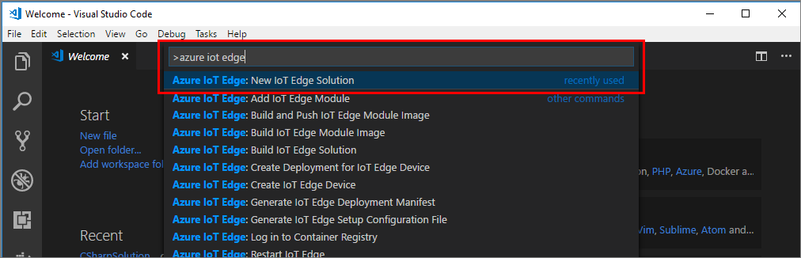
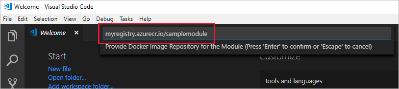
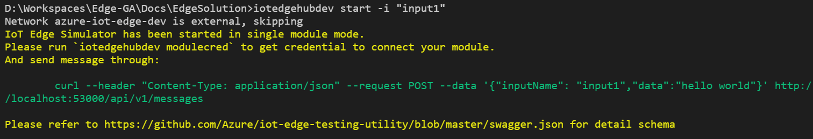
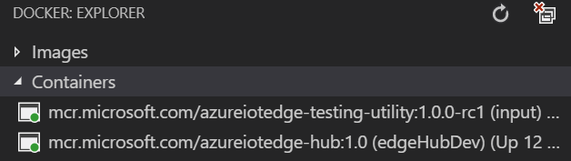
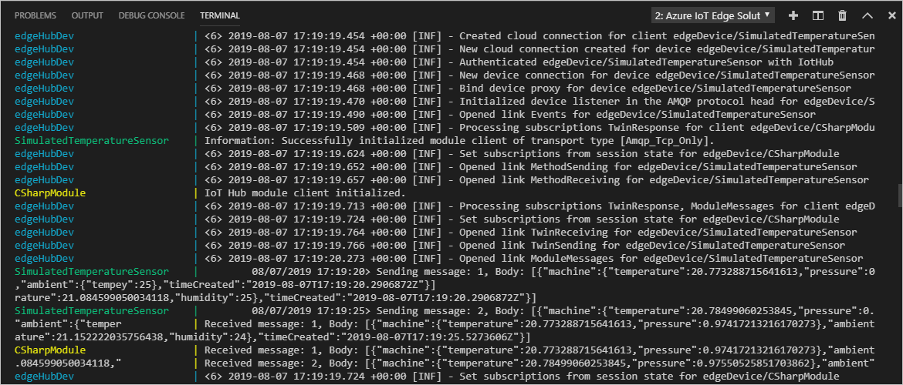

# Use Visual Studio Code to develop and debug modules for Azure IoT Edge

[!INCLUDE [iot-edge-version-all-supported](../../includes/iot-edge-version-all-supported.md)]

You can turn your business logic into modules for Azure IoT Edge. This article shows you how to use Visual Studio Code as the main tool to develop and debug modules.

There are two ways to debug modules written in C#, Node.js, or Java in Visual Studio Code: You can either attach a process in a module container or launch the module code in debug mode. To debug modules written in Python or C, you can only attach to a process in Linux amd64 containers.

If you aren't familiar with the debugging capabilities of Visual Studio Code, read about [Debugging](https://code.visualstudio.com/Docs/editor/debugging).

This article provides instructions for developing and debugging modules in multiple languages for multiple architectures. Currently, Visual Studio Code provides support for modules written in C#, C, Python, Node.js, and Java. The supported device architectures are X64 and ARM32. For more information about supported operating systems, languages, and architectures, see [Language and architecture support](module-development.md#language-and-architecture-support).

>[!NOTE]
>Develop and debugging support for Linux ARM64 devices is in [public preview](https://azure.microsoft.com/support/legal/preview-supplemental-terms/). For more information, see [Develop and debug ARM64 IoT Edge modules in Visual Studio Code (preview)](https://devblogs.microsoft.com/iotdev/develop-and-debug-arm64-iot-edge-modules-in-visual-studio-code-preview).

## Prerequisites

You can use a computer or a virtual machine running Windows, macOS, or Linux as your development machine. On Windows computers you can develop either Windows or Linux modules. To develop Windows modules, use a Windows computer running version 1809/build 17763 or newer. To develop Linux modules, use a Windows computer that meets the [requirements for Docker Desktop](https://docs.docker.com/docker-for-windows/install/#what-to-know-before-you-install).

Install [Visual Studio Code](https://code.visualstudio.com/) first and then add the following extensions:

- [Azure IoT Tools](https://marketplace.visualstudio.com/items?itemName=vsciot-vscode.azure-iot-tools)
- [Docker extension](https://marketplace.visualstudio.com/items?itemName=PeterJausovec.vscode-docker)
- Visual Studio extension(s) specific to the language you're developing in:
  - C#, including Azure Functions: [C# extension](https://marketplace.visualstudio.com/items?itemName=ms-dotnettools.csharp)
  - Python: [Python extension](https://marketplace.visualstudio.com/items?itemName=ms-python.python)
  - Java: [Java Extension Pack for Visual Studio Code](https://marketplace.visualstudio.com/items?itemName=vscjava.vscode-java-pack)
  - C: [C/C++ extension](https://marketplace.visualstudio.com/items?itemName=ms-vscode.cpptools)

You'll also need to install some additional, language-specific tools to develop your module:

- C#, including Azure Functions: [.NET Core 2.1 SDK](https://dotnet.microsoft.com/download/dotnet/2.1)

- Python: [Python](https://www.python.org/downloads/) and [Pip](https://pip.pypa.io/en/stable/installing/#installation) for installing Python packages (typically included with your Python installation).

- Node.js: [Node.js](https://nodejs.org). You'll also want to install [Yeoman](https://www.npmjs.com/package/yo) and the [Azure IoT Edge Node.js Module Generator](https://www.npmjs.com/package/generator-azure-iot-edge-module).

- Java: [Java SE Development Kit 10](/azure/developer/java/fundamentals/java-jdk-long-term-support) and [Maven](https://maven.apache.org/). You'll need to [set the `JAVA_HOME` environment variable](https://docs.oracle.com/cd/E19182-01/820-7851/inst_cli_jdk_javahome_t/) to point to your JDK installation.

To build and deploy your module image, you need Docker to build the module image and a container registry to hold the module image:

- [Docker Community Edition](https://docs.docker.com/install/) on your development machine.

- [Azure Container Registry](../container-registry/index.yml) or [Docker Hub](https://docs.docker.com/docker-hub/repos/#viewing-repository-tags)

    > [!TIP]
    > You can use a local Docker registry for prototype and testing purposes instead of a cloud registry.

Unless you're developing your module in C, you also need the Python-based [Azure IoT EdgeHub Dev Tool](https://pypi.org/project/iotedgehubdev/) in order to set up your local development environment to debug, run, and test your IoT Edge solution. If you haven't already done so, install [Python (2.7/3.6/3.7) and Pip](https://www.python.org/) and then install **iotedgehubdev** by running this command in your terminal.

   ```cmd
   pip install --upgrade iotedgehubdev
   ```
   
> [!NOTE]
> Currently, iotedgehubdev uses a docker-py library that is not compatible with Python 3.8.
>
> If you have multiple Python including pre-installed python 2.7 (for example, on Ubuntu or macOS), make sure you are using the correct `pip` or `pip3` to install **iotedgehubdev**

To test your module on a device, you'll need an active IoT hub with at least one IoT Edge device. To use your computer as an IoT Edge device, follow the steps in the quickstart for [Linux](quickstart-linux.md) or [Windows](quickstart.md). If you are running IoT Edge daemon on your development machine, you might need to stop EdgeHub and EdgeAgent before you move to next step.

## Create a new solution template

The following steps show you how to create an IoT Edge module in your preferred development language (including Azure Functions, written in C#) using Visual Studio Code and the Azure IoT Tools. You start by creating a solution, and then generating the first module in that solution. Each solution can contain multiple modules.

1. Select **View** > **Command Palette**.

1. In the command palette, enter and run the command **Azure IoT Edge: New IoT Edge Solution**.

   

1. Browse to the folder where you want to create the new solution and then select **Select folder**.

1. Enter a name for your solution.

1. Select a module template for your preferred development language to be the first module in the solution.

1. Enter a name for your module. Choose a name that's unique within your container registry.

1. Provide the name of the module's image repository. Visual Studio Code autopopulates the module name with **localhost:5000/<your module name\>**. Replace it with your own registry information. If you use a local Docker registry for testing, then **localhost** is fine. If you use Azure Container Registry, then use the login server from your registry's settings. The login server looks like **_\<registry name\>_.azurecr.io**. Only replace the **localhost:5000** part of the string so that the final result looks like **\<*registry name*\>.azurecr.io/_\<your module name\>_**.

   

Visual Studio Code takes the information you provided, creates an IoT Edge solution, and then loads it in a new window.

There are four items within the solution:

- A **.vscode** folder contains debug configurations.

- A **modules** folder has subfolders for each module.  Within the folder for each module there is a file, **module.json**, that controls how modules are built and deployed.  This file would need to be modified to change the module deployment container registry from localhost to a remote registry. At this point, you only have one module.  But you can add more in the command palette with the command **Azure IoT Edge: Add IoT Edge Module**.

- An **.env** file lists your environment variables. If Azure Container Registry is your registry, you'll have an Azure Container Registry username and password in it.

  > [!NOTE]
  > The environment file is only created if you provide an image repository for the module. If you accepted the localhost defaults to test and debug locally, then you don't need to declare environment variables.

- A **deployment.template.json** file lists your new module along with a sample **SimulatedTemperatureSensor** module that simulates data you can use for testing. For more information about how deployment manifests work, see [Learn how to use deployment manifests to deploy modules and establish routes](module-composition.md).

To see how the simulated temperature module works, view the [SimulatedTemperatureSensor.csproj source code](https://github.com/Azure/iotedge/tree/master/edge-modules/SimulatedTemperatureSensor).

## Add additional modules

To add additional modules to your solution, run the command **Azure IoT Edge: Add IoT Edge Module** from the command palette. You can also right-click the **modules** folder or the `deployment.template.json` file in the Visual Studio Code Explorer view and then select **Add IoT Edge Module**.

## Develop your module

The default module code that comes with the solution is located at the following location:

- Azure Function (C#): **modules > *&lt;your module name&gt;* > *&lt;your module name&gt;*.cs**
- C#: **modules > *&lt;your module name&gt;* > Program.cs**
- Python: **modules > *&lt;your module name&gt;* > main.py**
- Node.js: **modules > *&lt;your module name&gt;* > app.js**
- Java: **modules > *&lt;your module name&gt;* > src > main > java > com > edgemodulemodules > App.java**
- C: **modules > *&lt;your module name&gt;* > main.c**

The module and the deployment.template.json file are set up so that you can build the solution, push it to your container registry, and deploy it to a device to start testing without touching any code. The module is built to simply take input from a source (in this case, the SimulatedTemperatureSensor module that simulates data) and pipe it to IoT Hub.

When you're ready to customize the template with your own code, use the [Azure IoT Hub SDKs](../iot-hub/iot-hub-devguide-sdks.md) to build modules that address the key needs for IoT solutions such as security, device management, and reliability.

## Debug a module without a container (C#, Node.js, Java)

If you're developing in C#, Node.js, or Java, your module requires use of a **ModuleClient** object in the default module code so that it can start, run, and route messages. You'll also use the default input channel **input1** to take action when the module receives messages.

### Set up IoT Edge simulator for IoT Edge solution

On your development machine, you can start an IoT Edge simulator instead of installing the IoT Edge security daemon so that you can run your IoT Edge solution.

1. In device explorer on the left side, right-click on your IoT Edge device ID, and then select **Setup IoT Edge Simulator** to start the simulator with the device connection string.
1. You can see the IoT Edge Simulator has been successfully set up by reading the progress detail in the integrated terminal.

### Set up IoT Edge simulator for single module app

To set up and start the simulator, run the command **Azure IoT Edge: Start IoT Edge Hub Simulator for Single Module** from the Visual Studio Code command palette. When prompted, use the value **input1** from the default module code (or the equivalent value from your code) as the input name for your application. The command triggers the **iotedgehubdev** CLI and then starts the IoT Edge simulator and a testing utility module container. You can see the outputs below in the integrated terminal if the simulator has been started in single module mode successfully. You can also see a `curl` command to help send message through. You will use it later.

   

   You can use the Docker Explorer view in Visual Studio Code to see the module's running status.

   

   The **edgeHubDev** container is the core of the local IoT Edge simulator. It can run on your development machine without the IoT Edge security daemon and provides environment settings for your native module app or module containers. The **input** container exposes REST APIs to help bridge messages to the target input channel on your module.

### Debug module in launch mode

1. Prepare your environment for debugging according to the requirements of your development language, set a breakpoint in your module, and select the debug configuration to use:
   - **C#**
     - In the Visual Studio Code integrated terminal, change the directory to the ***&lt;your module name&gt;*** folder, and then run the following command to build .NET Core application.

       ```cmd
       dotnet build
       ```

     - Open the file `Program.cs` and add a breakpoint.

     - Navigate to the Visual Studio Code Debug view by selecting **View > Debug**. Select the debug configuration ***&lt;your module name&gt;* Local Debug (.NET Core)** from the dropdown.

        > [!NOTE]
        > If your .NET Core `TargetFramework` is not consistent with your program path in `launch.json`, you'll need to manually update the program path in `launch.json` to match the `TargetFramework` in your .csproj file so that Visual Studio Code can successfully launch this program.

   - **Node.js**
     - In the Visual Studio Code integrated terminal, change the directory to the ***&lt;your module name&gt;*** folder, and then run the following command to install Node packages

       ```cmd
       npm install
       ```

     - Open the file `app.js` and add a breakpoint.

     - Navigate to the Visual Studio Code Debug view by selecting **View > Debug**. Select the debug configuration ***&lt;your module name&gt;* Local Debug (Node.js)** from the dropdown.
   - **Java**
     - Open the file `App.java` and add a breakpoint.

     - Navigate to the Visual Studio Code Debug view by selecting **View > Debug**. Select the debug configuration ***&lt;your module name&gt;* Local Debug (Java)** from the dropdown.

1. Click **Start Debugging** or press **F5** to start the debug session.

1. In the Visual Studio Code integrated terminal, run the following command to send a **Hello World** message to your module. This is the command shown in previous steps when you set up IoT Edge simulator.

    ```bash
    curl --header "Content-Type: application/json" --request POST --data '{"inputName": "input1","data":"hello world"}' http://localhost:53000/api/v1/messages
    ```

   > [!NOTE]
   > If you are using Windows, making sure the shell of your Visual Studio Code integrated terminal is **Git Bash** or **WSL Bash**. You cannot run the `curl` command from a PowerShell or command prompt.
   > [!TIP]
   > You can also use [PostMan](https://www.getpostman.com/) or other API tools to send messages through instead of `curl`.

1. In the Visual Studio Code Debug view, you'll see the variables in the left panel.

1. To stop your debugging session, select the Stop button or press **Shift + F5**, and then run **Azure IoT Edge: Stop IoT Edge Simulator** in the command palette to stop the simulator and clean up.

## Debug in attach mode with IoT Edge Simulator (C#, Node.js, Java, Azure Functions)

Your default solution contains two modules, one is a simulated temperature sensor module and the other is the pipe module. The simulated temperature sensor sends messages to the pipe module and then the messages are piped to the IoT Hub. In the module folder you created, there are several Docker files for different container types. Use any of the files that end with the extension **.debug** to build your module for testing.

Currently, debugging in attach mode is supported only as follows:

- C# modules, including those for Azure Functions, support debugging in Linux amd64 containers
- Node.js modules support debugging in Linux amd64 and arm32v7 containers, and Windows amd64 containers
- Java modules support debugging in Linux amd64 and arm32v7 containers

> [!TIP]
> You can switch among options for the default platform for your IoT Edge solution by clicking the item in the Visual Studio Code status bar.

### Set up IoT Edge simulator for IoT Edge solution

In your development machine, you can start an IoT Edge simulator instead of installing the IoT Edge security daemon so that you can run your IoT Edge solution.

1. In device explorer on the left side, right-click on your IoT Edge device ID, and then select **Setup IoT Edge Simulator** to start the simulator with the device connection string.

1. You can see the IoT Edge Simulator has been successfully set up by reading the progress detail in the integrated terminal.

### Build and run container for debugging and debug in attach mode

1. Open your module file (`Program.cs`, `app.js`, `App.java`, or `<your module name>.cs`) and add a breakpoint.

1. In the Visual Studio Code Explorer view, right-click the `deployment.debug.template.json` file for your solution and then select **Build and Run IoT Edge solution in Simulator**. You can watch all the module container logs in the same window. You can also navigate to the Docker view to watch container status.

   

1. Navigate to the Visual Studio Code Debug view and select the debug configuration file for your module. The debug option name should be similar to ***&lt;your module name&gt;* Remote Debug**

1. Select **Start Debugging** or press **F5**. Select the process to attach to.

1. In Visual Studio Code Debug view, you'll see the variables in the left panel.

1. To stop the debugging session, first select the Stop button or press **Shift + F5**, and then select **Azure IoT Edge: Stop IoT Edge Simulator** from the command palette.

> [!NOTE]
> The preceding example shows how to debug IoT Edge modules on containers. It added exposed ports to your module's container `createOptions` settings. After you finish debugging your modules, we recommend you remove these exposed ports for production-ready IoT Edge modules.
>
> For modules written in C#, including Azure Functions, this example is based on the debug version of `Dockerfile.amd64.debug`, which includes the .NET Core command-line debugger (VSDBG) in your container image while building it. After you debug your C# modules, we recommend that you directly use the Dockerfile without VSDBG for production-ready IoT Edge modules.

## Debug a module with the IoT Edge runtime

In each module folder, there are several Docker files for different container types. Use any of the files that end with the extension **.debug** to build your module for testing.

When debugging modules using this method, your modules are running on top of the IoT Edge runtime. The IoT Edge device and your Visual Studio Code can be on the same machine, or more typically, Visual Studio Code is on the development machine and the IoT Edge runtime and modules are running on another physical machine. In order to debug from Visual Studio Code, you must:

- Set up your IoT Edge device, build your IoT Edge module(s) with the **.debug** Dockerfile, and then deploy to the IoT Edge device.
- Expose the IP and port of the module so that the debugger can be attached.
- Update the `launch.json` so that Visual Studio Code can attach to the process in the container on the remote machine. This file is located in the `.vscode` folder in your workspace and updates each time you add a new module that supports debugging.

### Build and deploy your module to the IoT Edge device

1. In Visual Studio Code, open the `deployment.debug.template.json` file, which contains the debug version of your module images with the proper `createOptions` values set.

1. If you're developing your module in Python, follow these steps before proceeding:
   - Open the file `main.py` and add this code after the import section:

      ```python
      import ptvsd
      ptvsd.enable_attach(('0.0.0.0',  5678))
      ```

   - Add the following single line of code to the callback you want to debug:

      ```python
      ptvsd.break_into_debugger()
      ```

     For example, if you want to debug the `receive_message_listener` function, you would insert that line of code as shown below:

      ```python
      def receive_message_listener(client):
          ptvsd.break_into_debugger()
          global RECEIVED_MESSAGES
          while True:
              message = client.receive_message_on_input("input1")   # blocking call
              RECEIVED_MESSAGES += 1
              print("Message received on input1")
              print( "    Data: <<{}>>".format(message.data) )
              print( "    Properties: {}".format(message.custom_properties))
              print( "    Total calls received: {}".format(RECEIVED_MESSAGES))
              print("Forwarding message to output1")
              client.send_message_to_output(message, "output1")
              print("Message successfully forwarded")
      ```

1. In the Visual Studio Code command palette:
   1. Run the command **Azure IoT Edge: Build and Push IoT Edge solution**.

   1. Select the `deployment.debug.template.json` file for your solution.

1. In the **Azure IoT Hub Devices** section of the Visual Studio Code Explorer view:
   1. Right-click an IoT Edge device ID and then select **Create Deployment for Single Device**.

      > [!TIP]
      > To confirm that the device you've chosen is an IoT Edge device, select it to expand the list of modules and verify the presence of **$edgeHub** and **$edgeAgent**. Every IoT Edge device includes these two modules.

   1. Navigate to your solution's **config** folder, select the `deployment.debug.amd64.json` file, and then select **Select Edge Deployment Manifest**.

You'll see the deployment successfully created with a deployment ID in the integrated terminal.

You can check your container status by running the `docker ps` command in the terminal. If your Visual Studio Code and IoT Edge runtime are running on the same machine, you can also check the status in the Visual Studio Code Docker view.

### Expose the IP and port of the module for the debugger

You can skip this section if your modules are running on the same machine as Visual Studio Code, as you are using localhost to attach to the container and already have the correct port settings in the **.debug** Dockerfile, module's container `createOptions` settings, and `launch.json` file. If your modules and Visual Studio Code are running on separate machines, follow the steps for your development language.

- **C#, including Azure Functions**

  [Configure the SSH channel on your development machine and IoT Edge device](https://github.com/OmniSharp/omnisharp-vscode/wiki/Attaching-to-remote-processes) and then edit `launch.json` file to attach.

- **Node.js**

  - Make sure the module on the machine to be debugged is running and ready for debuggers to attach, and that port 9229 is accessible externally. You can verify this by opening `http://<target-machine-IP>:9229/json` on the debugger machine. This URL should show information about the Node.js module to be debugged.
  
  - On your development machine, open Visual Studio Code and then edit `launch.json` so that the address value of the ***&lt;your module name&gt;* Remote Debug (Node.js)** profile (or ***&lt;your module name&gt;* Remote Debug (Node.js in Windows Container)** profile if the module is running as a Windows container) is the IP of the machine being debugged.

- **Java**

  - Build an SSH tunnel to the machine to be debugged by running `ssh -f <username>@<target-machine> -L 5005:127.0.0.1:5005 -N`.
  
  - On your development machine, open Visual Studio Code and edit the ***&lt;your module name&gt;* Remote Debug (Java)** profile in `launch.json` so that you can attach to the target machine. To learn more about editing `launch.json` and debugging Java with Visual Studio Code, see the section on [configuring the debugger](https://code.visualstudio.com/docs/java/java-debugging#_configuration).

- **Python**

  - Make sure that port 5678 on the machine to be debugged is open and accessible.

  - In the code `ptvsd.enable_attach(('0.0.0.0', 5678))` that you earlier inserted into `main.py`, change **0.0.0.0** to the IP address of the machine to be debugged. Build, push, and deploy your IoT Edge module again.

  - On your development machine, open Visual Studio Code and then edit `launch.json` so that the `host` value of the ***&lt;your module name&gt;* Remote Debug (Python)** profile uses the IP address of the target machine instead of `localhost`.

### Debug your module

1. In the Visual Studio Code Debug view, select the debug configuration file for your module. The debug option name should be similar to ***&lt;your module name&gt;* Remote Debug**

1. Open the module file for your development language and add a breakpoint:

   - **Azure Function (C#)**: Add your breakpoint to the file `<your module name>.cs`.
   - **C#**: Add your breakpoint to the file `Program.cs`.
   - **Node.js**: Add your breakpoint to the file `app.js`.
   - **Java**: Add your breakpoint to the file `App.java`.
   - **Python**: Add your breakpoint to the file `main.py`in the callback method where you added the `ptvsd.break_into_debugger()` line.
   - **C**: Add your breakpoint to the file `main.c`.

1. Select **Start Debugging** or select **F5**. Select the process to attach to.

1. In the Visual Studio Code Debug view, you'll see the variables in the left panel.

> [!NOTE]
> The preceding example shows how to debug IoT Edge modules on containers. It added exposed ports to your module's container `createOptions` settings. After you finish debugging your modules, we recommend you remove these exposed ports for production-ready IoT Edge modules.

## Build and debug a module remotely

With recent changes in both the Docker and Moby engines to support SSH connections, and a new setting in Azure IoT Tools that enables injection of environment settings into the Visual Studio Code command palette and Azure IoT Edge terminals, you can now build and debug modules on remote devices.

See this [IoT Developer blog entry](https://devblogs.microsoft.com/iotdev/easily-build-and-debug-iot-edge-modules-on-your-remote-device-with-azure-iot-edge-for-vs-code-1-9-0/) for more information and step-by-step instructions.

## Next steps

After you've built your module, learn how to [deploy Azure IoT Edge modules from Visual Studio Code](how-to-deploy-modules-vscode.md).

To develop modules for your IoT Edge devices, [Understand and use Azure IoT Hub SDKs](../iot-hub/iot-hub-devguide-sdks.md).