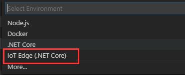
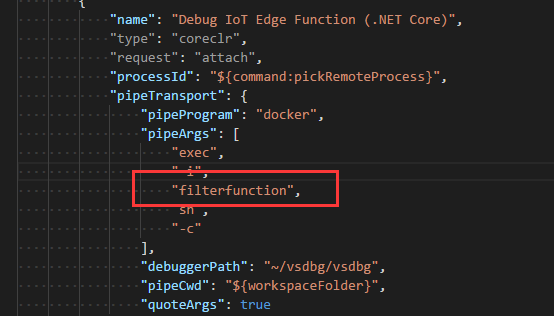
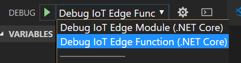
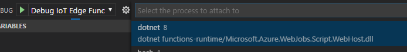

# Use Visual Studio Code to debug Azure Functions with Azure IoT Edge

This article provides detailed instructions for using [Visual Studio Code](https://code.visualstudio.com/) as the main development tool to debug your Azure Functions on IoT Edge.

## Prerequisites
This tutorial assumes that you are using a computer or virtual machine running Windows or Linux as your development machine. Your IoT Edge device could be another physical device or you can simulate your IoT Edge device on your development machine.

Make sure you have completed following tutorials before you start this guidance.
- [Use Visual Studio Code to develop and deploy Azure Functions to Azure IoT Edge](how-to-vscode-develop-azure-function.md)

After finish the preceding tutorial, you should have the following items ready,
- A local Docker registry running on your development machine. It is suggested to use a local Docker registry for prototype and testing purpose.
- The `run.csx` file with latest filter function code.
- An updated `deployment.json` file for your sensor module and filter function module.
- An Edge runtime running on your development machine.

## Build your IoT Edge module for debugging purpose
1. To start debugging, you need to use the **dockerfile.debug** to rebuild your docker image and deploy your Edge solution again. In VS Code explorer, click the Docker folder to open it. Then click the `linux-x64` folder, right-click the **Dockerfile.debug**, and click **Build IoT Edge module Docker image**.

    

2. In the **Select Folder** window, navigate to the **FilterFunction** project and click **Select Folder as EXE_DIR**.
3. In the pop-up text box at the top of the VS Code window, enter the image name. For example: `<your container registry address>/filterfunction:latest`. If you are deploying to local registry, it should be `localhost:5000/filterfunction:latest`.

    

4. Push the image to your Docker repository. Use the **Edge: Push IoT Edge module Docker image** command and enter the image URL in the pop-up text box at the top of the VS Code window. Use the same image URL you used in above step.
5. You can reuse the `deployment.json` to redeploy. In command Palette, type and select **Edge: Restart Edge** to get your filter function running with the debug version.

## Start debugging in VS Code
1. Go to VS Code debug window. Press **F5** and select **IoT Edge(.Net Core)**

    

2. In `launch.json`, navigate to **Debug IoT Edge Function (.NET Core)** section and fill in the `<container_name>`under `pipeArgs`.It should be `filterfunction` in this tutorial.

    

3. Navigate to run.csx. Add a breakpoint in the function.
4. Navigate to Debug window (Ctrl + Shift + D), choose **Debug IoT Edge Function (.NET Core)** from the dropdown list. 

    

5. Click Start Debugging button or press **F5**, and select the process to attach to.

    

6. In VS Code Debug window, you can see the variables in left panel. 

> [!NOTE]
> Above example shows how to debugging .Net Core IoT Edge Function on containers. It's based on the debug version of the `Dockerfile.debug`, which includes VSDBG(the .NET Core command-line debugger) in your container image while building it. We recommend you directly use or customize the `Dockerfile` without VSDBG for production-ready IoT Edge function after you finish debugging your C# function.

## Next steps

In this tutorial, you created an Azure Function and deployed it to IoT Edge for debugging purpose, and started debugging it in VS Code. You can continue on to either of the following tutorials to learn about other scenarios when developing Azure IoT Edge in VS Code. 

> [!div class="nextstepaction"]
> [Develop and deploy C# module in VS Code](how-to-vscode-develop-csharp-module.md)

