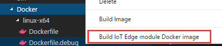
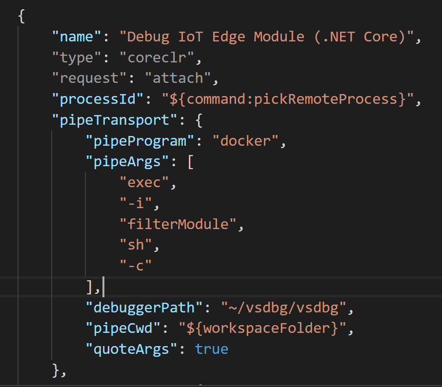
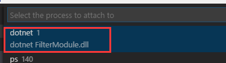

# Use Visual Studio Code to debug a C# module with Azure IoT Edge
This article provides detailed instructions for using [Visual Studio Code](https://code.visualstudio.com/) as the main development tool to debug your Azure IoT Edge modules.

## Prerequisites
This tutorial assumes that you are using a computer or virtual machine running Windows or Linux as your development machine. Your IoT Edge device can be another physical device, or you can simulate your IoT Edge device on your development machine.

Before you start this guidance, complete the following tutorial:
- [Use Visual Studio Code to develop C# module with Azure IoT Edge](how-to-vscode-develop-csharp-module.md)

After you finish the preceding tutorial, you should have the following items ready:
- A local Docker registry running on your development machine. This is for prototyping and testing purposes.
- The `Program.cs` file, with the latest filter module code.
- An updated `deployment.json` file for your sensor and filter modules.
- An IoT Edge runtime that runs on your development machine.

## Build your IoT Edge module for debugging
1. To start debugging, use **dockerfile.debug** to rebuild your Docker image and deploy your IoT Edge solution again. In Visual Studio Code Explorer, select the Docker folder to open it. Then select the **linux-x64** folder, right-click **Dockerfile.debug**, and select **Build IoT Edge module Docker image**.

    

3. In the **Select Folder** window, either browse to or enter **./bin/Debug/netcoreapp2.0/publish**. Then select **Select Folder as EXE_DIR**.
4. In the pop-up text box at the top of the VS Code window, enter the image name. For example: `<your container registry address>/filtermodule:latest`. If you are deploying to local registry, it should be: `localhost:5000/filtermodule:latest`.
5. Push the image to your Docker repository. Use the **Edge: Push IoT Edge module Docker image** command, and enter the image URL in the pop-up text box at the top of the VS Code window. Use the same image URL you used in the previous step.
6. You can reuse the `deployment.json` to redeploy. In the command palette, type and select **Edge: Restart Edge** to get your filter module running with the debug version.

## Start debugging in VS Code
1. Go to the VS Code debug window. Press **F5**, and select **IoT Edge(.NET Core)**.

    

2. In `launch.json`, browse to the **Debug IoT Edge Custom Module (.NET Core)** section. Under **pipeArgs**, fill in the `<container_name>`. It should be `filtermodule` in this tutorial.

    

3. Browse to **Program.cs**. Add a breakpoint in the `method static async Task<MessageResponse> FilterModule(Message message, object userContext)`.
4. Press **F5** again, and select the process to attach to. In this tutorial, the process name should be `FilterModule.dll`.

    

5. In the VS Code debug window, you can see the variables in left panel. 

> [!NOTE]
> The preceding example shows how to debug .NET Core IoT Edge modules on containers. It's based on the debug version of the `Dockerfile.debug`, which includes VSDBG (the .NET Core command-line debugger) in your container image while building it. After you finish debugging your C# modules, we recommend you directly use or customize `Dockerfile` without VSDBG for production-ready IoT Edge modules.

## Next steps

In this tutorial, you created an IoT Edge module and deployed it for debugging. You started debugging it in VS Code. To learn about other scenarios when you are developing Azure IoT Edge in VS Code, see: 

> [!div class="nextstepaction"]
> [Develop and deploy C# module in VS Code](how-to-vscode-develop-csharp-module.md)
