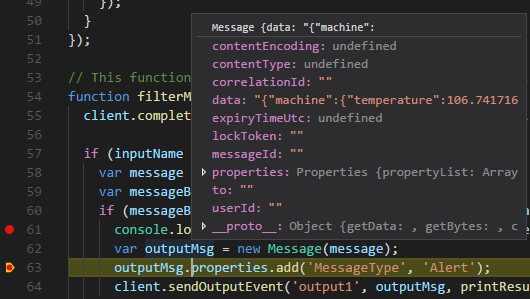

# Use Visual Studio Code to debug a Node.js module with Azure IoT Edge
This article provides detailed instructions for using [Visual Studio Code](https://code.visualstudio.com/) as the main development tool to debug your Azure IoT Edge modules.

## Prerequisites
This article assumes that you are using a computer or virtual machine running Windows or Linux as your development machine. Your IoT Edge device can be another physical device, or you can simulate your IoT Edge device on your development machine.

Before following the guidance in this article, complete the steps in  [Develop and deploy a Python IoT Edge module to your simulated device](tutorial-node-module.md). After that, you should have the following items ready:
- An IoT Edge solution project workspace with a Node.js module subfolder in it.
- The `app.js` file, with the latest module code.
- An Edge runtime running on your development machine.

## Configure the deployment manifest 
1. Replace the module's createOptions in **deployment.template.json** with below content and save this file: 
    ```json
    "createOptions": "{\"Env\":[\"DEBUG_OPTION=--inspect=0.0.0.0:9229\"],\"ExposedPorts\":{\"9229/tcp\":{}},\"HostConfig\":{\"PortBindings\":{\"9229/tcp\":[{\"HostPort\":\"9229\"}]}}}" 
    ```

2. Right click on the **deployment.template.json**, select **Generate IoT Edge Deployment Manifest** (if you have already built the solution and module code has not been changed since then) or **Build IoT Edge Solution** (if you have not built the solution before or module code has been changed since last build).

3. Right click on the IoT Edge device in the device list, select **Create Deployment for Edge Device**.

4. Choose **deployment.json** under **config** folder 

5. Restart Edge runtime by entering **Edge: Restart Edge** in command palette.

## Start debugging Node.js module in VS Code
1. VS Code keeps debugging configuration information in a `launch.json` file located in a `.vscode` folder in your workspace. This `launch.json` file has been generated when creating a new IoT Edge solution. And it will be updated each time you add a new module that support debugging. Navigate to the debug view and select the corresponding debug configuration file.
    

2. Navigate to `app.js`. Add a breakpoint in this file.

3. Click Start Debugging button or press **F5**, and select the process to attach to.
    > [!NOTE]
    > If you are using Windows container, please choose the **(Node.js in Windows Container)** launch config 

4. In VS Code Debug view, you can see the variables in left panel. 

    

## Next steps

[Use Visual Studio Code to debug Azure Functions with Azure IoT Edge](how-to-vscode-debug-azure-function.md)

