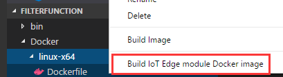
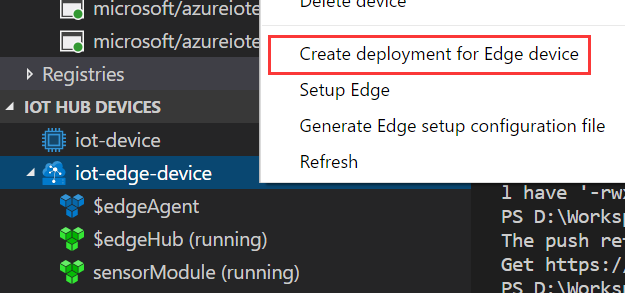
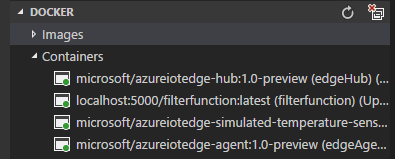
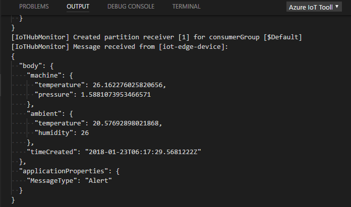

# Use Visual Studio Code to develop and deploy Azure Functions to Azure IoT Edge

This article provides detailed instructions for using [Visual Studio Code](https://code.visualstudio.com/) as the main development tool to develop and deploy Azure Functions on IoT Edge. 

## Prerequisites
This article assumes that you are using a computer or virtual machine running Windows or Linux as your development machine. Your IoT Edge device could be another physical device or you can simulate your IoT Edge device on your development machine.

Make sure you have completed following tutorials before you start this guidance.
- Deploy Azure IoT Edge on a simulated device in [Windows](https://docs.microsoft.com/azure/iot-edge/tutorial-simulate-device-windows) or [Linux](https://docs.microsoft.com/azure/iot-edge/tutorial-simulate-device-linux)
- [Deploy Azure Functions](https://docs.microsoft.com/azure/iot-edge/tutorial-deploy-function)

Here is a checklist that shows the items you should have after you finish preceding tutorials.

- [Visual Studio Code](https://code.visualstudio.com/). 
- [Azure IoT Edge extension for Visual Studio Code](https://marketplace.visualstudio.com/items?itemName=vsciot-vscode.azure-iot-edge). 
- [C# for Visual Studio Code (powered by OmniSharp) extension](https://marketplace.visualstudio.com/items?itemName=ms-vscode.csharp). 
- [Docker](https://docs.docker.com/engine/installation/)
- [.NET Core 2.0 SDK](https://www.microsoft.com/net/core#windowscmd). 
- [Python 2.7](https://www.python.org/downloads/)
- [IoT Edge control script](https://pypi.python.org/pypi/azure-iot-edge-runtime-ctl)
- AzureIoTEdgeFunction template (`dotnet new -i Microsoft.Azure.IoT.Edge.Function`)
- An active IoT hub with at least an IoT Edge device.

It is also suggested to install [Docker support for VS Code](https://marketplace.visualstudio.com/items?itemName=PeterJausovec.vscode-docker) to better manage your module images and containers.

> [!NOTE]
> Currently, Azure Functions on IoT Edge only supports C#.

## Deploy Azure IoT Functions in VS Code
In the tutorial [Deploy Azure Functions](https://docs.microsoft.com/azure/iot-edge/tutorial-deploy-function), you update, build, and publish your function module images in VS Code and then visit Azure portal to deploy Azure Functions. This section introduces how to use VS Code to deploy and monitor your Azure Functions.

### Start a local docker registry
You can use any Docker-compatible registry for this article. Two popular Docker registry services available in the cloud are [Azure Container Registry](https://docs.microsoft.com/azure/container-registry/) and [Docker Hub](https://docs.docker.com/docker-hub/repos/#viewing-repository-tags). This section uses a [local Docker registry](https://docs.docker.com/registry/deploying/), which is easier for testing purpose during your early development.
In VS Code **integrated terminal**(Ctrl + `), Run following commands to start a local registry.  

```cmd/sh
docker run -d -p 5000:5000 --name registry registry:2 
```

> [!NOTE]
> Above example shows registry configurations that are only appropriate for testing. A production-ready registry must be protected by TLS and should ideally use an access-control mechanism. We recommend you use [Azure Container Registry](https://docs.microsoft.com/azure/container-registry/) or [Docker Hub](https://docs.docker.com/docker-hub/repos/#viewing-repository-tags) to deploy production-ready IoT Edge modules.

### Create a function project
The following steps show you how to create an IoT Edge module based on .NET core 2.0 using Visual Studio Code and the Azure IoT Edge extension. If you have completed this section in a previous tutorial, you can safely skip this section.

1. In Visual Studio Code, select **View** > **Integrated Terminal** to open the VS Code integrated terminal.
2. To install (or update) the **AzureIoTEdgeFunction** template in dotnet, run the following command in the integrated terminal:

   ```cmd/sh
   dotnet new -i Microsoft.Azure.IoT.Edge.Function
   ```
3. Create a project for the new module. The following command creates the project folder, **FilterFunction**, in the current working folder:

   ```cmd/sh
   dotnet new aziotedgefunction -n FilterFunction
   ```
 
4. Select **File > Open Folder**, then browse to the **FilterFunction** folder and open the project in VS Code.
5. Browse to the **FilterFunction**  folder and click **Select Folder** to open the project in VS Code.
6. In VS Code explorer, expand the **EdgeHubTrigger-Csharp** folder, then open the **run.csx** file.
7. Replace the contents of the file with the following code:

   ```csharp
   #r "Microsoft.Azure.Devices.Client"
   #r "Newtonsoft.Json"

   using System.IO;
   using Microsoft.Azure.Devices.Client;
   using Newtonsoft.Json;

   // Filter messages based on the temperature value in the body of the message and the temperature threshold value.
   public static async Task Run(Message messageReceived, IAsyncCollector<Message> output, TraceWriter log)
   {
        const int temperatureThreshold = 25;
        byte[] messageBytes = messageReceived.GetBytes();
        var messageString = System.Text.Encoding.UTF8.GetString(messageBytes);

        if (!string.IsNullOrEmpty(messageString))
        {
            // Get the body of the message and deserialize it
            var messageBody = JsonConvert.DeserializeObject<MessageBody>(messageString);

            if (messageBody != null && messageBody.machine.temperature > temperatureThreshold)
            {
                // Send the message to the output as the temperature value is greater than the threashold
                var filteredMessage = new Message(messageBytes);
                // Copy the properties of the original message into the new Message object
                foreach (KeyValuePair<string, string> prop in messageReceived.Properties)
                {
                    filteredMessage.Properties.Add(prop.Key, prop.Value);
                }
                // Add a new property to the message to indicate it is an alert
                filteredMessage.Properties.Add("MessageType", "Alert");
                // Send the message        
                await output.AddAsync(filteredMessage);
                log.Info("Received and transferred a message with temperature above the threshold");
            }
        }
    }

    //Define the expected schema for the body of incoming messages
    class MessageBody
    {
        public Machine machine {get;set;}
        public Ambient ambient {get; set;}
        public string timeCreated {get; set;}
    }
    class Machine
    {
       public double temperature {get; set;}
       public double pressure {get; set;}         
    }
    class Ambient
    {
       public double temperature {get; set;}
       public int humidity {get; set;}         
    }
   ```

8. Save the file.

### Create a Docker image and publish it to your registry

1. In VS Code explorer, expand the **Docker** folder. Then expand the folder for your container platform, either **linux-x64** or **windows-nano**.
2. Right-click the **Dockerfile** file and click **Build IoT Edge module Docker image**. 

    

3. Navigate to the **FilterFunction** project folder and click **Select Folder as EXE_DIR**. 
4. In the pop-up text box at the top of the VS Code window, enter the image name. For example: `<your container registry address>/filterfunction:latest`. If you are deploying to local registry, it should be `localhost:5000/filterfunction:latest`.
5. Push the image to your Docker repository. Use the **Edge: Push IoT Edge module Docker image** command and enter the image URL in the pop-up text box at the top of the VS Code window. Use the same image URL you used in above step.
    

### Deploy your function to IoT Edge

1. Open the `deployment.json` file, replace **modules** section with below content:
   ```json
   "tempSensor": {
      "version": "1.0",
      "type": "docker",
      "status": "running",
      "restartPolicy": "always",
      "settings": {
         "image": "microsoft/azureiotedge-simulated-temperature-sensor:1.0-preview",
         "createOptions": ""
      }
   },
   "filterfunction": {
      "version": "1.0",
      "type": "docker",
      "status": "running",
      "restartPolicy": "always",
      "settings": {
         "image": "localhost:5000/filterfunction:latest",
         "createOptions": ""
      }
   }
   ```

2. Replace the **routes** section with below content:
   ```json
       "routes":{
           "sensorToFilter":"FROM /messages/modules/tempSensor/outputs/temperatureOutput INTO BrokeredEndpoint(\"/modules/filterfunction/inputs/input1\")",
           "filterToIoTHub":"FROM /messages/modules/filterfunction/outputs/* INTO $upstream"
       }
   ```
   > [!NOTE]
   > Declarative rules in the runtime define where those messages flow. In this article, you need two routes. The first route transports messages from the temperature sensor to the filter function via the "input1" endpoint, which is the endpoint that you configured with the FilterMessages handler. The second route transports messages from the filter function to IoT Hub. In this route, upstream is a special destination that tells Edge Hub to send messages to IoT Hub.

3. Save this file.
4. In Command Palette, select **Edge: Create deployment for Edge device**. Then select your IoT Edge device ID to create a deployment. Or right-click the device ID in the device list and select **Create deployment for Edge device**.

    

5. Select the `deployment.json` you updated. In the output window, you can see corresponding outputs for your deployment.
6. Start your Edge runtime in Command Palette. **Edge: Start Edge**
7. You can see your IoT Edge runtime start running in the Docker explorer with the simulated sensor and filter function.

    

8. Right-click your Edge device ID, and you can monitor D2C messages in VS Code.

    


## Next steps

[Debug Azure Functions in VS Code](how-to-vscode-debug-azure-function.md)
