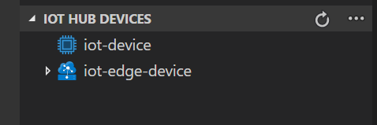
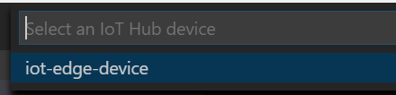
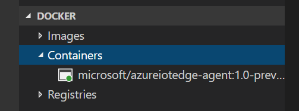
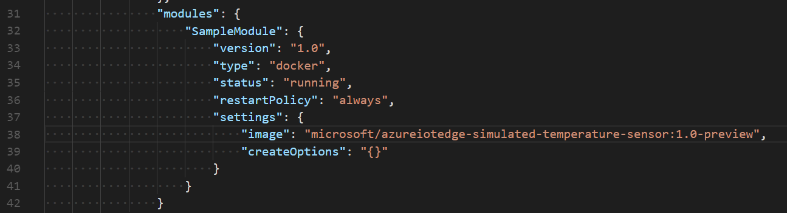
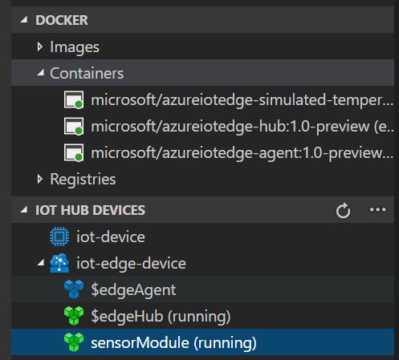
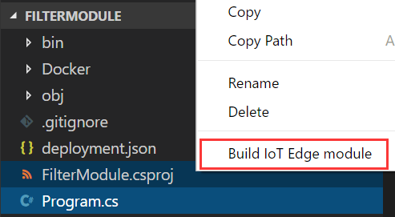
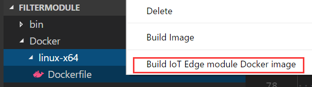
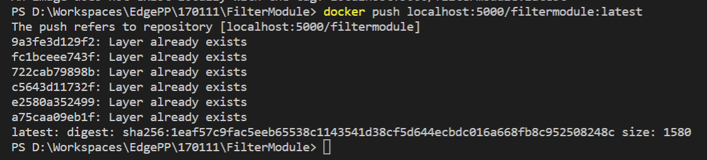
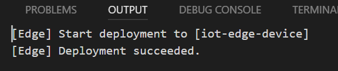
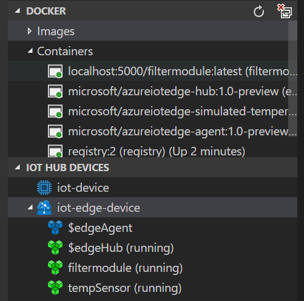

# Use Visual Studio Code to develop a C# module with Azure IoT Edge
This article provides detailed instructions for using [Visual Studio Code](https://code.visualstudio.com/) as the main development tool to develop and deploy your Azure IoT Edge modules. 

## Prerequisites
This tutorial assumes that you are using a computer or virtual machine running Windows or Linux as your development machine. Your IoT Edge device can be another physical device, or you can simulate your IoT Edge device on your development machine.

Before you start this guidance, complete the following tutorials:
- Deploy Azure IoT Edge on a simulated device in [Windows](https://docs.microsoft.com/azure/iot-edge/tutorial-simulate-device-windows) or [Linux](https://docs.microsoft.com/azure/iot-edge/tutorial-simulate-device-linux)
- [Develop and deploy a C# IoT Edge module to your simulated device](https://docs.microsoft.com/azure/iot-edge/tutorial-csharp-module)

Here is a checklist that shows the items you should have after you finish the preceding tutorials:

- [Visual Studio Code](https://code.visualstudio.com/) 
- [Azure IoT Edge extension for Visual Studio Code](https://marketplace.visualstudio.com/items?itemName=vsciot-vscode.azure-iot-edge) 
- [C# for Visual Studio Code (powered by OmniSharp) extension](https://marketplace.visualstudio.com/items?itemName=ms-vscode.csharp) 
- [Docker](https://docs.docker.com/engine/installation/)
- [.NET Core 2.0 SDK](https://www.microsoft.com/net/core#windowscmd) 
- [Python 2.7](https://www.python.org/downloads/)
- [IoT Edge control script](https://pypi.python.org/pypi/azure-iot-edge-runtime-ctl)
- AzureIoTEdgeModule template (`dotnet new -i Microsoft.Azure.IoT.Edge.Module`)
- An active IoT hub with at least an IoT Edge device

It is also helpful to install [Docker support for VS Code](https://marketplace.visualstudio.com/items?itemName=PeterJausovec.vscode-docker) to better manage your module images and containers.

## Deploy an Azure IoT Edge module in VS Code

### List your IoT hub devices
There are two ways to list your IoT hub devices in VS Code. You can choose either way to continue.

#### Sign in to your Azure account in VS Code, and choose your IoT hub
1. In the command palette (F1 or Ctrl + Shift + P), type and select **Azure: Sign in**. Then select **Copy & Open**. Paste (Ctrl + V) the code in your browser, and select **Continue**. Then sign in with your Azure account. You can see your account info in the VS Code status bar.
2. In the command palette, type and select **IoT: Select IoT Hub**. First, select the subscription where you created your IoT hub in the previous tutorial. Then, choose the IoT hub that contains the IoT Edge device.

    

#### Set the IoT hub connection string
In the command palette, type and select **IoT: Set IoT Hub Connection String**. Make sure you paste the connecting string under policy **iothubowner**. (You can find it in the shared access policies of your IoT hub in the Azure portal.)
 
You can see the device list in IoT Hub Devices Explorer, in the side bar on the left.

### Start your IoT Edge runtime and deploy a module
Install and start the Azure IoT Edge runtime on your device. Deploy a simulated sensor module that sends telemetry data to Azure IoT Hub.
1. In Command Palette, select **Edge: Setup Edge** and choose your IoT Edge device ID. Alternatively, right-click the IoT Edge device ID in **Device List**, and select **Setup Edge**.

    

2. In the command palette, select **Edge: Start Edge** to start your IoT Edge runtime. You can see corresponding outputs in the integrated terminal.

    

3. Check the IoT Edge runtime status in the Docker Explorer. Green means it's running, and your IoT Edge runtime started successfully. Your computer now simulates an IoT Edge device.

    

4. Simulate a sensor that keeps sending messages to your IoT Edge device. In the command palette, type and select **Edge: Generate Edge configuration file**. Select a folder to create this file. In the deployment.json file that is generated, replace the content `<registry>/<image>:<tag>` with `microsoft/azureiotedge-simulated-temperature-sensor:1.0-preview`, and save the file.

    

5. Select **Edge: Create deployment for Edge device**, and choose the IoT Edge device ID to create a new deployment. Alternatively, you can right-click the IoT Edge device ID in the device list, and select **Create deployment for Edge device**. 

6. You should see your IoT Edge start running in the Docker Explorer with the simulated sensor. Right-click the container in Docker Explorer. You can watch Docker logs for each module. Also, you can view the module list in the device list.

    

7. Right-click your IoT Edge device ID, and you can monitor D2C messages in VS Code.
8. To stop your IoT Edge runtime and the sensor module, type and select **Edge: Stop Edge** in the command palette.

## Develop and deploy a C# module in VS Code
In the tutorial [Develop a C# module](https://docs.microsoft.com/azure/iot-edge/tutorial-csharp-module), you update, build, and publish your module image in VS Code. Then you go to the Azure portal to deploy your C# module. This section introduces how to use VS Code to deploy and monitor your C# module.

### Start a local Docker registry
You can use any Docker-compatible registry for this tutorial. Two popular Docker registry services available in the cloud are [Azure Container Registry](https://docs.microsoft.com/azure/container-registry/) and [Docker Hub](https://docs.docker.com/docker-hub/repos/#viewing-repository-tags). This section uses a [local Docker registry](https://docs.docker.com/registry/deploying/), which is easier for testing during your early development.
In the VS Code **integrated terminal** (Ctrl + `), run the following command to start a local registry:  

```cmd/sh
docker run -d -p 5000:5000 --name registry registry:2 
```

> [!NOTE]
> This example shows registry configurations that are only appropriate for testing. A production-ready registry must be protected by TLS, and should ideally use an access-control mechanism. We recommend you use [Azure Container Registry](https://docs.microsoft.com/azure/container-registry/) or [Docker Hub](https://docs.docker.com/docker-hub/repos/#viewing-repository-tags) to deploy production-ready IoT Edge modules.

### Create an IoT Edge module project
The following steps show you how to create an IoT Edge module based on .NET Core 2.0, by using Visual Studio Code and the Azure IoT Edge extension. If you have completed this section in the previous tutorial, you can safely skip this section.
1. In Visual Studio Code, select **View** > **Integrated Terminal** to open the VS Code integrated terminal.
3. In the integrated terminal, enter the following command to install (or update) the **AzureIoTEdgeModule** template in dotnet:

    ```cmd/sh
    dotnet new -i Microsoft.Azure.IoT.Edge.Module
    ```

2. Create a project for the new module. The following command creates the project folder, **FilterModule**, in the current working folder:

    ```cmd/sh
    dotnet new aziotedgemodule -n FilterModule
    ```
 
3. Select  **File** > **Open Folder**.
4. Browse to the **FilterModule**  folder, and click **Select Folder** to open the project in VS Code.
5. In VS Code Explorer, select **Program.cs** to open it. At the top of **program.cs**, include the following namespaces:
   ```csharp
   using Microsoft.Azure.Devices.Shared;
   using System.Collections.Generic;  
   using Newtonsoft.Json;
   ```

6. Add the `temperatureThreshold` variable to the **Program** class. This variable sets the value that the measured temperature must exceed in order for the data to be sent to IoT Hub. 

   ```csharp
   static int temperatureThreshold { get; set; } = 25;
   ```

7. Add the `MessageBody`, `Machine`, and `Ambient` classes to the **Program** class. These classes define the expected schema for the body of incoming messages.

    ```csharp
    class MessageBody
    {
        public Machine machine {get;set;}
        public Ambient ambient {get; set;}
        public string timeCreated {get; set;}
    }
    class Machine
    {
       public double temperature {get; set;}
       public double pressure {get; set;}         
    }
    class Ambient
    {
       public double temperature {get; set;}
       public int humidity {get; set;}         
    }
    ```

8. In the **Init** method, the code creates and configures a **DeviceClient** object. This object allows the module to  connect to the local IoT Edge runtime to send and receive messages. The IoT Edge runtime supplies to the module the connection string used in the **Init** method. After creating the **DeviceClient** object, the code registers a callback for receiving messages from the IoT Edge hub via the **input1** endpoint. Replace the `SetInputMessageHandlerAsync` method with a new one, and add a `SetDesiredPropertyUpdateCallbackAsync` method for desired properties updates. To make this change, replace the last line of the **Init** method with the following code:

    ```csharp
    // Register callback to be called when a message is received by the module
    // await ioTHubModuleClient.SetImputMessageHandlerAsync("input1", PipeMessage, iotHubModuleClient);

    // Attach callback for Twin desired properties updates
    await ioTHubModuleClient.SetDesiredPropertyUpdateCallbackAsync(onDesiredPropertiesUpdate, null);

    // Register callback to be called when a message is received by the module
    await ioTHubModuleClient.SetInputMessageHandlerAsync("input1", FilterMessages, ioTHubModuleClient);
    ```

9. Add the `onDesiredPropertiesUpdate` method to the **Program** class. This method receives updates on the desired properties from the module twin, and updates the **temperatureThreshold** variable to match. All modules have their own module twin, which lets you configure the code running inside a module directly from the cloud.

    ```csharp
    static Task onDesiredPropertiesUpdate(TwinCollection desiredProperties, object userContext)
    {
        try
        {
            Console.WriteLine("Desired property change:");
            Console.WriteLine(JsonConvert.SerializeObject(desiredProperties));

            if (desiredProperties["TemperatureThreshold"]!=null)
                temperatureThreshold = desiredProperties["TemperatureThreshold"];

        }
        catch (AggregateException ex)
        {
            foreach (Exception exception in ex.InnerExceptions)
            {
                Console.WriteLine();
                Console.WriteLine("Error when receiving desired property: {0}", exception);
            }
        }
        catch (Exception ex)
        {
            Console.WriteLine();
            Console.WriteLine("Error when receiving desired property: {0}", ex.Message);
        }
        return Task.CompletedTask;
    }
    ```

10. Replace the `PipeMessage` method with the `FilterMessages` method. This method is called whenever the module receives a message from IoT Edge Hub. It filters out messages that report temperatures below the temperature threshold set via the module twin. It also adds the **MessageType** property to the message with the value set to **Alert**. 

    ```csharp
    static async Task<MessageResponse> FilterMessages(Message message, object userContext)
    {
        int counterValue = Interlocked.Increment(ref counter);

        try {
            DeviceClient deviceClient = (DeviceClient)userContext;

            byte[] messageBytes = message.GetBytes();
            string messageString = Encoding.UTF8.GetString(messageBytes);
            Console.WriteLine($"Received message {counterValue}: [{messageString}]");

            // Get message body
            var messageBody = JsonConvert.DeserializeObject<MessageBody>(messageString);

            if (messageBody != null && messageBody.machine.temperature > temperatureThreshold)
            {
                Console.WriteLine($"Machine temperature {messageBody.machine.temperature} " +
                    $"exceeds threshold {temperatureThreshold}");
                var filteredMessage = new Message(messageBytes);
                foreach (KeyValuePair<string, string> prop in message.Properties)
                {
                    filteredMessage.Properties.Add(prop.Key, prop.Value);
                }

                filteredMessage.Properties.Add("MessageType", "Alert");
                await deviceClient.SendEventAsync("output1", filteredMessage);
            }

            // Indicate that the message treatment is completed
            return MessageResponse.Completed;
        }
        catch (AggregateException ex)
        {
            foreach (Exception exception in ex.InnerExceptions)
            {
                Console.WriteLine();
                Console.WriteLine("Error in sample: {0}", exception);
            }
            // Indicate that the message treatment is not completed
            DeviceClient deviceClient = (DeviceClient)userContext;
            return MessageResponse.Abandoned;
        }
        catch (Exception ex)
        {
            Console.WriteLine();
            Console.WriteLine("Error in sample: {0}", ex.Message);
            // Indicate that the message treatment is not completed
            DeviceClient deviceClient = (DeviceClient)userContext;
            return MessageResponse.Abandoned;
        }
    }
    ```

11. To build the project, right-click the **FilterModule.csproj** file in Explorer, and select **Build IoT Edge module**. This process compiles the module, and exports the binary and its dependencies into a folder that is used to create a Docker image. 

    

### Create a Docker image and publish it to your registry

1. In VS Code Explorer, expand the **Docker** folder. Then expand the folder for your container platform, either **linux-x64** or **windows-nano**.
2. Right-click the **Dockerfile** file, and select **Build IoT Edge module Docker image**. 

    

3. In the **Select Folder** window, either browse to or enter `./bin/Debug/netcoreapp2.0/publish`. Select **Select Folder as EXE_DIR**.
4. In the pop-up text box at the top of the VS Code window, enter the image name. For example: `<your container registry address>/filtermodule:latest`. If you are deploying to local registry, it should be `localhost:5000/filtermodule:latest`.
5. Push the image to your Docker repository. Use the **Edge: Push IoT Edge module Docker image** command, and enter the image URL in the pop-up text box at the top of the VS Code window. Use the same image URL you used in the preceding step. Check the console log to make sure the image has been successfully pushed.

    
    

### Deploy your IoT Edge modules

1. Open the `deployment.json` file, and replace the **modules** section with the following:
    ```json
    "tempSensor": {
        "version": "1.0",
        "type": "docker",
        "status": "running",
        "restartPolicy": "always",
        "settings": {
            "image": "microsoft/azureiotedge-simulated-temperature-sensor:1.0-preview",
            "createOptions": ""
        }
    },
    "filtermodule": {
        "version": "1.0",
        "type": "docker",
        "status": "running",
        "restartPolicy": "always",
        "settings": {
            "image": "localhost:5000/filtermodule:latest",
            "createOptions": ""
        }
    }
    ```

2. Replace the **routes** section with the following:
    ```json
    "sensorToFilter": "FROM /messages/modules/tempSensor/outputs/temperatureOutput INTO BrokeredEndpoint(\"/modules/filtermodule/inputs/input1\")",
    "filterToIoTHub": "FROM /messages/modules/filtermodule/outputs/output1 INTO $upstream"
    ```
   > [!NOTE]
   > Declarative rules in the runtime define where those messages flow. In this tutorial, you need two routes. The first route transports messages from the temperature sensor to the filter module via the "input1" endpoint. This is the endpoint that you configured with the FilterMessages handler. The second route transports messages from the filter module to IoT Hub. In this route, upstream is a special destination that tells IoT Edge Hub to send messages to IoT Hub.

3. Save this file.
4. In the command palette, select **Edge: Create deployment for Edge device**. Then select your IoT Edge device ID to create a deployment. Or, right-click the device ID in the device list, and select **Create deployment for Edge device**.

    

5. Select the `deployment.json` you updated. In the output window, you can see corresponding outputs for your deployment.

    

6. Start your IoT Edge runtime in the command palette (select **Edge: Start Edge**).
7. You can see your IoT Edge runtime start running in the Docker Explorer, with the simulated sensor and filter module.

    

8. Right-click your IoT Edge device ID, and you can monitor D2C messages in VS Code.


## Next steps

In this tutorial, you created an IoT Edge module, and deployed it to an IoT Edge device in VS Code. To learn about other scenarios when you are developing Azure IoT Edge in VS Code, see the following tutorial:

> [!div class="nextstepaction"]
> [Debug C# module in VS Code](how-to-vscode-debug-csharp-module.md)
