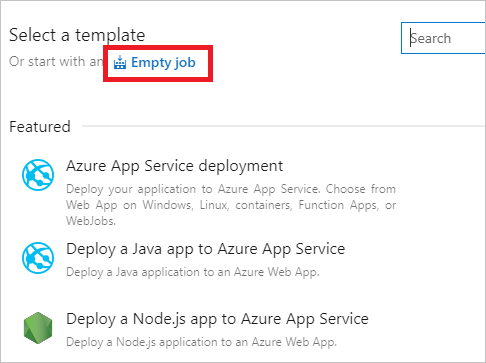
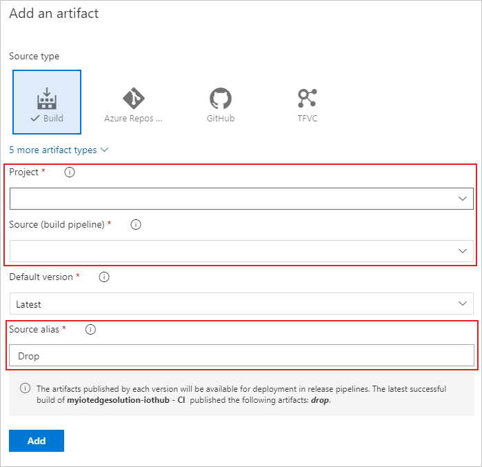
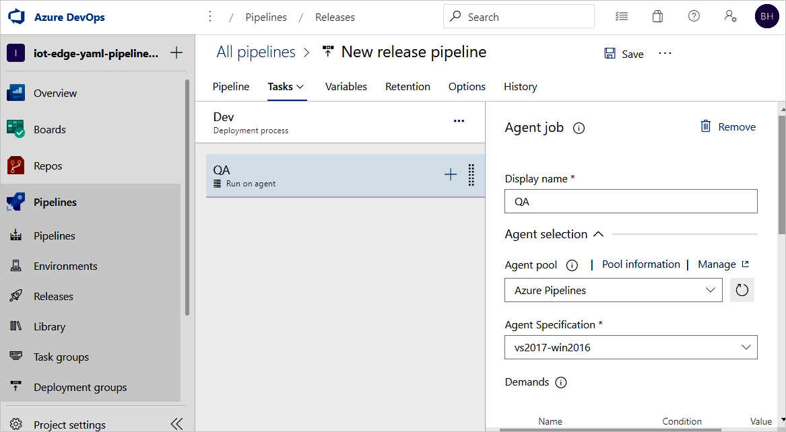
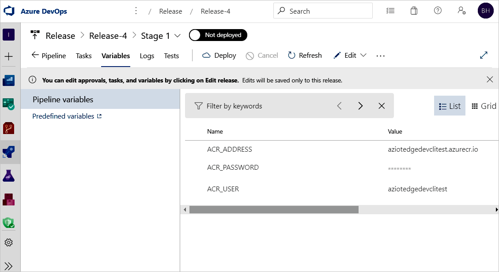

## Create a release pipeline for continuous deployment

In this section, you create a release pipeline that is configured to run automatically when your build pipeline drops artifacts, and it will show deployment logs in Azure Pipelines.

Create a new pipeline, and add a new stage:

1. In the **Releases** tab under **Pipelines**, choose **+ New pipeline**. Or, if you already have release pipelines, choose the **+ New** button and select **+ New release pipeline**.  

    

2. When prompted to select a template, choose to start with an **Empty job**.

    

3. Your new release pipeline initializes with one stage, called **Stage 1**. Rename Stage 1 to **dev** and treat it as a continuous deployment pipeline for your development environment. Usually, continuous deployment pipelines have multiple stages including **dev**, **staging**, and **prod**. You can use different names and create more based on your DevOps practice. Close the stage details window once it's renamed.

   You can also rename your release pipeline by selecting the "New release pipeline" text at the top.

4. Link the release to the build artifacts that are published by the build pipeline. Click **Add** in artifacts area.

   

5. On the **Add an artifact page**, select **Build** as the **Source type**. Choose the project and the build pipeline you created. If you wish, you can change the **Source alias** to something more descriptive. Then, select **Add**.

   

6. Open the artifact triggers and select the toggle to enable the continuous deployment trigger. Now, a new release will be created each time a new build is available.

   

7. The **dev** stage is preconfigured with one job and zero tasks. From the pipeline menu, select **Tasks** then choose the **dev** stage. Select the **Agent job** and change its **Display name** to **QA**. You can configure details about the agent job, but the deployment task is platform insensitive so you can use any **Agent specification** in the chosen **Agent pool**.

   

8. On the QA job, select the plus sign (**+**) to add two tasks. Search for and add **Azure IoT Edge** twice.

9. Select the first **Azure IoT Edge** task and configure it with the following values:

    | Parameter | Description |
    | --- | --- |
    | Display name | The display name is automatically updated when the Action field changes. |
    | Action | Select `Generate deployment manifest`. |
    | .template.json file | Specify the path: `$(System.DefaultWorkingDirectory)/Drop/drop/deployment.template.json`. The path is published from build pipeline. |
    | Default platform | Select the appropriate operating system for your modules based on your targeted IoT Edge device. |
    | Output path| Put the path `$(System.DefaultWorkingDirectory)/Drop/drop/configs/deployment.json`. This path is the final IoT Edge deployment manifest file. |

    These configurations help replace the module image URLs in the `deployment.template.json` file. The **Generate deployment manifest** also helps replace the variables with the exact value you defined in the `deployment.template.json` file. In Visual Studio/Visual Studio Code, you are specifying the actual value in a `.env` file. In Azure Pipelines, you set the value in **Release Pipeline Variables** tab. Move to **Variables** tab and configure the name and value as following:

    * **ACR_ADDRESS**: Your Azure Container Registry **Login server** value. You can retrieve the Login server from the Overview page of your container registry in the Azure portal.
    * **ACR_PASSWORD**: Your Azure Container Registry password.
    * **ACR_USER**: Your Azure Container Registry username.

    If you have other variables in your project, you can specify the name and value in this tab. The **Generate deployment manifest** can only recognize the variables that are in `${VARIABLE}` flavor. Make sure you are using this flavor in your `*.template.json` files.
    
    ```json-interactive
    "registryCredentials": {
      "<ACR name>": { // Your Azure Container Registry **Registry name** value
        "username": "${ACR_USER}",
        "password": "${ACR_PASSWORD}",
        "address": "${ACR_ADDRESS}"
      }
    }
    ```
    
    

10. Select the second **Azure IoT Edge** task and configure it with the following values:

    | Parameter | Description |
    | --- | --- |
    | Display name | The display name is automatically updated when the Action field changes. |
    | Action | Select `Deploy to IoT Edge devices`. |
    | Deployment file | Put the path `$(System.DefaultWorkingDirectory)/Drop/drop/configs/deployment.json`. This path is the file IoT Edge deployment manifest file. |
    | Azure subscription | Select the subscription that contains your IoT Hub.|
    | IoT Hub name | Select your IoT hub.|
    | Choose single/multiple device | Choose whether you want the release pipeline to deploy to one or multiple devices. If you deploy to a single device, enter the **IoT Edge device ID**. If you are deploying to multiple devices, specify the device **target condition**. The target condition is a filter to match a set of IoT Edge devices in IoT Hub. If you want to use device tags as the condition, you need to update your corresponding devices tags with IoT Hub device twin. Update the **IoT Edge deployment ID** and **IoT Edge deployment priority** in the advanced settings. For more information about creating a deployment for multiple devices, see [Understand IoT Edge automatic deployments](/azure/iot-edge/module-deployment-monitoring). |
    | Device ID or target condition | Depending on the prior selection, specify a device ID or [target condition](/azure/iot-edge/module-deployment-monitoring#target-condition) to deploy to multiple devices. |
    | Advanced | For the IoT Edge deployment ID, specify `$(System.TeamProject)-$(Release.EnvironmentName)`. This variable maps the project and release name with your IoT Edge deployment ID. |
    

    If your task involves using an image that resides in a private Docker Trusted Registry that isn't visible to the public cloud, you can set the **SKIP_MODULE_IMAGE_VALIDATION** environment variable to `true` to skip image validation. 

    

11. Select **Save** to save your changes to the new release pipeline. Return to the pipeline view by selecting **Pipeline** tab from the menu.
