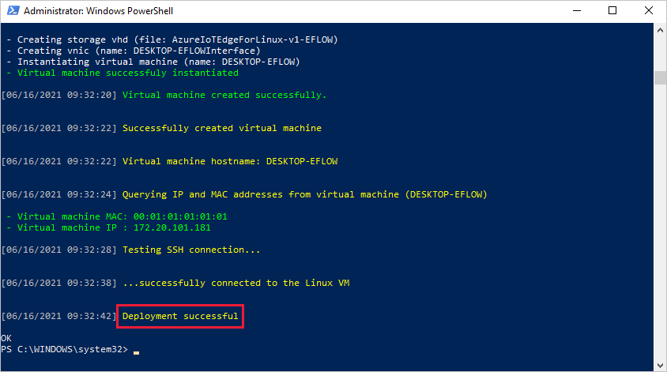

## Install IoT Edge

Deploy Azure IoT Edge for Linux on Windows on your target device.

> [!NOTE]
> The following PowerShell process outlines how to deploy IoT Edge for Linux on Windows onto the local device. To deploy to a remote target device using PowerShell, you can use [Remote PowerShell](/powershell/module/microsoft.powershell.core/about/about_remote) to establish a connection to a remote device and run these commands remotely on that device.


1. In an elevated PowerShell session, run either of the following commands depending on your target device architecture to download IoT Edge for Linux on Windows.

   * **X64/AMD64**
      ```powershell
      $msiPath = $([io.Path]::Combine($env:TEMP, 'AzureIoTEdge.msi'))
      $ProgressPreference = 'SilentlyContinue'
      Invoke-WebRequest "https://aka.ms/AzEFLOWMSI_1_4_LTS_X64" -OutFile $msiPath
      ```

   * **ARM64**
      ```powershell
      $msiPath = $([io.Path]::Combine($env:TEMP, 'AzureIoTEdge.msi'))
      $ProgressPreference = 'SilentlyContinue'
      Invoke-WebRequest "https://aka.ms/AzEFLOWMSI_1_4_LTS_ARM64" -OutFile $msiPath
      ```

1. Install IoT Edge for Linux on Windows on your device.

   ```powershell
   Start-Process -Wait msiexec -ArgumentList "/i","$([io.Path]::Combine($env:TEMP, 'AzureIoTEdge.msi'))","/qn"
   ```

   You can specify custom IoT Edge for Linux on Windows installation and VHDX directories by adding `INSTALLDIR="<FULLY_QUALIFIED_PATH>"` and `VHDXDIR="<FULLY_QUALIFIED_PATH>"` parameters to the install command. For example, if you want to use the _D:\EFLOW_ folder for installation and the _D:\EFLOW-VHDX_ for the VHDX, you can use the following PowerShell cmdlet.

   ```powershell
   Start-Process -Wait msiexec -ArgumentList "/i","$([io.Path]::Combine($env:TEMP, 'AzureIoTEdge.msi'))","/qn","INSTALLDIR=D:\EFLOW", "VHDXDIR=D:\EFLOW-VHDX"
   ```

1. Set the execution policy on the target device to `AllSigned` if it is not already. See the PowerShell prerequisites for commands to check the current execution policy and set the execution policy to `AllSigned`.

1. Create the IoT Edge for Linux on Windows deployment. The deployment creates your Linux virtual machine and installs the IoT Edge runtime for you.

   ```powershell
   Deploy-Eflow
   ```

   >[!TIP]
   >By default, the `Deploy-Eflow` command creates your Linux virtual machine with 1 GB of RAM, 1 vCPU core, and 16 GB of disk space. However, the resources your VM needs are highly dependent on the workloads you deploy. If your VM does not have sufficient memory to support your workloads, it will fail to start.
   >
   >You can customize the virtual machine's available resources using the `Deploy-Eflow` command's optional parameters. This is required to deploy EFLOW on a device with the minimum hardware requirements.
   >
   >For example, the command below creates a virtual machine with 1 vCPU core, 1 GB of RAM (represented in MB), and 2 GB of disk space:
   >
   >   ```powershell
   >   Deploy-Eflow -cpuCount 1 -memoryInMB 1024 -vmDataSize 2
   >   ```
   >
   >For information about all the optional parameters available, see [PowerShell functions for IoT Edge for Linux on Windows](/azure/iot-edge/reference-iot-edge-for-linux-on-windows-functions#deploy-eflow).

   >[!WARNING]
   >By default, the EFLOW Linux virtual machine has no DNS configuration. Deployments using DHCP will try to obtain the DNS configuration propagated by the DHCP server. Please check your DNS configuration to ensure internet connectivity. For more information, see [AzEFLOW-DNS](https://aka.ms/AzEFLOW-DNS).

   You can assign a GPU to your deployment to enable GPU-accelerated Linux modules. To gain access to these features, you will need to install the prerequisites detailed in [GPU acceleration for Azure IoT Edge for Linux on Windows](/azure/iot-edge/gpu-acceleration).

   To use a GPU passthrough, add the **gpuName**, **gpuPassthroughType**, and **gpuCount** parameters to your `Deploy-Eflow` command. For information about all the optional parameters available, see [PowerShell functions for IoT Edge for Linux on Windows](/azure/iot-edge/reference-iot-edge-for-linux-on-windows-functions#deploy-eflow).

   >[!WARNING]
   >Enabling hardware device passthrough may increase security risks. Microsoft recommends a device mitigation driver from your GPU's vendor, when applicable. For more information, see [Deploy graphics devices using discrete device assignment](/windows-server/virtualization/hyper-v/deploy/deploying-graphics-devices-using-dda).

1. Enter 'Y' to accept the license terms.

1. Enter 'O' or 'R' to toggle **Optional diagnostic data** on or off, depending on your preference.

1. Once the deployment is complete, the PowerShell window reports **Deployment successful**.

   

   After a successful deployment, you are ready to provision your device.

