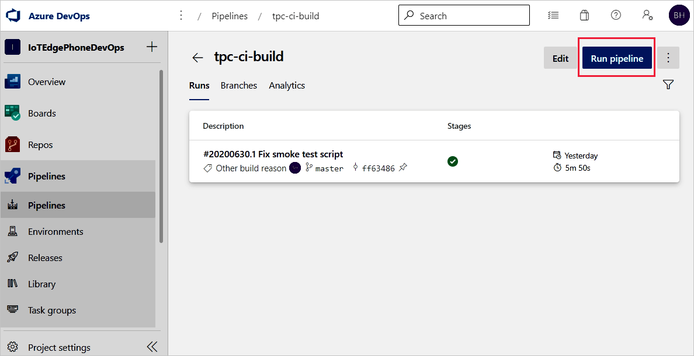
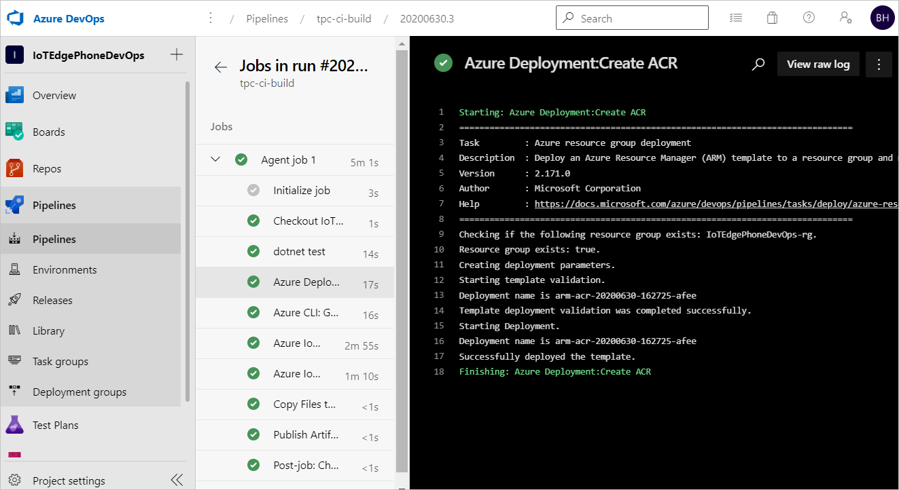

## Verify IoT Edge CI/CD with the build and release pipelines

To trigger a build job, you can either push a commit to source code repository or manually trigger it. In this section, you manually trigger the CI/CD pipeline to test that it works. Then verify that the deployment succeeds.

1. From the left pane menu, select **Pipelines** and open the build pipeline that you created at the beginning of this article.

2. You can trigger a build job in your build pipeline by selecting the **Run pipeline** button in the top right.

    

3. Review the **Run pipeline** settings. Then, select **Run**.

    

4. Select **Agent job 1** to watch the run's progress. You can review the logs of the job's output by selecting the job. 

    

5. If the build pipeline is completed successfully, it triggers a release to **dev** stage. The successful **dev** release creates IoT Edge deployment to target IoT Edge devices.

    

6. Click **dev** stage to see release logs.

    

7. If your pipeline is failing, start by looking at the logs. You can view logs by navigating to the pipeline run summary and selecting the job and task. If a certain task is failing, check the logs for that task. For detailed instructions for configuring and using logs, see [Review logs to diagnose pipeline issues](/azure/devops/pipelines/troubleshooting/review-logs).
