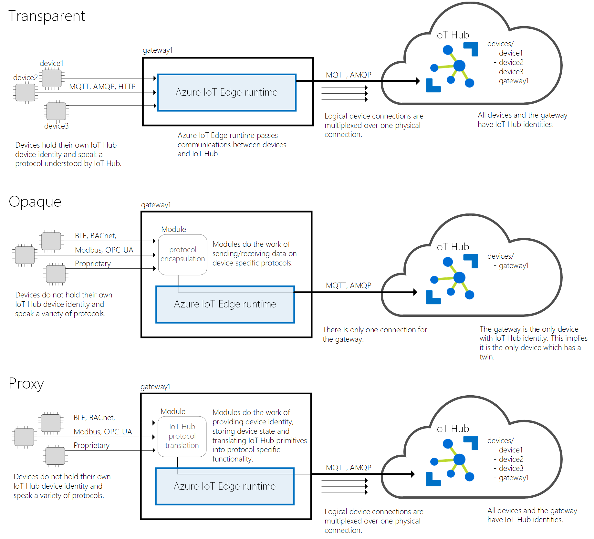

# How an IoT Edge device can be used as a gateway

Gateways in IoT Edge solutions provide device connectivity and edge analytics to IoT devices that otherwise wouldn't have those capabilities. Azure IoT Edge can be used to satisfy any need for an IoT gateway, whether it's related to connectivity, identity, or edge analytics. Gateway patterns in this article only refer to characteristics of downstream device connectivity and device identity, not how device data is processed on the gateway.

## Patterns

There are three patterns for using an IoT Edge device as a gateway: transparent, protocol translation, and identity translation.

A key difference between the patterns is that a transparent gateway passes messages between downstream devices and IoT Hub without needing any additional processing. Protocol translation and identity translation, however, require processing on the gateway to enable communication.

Any gateway can use IoT Edge modules to perform analytics or pre-processing at the edge before passing messages from downstream devices to IoT Hub.

### Transparent pattern

In a *transparent* gateway pattern, devices that theoretically could connect to IoT Hub can connect to a gateway device instead. The downstream devices have their own IoT Hub identities and are using any of the MQTT, AMQP, or HTTP protocols. The gateway simply passes communications between the devices and IoT Hub. Both the devices and the users interacting with them through IoT Hub are unaware that a gateway is mediating their communications. This lack of awareness means the gateway is considered *transparent*.

The IoT Edge runtime includes transparent gateway capabilities. For more information, see [Configure an IoT Edge device to act as a transparent gateway](how-to-create-transparent-gateway.md).

### Protocol translation pattern

A *protocol translation* gateway is also known as an *opaque* gateway, in contrast with the transparent gateway pattern. In this pattern, devices that do not support MQTT, AMQP, or HTTP can use a gateway device to send data to IoT Hub on their behalf. The gateway understands the protocol used by the downstream devices, and is the only device that has an identity in IoT Hub. All information looks like it is coming from one device, the gateway. Downstream devices must embed additional identifying information in their messages if cloud applications want to analyze the data on a per-device basis. Additionally, IoT Hub primitives like twins and methods are only available for the gateway device, not downstream devices.

The IoT Edge runtime does not include protocol translation capabilities. This pattern requires custom or third-party modules that are often specific to the hardware and protocol used. [Azure Marketplace](https://azuremarketplace.microsoft.com/marketplace/apps/category/internet-of-things?page=1&subcategories=iot-edge-modules) contains several protocol translation modules to choose from.

### Identity translation pattern

In an *identity translation* gateway pattern, devices that cannot connect to IoT Hub can connect to a gateway device, instead. The gateway provides IoT Hub identity and protocol translation on behalf of the downstream devices. The gateway is smart enough to understand the protocol used by the downstream devices, provide them identity, and translate IoT Hub primitives. Downstream devices appear in IoT Hub as first-class devices with twins and methods. A user can interact with the devices in IoT Hub and is unaware of the intermediate gateway device.

The IoT Edge runtime does not include identity translation capabilities. This pattern requires custom or third-party modules that are often specific to the hardware and protocol used. For a sample that uses the identity translation pattern, see [Azure IoT Edge LoRaWAN Starter Kit](https://github.com/Azure/iotedge-lorawan-starterkit).

## Use cases

All gateway patterns provide the following benefits:

* **Analytics at the edge** – Use AI services locally to process data coming from downstream devices without sending full-fidelity telemetry to the cloud. Find and react to insights locally and only send a subset of data to IoT Hub.
* **Downstream device isolation** – The gateway device can shield all downstream devices from exposure to the internet. It can sit in between an OT network that does not have connectivity and an IT network that provides access to the web.
* **Connection multiplexing** - All devices connecting to IoT Hub through an IoT Edge gateway use the same underlying connection.
* **Traffic smoothing** - The IoT Edge device will automatically implement exponential backoff if IoT Hub throttles traffic, while persisting the messages locally. This benefit makes your solution resilient to spikes in traffic.
* **Offline support** - The gateway device stores messages and twin updates that cannot be delivered to IoT Hub.

A gateway that does protocol translation can support existing devices and new devices that are resource constrained. Many existing devices are producing data that can power business insights; however they were not designed with cloud connectivity in mind. Opaque gateways allow this data to be unlocked and used in an IoT solution.

A gateway that does identity translation provides the benefits of protocol translation and additionally allows for full manageability of downstream devices from the cloud. All devices in your IoT solution show up in IoT Hub regardless of the protocol they use.

## Cheat sheet

Here is a quick cheat sheet that compares IoT Hub primitives when using transparent, opaque (protocol), and proxy gateways.

| Primitive | Transparent gateway | Protocol translation | Identity translation |
|--------|-------------|--------|--------|
| Identities stored in the IoT Hub identity registry | Identities of all connected devices | Only the identity of the gateway device | Identities of all connected devices |
| Device twin | Each connected device has its own device twin | Only the gateway has a device and module twins | Each connected device has its own device twin |
| Direct methods and cloud-to-device messages | The cloud can address each connected device individually | The cloud can only address the gateway device | The cloud can address each connected device individually |
| [IoT Hub throttles and quotas](../iot-hub/iot-hub-devguide-quotas-throttling.md) | Apply to each device | Apply to the gateway device | Apply to each device |

When using an opaque gateway (protocol translation) pattern, all devices connecting through that gateway share the same cloud-to-device queue, which can contain at most 50 messages. It follows that the opaque gateway pattern should be used only when few devices are connecting through each field gateway, and their cloud-to-device traffic is low.

## Next steps

Learn the three steps to set up a transparent gateway:

* [Configure an IoT Edge device to act as a transparent gateway](how-to-create-transparent-gateway.md)
* [Authenticate a downstream device to Azure IoT Hub](how-to-authenticate-downstream-device.md)
* [Connect a downstream device to an Azure IoT Edge gateway](how-to-connect-downstream-device.md)
