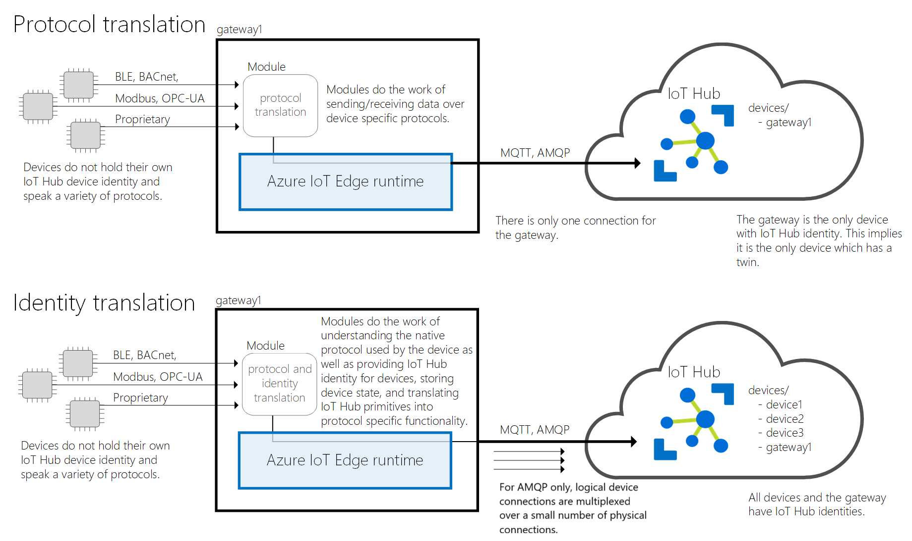

# How an IoT Edge device can be used as a gateway

IoT Edge devices can operate as gateways, providing a connection between other devices on the network and IoT Hub.

<!-- NOTE: commented-out portions are the content that will be swapped in for versions 1.0 and 1.1 -->

<!--::: moniker range=">= iotedge-1.2"-->

The IoT Edge hub module acts like IoT Hub, so can handle connections from any devices that have an identity with IoT Hub, including other IoT Edge devices. This type of gateway pattern is called *transparent* because messages can pass from downstream devices to IoT Hub as though there were not a gateway between them.

<!--::: moniker-end

::: moniker range="< iotedge-1.2"

The IoT Edge hub module acts like IoT Hub, so can handle connections from any non-IoT Edge devices that have an identity with IoT Hub. This type of gateway pattern is called *transparent* because messages can pass from downstream devices to IoT Hub as though there were not a gateway between them.

::: moniker-end-->

For device that don't or can't connect to IoT Hub on their own, IoT Edge gateways can provide that connection. This type of gateway pattern is called *translation* because the IoT Edge device has to perform processing on incoming downstream device messages before they can be forwarded to IoT Hub. These scenarios require additional modules on the IoT Edge gateway to handle the processing steps.

The transparent and translation gateway patterns are not mutually exclusive. A single IoT Edge device can function as both a transparent gateway and a translation gateway.

All gateway patterns provide the following benefits:

* **Analytics at the edge** – Use AI services locally to process data coming from downstream devices without sending full-fidelity telemetry to the cloud. Find and react to insights locally and only send a subset of data to IoT Hub.
* **Downstream device isolation** – The gateway device can shield all downstream devices from exposure to the internet. It can sit in between an operational technology (OT) network that does not have connectivity and an information technology (IT) network that provides access to the web. Similarly, devices that don't have the capability to connect to IoT Hub on their own can connect to a gateway device instead.
* **Connection multiplexing** - All devices connecting to IoT Hub through an IoT Edge gateway use the same underlying connection.
* **Traffic smoothing** - The IoT Edge device will automatically implement exponential backoff if IoT Hub throttles traffic, while persisting the messages locally. This benefit makes your solution resilient to spikes in traffic.
* **Offline support** - The gateway device stores messages and twin updates that cannot be delivered to IoT Hub.

## Transparent gateways

In the transparent gateway pattern, devices that theoretically could connect to IoT Hub can connect to a gateway device instead. The downstream devices have their own IoT Hub identities and are using any of the MQTT, AMQP, or HTTP protocols. The gateway simply passes communications between the devices and IoT Hub. Both the devices and the users interacting with them through IoT Hub are unaware that a gateway is mediating their communications. This lack of awareness means the gateway is considered *transparent*.

<!--::: moniker range=">= iotedge-1.2"-->

IoT Edge devices can connect through transparent gateways, as well as regular IoT devices.

<!-- TODO add a downstream IoT Edge device to graphic -->

<!--::: moniker-end

::: moniker range="< iotedge-1.2"

IoT Edge devices cannot be downstream of an IoT Edge gateway.

::: moniker-end-->

### Parent and child relationships

You declare transparent gateway relationships in IoT Hub by setting the IoT Edge gateway as the *parent* of a downstream device *child* that connects to it. This relationship can be declared at the time of creating a device ID, or afterwards in the device settings.

<!--::: moniker range">= iotedge-1.2"-->

IoT Edge devices can be both parents and children in transparent gateway relationships. A hierarchy of multiple IoT Edge devices reporting to each other can be created, where only the IoT Edge device at the top level has a connection to the cloud.

Child devices can only have one parent. Each parent can have up to 100 children. The top node of a gateway hierarchy can have up to five generations of children. For example, an IoT Edge device can have five layers of IoT Edge devices linked as children below it. But the IoT Edge device in the fifth generation cannot have any children, IoT Edge or otherwise.

<!-- TODO: generations graphic -->

Child devices must be configured to connect to their assigned parent devices instead of IoT Hub. On IoT devices, the `gatewayHostname` parameter in the connection string points to the parent device. On IoT Edge devices, the `parent_hostname` parameter in the config.yaml file points to the parent device.

Parent and child devices also need to authenticate their connections to each other. A single certificate chain should be used for all the devices in a gateway hierarchy. Each child device uses the shared root CA certificate to verify that it's connecting to the proper gateway.

<!-- TODO: Is this certificate statement true? Same root CA on every device? -->

<!-- TODO: Add more-information links to how-to docs -->

<!--::: moniker-end

::: moniker range="< iotedge-1.2"

IoT Edge devices can be parents in transparent gateway relationships, but not children.

Child devices can only have one parent. Each parent can have up to 100 children.

Child devices must be configured to connect to their assigned parent devices instead of IoT Hub. On IoT devices, the `gatewayHostname` parameter in the connection string points to the parent device.

Parent and child devices also need to authenticate their connections to each other. Child devices use a shared root CA certificate to verify that they are connecting to the proper gateway.

::: moniker-end-->

### Device capabilities behind transparent gateways

<!--::: moniker range=">= iotedge-1.2"-->

All IoT Hub primitives that work with IoT Edge's messaging pipeline also support transparent gateway scenarios. Each IoT Edge device in the hierarchy has store and forward capabilities for messages coming through it.

Except for the top IoT Edge device in the hierarchy, downstream IoT Edge devices are not allowed to create direct connections to the cloud. All messaging must be routed through the parent devices using IoT Hub primitives.

Use the following table to see how different IoT Hub capabilities are supported for devices compared to devices behind gateways.

| Capability | IoT device | IoT behind a gateway | IoT Edge device | IoT Edge behind a gateway |
| ---------- | ---------- | --------------------------- | --------------- | -------------------------------- |
| [Device-to-cloud (D2C) messages](../iot-hub/iot-hub-devguide-messages-d2c.md) |   |  |  |  |
| [Cloud-to-device (C2D) messages](../iot-hub/iot-hub-devguide-messages-c2d.md) |  |  |  |  |
| [Direct methods](../iot-hub/iot-hub-devguide-direct-methods.md) |  |  |  |  |
| [Device twins](../iot-hub/iot-hub-devguide-device-twins.md) and [Module twins](../iot-hub/iot-hub-devguide-module-twins.md) |  |  |  |  |
| [File upload](../iot-hub/iot-hub-devguide-file-upload.md) |  |  |  |  |
| Container image pulls |   |   |  |  |
| Blob upload |   |   |  |  |

**Container images** can be downloaded, stored, and delivered from parent devices to child devices.

**Blobs**, including support bundles and logs, can be uploaded from child devices to parent devices.

<!--::: moniker-end

::: moniker range="< iotedge-1.2"

All IoT Hub primitives that work with IoT Edge's messaging pipeline also support transparent gateway scenarios. Each IoT Edge gateway has store and forward capabilities for messages coming through it.

Use the following table to see how different IoT Hub capabilities are supported for devices compared to devices behind gateways.

| Capability | IoT device | IoT behind a gateway |
| ---------- | ---------- | -------------------- |
| [Device-to-cloud (D2C) messages](../iot-hub/iot-hub-devguide-messages-d2c.md) |   |  |
| [Cloud-to-device (C2D) messages](../iot-hub/iot-hub-devguide-messages-c2d.md) |  |  |
| [Direct methods](../iot-hub/iot-hub-devguide-direct-methods.md) |  |  |
| [Device twins](../iot-hub/iot-hub-devguide-device-twins.md) and [Module twins](../iot-hub/iot-hub-devguide-module-twins.md) |  |  |
| [File upload](../iot-hub/iot-hub-devguide-file-upload.md) |  |  |

::: moniker-end-->

### Restrictions of transparent gateways

<!--::: moniker range=">= iotedge-1.2"-->

**Direct connections** are not allowed for modules deployed to IoT Edge devices in lower levels of the parent/child hierarchy. This restriction is by design. Ensure that all modules deployed to IoT Edge devices in lower levels of the hierarchy only use IoT Hub primitives and do not make any direct connections to the cloud.

**Auto-provisioning with the Device Provisioning Service (DPS)** is not supported for child devices, whether IoT devices or IoT Edge devices. DPS currently requires a direct connection between the service and the device.

<!--::: moniker-end

::: moniker range="< iotedge-1.2"

**Auto-provisioning with the Device Provisioning Service (DPS)** is not supported for child devices. DPS currently requires a direct connection between the service and the device, so cannot provision a device through a gateway.

::: moniker-end-->

## Translation gateways

If downstream devices can't connect to IoT Hub, then the IoT Edge gateway needs to act as a translator. Often, this pattern is required for devices that don't support MQTT, AMQP, or HTTP. Since these devices can't connect to IoT Hub, they also can't connect to the IoT Edge hub module without some pre-processing.

Custom or third-party modules that are often specific to the downstream device's hardware or protocol need to be deployed to the IoT Edge gateway. These translation modules take the incoming messages and turn them into a format that can be understood by IoT Hub.

There are two patterns for translation gateways: *protocol translation* and *identity translation*.

### Protocol translation

In the protocol translation gateway pattern, only the IoT Edge gateway has an identity with IoT Hub. The translation module receives messages from downstream devices, translates them into a supported protocol, and then the IoT Edge device sends the messages on behalf of the downstream devices. All information looks like it is coming from one device, the gateway. Downstream devices must embed additional identifying information in their messages if cloud applications want to analyze the data on a per-device basis. Additionally, IoT Hub primitives like twins and direct methods are only supported for the gateway device, not downstream devices. Gateways in this pattern are considered *opaque* in contrast to transparent gateways, because they obscure the identities of downstream devices.

Protocol translation supports devices that are resource constrained. Many existing devices are producing data that can power business insights; however they were not designed with cloud connectivity in mind. Opaque gateways allow this data to be unlocked and used in an IoT solution.

### Identity translation

The identity translation gateway pattern builds on protocol translation, but the IoT Edge gateway also provides a device identity on behalf of the downstream devices. The translation module is responsible for understanding the protocol used by the downstream devices, providing them identity, and translate their messages into IoT Hub primitives. Downstream devices appear in IoT Hub as first-class devices with twins and methods. A user can interact with the devices in IoT Hub and is unaware of the intermediate gateway device.

Identity translation provides the benefits of protocol translation and additionally allows for full manageability of downstream devices from the cloud. All devices in your IoT solution show up in IoT Hub regardless of the protocol they use.

### Device capabilities behind translation gateways

The following table explains how IoT Hub features are extended to downstream devices in both translation gateway patterns.

| Capability | Protocol translation | Identity translation |
| ---------- | -------------------- | -------------------- |
| Identities stored in the IoT Hub identity registry | Only the identity of the gateway device | Identities of all connected devices |
| Device twin | Only the gateway has a device and module twins | Each connected device has its own device twin |
| Direct methods and cloud-to-device messages | The cloud can only address the gateway device | The cloud can address each connected device individually |
| [IoT Hub throttles and quotas](../iot-hub/iot-hub-devguide-quotas-throttling.md) | Apply to the gateway device | Apply to each device |

When using the protocol translation pattern, all devices connecting through that gateway share the same cloud-to-device queue, which can contain at most 50 messages. Only use this pattern when few devices are connecting through each field gateway, and their cloud-to-device traffic is low.

The IoT Edge runtime does not include protocol or identity translation capabilities. These patterns requires custom or third-party modules that are often specific to the hardware and protocol used. [Azure Marketplace](https://azuremarketplace.microsoft.com/marketplace/apps/category/internet-of-things?page=1&subcategories=iot-edge-modules) contains several protocol translation modules to choose from. For a sample that uses the identity translation pattern, see [Azure IoT Edge LoRaWAN Starter Kit](https://github.com/Azure/iotedge-lorawan-starterkit).

## Next steps

Learn the three steps to set up a transparent gateway:

* [Configure an IoT Edge device to act as a transparent gateway](how-to-create-transparent-gateway.md)
* [Authenticate a downstream device to Azure IoT Hub](how-to-authenticate-downstream-device.md)
* [Connect a downstream device to an Azure IoT Edge gateway](how-to-connect-downstream-device.md)
