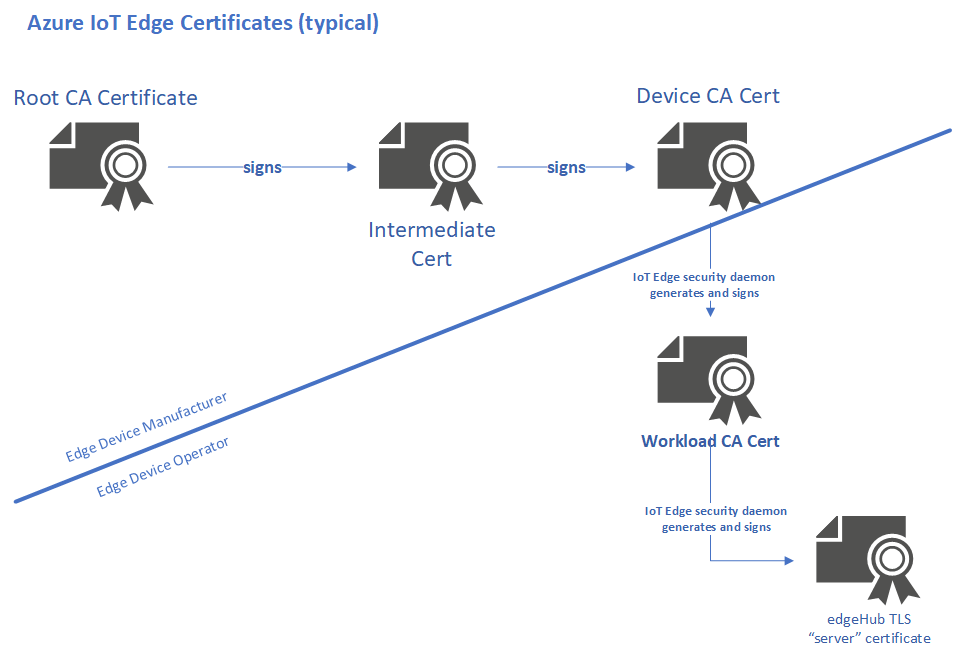
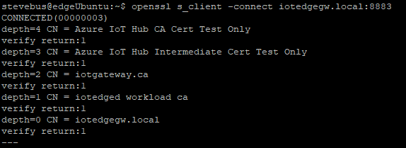

# Azure IoT Edge certificate usage detail

IoT Edge certificates are used for the modules and downstream IoT devices to verify identity and legitimacy of the [Edge Hub](iot-edge-runtime.md#iot-edge-hub) runtime module they are connecting to. These verifications enable a TLS (transport layer security) secure connection between the runtime, the modules, and the IoT devices. Like IoT Hub itself, IoT Edge requires a secure and encrypted connection from IoT downstream (or leaf) devices and IoT Edge modules. To establish a secure TLS connection, the Edge Hub module presents a server certificate chain to connecting clients in order for them to verify its identity.

To clear up any confusion about IoT Edge's use of certificates, this article explains how IoT Edge certificates can work in at-scale scenarios, as well as development and test scenarios. While the scripts are different (Powershell vs. bash), the concepts are the same between Linux and Windows.

## IoT Edge certificates

In most cases, manufacturers are independent entities from end users of an Edge device. Sometimes the only relationship between manufacturer and operator is the purchase of a commercially available Edge device. Other times, the manufacturer working under contract to build an Edge device on behalf of the operator. The IoT Edge certificate design attempts to take both scenarios into account.

The following figure illustrates IoT Edge's usage of certificates. There may be zero, one, or many intermediate signing certificates between the root CA certificate and the device CA certificate. Depending on the number of entities involved, here we show one case.



### Certificate authority

The certificate authority, or 'CA' for short, is an entity that issues digital certificates. A certificate authority acts as a trusted third party between the owner, and the receiver of the certificate. A digital certificate certifies the ownership of a public key by the receiver of the certificate. The certificate chain of trust works by initially issuing a root certificate, which is the basis for trust in all certificates issued by the authority. Afterwards, the owner can use the root certificate to issue additional intermediate certificates ('leaf' certificates).

### Root CA certificate

A root CA certificate is the root of trust of the entire process. In production scenarios, this is usually going to be a CA certificate purchased from a trusted commercial certificate authority like Baltimore, Verisign, DigiCert, etc. Should you have complete control over the devices connecting to your Edge device(s), it's possible to use a corporate level certificate authority. In either event, the entire certificate chain from the Edge Hub up rolls up to it, so the leaf IoT devices must trust the root certificate. You can store the root CA certificate either in the trusted root certificate authority store, or provide the root CA certificate details in your code when the IoT client connects to IoT Edge.

### Intermediate certificate(s)

In a typical manufacturing process for creating secure devices, root CA certificates are rarely used directly, primarily because of the risk of leakage or exposure. Generally, one or more intermediate CA certificates are created and digitally signed by the root CA certificate. There may only be one, or there may be a chain of these intermediate certificates. Scenarios that would require a chain of intermediate certificates include:

* A hierarchy of departments within a manufacturer.

* Multiple companies involved serially in the production of a device.

* A customer buying a root CA and deriving a signing certificate for the manufacturer to sign the devices they make on that customer's behalf.

In any case, the manufacturer uses an intermediate CA certificate at the end of this chain to sign the device CA certificate placed on the end device. Generally, these intermediate certificates are closely guarded at the manufacturing plant. They undergo strict processes, both physical and electronic for their usage.

### Device CA certificate

The device CA certificate is generated from and signed by the final intermediate CA certificate in the process. This certificate is installed on the Edge device itself, preferably in secure storage such as a hardware security module (HSM). In addition, a device CA certificate uniquely identifies an IoT Edge device. For IoT Edge, the device CA certificate is capable of issuing other certificates. For example, the device CA certificate issues leaf device certificates which are used to authenticate devices to the [Azure IoT Device Provisioning Service](..\iot-dps\about-iot-dps.md).

### IoT Edge Workload CA

This certificate, the first on the "operator" side of the process, is generated by the [IoT Edge Security Manager](iot-edge-security-manager.md) when IoT Edge first starts. This certificate is generated from and signed by the "device CA certificate". This certificate, which is just another intermediate signing certificate, is used to generate and sign any other certificates used by the IoT Edge runtime. Today, that is primarily the Edge Hub server certificate discussed in the following section, but in the future may include other certificates for authenticating IoT Edge components.

### Edge Hub server certificate

The Edge Hub server certificate is the actual certificate presented to leaf devices and modules for identity verification during establishment of the TLS connection required by IoT Edge. This certificate presents the full chain of signing certificates used to generate it up to the root CA certificate, which the leaf IoT device must trust. When generated by the IoT Edge Security Manager, the common name (CN), of this Edge Hub certificate is set to the name provided by the 'hostname' property in the config.yaml file after conversion to lower case. This is a common source of confusion with IoT Edge.

## Production implications

A reasonable question might be "why does IoT Edge need the 'workload CA' extra certificate? Couldn't it use the device CA certificate to directly generate the Edge Hub server certificate?". Technically, it could. However, the purpose of this "workload" intermediate certificate is to separate concerns between the device manufacturer and the device operator. Imagine a scenario where an IoT Edge device is sold or transferred from one customer to another. You would likely want the device CA certificate provided by the manufacturer to be immutable. However, the "workload" certificates specific to operation of the device should be wiped and recreated for the new deployment.

Because manufacturer and operator processes are separated, there are a few implications that need to be considered related to rolling out IoT Edge for production devices.

* With any certificate-based process, the root CA certificate and all intermediate CA certificates should be secured and monitored during the entire process of rolling out an IoT Edge device. The IoT Edge device manufacturer should have strong processes in place for proper storage and usage of their intermediate certificates. In addition, the device CA certificate should be kept in as secure storage as possible on the device itself, preferably a hardware security module.

* Since the Edge Hub server certificate will be presented by Edge Hub to the connecting client devices and modules, the CN of the device CA certificate **must not be** the same as the "hostname" that will be used in config.yaml on the IoT Edge device. The name used by clients to connect to IoT Edge (e.g. via the GatewayHostName parameter of the connection string or the CONNECT command in MQTT) **can't be** the same as common name used in the device CA certificate. This is because Edge Hub presents its entire certificate chain for verification by clients. If the Edge Hub server certificate and the device CA certificate both have the same CN, you get in a verification loop and the certificate will invalidate.

* Because the device CA certificate is used by the IoT Edge Security daemon to generate the final IoT Edge certificates, it must itself be a signing certificate, meaning it has certificate signing capabilities. To make this a signing CA cert, essentially applying "V3 Basic constraints CA:True" to the device CA certificate will automatically set up the required key usage properties.

>[!Tip]
> If you've already gone through the setup of IoT Edge as a transparent gateway in a dev/test scenario using our "convenience scripts" (see next section) and used the same host name when creating the device CA certificate as you did for the hostname in config.yaml, you might be wondering why it worked. In an effort to simplify the developer experience, the convenience scripts appends a ".ca" on the end of the name you pass into the script. So, for example, if you used "mygateway" for both your device name in the scripts and hostname in config.yaml, the former will be turned into mygateway.ca before being used as the CN for the device CA cert.

## Dev/Test implications

To ease development and test scenarios, Microsoft provides a set of [convenience scripts](https://github.com/Azure/azure-iot-sdk-c/tree/master/tools/CACertificates) for generating non-production certificates suitable for IoT Edge in the transparent gateway scenario.

These scripts generate certificates that follow the certificate chain structure explained in this article. For [Linux](how-to-create-transparent-gateway-linux.md#certificate-creation) or [Windows](how-to-create-transparent-gateway-windows.md#certificate-creation). The following commands generate the "root CA certificate" and a single "intermediate CA certificate".

```bash
./certGen.sh create_root_and_intermediate 
```

```Powershell
New-CACertsCertChain rsa 
```

Likewise, these commands generate the "Device CA Certificate".

```bash
./certGen.sh create_edge_device_certificate "<gateway device name>"
```

```Powershell
New-CACertsEdgeDevice "<gateway device name>"
```

* The **\<gateway device name\>** passed into those scripts **must not** be the same as the "hostname" parameter in config.yaml. As mentioned, the scripts help you avoid any issues by appending a ".ca" string to the **\<gateway device name\>** to prevent the name collision in case a user sets up the Edge using the same name in both places, however, it's good practice to avoid using the same name.

>[!Tip]
> To connect your device IoT "leaf" devices and applications that use our IoT device SDK through IoT Edge, you must add the optional GatewayHostName parameter on to the end of the device's connection string. When the Edge Hub Server Certificate is generated, it is based on a lower-cased version of the hostname from config.yaml, therefore, for the names to match and the TLS certificate verification to succeed, you should enter the GatewayHostName parameter in lower case.

## Example of IoT Edge certificate hierarchy

To illustrate an example of this certificate path, the following screenshot is from a working IoT Edge device set up as a transparent gateway. OpenSSL is used to connect to the Edge Hub, validate, and dump out the certificates.



You can see the hierarchy of certificate depth represented in the screenshot:

| Root CA Certificate         | Azure IoT Hub CA Cert Test Only                                                                           |
|-----------------------------|-----------------------------------------------------------------------------------------------------------|
| Intermediate CA Certificate | Azure IoT Hub Intermediate Cert Test Only                                                                 |
| Device CA Certificate       | iotgateway.ca ("iotgateway" was passed in as the  < gateway host name >  to the convenience scripts)      |
| Workload CA Certificate     | iotedge workload ca                                                                                       |
| Edge Hub Server Certificate | iotedgegw.local  (matches the 'hostname' from config.yaml)                                                |

## Next steps

[Understand Azure IoT Edge modules](iot-edge-modules.md)

[Use an IoT Edge device as a transparent gateway (Linux)](how-to-create-transparent-gateway-linux.md)

[Use an IoT Edge device as a transparent gateway (Windows)](how-to-create-transparent-gateway-windows.md)
