# Understand how Azure IoT Edge uses certificates

[!INCLUDE [iot-edge-version-1.1-or-1.4](./includes/iot-edge-version-1.1-or-1.4.md)]

IoT Edge uses different types of certificates for different purposes. This article walks you through the different ways that IoT Edge uses certificates with different partners. At the end there's a recap.

> [!IMPORTANT]
> For brevity, this article is written using terminologies for 1.2 or later. Concepts are very similar, but compared to 1.1 there are some changes:
> * The **Device CA certificate** was renamed as **Edge CA certificate**.
> * The **workload CA certificate** was deprecated. Now the IoT Edge security manager generates the IoT Edge hub `edgeHub` server certificate directly from the Edge CA certificate, without the intermediate workload CA certificate between them.

## Prerequisites

- You should have some idea how public key cryptography, key pairs, and how a public key and private key can encrypt/decrypt data done with its counterpart. If not, [this link is a good start](../iot-hub/tutorial-x509-introduction.md).
- You should have some idea about what IoT Edge is in relation to IoT Hub 

## A representative example

The best way to understand all of this is with an illustrative example. This is a very basic scenario where *EdgeGateway* (an IoT Edge device) connects to *ContosoIotHub* (an IoT Hub instance in Azure). In this example, all authentication is done with X.509 certificate authentication (as opposed to symmetric keys). Trust must be established, which essentially become questions like "is this message really from where it says it is" and "am I really talking to who I think I'm talking to". If deconstructed, it becomes:


We go through each one of these. And once we're good , we'll also expand the example later.

## Part 1: *Am I really talking to ContosoIotHub?*

This first question is about when EdgeGateway wants to talk to the cloud. From the connection string it knows it should reach out to `ContosoIoTHub.azure-devices.net` but to be safe IoT Edge wants that endpoint to show some sort of ID, ideally issued by someone it trusts.

To achieve this, IoT Edge and IoT Hub perform the **TLS handshake** to verify an IoT hub's server identity. This is a simplified diagram and skips some parts. To learn more you should see this cool link.

> [!NOTE]
> When we say ContosoIoTHub, it generally means `ContosoIotHub.azure-devices.net` (the hostname of the IoT hub). Skipped for brevity in the diagram and subsequent references.

```mermaid
sequenceDiagram
    participant EdgeGateway
    participant ContosoIotHub
    
    EdgeGateway->>ContosoIotHub: Let's talk securely with TLS 🔒
    ContosoIotHub->>EdgeGateway: Ok, here's my certificate 📜
    EdgeGateway->>EdgeGateway: Check trusted root certificate store
    note over EdgeGateway, ContosoIotHub: *Cryptographic magic happens*
    EdgeGateway->>ContosoIotHub: Looks good 🙂, let's connect
```



First thing first, it's not important to know exactly what *cryptographic magic* means in this context. It's important to know that it's some fancy math, done by both sides, that ensures both the client and the server indeed are in possession of the private key that is paired with the public key. It then means that the presenter of the certificate didn't just steal it. It's a bit like only you can produce the face that looks like the photo on the ID. So if someone steals your ID the bar won't let them in because they don't have your face, which is unstealable. So it's like that, except that the private key is the unstealable element, and instead of the human ability to match a face to a picture, computers use math. The math is so sound and it's so hard to brute force that all you need to know that it's very trustworthy.

With that out of the way, let's go ahead and look at the non-magical part. I promise it's basically like when you go to a bar and they check your ID and they want to make sure that the ID isn't faked. Well first ContosoIotHub showed this certificate chain, so let's expand it. 

```mermaid
flowchart TB
    id3["📃 CN = Baltimore CyberTrust Root (Root CA)"]
    id2["📃 CN = Microsoft IT TLS CA 1 (Intermediate CA)"]
    id1["📃 CN = *.azure-devices.net"] 
    
    id2-- Issued by ---> id3
    id1-- Issued by ---> id2
```



Here the Root CA is something called [Baltimore CyberTrust Root](https://baltimore-cybertrust-root.chain-demos.digicert.com/info/index.html). What is that? It's a certificate that is signed by DigiCert, and is widely trusted and stored in many operating systems. For example, both Ubuntu and Windows have it in the default store. So when a device checks the OS for it, it's probably there. From EdgeGateway perspective, certificate chain presented by ContosoIotHub is signed by the same root what its OS trusts, means that it's trustworthy.

In Windows:

  

Ubuntu:

  

It's generally known as **IoT Hub server certificate**. To learn more, see [Transport Layer Security (TLS) support in IoT Hub](../iot-hub/iot-hub-tls-support.md). It has a public certificate because it's widely used. I know the article said it's about IoT Edge but we started with IoT Hub and it's weird. I promise this is important. 

### Conclusion

EdgeGateway can trust ContosoIotHub because 

- It showed its **IoT Hub server certificate** 
- This certificate is issued widely trusted root CA (Baltimore CyberTrust Root)
- Cryptographic magic: random data encrypted with ContosoIotHub's public key can be decrypted by ContosoIotHub, proving its possession of the private key

## Part 2: *Is this really from EdgeGateway?*

In Part 1, EdgeGateway verified the legitimacy of ContosoIotHub. Now, the counterpart happens: ContosoIotHub needs to know if EdgeGateway is really legit. Here they perform the what's known as **TLS client authentication**. For simplicity we again skip some steps (so you should get the real version from this link), and this happens together with TLS handshake from earlier. But for the sake of education let's look at this specifically.

```mermaid
sequenceDiagram
    participant EdgeGateway
    participant ContosoIotHub
    
    EdgeGateway->>ContosoIotHub: Let's talk securely with TLS 🔒
    EdgeGateway->>ContosoIotHub: Here's my certificate 📜
    ContosoIotHub->>ContosoIotHub: Check if certificate thumbprint matches record
    note over EdgeGateway, ContosoIotHub: *Cryptographic magic happens*
    ContosoIotHub->>EdgeGateway: Great, let's connect
```



So it's pretty similar to the first question. Right? IoT Edge in this case shows its certificate, known as the **IoT Edge device identity certificate**. From ContosoIotHub perspective, it needs to check if the thumbprint of the provided certificate matches its record.
 
When you provision an IoT Edge device in IoT Hub, you provide a thumbprint. That's the same string that IoT Hub checks if there's a match. Let's try to do that now.

Get the thumbprint of the identity cert on EdgeGateway:

```bash
user@edgeGateway:~$ sudo openssl x509 -in /var/lib/aziot/certd/certs/deviceid-long-random-string.cer -noout -nocert -fingerprint -sha256

SHA256 Fingerprint=1E:F3:1F:88:24:74:2C:4A:C1:A7:FA:EC:5D:16:C4:11:CD:85:52:D0:88:3E:39:CB:7F:17:53:40:9C:02:95:C3
```

In ContosoIotHub:

  

Notice that the thumbprints match. 

### Conclusion

ContosoIotHub can trust EdgeGateway because it showed a valid **IoT Edge device identity certificate** whose thumbprint matches the one uploaded to earlier. This fact along with EdgeGateway's ability to decrypt data signed with its public means that the certificate is indeed the same one as what the user intended and ALSO that EdgeGateway MUST have the correct private key. So it's legit!

> [!NOTE]
> This example doesn't address DPS, which also has support for X.509 CA authentication with IoT Edge when provisioned with enrollment group. You upload the CA or an intermediate certificate to DPS. DPS then checks that the chain is legit, a proceeds with a provisioning. To learn more, see link.
> 
> Then, DPS registers the SHA256 thumbprint (and updates it if reprovisioned) to IoT Hub. Verify this by `openssl x509 -in /var/lib/aziot/certd/certs/deviceid-long-random-string.cer -noout -fingerprint -sha256`. From then on, Iot Edge essentially uses thumbprint auth with IoT Hub until it's time for reprovision. If that happens, DPS updates IoT Hub with the new thumbprint if a new cert is issued. 
> 
> IoT Hub currently doesn't support X.509 CA authentication directly with IoT Edge.

### PS: IoT Edge uses the certificate only for module identity operations

In the diagram it kind of looks like IoT Edge just uses the certificate to talk to IoT Hub always. The reality is more complicated because IoT Edge is made up of a bunch of different components. IoT Edge uses the certificate to manage module identities. These modules are the ones that actually send messages and such. Important to know that *modules themselves* (including `edgeHub`) **don't** use this certificate to authenticate to IoT Hub, but rather use SAS keys that are generated by IoT Edge security daemon, derived from the private key. These SAS keys don't change even if the device identity certificate expires. If that happens, `edgeHub` for example will continue to run indefinitely and the only thing that would fail would be the module identity operations.

This may sound a bit weird, but it's secure because the SAS key is derived from a secret (which lives in the TPM when in prod) and IoT Edge handles it without human intervention. Like no human would be emailing the SAS key or sending them over chat like you might if you were to use SAS key (connection string) directly with IoT Hub.

## The example gets bigger

You now have a good understanding of a simple IoT Edge <-> IoT Hub interaction. But IoT Edge can also act as a gateway for downstream devices or other IoT Edge devices. These communication channels must also be encrypted and trusted. It also gets a lot more complicated here. So we have to expand the scenario to a more complicated situation.

We add *TempSensor* (a regular IoT device), which connects to parent *EdgeGateway* (an IoT Edge device), which connects to *ContosoIotHub* (an IoT Hub instance in Azure). Like before, all authentication is done with X.509 certificate authentication. We now have two more unanswered questions:


From here let's tackle the two questions, then we can do a recap.

> [!TIP]
> Here, TempSensor is a "regular IoT device" here but it could also be an IoT Edge device as the child. Concepts are the same.

## Part 3: *Am I really talking to EdgeGateway?*

This is the really hard part and by FAR the part that causes the most confusion. 

```mermaid
sequenceDiagram
    participant TempSensor
    participant EdgeGateway
    
    TempSensor->>EdgeGateway: Let's talk securely with TLS 🔒
    EdgeGateway-)TempSensor: Ok, this certificate chain proves my legitimacy 📜
    TempSensor->>TempSensor: Check trusted root certificate store
    note over TempSensor, EdgeGateway: *Cryptographic magic happens*
    TempSensor->>EdgeGateway: Name checks out, private root CA found 🙂, let's connect
```



"Wait, doesn't this look exactly this same as the first question?" you say, "what makes it so confusing?" You're right, it's similar. The two difficult parts are 

1. **Hostname complexity**: certificate presented by EdgeGateway needs to show the *exact same* IP address or hostname that TempSensor uses to reach EdgeGateway.
1. **Private root CA complexity**: certificate chain presented by EdgeGateway is almost certainly NOT something that is trusted by the device already, and so it's NOT in the OS default trusted root store. 

To examine the challenges let's first unpack the certificate chain presented by EdgeGateway.

```mermaid
flowchart TB
    id4["📃 CN = my private root CA"]
    id3["📃 CN = my optional intermediate CA"]
    id2["📃 CN = iotedged workload ca edgegateway"]
    id1["📃 CN = edgegateway.local"] 
    
    id3-- Issued by ---> id4
    id2-- Issued by ---> id3
    id1-- Issued by ---> id2
```



At the top you see `CN = edgegateway.local`. This is correct but we should look at why it might be difficult to get it right sometimes. 

### Hostname complexity

Here `edgegateway.local` is the hostname for EdgeGateway on the local network (LAN or VNet) that TempSensor and EdgeGateway are both on. It could be a - most likely private - IP address (like 192.168.1.23) or some mDNS address like the example. The important part are

* TempSensor's OS could resolve the hostname to reach EdgeGateway, and
* The hostname is explicitly configured in EdgeGateway's `config.toml` as 
  ```toml
  hostname = edgegateway.local
  ```

And these two values must **match exactly**.

#### Why does EdgeGateway need to be told about *its own* hostname? 

EdgeGateway doesn't really have a 100% reliable way to know how other clients on the network can reach it. In some places like maybe your home network, there are DHCP servers or mDNS services that can tell EdgeGateway "hey you're `10.0.0.2` or `example-mdns-hostname.local`". 

But, some places have a DNS servers (heck, even the `hosts` file can act the same way). Imagine that this DNS server maps `edgegateway.local` to `10.0.0.2` which is EdgeGateway's IP address. From EdgeGateway perspective, it just knows about its own IP, it has no idea that other clients like TempSensor might want to reach it via a fancy long FQDN. Worse, they'll want to see some ID. 

To solve this issue, IoT Edge grabs the configured hostname value in `config.toml` and creates a server certificate for it. When a request comes to `edgeHub`, it presents the certificate with the right CN.

#### Wait, IoT Edge can create certificates?

Yes! And this is where the other half of the confusion comes from. You see in the example there's a "iotedged workload ca edgegateway"? That's the certificate authority (CA) that lives on the IoT Edge device AKA **Edge CA** and formerly known as *Device CA* in 1.1. Just like the Baltimore CyberTrust root CA we saw earlier, Edge CA is an issuer certificate and can sign/issue other certificates. Most often, and also in this example, it issues the server certificate to `edgeHub`, but it can also issue certificates to other modules running on the IoT Edge device. 

> [!IMPORTANT]
> By default, if you don't configure anything, Edge CA is randomly generated by IoT Edge security daemon when it starts for the first time, and then it issues a cert to `edgeHub`. This helps with getting started quickly, like if a child device wants to connect then `edgeHub` can present a valid cert signed by *somebody*. Without this you'll have to get your CA to issue you a cert just for `edgeHub` just to get started. Obviously you don't want to do this in production and you do want to switch over to an non-randomly-generated Edge CA or not use Edge CA at all. We already have warnings all over the place about this, but it's worth reiterating.

#### Isn't it dangerous to have an issuer cert on the device?

Edge CA is **optional**! It's on by default for quickstarts, but you don't have to use it for production. Customers who don’t need it can bypass Edge CA and directly request the individual certificates via EST (a whole other topic!).  These are customers with strong connectivity availability e.g. Retail.

<!-- TODO: how does edgeHub get server cert today without Edge CA? Like with EST -->

Customers that need it cannot do without.   These are customers with limited (e.g. GSM in oil & gas),  unreliable (e.g. WIFI in consumer energy meters), expensive (e.g. satellite on high seas), or absent (e.g. underground mining) connectivity but at the same time have strict regulations or policies on cert renewals.  These customers push to have Edge CA.

If you do use Edge CA in production, you should put the private key in HSM - a whole other topic also.

### Private root CA complexity

Like I said earlier, `edgeHub` - basically a random container running on a random device compared to say IoT Hub - has a certificate that isn't rooted in a widely known public root like Baltimore, but rather your own private CA (or randomly generated by IoT Edge if not configured). Because it's probably not widely trusted by OS vendors, the only way TempSensor would know to trust it is the root CA certificate is explicitly installed onto the device. This is also known as the *trust bundle* scenario, where you need to distribute the root to clients that need to trust the chain. This can be annoying because you need access to the device to put the `------BEGIN CERTIFICATE ------` stuff in a file and run the `update ca-trust` command on the device itself. We do show you roughly how using our scripts, but yeah, you need to be careful and plan around this. Maybe put the trust bundle in during manufacturing or in the OS image.

> [!NOTE]
> Some clients and SDKs don’t use the OS trusted root store and you need to pass the root ca file directly


Putting it all together, TempSensor can say "yes, that is indeed EdgeGateway because 1) it showed me a certificate that matched the address I and 2) the certificate is signed by a root I trust"

If I had access from TempSensor, I could use `openssl` to do this same verification. Notice that the hostname for connection matches the CN of the depth 0 cert, and notice that the root CA match.

```bash
user@tempSensor:~$ openssl s_client -connect edgegateway.local:8883 --CAfile my_private_root_CA.pem

depth=3 CN = my_private_root_CA
verify return:1
depth=2 CN = my_optional_intermediate_CA
verify return:1
depth=1 CN = iotedged workload ca edgegateway
verify return:1
depth=0 CN = edgegateway.local
verify return: 1
CONNECTED(00000003)
---
Certificate chain
0 s:/CN=edgegateway.local
  i:/CN=iotedged workload ca edgegateway
1 s:/CN=iotedged workload ca edgegateway
  i:/CN=my_optional_intermediate_CA
2 s:/CN=my_optional_intermediate_CA
  i:/CN=my_private_root_CA
```

To learn more about about `openssl` command and what it did, see link. For fun, you could inspect the certs where they're stored by default in `/var/lib/aziot/certd/certs`. You can find Edge CA certs, device identity cert, and module certs all here. Check them out with `openssl x509` commands.

```sh    
user@edgeGateway:~$ sudo ls -l /var/lib/aziot/certd/certs

total 24
-rw-r--r-- 1 aziotcs aziotcs 1090 Jul 27 21:27 aziotedgedca-86f154be7ff14480027f0d00c59c223db6d9e4ab0b559fc523cca36a7c973d6d.cer
-rw-r--r-- 1 aziotcs aziotcs 2589 Jun 22 18:25 aziotedgedmoduleIoTEdgeAPIProxy637913460334654299server-c7066944a8d35ca97f1e7380ab2afea5068f39a8112476ffc89ea2c46ca81d10.cer
-rw-r--r-- 1 aziotcs aziotcs 2576 Jun 22 18:25 aziotedgedmoduleedgeHub637911101449272999server-a0407493b6b50ee07b3fedbbb9d181e7bb5f6f52c1d071114c361aca628daa92.cer
-rw-r--r-- 1 aziotcs aziotcs 1450 Jul 27 21:27 deviceid-bd732105ef89cf8edd2606a5309c8a26b7b5599a4e124a0fe6199b6b2f60e655.cer
```

<!--    -->

### Conclusion

TempSensor knows that it can trust EdgeGateway because 

- The greeter `edgeHub` showed a valid **IoT Edge module server certificate** for `edgegateway.local`
- The certificate is issued by **Edge CA** which is issued by `my_private_root_CA` 
- This private root CA is also stored in the TempSensor as trusted root CA earlier
- Again, cryptographic magic verifies that the ownership and issurance chain can be trusted


### PS: Certificates for non-edgeHub modules

Other modules, not just `edgeHub` can also get server certs issued by Edge CA. For example if you had a Grafana module, that could have a web interface. It can also get a cert from Edge CA. Modules are basically just leaf devices hosted in the container, but being able to get a cert from IoT Edge security daemon is a special priviledge. They just have to call the "workload API" to receive the trust bundle (again which is basically just the root CA cert). 

Azure IoT SDKs can do this for you under the covers using for example `ModuleClient.CreateFromEnvironmentAsync()`. Or you can manually call the API manually to get the trust bundle.

## Part 4: *Is this really from TempSensor?*

Just like earlier, EdgeGateway uses *TLS client authentication* to authenticate TempSensor. Some small differences, let's see.

```mermaid
sequenceDiagram
    participant TempSensor
    participant EdgeGateway
    participant ContosoIotHub
    
    TempSensor->>EdgeGateway: Let's talk securely with TLS 🔒
    TempSensor->>EdgeGateway: Here's my certificate 📜
    opt If online
        EdgeGateway-->>ContosoIotHub: Can you give me the latest list of certificates?
        ContosoIotHub-->>EdgeGateway: Here you go 📜📜📜
    end
    EdgeGateway->>EdgeGateway: Verify certificate against record
    note over TempSensor, EdgeGateway: *Cryptographic magic happens*
    EdgeGateway->>TempSensor: Great, let's connect
```


The major difference here is that EdgeGateway relies on ContosoIotHub as the source of truth for the record of the certificates. EdgeGateway also keeps an offline copy (cache) in case there's no internet.

> [!TIP]
> Also, unlike IoT Edge itself, downstream (normal) devices are not limited to thumbprint X.509 auth here. X.509 CA auth is also an option. So like instead of just looking for a match on the thumbprint, EdgeGateway can also check if TempSensor's certificate is rooted in a CA that is uploaded to ContosoIotHub.

### Conclusion

EdgeGateway knows that it can trust TempSensor because 

- TempSensor showed a valid **IoT device identity certificate** for its name
- This certificate's thumbprint matches the one uploaded to earlier to ContosoIotHub
- Again, cryptographic magic verifies that the ownership can be trusted

## Part 5: Recap

So, what did we learn? These are the core scenarios where IoT Edge uses certificates, either ones it owns, or ones it verifies.

| Actor | Purpose | Certificate |
|---|---|---|
| IoT Edge | Ensure it's talking to the right IoT Hub | IoT Hub server certificate |
| IoT Hub | Ensure the request came from a legit IoT Edge device | IoT Edge identity certificate |
| Child device | Ensure it's talking to the right IoT Edge gateway | IoT Edge module server certificate |
| IoT Edge | Sign new module server certificates (e.g. for `edgeHub`) | Edge CA certificate |
| IoT Edge | Ensure the request came from a legit child device | IoT device identity certificate |

## Where do you get the certs and how do you manage them?

Generally, you can provide you own certs. Sometimes, it's auto-generated. We mentioned that Edge CA and the `edgeHub` cert is auto generated earlier. 

Best practice is to use EST. See GlobalSign page! This way you're not handling the certs and having to `scp` them back and forth. See how to configure EST

We didn't mention earlier, but you can use certificates to authenticate to EST server as well. These certificates are used to authenticate with EST servers to issue other certificates. Generally, Certificates Service uses a bootstrap certificate to authenticate with an EST server. The bootstrap certificate is supposed to be long-lived. Upon initial authentication, Certificates Service will make a request to the EST server to issue an identity certificate. This identity certificate will be used in future EST requests to the same server.

If you can't do that, you should get your certs in files (see page about format) from your PKI provider. 

While you're waiting to do that, or if you're doing PoC, you can use our scripts. See link.


## Certificates in IoT

### Certificate authority

The certificate authority, or 'CA' for short, is an entity that issues digital certificates. A certificate authority acts as a trusted third party between the owner and the receiver of the certificate. A digital certificate certifies the ownership of a public key by the receiver of the certificate. The certificate chain of trust works by initially issuing a root certificate, which is the basis for trust in all certificates issued by the authority. Afterwards, the owner can use the root certificate to issue additional intermediate certificates ('leaf' certificates).

### Root CA certificate

A root CA certificate is the root of trust of the entire process. In production scenarios, this CA certificate is usually purchased from a trusted commercial certificate authority like Baltimore, Verisign, or DigiCert. Should you have complete control over the devices connecting to your IoT Edge devices, it's possible to use a corporate level certificate authority. In either event, the entire certificate chain from the IoT Edge hub up rolls to it, so the leaf IoT devices must trust the root certificate. You can store the root CA certificate either in the trusted root certificate authority store, or provide the certificate details in your application code.

### Intermediate certificates

In a typical manufacturing process for creating secure devices, root CA certificates are rarely used directly, primarily because of the risk of leakage or exposure. The root CA certificate creates and digitally signs one or more intermediate CA certificates. There may be only one, or there may be a chain of these intermediate certificates. Scenarios that would require a chain of intermediate certificates include:

* A hierarchy of departments within a manufacturer.

* Multiple companies involved serially in the production of a device.

* A customer buying a root CA and deriving a signing certificate for the manufacturer to sign the devices they make on that customer's behalf.

In any case, the manufacturer uses an intermediate CA certificate at the end of this chain to sign the edge CA certificate placed on the end device. Generally, these intermediate certificates are closely guarded at the manufacturing plant. They undergo strict processes, both physical and electronic for their usage.

## Next steps

* For more information about how to install certificates on an IoT Edge device and reference them from the config file, see [Manage certificate on an IoT Edge device](how-to-manage-device-certificates.md).
* [Understand Azure IoT Edge modules](iot-edge-modules.md)
* [Configure an IoT Edge device to act as a transparent gateway](how-to-create-transparent-gateway.md)
* This article talks about the certificates that are used to secure connections between the different components on an IoT Edge device or between an IoT Edge device and any leaf devices. You may also use certificates to authenticate your IoT Edge device to IoT Hub. Those authentication certificates are different, and are not discussed in this article. For more information about authenticating your device with certificates, see [Create and provision an IoT Edge device using X.509 certificates](how-to-provision-devices-at-scale-linux-x509.md).