# Understand how Azure IoT Edge uses certificates

[!INCLUDE [iot-edge-version-1.1-or-1.4](./includes/iot-edge-version-1.1-or-1.4.md)]

IoT Edge uses different types of certificates for different purposes. This article walks you through the different ways that IoT Edge uses certificates with different partners. At the end there's a recap.

> [!IMPORTANT]
> For brevity, this article applies to IoT Edge version 1.2 or later. The certificate concepts for version 1.1 are similar, but there are some changes:
> * The **device CA certificate** in version 1.1 was renamed to **Edge CA certificate**.
> * The **workload CA certificate** in version 1.1 was retired. In version 1.2 or later, the IoT Edge module runtime generates the IoT Edge hub `edgeHub` server certificate directly from the Edge CA certificate, without the intermediate workload CA certificate between them in the certificate chain.

## Prerequisites

- You should have a basic understanding of public key cryptography, key pairs, and how a public key and private key can encrypt or decrypt data. For more information about how IoT Edge uses public key cryptography, see [Tutorial: Understanding Public Key Cryptography and X.509 Public Key Infrastructure](../iot-hub/tutorial-x509-introduction.md).
- You should have a basic understanding about how IoT Edge relates to IoT Hub. For more information, see [Understand the Azure IoT Edge runtime and its architecture](iot-edge-runtime.md).

## Single device scenario

To help understand IoT Edge certificate concepts, imagine a simple scenario where an IoT Edge device named *EdgeGateway* connects to an Azure IoT Hub named *ContosoIotHub*. In this example, all authentication is done with X.509 certificate authentication rather than symmetric keys. To establish trust in this scenario, we need to guarantee the hub and message are authentic. Can we answer questions like *"Is this message genuine?"* and *"Is the identity of the IoT Hub correct?"*. The scenario can be illustrated as follows:

:::image type="content" source="./media/iot-edge-certs/trust-scenario.svg" alt-text="Trust scenario state diagram showing connection between IoT Edge device and IoT Hub.":::

<!-- mermaid
stateDiagram-v2
    EdgeGateway - -> ContosoIotHub
    note right of EdgeGateway: Verify hub identity - "Are you ContosoIotHub?"
    note left of ContosoIotHub: Verify genuine message - "Is this message from EdgeGateway?"
-->

We'll explain the answers to each question and then expand the example in later sections of the article.

## Device verifies IoT Hub identity

How does *EdgeGateway* verify it's communicating with the genuine *ContosoIotHub*? When *EdgeGateway* wants to talk to the cloud, it uses the connection string to connect to the endpoint *ContosoIoTHub.azure-devices.net*. To make sure the endpoint is authentic, IoT Edge needs *ContosoIoTHub* to show an ID. Ideally, the ID is issued by an authority *EdgeGateway* trusts. To verify IoT Hub identity, IoT Edge and IoT Hub use the **TLS handshake** protocol to verify IoT Hub's server identity. A *TLS handshake* is illustrated in the following diagram. To keep the example simple, some details have been omitted. To learn more about the *TLS handshake* protocol, see [this cool link]().

> [!NOTE]
> In this example, *ContosoIoTHub*, represents the IoT Hub hostname *ContosoIotHub.azure-devices.net*.

:::image type="content" source="./media/iot-edge-certs/verify-hub-identity.svg" alt-text="Sequence diagram showing certificate exchange from IoT Hub to IoT Edge device with certificate verification with the trusted root store on the IoT Edge device.":::

<!-- mermaid
sequenceDiagram
    participant EdgeGateway
    participant ContosoIotHub
    
    EdgeGateway->>ContosoIotHub: Let's talk securely with TLS 🔒
    ContosoIotHub->>EdgeGateway: Ok, here's my certificate 📜
    EdgeGateway->>EdgeGateway: Check trusted root certificate store
    note over EdgeGateway, ContosoIotHub: Cryptographic algorithm
    EdgeGateway->>ContosoIotHub: Looks good 🙂, let's connect
-->

In this context, you don't need to know the details of the *cryptographic algorithm*. It's important to understand that the algorithm ensures both the client and the server are in possession of the private key that is paired with the public key. It verifies that the presenter of the certificate didn't copy or steal it. If we use a photo ID as an example, your face matches the photo on the ID. If someone steals your ID, they can't use it for identification because your face is unique and difficult to reproduce. In the case of cryptographic keys, the key pair is related and unique. Instead of the matching a face to a photo ID, the cryptographic algorithm uses the key pair to verify identity.

In our scenario, *ContosoIotHub* shows the following certificate chain:

:::image type="content" source="./media/iot-edge-certs/hub-certificate-chain.svg" alt-text="Flow diagram showing intermediate and root certificate authority chain for IoT Hub.":::

<!-- mermaid
flowchart TB
    id3["📃 CN = Baltimore CyberTrust Root (Root CA)"]
    id2["📃 CN = Microsoft IT TLS CA 1 (Intermediate CA)"]
    id1["📃 CN = *.azure-devices.net"] 
    
    id2-- Issued by -- -> id3
    id1-- Issued by -- -> id2
-->

The root certificate authority (CA) is the [Baltimore CyberTrust Root](https://baltimore-cybertrust-root.chain-demos.digicert.com/info/index.html) certificate. This root certificate is signed by DigiCert, and is widely trusted and stored in many operating systems. For example, both Ubuntu and Windows include it in the default certificate store.

Windows certificate store:

:::image type="content" source="./media/iot-edge-certs/baltimore-windows.png" alt-text="Screenshot showing Baltimore CyberTrust Root certificate listed in the Windows certificate store.":::

Ubuntu certificate store:

:::image type="content" source="./media/iot-edge-certs/baltimore-windows.png" alt-text="Screenshot showing Baltimore CyberTrust Root certificate listed in the Windows certificate store.":::

When a device checks for the *Baltimore CyberTrust Root* certificate, it's available in the OS. From *EdgeGateway* perspective, since the certificate chain presented by *ContosoIotHub* is signed by a root CA that the OS trusts, the certificate is considered trustworthy. The certificate is generally known as **IoT Hub server certificate**. To learn more about the IoT Hub certificate, see [Transport Layer Security (TLS) support in IoT Hub](../iot-hub/iot-hub-tls-support.md).

In summary, *EdgeGateway* can verify and trust *ContosoIotHub's* identity because:

- *ContosoIotHub* presents its **IoT Hub server certificate**
- The server certificate is trusted in the OS certificate store
- Data encrypted with *ContosoIotHub's* public key can be decrypted by *ContosoIotHub*, proving its possession of the private key

## Hub verifies device identity

How does *ContosoIotHub* verify it's communicating with *EdgeGateway*? Verification is done using **TLS client authentication**. This step this happens together with the *TLS handshake*. For simplicity, we'll skip some steps in the following diagram. For more information about the TLS protocol, see [link]().

:::image type="content" source="./media/iot-edge-certs/verify-edge-identity.svg" alt-text="Sequence diagram showing certificate exchange from IoT Edge device to IoT Hub with certificate thumbprint check verification on IoT Hub.":::

<!-- mermaid
sequenceDiagram
    participant EdgeGateway
    participant ContosoIotHub
    
    EdgeGateway->>ContosoIotHub: Let's talk securely with TLS 🔒
    EdgeGateway->>ContosoIotHub: Here's my certificate 📜
    ContosoIotHub->>ContosoIotHub: Check if certificate thumbprint matches record
    note over EdgeGateway, ContosoIotHub: *Cryptographic magic happens*
    ContosoIotHub->>EdgeGateway: Great, let's connect
-->

In this case, IoT Edge provides its **IoT Edge device identity certificate**. From *ContosoIotHub* perspective, it needs to check if the thumbprint of the provided certificate matches its record. When you provision an IoT Edge device in IoT Hub, you provide a thumbprint. The thumbprint is what IoT Hub uses to verify the certificate.

For example, we we can use the following command to get the identity certificate's thumbprint on *EdgeGateway*:

```bash
sudo openssl x509 -in /var/lib/aziot/certd/certs/deviceid-random.cer -noout -nocert -fingerprint -sha256
```

The command outputs the certificate thumbprint:

```output
SHA256 Fingerprint=1E:F3:1F:88:24:74:2C:4A:C1:A7:FA:EC:5D:16:C4:11:CD:85:52:D0:88:3E:39:CB:7F:17:53:40:9C:02:95:C3
```

If we view the thumbprint value for the *EdgeGateway* device in the Azure portal, we can see it matches the thumbprint on *EdgeGateway*:

:::image type="content" source="./media/iot-edge-certs/edge-id-thumbprint.png" alt-text="Screenshot from Azure portal of EdgeGateway device's thumbprint in ContosoIotHub.":::

In summary, *ContosoIotHub* can trust *EdgeGateway* because:

- *ContosoIotHub* presents a valid **IoT Edge device identity certificate** whose thumbprint matches the one registered in IoT Hub
- *EdgeGateway's* ability to decrypt data signed with its public key using its private key verifies the cryptographic key pair

> [!NOTE]
> This example doesn't address Azure IoT Hub Device Provisioning Service (DPS), which has support for X.509 CA authentication with IoT Edge when provisioned with an enrollment group. Using DPS, you upload the CA certificate or an intermediate certificate, the certificate chain is verified, then the device is provisioned. To learn more, see [link]().
>
> DPS registers or updates the SHA256 thumbprint to IoT Hub. You can verify the thumbprint using the command `openssl x509 -in /var/lib/aziot/certd/certs/deviceid-long-random-string.cer -noout -fingerprint -sha256`. Once registered, Iot Edge uses thumbprint authentication with IoT Hub. If the device is reprovisioned and a new certificate is issued, DPS updates IoT Hub with the new thumbprint.
>
> IoT Hub currently doesn't support X.509 CA authentication directly with IoT Edge.

### Certificate use for module identity operations

In the certificate verification diagrams, it may appear IoT Edge only uses the certificate to talk to IoT Hub. IoT Edge consists of several modules. As a result, IoT Edge uses the certificate to manage module identities for modules that send messages. The modules don't use the certificate to authenticate to IoT Hub, but rather use SAS keys derived from the private key that are generated by IoT Edge module runtime. These SAS keys don't change even if the device identity certificate expires. If the certificate expires, *edgeHub* for example continues to run and only the module identity operations fail.

The interaction between modules and IoT Hub is secure because the SAS key is derived from a secret and IoT Edge manages the key without the risk of human intervention. In production, the SAS key is stored and protected in the TPM.

## Nested device scenario

You now have a good understanding of a simple interaction IoT Edge between and IoT Hub. But, IoT Edge can also act as a gateway for downstream devices or other IoT Edge devices. These communication channels must also be encrypted and trusted. Because of the added complexity, we have to expand our example scenario to include a downstream device.

We add a regular IoT device named *TempSensor*, which connects to its parent IoT Edge device *EdgeGateway* which connects to IoT Hub *ContosoIotHub*. Similar to before, all authentication is done with X.509 certificate authentication. Our new scenario raises two new questions: *"Is this an authentic message from TempSensor?"* and *"Is the identity of the EdgeGateway correct?"*. The scenario can be illustrated as follows:

:::image type="content" source="./media/iot-edge-certs/trust-scenario-ext.svg" alt-text="Trust scenario state diagram showing connection between IoT Edge device, an IoT Edge gateway, and IoT Hub.":::

<!-- mermaid
stateDiagram-v2
    TempSensor
    note right of TempSensor: 🆕 Is the identity of EdgeGateway correct?

    TempSensor - -> EdgeGateway
    note left of EdgeGateway: 🆕 Is this an authentic message from TempSensor?
    note right of EdgeGateway: ✅ Is the identity of ContosoIotHub correct?

    EdgeGateway - -> ContosoIotHub
    note left of ContosoIotHub: ✅ Is this an authentic message from EdgeGateway?
-->

> [!TIP]
> *TempSensor* is an IoT device in the scenario. The certificate concept is the same if *TempSensor* is a child IoT Edge device of parent *EdgeGateway*.

## Device verifies gateway identity

How does *TempSensor* verify it's communicating with the genuine *EdgeGateway?* When *TempSensor* wants to talk to the *EdgeGateway*, *TempSensor* needs *EdgeGateway* to show an ID. Ideally, the ID is issued by an authority *EdgeGateway* trusts. 

:::image type="content" source="./media/iot-edge-certs/verify-gateway-identity.svg" alt-text="Sequence diagram showing certificate exchange from gateway device to IoT Edge device with certificate verification using the private root certificate authority.":::

<!-- mermaid
sequenceDiagram
    participant TempSensor
    participant EdgeGateway
    
    TempSensor->>EdgeGateway: Let's talk securely with TLS 🔒
    EdgeGateway-)TempSensor: Ok, this certificate chain proves my legitimacy 📜
    TempSensor->>TempSensor: Check trusted root certificate store
    note over TempSensor, EdgeGateway: *Cryptographic magic happens*
    TempSensor->>EdgeGateway: Name checks out, private root CA found 🙂, let's connect
-->

The flow is similar to when *EdgeGateway* talks to *ContosoIotHub*. *TempSensor* and *EdgeGateway* use the **TLS handshake** protocol to verify *EdgeGateway's* identity. There are two important differences:

1. **Hostname complexity**: The certificate presented by *EdgeGateway* must show the *same IP address or hostname* that *TempSensor* uses to connect to *EdgeGateway*.
1. **Private root CA complexity**: The certificate chain presented by *EdgeGateway* is likely not in the OS default trusted root store.

To understand the challenges, let's first examine the certificate chain presented by *EdgeGateway*.

:::image type="content" source="./media/iot-edge-certs/gateway-certificate-chain.svg" alt-text="Flow diagram showing certificate authority chain for an IoT Edge gateway.":::

<!-- mermaid
flowchart TB
    id4["📃 CN = my private root CA"]
    id3["📃 CN = my optional intermediate CA"]
    id2["📃 CN = iotedged workload ca edgegateway"]
    id1["📃 CN = edgegateway.local"] 
    
    id3-- Issued by --- > id4
    id2-- Issued by --- > id3
    id1-- Issued by --- > id2
-->

### Hostname complexity

The certificate common name **CN = edgegateway.local** is listed at the top of the chain. `edgegateway.local` is the hostname for *EdgeGateway* on the local network (LAN or VNet) that *TempSensor* and *EdgeGateway* are both on. It could be a private IP address such as *192.168.1.23* or a mDNS address similar to the diagram. The important parts are:

* *TempSensor's* OS could resolve the hostname to reach *EdgeGateway*
* The hostname is explicitly configured in *EdgeGateway's* `config.toml` as follows:
    ```toml
    hostname = edgegateway.local
    ```

The two values must *match exactly*. As in the example, **CN = edgegateway.local** and **hostname = edgegateway.local**.

*Why does EdgeGateway need to be told about its own hostname?*

*EdgeGateway* doesn't have a reliable way to know how other clients on the network can connect to it. For example, on a private network, there could be DHCP servers or mDNS services that list *EdgeGateway* as `10.0.0.2` or `example-mdns-hostname.local`". But, some networks could have DNS servers that map `edgegateway.local` to *EdgeGateway's* IP address `10.0.0.2`. From *EdgeGateway* perspective, it only knows about its own IP address not DNS names.

To solve the issue, IoT Edge uses the configured hostname value in `config.toml` and creates a server certificate for it. When a request comes to *edgeHub* module, it presents the certificate with the right certificate common name (CN).

*Why does IoT Edge create certificates?*

In the example, notice there's an *iotedged workload ca edgegateway* in the certificate chain. It's the certificate authority (CA) that exists on the IoT Edge device known as *Edge CA* (formerly known as *Device CA* in version 1.1). Like the *Baltimore CyberTrust root CA* in the earlier example, *Edge CA* is an issuer certificate and can sign or issue other certificates. Most often, and also in this example, it issues the server certificate to *edgeHub* module. But, it can also issue certificates to other modules running on the IoT Edge device.

> [!IMPORTANT]
> By default without configuration, *Edge CA* is randomly generated by IoT Edge module runtime when it starts for the first time, and then it issues a certificate to *edgeHub* module. This process speeds child device connection by allowing *edgeHub* to present a valid certificate that is signed. Without this feature, you'd have to get your CA to issue a certificate for *edgeHub* module. Using a randomly generated *Edge CA* isn't intended to be used in production. For production, switch to an non-randomly-generated *Edge CA* or don't use *Edge CA*.

*Isn't it dangerous to have an issuer certificate on the device?*

*Edge CA* is optional. It's enabled by default to simplify getting started with IoT Edge. It's not required for production. There are other options such as using an EST server to request individual certificates.

<!-- TODO: how does edgeHub get server cert today without Edge CA? Like with EST -->

*Edge CA* is for customers with limited, unreliable, expensive, or absent connectivity but at the same time have strict regulations or policies on certificate renewals.

> [!IMPORTANT]
> If you do use Edge CA in production, you should put the private key in a hardware security module (HSM).

### Private root CA complexity

The *edgeHub* module is a container running on a device using your own private CA or randomly generated by IoT Edge. Because the root certificate isn't trusted by the OS, the only way *TempSensor* would trust it is if the root CA certificate is installed onto the device. This is also known as the *trust bundle* scenario, where you need to distribute the root to clients that need to trust the chain. The trust bundle scenario can be troublesome because you need access the device and install the certificate. Installing the certificate requires planning. It can be done with scripts, added during manufacturing, or pre-installed in the OS image.

> [!NOTE]
> Some clients and SDKs don't use the OS trusted root store and you need to pass the root CA file directly.

Applying all of these concepts, *TempSensor* can verify it's communicating with the genuine *EdgeGateway* because it presented a certificate that matched the address and the certificate is signed by a trusted root

To verify the certificate chain, you could use `openssl` on the *TempSensor* device. In this example, notice that the hostname for connection matches the CN of the depth 0 certificate, and that the root CA match.

```bash
openssl s_client -connect edgegateway.local:8883 --CAfile my_private_root_CA.pem

depth=3 CN = my_private_root_CA
verify return:1
depth=2 CN = my_optional_intermediate_CA
verify return:1
depth=1 CN = iotedged workload ca edgegateway
verify return:1
depth=0 CN = edgegateway.local
verify return: 1
CONNECTED(00000003)
---
Certificate chain
0 s:/CN=edgegateway.local
  i:/CN=iotedged workload ca edgegateway
1 s:/CN=iotedged workload ca edgegateway
  i:/CN=my_optional_intermediate_CA
2 s:/CN=my_optional_intermediate_CA
  i:/CN=my_private_root_CA
```

To learn more about about `openssl` command, see [link](). 

You could also inspect the certificates where they're stored by default in `/var/lib/aziot/certd/certs`. You can find *Edge CA* certificates, device identity certificates, and module certificates in the directory. You can use `openssl x509` commands to inspect the certificates. For example:

```bash
sudo ls -l /var/lib/aziot/certd/certs

total 24
-rw-r--r-- 1 aziotcs aziotcs 1090 Jul 27 21:27 aziotedgedca-86f154be7ff14480027f0d00c59c223db6d9e4ab0b559fc523cca36a7c973d6d.cer
-rw-r--r-- 1 aziotcs aziotcs 2589 Jun 22 18:25 aziotedgedmoduleIoTEdgeAPIProxy637913460334654299server-c7066944a8d35ca97f1e7380ab2afea5068f39a8112476ffc89ea2c46ca81d10.cer
-rw-r--r-- 1 aziotcs aziotcs 2576 Jun 22 18:25 aziotedgedmoduleedgeHub637911101449272999server-a0407493b6b50ee07b3fedbbb9d181e7bb5f6f52c1d071114c361aca628daa92.cer
-rw-r--r-- 1 aziotcs aziotcs 1450 Jul 27 21:27 deviceid-bd732105ef89cf8edd2606a5309c8a26b7b5599a4e124a0fe6199b6b2f60e655.cer
```

<!--    -->

In summary, *TempSensor* can trust *EdgeGateway* because:

- The *edgeHub* module showed a valid **IoT Edge module server certificate** for *edgegateway.local*
- The certificate is issued by **Edge CA** which is issued by `my_private_root_CA` 
- This private root CA is also stored in the TempSensor as trusted root CA earlier
- Cryptographic algorithms verify that the ownership and issuance chain can be trusted

### PS: Certificates for non-edgeHub modules

Other modules, not just `edgeHub` can also get server certs issued by Edge CA. For example if you had a Grafana module, that could have a web interface. It can also get a cert from Edge CA. Modules are basically just leaf devices hosted in the container, but being able to get a cert from IoT Edge module runtime is a special privilege. They just have to call the "workload API" to receive the trust bundle (again which is basically just the root CA cert). 

Azure IoT SDKs can do this for you under the covers using for example `ModuleClient.CreateFromEnvironmentAsync()`. Or you can manually call the API manually to get the trust bundle.

## Part 4: *Is this really from TempSensor?*

Just like earlier, EdgeGateway uses *TLS client authentication* to authenticate TempSensor. Some small differences, let's see.

```mermaid
sequenceDiagram
    participant TempSensor
    participant EdgeGateway
    participant ContosoIotHub
    
    TempSensor->>EdgeGateway: Let's talk securely with TLS 🔒
    TempSensor->>EdgeGateway: Here's my certificate 📜
    opt If online
        EdgeGateway-->>ContosoIotHub: Can you give me the latest list of certificates?
        ContosoIotHub-->>EdgeGateway: Here you go 📜📜📜
    end
    EdgeGateway->>EdgeGateway: Verify certificate against record
    note over TempSensor, EdgeGateway: *Cryptographic magic happens*
    EdgeGateway->>TempSensor: Great, let's connect
```


The major difference here is that EdgeGateway relies on ContosoIotHub as the source of truth for the record of the certificates. EdgeGateway also keeps an offline copy (cache) in case there's no internet.

> [!TIP]
> Also, unlike IoT Edge itself, downstream (normal) devices are not limited to thumbprint X.509 auth here. X.509 CA auth is also an option. So like instead of just looking for a match on the thumbprint, EdgeGateway can also check if TempSensor's certificate is rooted in a CA that is uploaded to ContosoIotHub.

### Conclusion

EdgeGateway knows that it can trust TempSensor because 

- TempSensor showed a valid **IoT device identity certificate** for its name
- This certificate's thumbprint matches the one uploaded to earlier to ContosoIotHub
- Again, cryptographic magic verifies that the ownership can be trusted

## Part 5: Recap

So, what did we learn? These are the core scenarios where IoT Edge uses certificates, either ones it owns, or ones it verifies.

| Actor | Purpose | Certificate |
|---|---|---|
| IoT Edge | Ensure it's talking to the right IoT Hub | IoT Hub server certificate |
| IoT Hub | Ensure the request came from a legit IoT Edge device | IoT Edge identity certificate |
| Child device | Ensure it's talking to the right IoT Edge gateway | IoT Edge module server certificate |
| IoT Edge | Sign new module server certificates (e.g. for `edgeHub`) | Edge CA certificate |
| IoT Edge | Ensure the request came from a legit child device | IoT device identity certificate |

## Where do you get the certs and how do you manage them?

Generally, you can provide you own certs. Sometimes, it's auto-generated. We mentioned that Edge CA and the `edgeHub` cert is auto generated earlier. 

Best practice is to use EST. See GlobalSign page! This way you're not handling the certs and having to `scp` them back and forth. See how to configure EST

We didn't mention earlier, but you can use certificates to authenticate to EST server as well. These certificates are used to authenticate with EST servers to issue other certificates. Generally, Certificates Service uses a bootstrap certificate to authenticate with an EST server. The bootstrap certificate is supposed to be long-lived. Upon initial authentication, Certificates Service will make a request to the EST server to issue an identity certificate. This identity certificate will be used in future EST requests to the same server.

If you can't do that, you should get your certs in files (see page about format) from your PKI provider. 

While you're waiting to do that, or if you're doing PoC, you can use our scripts. See link.


## Certificates in IoT

### Certificate authority

The certificate authority, or 'CA' for short, is an entity that issues digital certificates. A certificate authority acts as a trusted third party between the owner and the receiver of the certificate. A digital certificate certifies the ownership of a public key by the receiver of the certificate. The certificate chain of trust works by initially issuing a root certificate, which is the basis for trust in all certificates issued by the authority. Afterwards, the owner can use the root certificate to issue additional intermediate certificates ('leaf' certificates).

### Root CA certificate

A root CA certificate is the root of trust of the entire process. In production scenarios, this CA certificate is usually purchased from a trusted commercial certificate authority like Baltimore, Verisign, or DigiCert. Should you have complete control over the devices connecting to your IoT Edge devices, it's possible to use a corporate level certificate authority. In either event, the entire certificate chain from the IoT Edge hub up rolls to it, so the leaf IoT devices must trust the root certificate. You can store the root CA certificate either in the trusted root certificate authority store, or provide the certificate details in your application code.

### Intermediate certificates

In a typical manufacturing process for creating secure devices, root CA certificates are rarely used directly, primarily because of the risk of leakage or exposure. The root CA certificate creates and digitally signs one or more intermediate CA certificates. There may be only one, or there may be a chain of these intermediate certificates. Scenarios that would require a chain of intermediate certificates include:

* A hierarchy of departments within a manufacturer.

* Multiple companies involved serially in the production of a device.

* A customer buying a root CA and deriving a signing certificate for the manufacturer to sign the devices they make on that customer's behalf.

In any case, the manufacturer uses an intermediate CA certificate at the end of this chain to sign the edge CA certificate placed on the end device. Generally, these intermediate certificates are closely guarded at the manufacturing plant. They undergo strict processes, both physical and electronic for their usage.

## Next steps

* For more information about how to install certificates on an IoT Edge device and reference them from the config file, see [Manage certificate on an IoT Edge device](how-to-manage-device-certificates.md).
* [Understand Azure IoT Edge modules](iot-edge-modules.md)
* [Configure an IoT Edge device to act as a transparent gateway](how-to-create-transparent-gateway.md)
* This article talks about the certificates that are used to secure connections between the different components on an IoT Edge device or between an IoT Edge device and any leaf devices. You may also use certificates to authenticate your IoT Edge device to IoT Hub. Those authentication certificates are different, and are not discussed in this article. For more information about authenticating your device with certificates, see [Create and provision an IoT Edge device using X.509 certificates](how-to-provision-devices-at-scale-linux-x509.md).