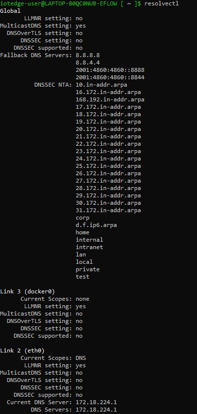

# IoT Edge for Linux on Windows networking

[!INCLUDE [iot-edge-version-1.4](includes/iot-edge-version-1.4.md)]

 This article provides information about how to configure the networking between the Windows host OS and the IoT Edge for Linux on Windows (EFLOW) virtual machine. EFLOW uses a [CBL-Mariner](https://github.com/microsoft/CBL-Mariner) Linux virtual machine in order to run IoT Edge modules. For more information about EFLOW architecture, see [What is Azure IoT Edge for Linux on Windows](./iot-edge-for-linux-on-windows.md).

## Networking
To establish a communication channel between the Windows host OS and the EFLOW virtual machine, we use Hyper-V networking stack. For more information about Hyper-V networking, see [Hyper-V networking basics](/windows-server/virtualization/hyper-v/plan/plan-hyper-v-networking-in-windows-server#hyper-v-networking-basics). Basic networking in EFLOW is simple; it uses two parts, a virtual switch and a virtual network. 

The easiest way to establish basic networking on Windows client SKUs is by using the [**default switch**](/virtualization/community/team-blog/2017/20170726-hyper-v-virtual-machine-gallery-and-networking-improvements#details-about-the-default-switch) already created by the Hyper-V feature. During EFLOW deployment, if no specific virtual switch is specified using the `-vSwitchName` and `-vSwitchType` flags, the virtual machine will be created using the **default switch**.

On Windows Server SKUs devices, networking is a bit more complicated as there's no **default switch** available. However, there's a comprehensive guide on [Azure IoT Edge for Linux on Windows virtual switch creation](./how-to-create-virtual-switch.md). 

To handle different types of networking, you can use different types of virtual switches and add multiple virtual network adapters. 

### Virtual switch choices
EFLOW supports two types of Hyper-V virtual switches: **internal** and **external**. You'll choose which one of each you want when you create it previous to EFLOW deployment. You can use Hyper-V Manager or the Hyper-V module for Windows PowerShell to create and manage virtual switches. For more information about creating a virtual switch, see [Create a virtual switch for Hyper-V virtual machines](/windows-server/virtualization/hyper-v/get-started/create-a-virtual-switch-for-hyper-v-virtual-machines).

You can make some changes to a virtual switch after you create it. For example, it's possible to change an existing switch to a different type, but doing that may affect the networking capabilities of EFLOW virtual machine connected to that switch. So, it's not recommended to do change the virtual switch configuration unless you made a mistake or need to test something. 

Depending if the EFLOW VM is deployed in a Windows client SKU or Windows Server SKU device, we support different types of switches, as shown in the following table.

| Virtual switch type | Windows client SKUs | Windows Server SKUs | 
| ------------------- | ----------- | ----------- |
| **External** |  |  | 
| **Internal** |  -  |  | 
| **Default switch** |    | - | 

- **External virtual switch** - Connects to a wired, physical network by binding to a physical network adapter. It gives virtual machines access to a physical network to communicate with devices on an external network. In addition, it allows virtual machines on the same Hyper-V server to communicate with each other.
- **Internal virtual switch** - Connects to a network that can be used only by the virtual machines running on the host that has the virtual switch, and between the host and the virtual machines.

  >[!NOTE]
  > The **default switch** is a particular internal virtual switch created by default once Hyper-V is enabled in Windows client SKUs. The virtual switch already has a DHCP Server for IP assignments, Internet Connection Sharing (ICS) enabled, and a NAT table. For EFLOW purposes, the Default Switch is a Virtual Internal Switch that can be used without further configuration.

### IP address allocations
To enable EFLOW VM network IP communications, the virtual machine must have an IP address assigned. This IP address can be configured by two different methods: **Static IP** or **DHCP**. 

Depending on the type of virtual switch used, EFLOW VM supports different IP allocations, as shown in the following table.

| Virtual switch type | Static IP | DHCP | 
| ------------------- | ----------- | ----------- |
| **External** |  |  | 
| **Internal** |   |  | 
| **Default switch** | - |  | 

- **Static IP** - This IP address is permanently assigned to the EFLOW VM during installation and doesn't change across EFLOW VM or Windows host reboots. Static IP addresses  typically have two versions: IPv4 and IPv6; however, EFLOW only supports static IP for IPv4 addresses. On networks using static IP, each device on the network has its address with no overlap. During EFLOW installation, you must input the **EFLOW VM IP4 address**(`-ip4Address`), the **IP4 prefix length**(`-ip4PrefixLength`), and the **default gateway IP4 address**(`-ip4GatewayAddress`). All **three** parameters must be input for correct configuration.

    For example, if you want to deploy the EFLOW VM using an *external virtual switch* named *ExternalEflow* with a static IP address *192.168.0.100*, default gateway *192.168.0.1*, and a prefix length of *24*, the following deploy command is needed

    ```powershell
    Deploy-Eflow -vSwitchName "ExternalEflow" -vswitchType "External" -ip4Address 192.168.0.100 -ip4GatewayAddress 192.168.0.1 -ip4PrefixLength 24
    ```

    >[!WARNING]
    > When using static IP, the **three parameters** (`ip4Address`, `ip4GatewayAddres`, `ip4PrefixLength`) must be used. Also, if the IP address is invalid, being used by another device on thee netowrk, or the gateway address is incorrect, EFLOW installation could fail as the EFLOW VM can't get an IP address.

- **DHCP** -  Contrary to static IP, when using DHCP, the EFLOW virtual machine is assigned with a dynamic IP address; which is an address that may change. The network must have a DHCP server configured and operating to assign dynamic IP addresses. The DHCP server assigns a vacant IP address to the EFLOW VM and others connected to the network. Therefore, when deploying EFLOW using DHCP, no IP address, gateway address, or prefix length is needed, as the DHCP server provides all the information. 
    
    >[!WARNING]
    > When deploying EFLOW using DHCP, a DHCP server must be present in the network connected to the EFLOW VM virtual switch. If no DHCP server is present, EFLOW installation with fail as the VM can't get an IP address.


### DNS
Domain Name System (DNS) translates human-readable domain names (for example, www.microsoft.com) to machine-readable IP addresses (for example, 192.0.2.44). The EFLOW virtual machine uses [*systemd*](https://systemd.io/) (system and service manager), so the DNS or name resolution services are provided to local applications and services via the [systemd-resolved](https://www.man7.org/linux/man-pages/man8/systemd-resolved.service.8.html) service. 

By default, the EFLOW VM DNS configuration file contains the local stub *127.0.0.53* as the only DNS server. This is redirected to the */etc/resolv.conf* file, which is used to add the name servers used by the system. The local stub is a DNS server that runs locally to resolve DNS queries. In some cases, these queries are forwarded to another DNS server in the network and then cached locally.

It's possible to configure the EFLOW virtual machine to use a specific DNS server, or list of servers. To do so, you can use the `Set-EflowVmDnsServers` PowerShell cmdlet. For more information about DNS configuration, see [PowerShell functions for IoT Edge for Linux on Windows](./reference-iot-edge-for-linux-on-windows-functions.md#set-eflowvmdnsservers).

To check the DNS servers assigned to the EFLOW VM, from inside the EFLOW VM, use the command: `resolvectl status`. The command's output will show a list of the DNS servers configured for each interface. In particular, it's important to check the *eth0* interface status, which will be the default interface for the EFLOW VM communication. Also, make sure to check the IP addresses of the **Current DNS Server**s and **DNS Servers** fields of the list. If there's no IP address, or the IP address isn't a valid DNS server IP address, then the DNS service won't work.



### Static MAC Address
Hyper-V allows you to create virtual machines with a **static** or **dynamic** MAC address. During EFLOW virtual machine creation, the MAC address is randomly generated and stored locally to keep the same MAC address across virtual machine or Windows host reboots.  To query the EFLOW virtual machine MAC address, you can use the following command.

```powershell
Get-EflowVmAddr
```


### Multiple Network Interface Cards (NICs)
There are many network virtual appliances and scenarios that require multiple NICs. The EFLOW virtual machine supports attaching multiple NICs. With multiple NICs you can better manage your network traffic. You can also isolate traffic between the frontend NIC and backend NICs, or separating data plane traffic from the management plane communication. 

For example, there are numerous of industrial IoT scenarios that require connecting the EFLOW virtual machine to a demilitarized zone (DMZ), and to the offline network where all the OPC UA compliant devices are connected. This is just one of the multiple scenarios that can be supported by attaching multiple NICs to the EFLOW VM. 

For more information about multiple NICs, see [Multiple NICs support](https://github.com/Azure/iotedge-eflow/wiki/Multiple-NICs).

>[!WARNING]
>When using EFLOW multiple NICs feature, you may want to set up the different routes priorities. By default, EFLOW will create one default route per _ehtX_ interface assigned to the VM and assign a random priority. If all interfaces are connected to the internet, random priorities may not be a problem. However, if one of the NICs is connected to an offline network, you may want to prioritize the online NIC over the offline NIC to get the EFLOW VM connected to the internet. For more information about custom routing, see [EFLOW routing](https://github.com/Azure/iotedge-eflow/tree/main/samples/networking/routing).

## Next steps

Read more about [Azure IoT Edge for Linux on Windows Security](./iot-edge-for-linux-on-windows-security.md).

Learn how to manage EFLOW networking [Networking configuration for Azure IoT Edge for Linux on Windows](./how-to-configure-iot-edge-for-linux-on-windows-networking.md)
