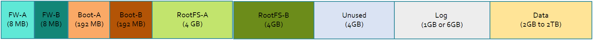
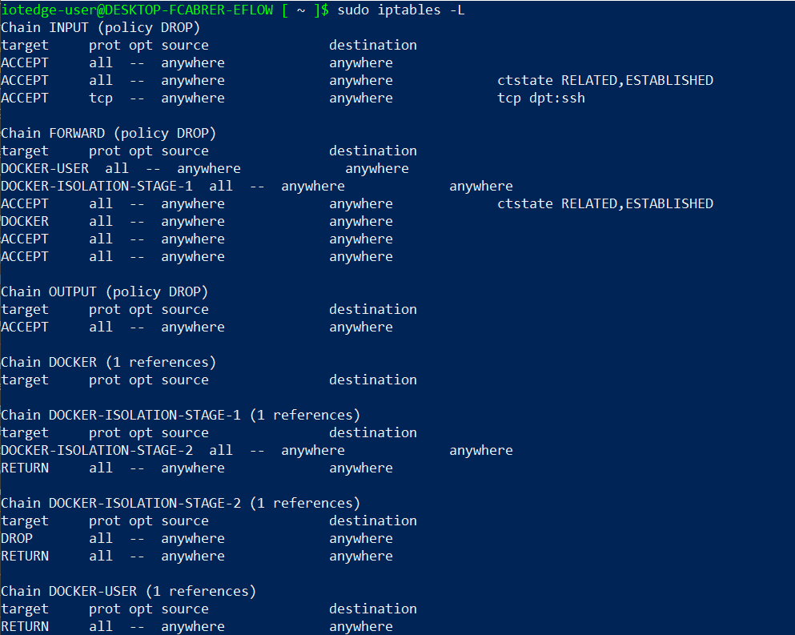

# IoT Edge for Linux on Windows security

[!INCLUDE [iot-edge-version-1.4](includes/iot-edge-version-1.4.md)]

Azure IoT Edge for Linux on Windows benefits from all the security offerings from running on a Windows Client/Server host and ensures all the extra components keep the same security premises. This article provides information about the different security premises that are enabled by default, and some of the optional premises the user may enable.

## Virtual machine security

The IoT Edge for Linux (EFLOW) curated virtual machine is based on [Microsoft CBL-Mariner](https://github.com/microsoft/CBL-Mariner). CBL-Mariner is an internal Linux distribution for Microsoft's cloud infrastructure and edge products and services. CBL-Mariner is designed to provide a consistent platform for these devices and services and  enhances Microsoft's ability to stay current on Linux updates. For more information, see [CBL-Mariner security](https://github.com/microsoft/CBL-Mariner/blob/1.0/SECURITY.md). 

The EFLOW virtual machine is built on a four-point comprehensive security platform:
1. Servicing updates
1. Read-only root filesystem
1. Firewall lockdown
1. DM-Verity

### Servicing updates
When security vulnerabilities arise, CBL-Mariner makes the latest security patches and fixes available for being serviced through ELOW monthly updates. The virtual machine has no package manager, so it's not possible to manually download and install RPM packages. All updates to the virtual machine are installed using EFLOW A/B update mechanism. For more information on EFLOW updates, see [Update IoT Edge for Linux on Windows](./iot-edge-for-linux-on-windows-updates.md)

### Read-only root filesystem
The EFLOW virtual machine is made up of two main partitions *rootfs*, and *data*. The rootFS-A or rootFS-B partitions are interchangeable and one of the two is mounted as a read-only filesystem at `/`, which means that no changes are allowed on files stored inside this partition. On the other hand, the *data* partition mounted under `/var` is readable and writeable, allowing the user to modify the content inside the partition. The data stored on this partition isn't manipulated by the update process and hence won't be modified across updates.

Because you may need write access to `/etc`, `/home`, `/root`, `/var` for specific use cases, write access for these directories is done by overlaying them onto our data partition specifically to the directory `/var/.eflow/overlays`. The end result of this is that users can write anything to the previous mentioned directories. For more information about overlays, see [*overlayfs*](https://docs.kernel.org/filesystems/overlayfs.html).

[  ](./media/iot-edge-for-linux-on-windows-security/eflow-cr-partition-layout.png#lightbox)

| Partition | Size | Description | 
| --------- |---------- |------------ |
| BootEFIA | 8 MB | Firmware partition A for future GRUBless boot |
| BootA | 192 MB | Contains the bootloader for A partition |
| RootFS A | 4 GB | One of two active/passive partitions holding the root file system |
| BootEFIB | 8 MB | Firmware partition B for future GRUBless boot |
| BootB | 192 MB | Contains the bootloader for B partition |
| RootFS B | 4 GB | One of two active/passive partitions holding the root file system |
| Log | 1 GB or 6 GB | Logs specific partition mounted under /logs |
| Data | 2 GB to 2 TB | Stateful partition for storing persistent data across updates. Expandable according to the deployment configuration |

>[!NOTE]
>The partition layout represents the logical disk size and does not indicate the physical space the virtual machine will occupy on the host OS disk.​

### Firewall

By default, the EFLOW virtual machine uses [*iptables*](https://git.netfilter.org/) utility for firewall configurations. *Iptables* is used to set up, maintain, and inspect the tables of IP packet filter rules in the Linux kernel. The default implementation only allows incoming traffic on port 22 (SSH service) and blocks the traffic otherwise. You can check the *iptables* configuration with the following steps:

1. Open an elevated PowerShell session
1. Connect to the EFLOW virtual machine
    ```powershell
    Connect-EflowVm
    ```
1. List all the *iptables* rules
    ```bash
    sudo iptables -L
    ```

    

### Verified boot

The EFLOW virtual machine supports **Verified boot** through the included *device-mapper-verity (dm-verity)* kernel feature, which provides transparent integrity checking of block devices. *dm-verity* helps prevent persistent rootkits that can hold onto root privileges and compromise devices. This feature assures the virtual machine base software image it's the same and it wasn't altered. The virtual machine uses the *dm-verity* feature to check specific block device, the underlying storage layer of the file system, and determine if it matches its expected configuration.

By default, this feature is disabled in the virtual machine, and can be turned on or off. For more information, see [dm-verity](https://www.kernel.org/doc/html/latest/admin-guide/device-mapper/verity.html#).

## Trusted platform module (TPM)
[Trusted platform module (TPM)](/windows/security/information-protection/tpm/trusted-platform-module-top-node) technology is designed to provide hardware-based, security-related functions. A TPM chip is a secure crypto-processor that is designed to carry out cryptographic operations. The chip includes multiple physical security mechanisms to make it tamper resistant, and malicious software is unable to tamper with the security functions of the TPM.

The EFLOW virtual machine doesn't support vTPM. However the user can enable/disable the TPM passthrough feature, that allows the EFLOW virtual machine to use the Windows host OS TPM. This enables two main scenarios:
* Use TPM technology for IoT Edge device provisioning using Device Provision Service (DPS). For more information, see [Create and provision an IoT Edge for Linux on Windows device at scale by using a TPM](./how-to-provision-devices-at-scale-linux-on-windows-tpm.md).
* Read-only access to cryptographic keys stored inside the TPM. For more information, see [Set-EflowVmFeature to enable TPM passthrough](./reference-iot-edge-for-linux-on-windows-functions.md#set-eflowvmfeature).


## Secure host & virtual machine communication
EFLOW provides multiple ways to interact with the virtual machine by exposing a rich PowerShell module implementation. For more information, see [PowerShell functions for IoT Edge for Linux on Windows](./reference-iot-edge-for-linux-on-windows-functions.md#set-eflowvmfeature). This module requires an elevated session to run, and it's signed using a Microsoft Corporation certificate.

All communications between the Windows host operating system and the EFLOW virtual machine required by the PowerShell cmdlets are done using an SSH channel. By default, the virtual machine SSH service won't allow authentication via username and password, and it's limited to certificate authentication. The certificate is created during EFLOW deployment process, and is unique for each EFLOW installation. Furthermore, to prevent SSH brute force attacks, the virtual machine will block an IP address if it attempts more than three connections per minute to SSH service. 

In the EFLOW Continuous Release (CR) version, we introduced a change in the transport channel used to establish the SSH connection. Originally, SSH service runs on TCP port 22, which can be accessed by all external devices in the same network using a TCP socket to that specific port. For security reasons, EFLOW CR runs the SSH service over Hyper-V sockets instead of normal TCP sockets. All communication over Hyper-V sockets runs between the Windows host OS and the EFLOW virtual machine, without using networking. This limits the access of the SSH service, restricting connections to only the Windows host OS. For more information, see [Hyper-V sockets](/virtualization/hyper-v-on-windows/user-guide/make-integration-service).

## Next steps

Read more about [Windows IoT security premises](/windows/iot/iot-enterprise/os-features/security)

Stay up-to-date with the latest [IoT Edge for Linux on Windows updates](./iot-edge-for-linux-on-windows-updates.md).
