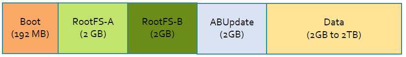

# Security

[!INCLUDE [iot-edge-version-201806-or-202011](../../includes/iot-edge-version-201806-or-202011.md)]

Azure IoT Edge for Linux on Windows benefits from all the security offerings from running on a Windows Client/Server host and ensures all the additional components keep the same security premises.

## Virtual Machine security

The IoT Edge for Linux (EFLOW) curated virtual machine is based on [Microsoft CBL-Mariner](https://github.com/microsoft/CBL-Mariner). CBL-Mariner is an internal Linux distribution for Microsoft’s cloud infrastructure and edge products and services. CBL-Mariner is designed to provide a consistent platform for these devices and services and will enhance Microsoft’s ability to stay current on Linux updates. For more information, see [CBL-Mariner security](https://github.com/microsoft/CBL-Mariner/blob/1.0/SECURITY.md). 

<!-- 1.1 -->
:::moniker range="iotedge-2018-06"
The EFLOW virtual machine is built on a three-point comprehensive security platform:
1. Servicing updates
1. Read-only root filesystem
1. Firewall lockdown

:::moniker-end
<!-- end 1.1 -->

<!-- 1.2 -->
:::moniker range=">=iotedge-2020-11"
The EFLOW virtual machine is built on a four-point comprehensive security platform:
1. Servicing updates
1. Read-only root filesystem
1. Firewall lockdown
1. DM-Verity
:::moniker-end
<!-- end 1.2 -->

### Servicing updates
When security vulnerabilities arise, CBL-Mariner makes the latest security patches and fixes available for being serviced through [EFLOW Updates](./iot-edge-for-linux-on-windows.md). The virtual machine has no package manager, so it's not possible to manually download and install RPM packages.

### Read-only root filesystem
The EFLOW virtual machine is made up of two main partitions _rootfs_, and _data_. The rootFS-A or rootFS-B partitions are interchangeable and one of the two is mounted as a read-only filesystem at “/”, which means that no changes are allowed on files stored inside this partition. On the other hand, the _data_ partition mounted under “/var” is readable and writeable, allowing the user to modify the content inside the partition. The data stored on this partition isn’t manipulated by the update process and hence won't be modified across updates.

Because you may need write access to _/etc_, _/home_, _/root_, _/var_ for specific use cases, write access for these directories is done by overlaying them onto our data partition specifically to the directory _/var/.eflow/overlays_. The end result of this is that users can write anything to the previous mentioned directories. For more information about overlays, refer to [overlayfs](https://docs.kernel.org/filesystems/overlayfs.html).

<!-- 1.1 -->
:::moniker range="iotedge-2018-06"



| Partition | Size | Description | 
| --------- |---------- |------------ |
| Boot | 192 MB | Contains the bootloader |
| RootFS A | 2048 MB | One of two active/passive partitions holding the root file system |
| RootFS B | 2048 MB | One of two active/passive partitions holding the root file system |
| ABUpdate | 2048 MB | Holds the update files. Ensure there's always enough space in the VM for updates |
| Data | 2 GB to 2 TB | Stateful partition for storing persistent data across updates. Expandable according to the deployment configuration |

:::moniker-end
<!-- end 1.1 -->

<!-- 1.2 -->
:::moniker range=">=iotedge-2020-11"


| Partition | Size | Description | 
| --------- |---------- |------------ |
| BootEFIA | 8 MB | Firmware partition A for future GRUBless boot |
| BootEFIB | 8 MB | Firmware partition B for future GRUBless boot |
| BootA | 192 MB | Contains the bootloader for A partition |
| BootB | 192 MB | Contains the bootloader for B partition |
| RootFS A | 4096 MB | One of two active/passive partitions holding the root file system |
| RootFS B | 4096 MB | One of two active/passive partitions holding the root file system |
| Unused | 4096 MB | This partition is reserved for future use |
| Log | 1 GB or 6 GB | Logs specific partition mounted under _/logs |
| Data | 2 GB to 2 TB | Stateful partition for storing persistent data across updates. Expandable according to the deployment configuration |

:::moniker-end
<!-- end 1.2 -->

>[!NOTE]
>The partition layout represents the logical disk size and does not indicate the physical space the virtual machine will occupy on the host OS disk.​

### Firewall

The EFLOW virtual machine is configured to use [_iptables_](https://git.netfilter.org/) by default. Iptables is used to set up, maintain, and inspect the tables of IP packet filter rules in the Linux kernel. The default implementation only allows incoming traffic on port 22 (SSH service) and blocks the traffic otherwise. You can check the _iptables_ configuration with the following steps:

1. Open an elevated PowerShell session
1. Connect to the EFLOW virtual machine
    ```powershell
    Connect-EflowVm
    ```
1. List all the iptables rules
    ```bash
    sudo iptables -L
    ```
    

<!-- 1.2 -->
:::moniker range=">=iotedge-2020-11"
### Verified boot

The EFLOW virtual machine supports **Verified Boot** through the included device-mapper-verity (dm-verity) kernel feature, which provides transparent integrity checking of block devices. _dm-verity_ helps prevent persistent rootkits that can hold onto root privileges and compromise devices. This feature assures the virtual machine it is in the same state as when it was last booted. The virtual machine uses the _dm-verity_ feature to check specific block device, the underlying storage layer of the file system, and determine if it matches its expected configuration.

By default, this feature is enabled in the virtual machine, and can't be turned off. For more information, see [dm-verity](https://www.kernel.org/doc/html/latest/admin-guide/device-mapper/verity.html#).

:::moniker-end
<!-- end 1.2 -->

## Next steps

View the latest [Azure IoT Edge releases](https://github.com/Azure/azure-iotedge/releases).

Stay up-to-date with recent updates and announcements in the [Internet of Things blog](https://azure.microsoft.com/blog/topics/internet-of-things/)