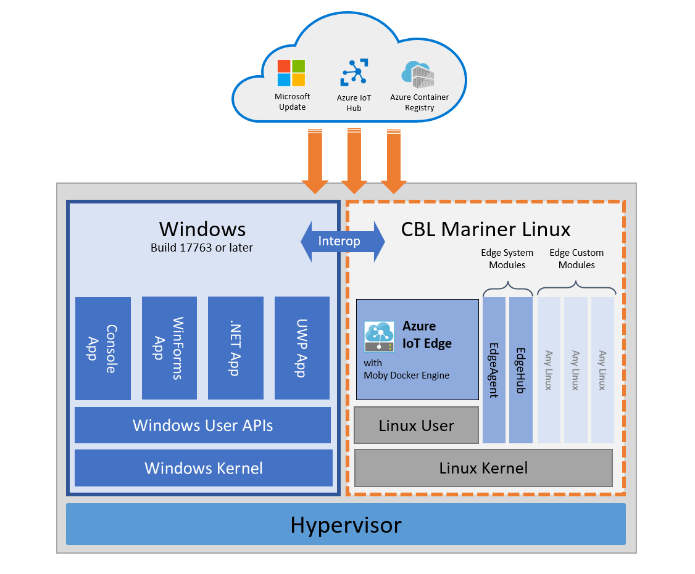

# What is Azure IoT Edge for Linux on Windows

[!INCLUDE [iot-edge-version-1.4](includes/iot-edge-version-1.4.md)]

Azure IoT Edge for Linux on Windows (EFLOW) allows you to run containerized Linux workloads alongside Windows applications in Windows deployments. Businesses that rely on Windows to power their edge devices and solutions can now take advantage of the cloud-native analytics solutions being built in Linux.

Azure IoT Edge for Linux on Windows works by running a Linux virtual machine on a Windows device. The Linux virtual machine comes pre-installed with the Azure IoT Edge runtime. Any Azure IoT Edge modules deployed to the device run inside the virtual machine. Meanwhile, Windows applications running on the Windows host device can communicate with the modules running in the Linux virtual machine.

[Get started](how-to-provision-single-device-linux-on-windows-symmetric.md) today.

## Components

Azure IoT Edge for Linux on Windows uses the following components to enable Linux and Windows workloads to run alongside each other and communicate seamlessly:

* **A Linux virtual machine running Azure IoT Edge**: A Linux virtual machine, based on Microsoft's first party [CBL-Mariner](https://github.com/microsoft/CBL-Mariner) operating system, is built with the Azure IoT Edge runtime and validated as a tier 1 supported environment for Azure IoT Edge workloads.

* **Microsoft Update**: Integration with Microsoft Update keeps the Windows runtime components, the CBL-Mariner Linux VM, and Azure IoT Edge up to date. For more information about IoT Edge for Linux on Windows updates, see [Update IoT Edge for Linux on Windows](./iot-edge-for-linux-on-windows-updates.md).

Bi-directional communication between Windows process and the Linux virtual machine means that Windows processes can provide user interfaces or hardware proxies for workloads run in the Linux containers.

## Prerequisites

A Windows device with the following minimum requirements:

* System Requirements
   * Windows 101/11 (Pro, Enterprise, IoT Enterprise)
   * Windows Server 20191/2022  
   1 Windows 10 and Windows Server 2019 minimum build 17763 with all current cumulative updates installed.

* Hardware requirements
  * Minimum Free Memory: 1 GB
  * Minimum Free Disk Space: 10 GB

For more information about IoT Edge for Linux on Windows requirements, see [Azure IoT Edge for Linux on Windows supported systems](./iot-edge-for-linux-on-windows-support.md).

## Platform support

Azure IoT Edge for Linux on Windows supports both AMD64 and ARM64 architectures. For more information about EFLOW platform support, see [Azure IoT Edge for Linux on Windows supported systems](./iot-edge-for-linux-on-windows-support.md)

## Samples

Azure IoT Edge for Linux on Windows emphasizes interoperability between the Linux and Windows components.

For samples that demonstrate communication between Windows applications and Azure IoT Edge modules, see [EFLOW GitHub](https://aka.ms/AzEFLOW-Samples).

Also, you can use your IoT Edge for Linux on Windows device to act as a transparent gateway for other edge devices. For more information on how to configure EFLOW as a transparent gateway, see [Configure an IoT Edge device to act as a transparent gateway](./how-to-create-transparent-gateway.md).

## Support

Use the Azure IoT Edge support and feedback channels to get assistance with Azure IoT Edge for Linux on Windows.

**Reporting bugs** - Bugs related to Azure IoT Edge for Linux on Windows can be reported on the [iotedge-eflow issues page](https://aka.ms/AzEFLOW-Issues). Bugs related to Azure IoT Edge can be reported on the [issues page](https://github.com/azure/iotedge/issues) of the Azure IoT Edge open-source project.

**Microsoft Customer Support team** - Users who have a [support plan](https://azure.microsoft.com/support/plans/) can engage the Microsoft Customer Support team by creating a support ticket directly from the [Azure portal](https://portal.azure.com/signin/index/?feature.settingsportalinstance=mpac).

**Feature requests** - The Azure IoT Edge product tracks feature requests via the product's [User Voice page](https://feedback.azure.com/d365community/forum/0e2fff5d-f524-ec11-b6e6-000d3a4f0da0).

## Next steps

Watch [Azure IoT Edge for Linux on Windows 10 IoT Enterprise](https://aka.ms/azeflow-show) for more information and a sample in action.

Follow the steps in [Manually provision a single Azure IoT Edge for Linux on a Windows device](how-to-provision-single-device-linux-on-windows-symmetric.md) to set up a device with Azure IoT Edge for Linux on Windows.