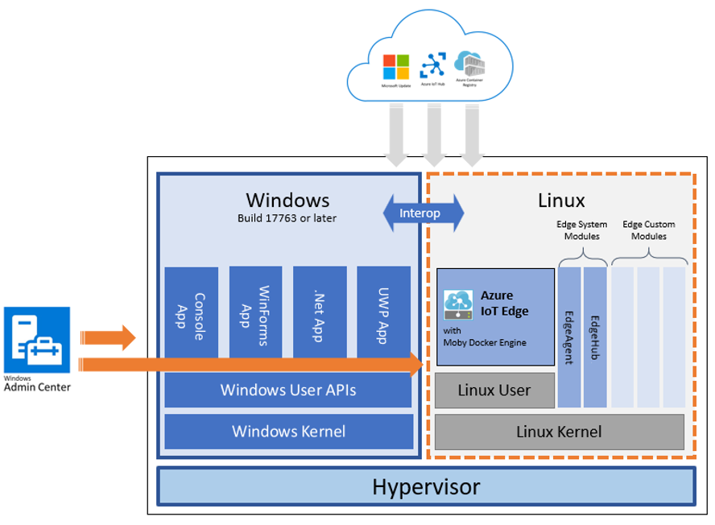

# What is Azure IoT Edge for Linux on Windows

[!INCLUDE [iot-edge-version-201806](../../includes/iot-edge-version-201806.md)]

Azure IoT Edge for Linux on Windows allows you to run containerized Linux workloads alongside Windows applications in Windows IoT deployments. Businesses that rely on Windows IoT to power their edge devices can now take advantage of the cloud-native analytics solutions being built in Linux.

IoT Edge for Linux on Windows works by running a Linux virtual machine on a Windows device. The Linux virtual machine comes pre-installed with the IoT Edge runtime. Any IoT Edge modules deployed to the device run inside the virtual machine. Meanwhile, Windows applications running on the Windows host device can communicate with the modules running in the Linux virtual machine.

[Get started](how-to-install-iot-edge-on-windows.md) today.

## Components

IoT Edge for Linux on Windows uses the following components to enable Linux and Windows workloads to run alongside each other and communicate seamlessly:

* **A Linux virtual machine running Azure IoT Edge**: A Linux virtual machine, based on Microsoft's first party [CBL-Mariner](https://github.com/microsoft/CBL-Mariner) operating system, is built with the IoT Edge runtime and validated as a tier 1 supported environment for IoT Edge workloads.

* **Windows Admin Center**: An IoT Edge extension for Windows Admin Center facilitates installation, configuration, and diagnostics of IoT Edge on the Linux virtual machine. Windows Admin Center can deploy IoT Edge for Linux on Windows on the local device, or can connect to target devices and manage them remotely.

* **Microsoft Update**: Integration with Microsoft Update keeps the Windows runtime components, the CBL-Mariner Linux VM, and IoT Edge up to date.

Bi-directional communication between Windows process and the Linux virtual machine means that Windows processes can provide user interfaces or hardware proxies for workloads run in the Linux containers.

## Samples

IoT Edge for Linux on Windows emphasizes interoperability between the Linux and Windows components.

For samples that demonstrate communication between Windows applications and IoT Edge modules, see [EFLOW & Windows 10 IoT Samples](https://aka.ms/AzEFLOW-Samples).

## Support

Use the IoT Edge support and feedback channels to get assistance with IoT Edge for Linux on Windows.

**Reporting bugs** – Bugs related to Azure IoT Edge for Linux on Windows can be reported on the [iotedge-eflow issues page](https://aka.ms/AzEFLOW-Issues). Bugs related to IoT Edge can be reported on the [issues page](https://github.com/azure/iotedge/issues) of the IoT Edge open-source project.

**Microsoft Customer Support team** – Users who have a [support plan](https://azure.microsoft.com/support/plans/) can engage the Microsoft Customer Support team by creating a support ticket directly from the [Azure portal](https://ms.portal.azure.com/signin/index/?feature.settingsportalinstance=mpac).

**Feature requests** – The Azure IoT Edge product tracks feature requests via the product's [User Voice page](https://feedback.azure.com/forums/907045-azure-iot-edge).

## Next steps

Watch [IoT Edge for Linux on Windows 10 IoT Enterprise](https://aka.ms/azeflow-show) for more information and a sample in action.

Follow the steps in [Install and provision Azure IoT Edge for Linux on a Windows device](how-to-install-iot-edge-on-windows.md) to set up a device with IoT Edge for Linux on Windows.
