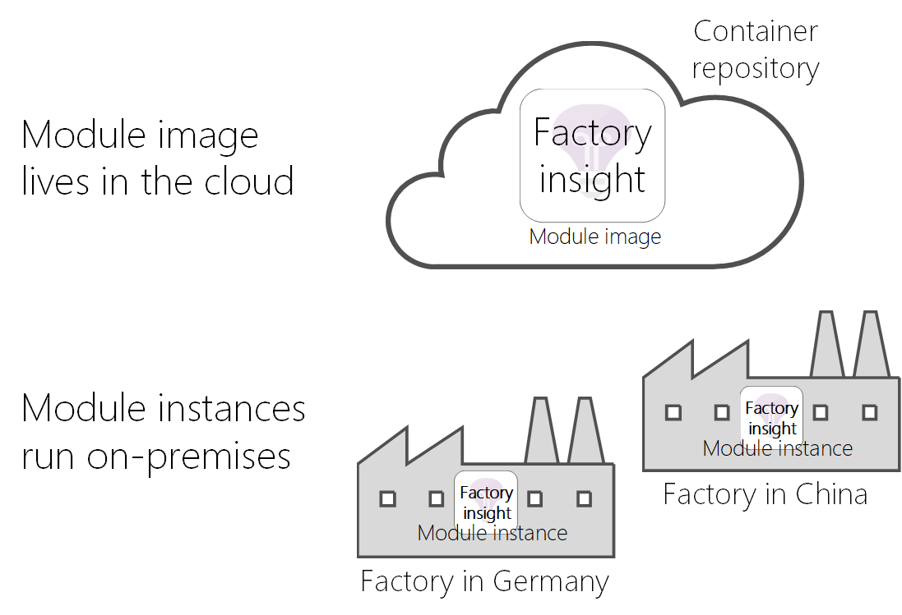
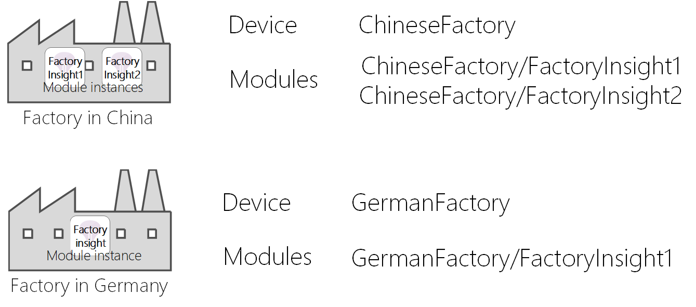

# Understand Azure IoT Edge modules

Azure IoT Edge lets you deploy and manage business logic on the edge in the form of *modules*. Azure IoT Edge modules are the smallest unit of computation managed by IoT Edge, and can contain Azure services (such as Azure Stream Analytics) or your own solution-specific code. To understand how modules are developed, deployed, and maintained, it helps to think of the four conceptual elements of a module:

* A **module image** is a package containing the software that defines a module.
* A **module instance** is the specific unit of computation running the module image on an IoT Edge device. The module instance is started by the IoT Edge runtime.
* A **module identity** is a piece of information (including security credentials) stored in IoT Hub, that is associated to each module instance.
* A **module twin** is a JSON document stored in IoT Hub, that contains state information for a module instance, including metadata, configurations, and conditions. 

## Module images and instances

IoT Edge module images contain applications that take advantage of the management, security, and communication features of the IoT Edge runtime. You can develop your own module images, or export one from a supported Azure service, such as Azure Stream Analytics.
The images exist in the cloud and they can be updated, changed, and deployed in different solutions. For instance, a module that uses machine learning to predict production line output exists as a separate image than a module that uses computer vision to control a drone. 

Each time a module image is deployed to a device and started by the IoT Edge runtime, a new instance of that module is created. Two devices in different parts of the world could use the same module image. However, each device would have its own module instance when the module is started on the device. 



In implementation, modules images exist as container images in a repository, and module instances are containers on devices. 

<!--
As use cases for Azure IoT Edge grow, new types of module images and instances will be created. For example, resource constrained devices cannot run containers so may require module images that exist as dynamic link libraries and instances that are executables. 
-->

## Module identities

When a new module instance is created by the IoT Edge runtime, the instance is associated with a corresponding module identity. The module identity is stored in IoT Hub, and is employed as the addressing and security scope for all local and cloud communications for that specific module instance.

The identity associated with a module instance depends on the identity of the device on which the instance is running and the name you provide to that module in your solution. For instance, if you call `insight` a module that uses an Azure Stream Analytics, and you deploy it on a device called `Hannover01`, the IoT Edge runtime creates a corresponding module identity called `/devices/Hannover01/modules/insight`.

Clearly, in scenarios when you need to deploy one module image multiple times on the same device, you can deploy the same image multiple times with different names.



## Module twins

Each module instance also has a corresponding module twin that you can use to configure the module instance. The instance and the twin are associated with each other through the module identity. 

A module twin is a JSON document that stores module information and configuration properties. This concept parallels the [device twin](../iot-hub/iot-hub-devguide-device-twins.md) concept from IoT Hub. The structure of a module twin is the same as a device twin. The APIs used to interact with both types of twins are also the same. The only difference between the two is the identity used to instantiate the client SDK. 

```csharp
// Create a ModuleClient object. This ModuleClient will act on behalf of a 
// module since it is created with a module’s connection string instead 
// of a device connection string. 
ModuleClient client = new ModuleClient.CreateFromEnvironmentAsync(settings); 
await client.OpenAsync(); 
 
// Get the module twin 
Twin twin = await client.GetTwinAsync(); 
```

## Offline capabilities

Azure IoT Edge modules can operate offline indefinitely after syncing with IoT Hub at least once. IoT Edge devices can also extend this offline capability to other IoT devices. For more information, see [Understand extended offline capabilities for IoT Edge devices, modules, and child devices](offline-capabilities.md).

## Next steps
 - [Understand the requirements and tools for developing IoT Edge modules](module-development.md)
 - [Understand the Azure IoT Edge runtime and its architecture](iot-edge-runtime.md)

