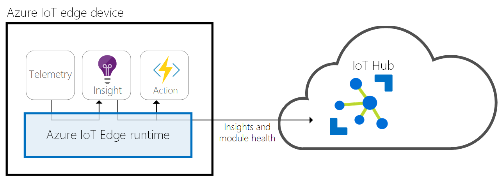
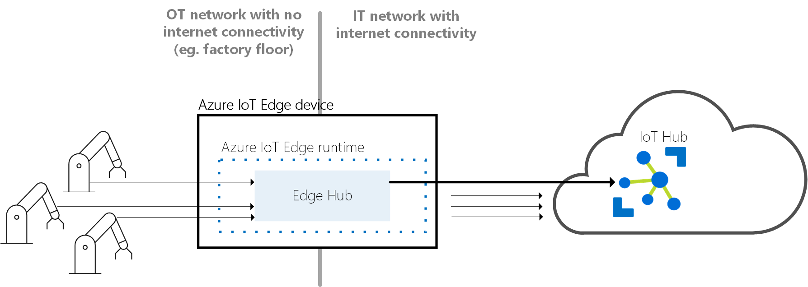
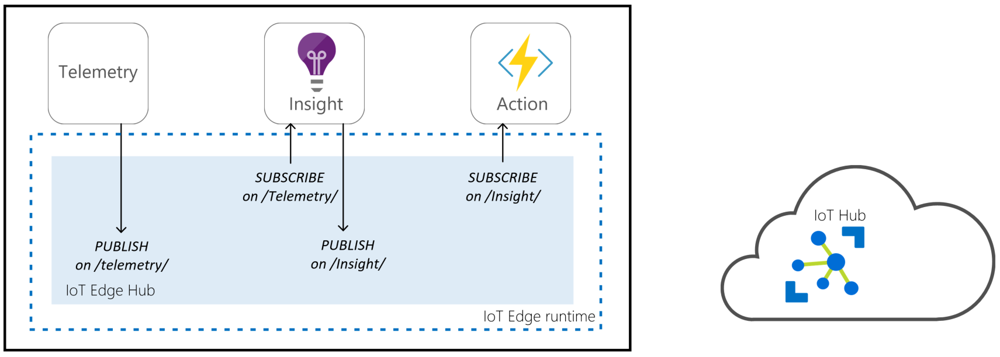

# Understand the Azure IoT Edge runtime and its architecture

The IoT Edge runtime is a collection of programs that turn a device into an IoT Edge device. Collectively, the IoT Edge runtime components enable IoT Edge devices to receive code to run at the edge and communicate the results.

The IoT Edge runtime is responsible for the following functions on IoT Edge devices:

* Install and update workloads on the device.

* Maintain Azure IoT Edge security standards on the device.

* Ensure that [IoT Edge modules](iot-edge-modules.md) are always running.

* Report module health to the cloud for remote monitoring.

* Manage communication between downstream devices and IoT Edge devices.

* Manage communication between modules on an IoT Edge device.

* Manage communication between an IoT Edge device and the cloud.
<!-- 1.2.0 -->
::: moniker range=">=iotedge-2020-11"
* Manage communication between IoT Edge devices.
::: moniker-end



The responsibilities of the IoT Edge runtime fall into two categories: communication and module management. These two roles are performed by two components that are part of the IoT Edge runtime. The *IoT Edge agent* deploys and monitors the modules, while the *IoT Edge hub* is responsible for communication.

Both the IoT Edge agent and the IoT Edge hub are modules, just like any other module running on an IoT Edge device. They're sometimes referred to as the *runtime modules*.

## IoT Edge agent

The IoT Edge agent is one of two modules that make up the Azure IoT Edge runtime. It is responsible for instantiating modules, ensuring that they continue to run, and reporting the status of the modules back to IoT Hub. This configuration data is written as a property of the IoT Edge agent module twin.

The [IoT Edge security daemon](iot-edge-security-manager.md) starts the IoT Edge agent on device startup. The agent retrieves its module twin from IoT Hub and inspects the deployment manifest. The deployment manifest is a JSON file that declares the modules that need to be started.

Each item in the deployment manifest contains specific information about a module and is used by the IoT Edge agent for controlling the module's lifecycle. For more information about all the properties used by the IoT Edge agent to control modules, read about the [Properties of the IoT Edge agent and IoT Edge hub module twins](module-edgeagent-edgehub.md).

The IoT Edge agent sends runtime response to IoT Hub. Here is a list of possible responses:
  
* 200 - OK
* 400 - The deployment configuration is malformed or invalid.
* 417 - The device doesn't have a deployment configuration set.
* 412 - The schema version in the deployment configuration is invalid.
* 406 - The IoT Edge device is offline or not sending status reports.
* 500 - An error occurred in the IoT Edge runtime.

For more information about creating deployment manifests, see [Learn how to deploy modules and establish routes in IoT Edge](module-composition.md).

### Security

The IoT Edge agent plays a critical role in the security of an IoT Edge device. For example, it performs actions like verifying a module's image before starting it.

For more information about the Azure IoT Edge security framework, read about the [IoT Edge security manager](iot-edge-security-manager.md).

## IoT Edge hub

The IoT Edge hub is the other module that makes up the Azure IoT Edge runtime. It acts as a local proxy for IoT Hub by exposing the same protocol endpoints as IoT Hub. This consistency means that clients can connect to the IoT Edge runtime just as they would to IoT Hub.

The IoT Edge hub isn't a full version of IoT Hub running locally. IoT Edge hub silently delegates some tasks to IoT Hub. For example, IoT Edge hub automatically downloads authorization information from IoT Hub on its first connection to enable a device to connect. After the first connection is established, authorization information is cached locally by IoT Edge hub. Future connections from that device are authorized without having to download authorization information from the cloud again.

### Cloud communication

To reduce the bandwidth that your IoT Edge solution uses, the IoT Edge hub optimizes how many actual connections are made to the cloud. IoT Edge hub takes logical connections from modules or downstream devices and combines them for a single physical connection to the cloud. The details of this process are transparent to the rest of the solution. Clients think they have their own connection to the cloud even though they are all being sent over the same connection. The IoT Edge hub can either use the AMQP or the MQTT protocol to communicate upstream with the cloud, independently from protocols used by downstream devices. However, the IoT Edge hub currently only supports combining logical connections into a single physical connection by using AMQP as the upstream protocol and its multiplexing capabilities. AMQP is the default upstream protocol.



IoT Edge hub can determine whether it's connected to IoT Hub. If the connection is lost, IoT Edge hub saves messages or twin updates locally. Once a connection is reestablished, it syncs all the data. The location used for this temporary cache is determined by a property of the IoT Edge hub's module twin. The size of the cache is not capped and will grow as long as the device has storage capacity. For more information, see [Offline capabilities](offline-capabilities.md).

<!-- <1.1> -->
::: moniker range="iotedge-2018-06"

### Module communication

IoT Edge hub facilitates module to module communication. Using IoT Edge hub as a message broker keeps modules independent from each other. Modules only need to specify the inputs on which they accept messages and the outputs to which they write messages. A solution developer can stitch these inputs and outputs together so that the modules process data in the order specific to that solution.


To send data to the IoT Edge hub, a module calls the SendEventAsync method. The first argument specifies on which output to send the message. The following pseudocode sends a message on **output1**:

   ```csharp
   ModuleClient client = await ModuleClient.CreateFromEnvironmentAsync(transportSettings);
   await client.OpenAsync();
   await client.SendEventAsync("output1", message);
   ```

To receive a message, register a callback that processes messages coming in on a specific input. The following pseudocode registers the function messageProcessor to be used for processing all messages received on **input1**:

   ```csharp
   await client.SetInputMessageHandlerAsync("input1", messageProcessor, userContext);
   ```

For more information about the ModuleClient class and its communication methods, see the API reference for your preferred SDK language: [C#](/dotnet/api/microsoft.azure.devices.client.moduleclient), [C](/azure/iot-hub/iot-c-sdk-ref/iothub-module-client-h), [Python](/python/api/azure-iot-device/azure.iot.device.iothubmoduleclient), [Java](/java/api/com.microsoft.azure.sdk.iot.device.moduleclient), or [Node.js](/javascript/api/azure-iot-device/moduleclient).

The solution developer is responsible for specifying the rules that determine how IoT Edge hub passes messages between modules. Routing rules are defined in the cloud and pushed down to IoT Edge hub in its module twin. The same syntax for IoT Hub routes is used to define routes between modules in Azure IoT Edge. For more information, see [Learn how to deploy modules and establish routes in IoT Edge](module-composition.md).


::: moniker-end

<!-- <1.2> -->
::: moniker range=">=iotedge-2020-11"

### Local communication

IoT Edge hub facilitates local communication. It enables device-to-module, module-to-module, device-to-device communications by brokering messages to keep devices and modules independent from each other.

>[!NOTE]
> The MQTT broker feature is in public preview with IoT Edge version 1.2. It must be explicitly enabled.

The IoT Edge hub supports two brokering mechanisms:

1. The [message routing features supported by IoT Hub](../iot-hub/iot-hub-devguide-messages-d2c.md) and,
2. A general-purpose MQTT broker that meets the [MQTT standard v3.1.1](https://docs.oasis-open.org/mqtt/mqtt/v3.1.1/os/mqtt-v3.1.1-os.html)

#### Using routing

The first brokering mechanism leverages the same routing features as IoT Hub to specify how messages are passed between devices or modules. First devices or modules specify the inputs on which they accept messages and the outputs to which they write messages. Then a solution developer can route messages between a source, e.g. outputs, and a destination, e.g. inputs, with potential filters.


Routing can be used by devices or modules built with the Azure IoT Device SDKs either via the AMQP or the MQTT protocol. All messaging IoT Hub primitives, e.g. telemetry, direct methods, C2D, twins, are supported but communication over user-defined topics is not supported.

For more information about routes, see [Learn how to deploy modules and establish routes in IoT Edge](module-composition.md)

#### Using the MQTT broker

The second brokering mechanism is based on a standard MQTT broker. MQTT is a lightweight message transfer protocol that guarantees optimal performances on resource constrained devices and is a popular publish and subscribe standard. Devices or modules subscribe to topics to receive messages published by other devices or modules. IoT Edge hub implements its own MQTT broker that follows [the specifications of MQTT version 3.1.1](https://docs.oasis-open.org/mqtt/mqtt/v3.1.1/os/mqtt-v3.1.1-os.html).

The MQTT broker enables two additional communication patterns compared to routing: local broadcasting and point-to-point communication. Local broadcasting is useful when one device or module needs to locally alert multiple other devices or modules. Point-to-point communication enables two IoT Edge devices or two IoT devices to communicate locally without round-trip to the cloud.



The MQTT broker can be used by devices or modules built with either the Azure IoT Device SDKs that communicate via the MQTT protocol or any general-purpose MQTT clients. With the exception of C2D all messaging IoT Hub primitives, e.g. telemetry, direct methods, twins are supported. IoT Hub special topics used by IoT Hub primitives are supported and so are user-defined topics.
This topic could be an IoT Hub special topic or a user-defined topic.

Unlike with the routing mechanism, ordering of messages is only best-effort and not guaranteed and filtering of messages is not supported by the broker. The lack of these features however enable the MQTT broker to be faster than routing.

For more information about the MQTT broker, see [Publish and subscribe with IoT Edge](how-to-publish-subscribe.md)

#### Comparison between brokering mechanisms

Here are the features available with each brokering mechanism:

|Features  | Routing  | MQTT broker  |
|---------|---------|---------|
|D2C telemetry    |     &#10004;    |         |
|Local telemetry     |     &#10004;    |    &#10004;     |
|DirectMethods     |    &#10004;     |    &#10004;     |
|Twin     |    &#10004;     |    &#10004;     |
|C2D for devices     |   &#10004;      |         |
|Ordering     |    &#10004;     |         |
|Filtering     |     &#10004;    |         |
|User-defined topics     |         |    &#10004;     |
|Device-to-Device     |         |    &#10004;     |
|Local broadcasting     |         |    &#10004;     |
|Performance     |         |    &#10004;     |

### Connecting to the IoT Edge hub

The IoT Edge hub accepts connections from device or module clients, either over the MQTT protocol or the AMQP protocol.

>[!NOTE]
> IoT Edge hub supports clients that connect using MQTT or AMQP. It does not support clients that use HTTP.

When a client connects to the IoT Edge hub, the following happens:

1. If Transport Layer Security (TLS) is used (recommended), a TLS channel is built to establish an encrypted communication between the client and the IoT Edge hub.
2. Authentication information is sent from the client to IoT Edge hub to identify itself.
3. IoT Edge hub authorizes or rejects the connection based on its authorization policy.

#### Secure connections (TLS)

By default, the IoT Edge hub only accepts connections secured with Transport Layer Security (TLS), e.g. encrypted connections that a third party cannot decrypt.

If a client connects on port 8883 (MQTTS) or 5671 (AMQPS) to the IoT Edge hub, a TLS channel must be built. During the TLS handshake, the IoT Edge hub sends its certificate chain that the client needs to validate. In order to validate the certificate chain, the root certificate of the IoT Edge hub must be installed as a trusted certificate on the client. If the root certificate is not trusted, the client library will be rejected by the IoT Edge hub with a certificate verification error.

The steps to follow to install this root certificate of the broker on device clients are described in the [transparent gateway](how-to-create-transparent-gateway.md) and in the [prepare a downstream device](how-to-connect-downstream-device.md#prepare-a-downstream-device) documentation. Modules can use the same root certificate as the IoT Edge hub by leveraging the IoT Edge daemon API.

#### Authentication

The IoT Edge Hub only accepts connections from devices or modules that have an IoT Hub identity, e.g. that have been registered in IoT Hub and have one of the three client authentication methods supported by IoT hub to provide prove their identity: [Symmetric keys authentication](how-to-authenticate-downstream-device.md#symmetric-key-authentication), [X.509 self-signed authentication](how-to-authenticate-downstream-device.md#x509-self-signed-authentication), [X.509 CA signed authentication](how-to-authenticate-downstream-device.md#x509-ca-signed-authentication).  These IoT Hub identities can be verified locally by the IoT Edge hub so connections can still be made while offline.

Notes:

* IoT Edge modules currently only support symmetric key authentication.
* MQTT clients with only local username and passwords are not accepted by the IoT Edge hub MQTT broker, they must use IoT Hub identities.

#### Authorization

Once authenticated, the IoT Edge hub has two ways to authorize client connections:

* By verifying that a client belongs to its set of trusted clients defined in IoT Hub. The set of trusted clients is specified by setting up parent/child or device/module relationships in IoT Hub. When a module is created in IoT Edge, a trust relationship is automatically established between this module and its IoT Edge device. This is the only authorization model supported by the routing brokering mechanism.

* By setting up an authorization policy. This authorization policy is a document listing all the authorized client identities that can access resources on the IoT Edge hub. This is the primary authorization model used by the IoT Edge hub MQTT broker, though parent/child and device/module relationships can also be understood by the MQTT broker for IoT Hub topics.

### Remote configuration

The IoT Edge hub is entirely controlled by the cloud. It gets its configuration from IoT Hub via its [module twin](iot-edge-modules.md#module-twins). It includes:

* Routes configuration
* Authorization policies
* MQTT bridge configuration

Additionally, several configuration can be done by setting up [environment variables on the IoT Edge hub](https://github.com/Azure/iotedge/blob/master/doc/EnvironmentVariables.md).
<!-- </1.2> -->
::: moniker-end

## Runtime quality telemetry

IoT Edge collects anonymous telemetry from the host runtime and system modules to improve product quality. This information is called runtime quality telemetry. The collected telemetry is periodically sent as device-to-cloud messages to IoT Hub from the IoT Edge agent. These messages do not appear in customer's regular telemetry and do not consume any message quota.

The IoT Edge agent and hub generate metrics that you can collect to understand device performance. A subset of these metrics is collected by the IoT Edge Agent as part of runtime quality telemetry. The metrics collected for runtime quality telemetry are labeled with the tag `ms_telemetry`. For information about all the available metrics, see [Access built-in metrics](how-to-access-built-in-metrics.md).

Any personally or organizationally identifiable information, such as device and module names, are removed before upload to ensure the anonymous nature of the runtime quality telemetry.

The IoT Edge agent collects the telemetry every hour and sends one message to IoT Hub every 24 hours.

If you wish to opt out of sending runtime telemetry from your devices, there are two ways to do so:

* Set the `SendRuntimeQualityTelemetry` environment variable to `false` for **edgeAgent**, or
* Uncheck the option in the Azure portal during deployment.

## Next steps

* [Understand Azure IoT Edge modules](iot-edge-modules.md)
* [Learn how to deploy modules and establish routes in IoT Edge](module-composition.md)
* [Learn how to publish and subscribe with IoT Edge](how-to-publish-subscribe.md)
* [Learn about IoT Edge runtime metrics](how-to-access-built-in-metrics.md)
