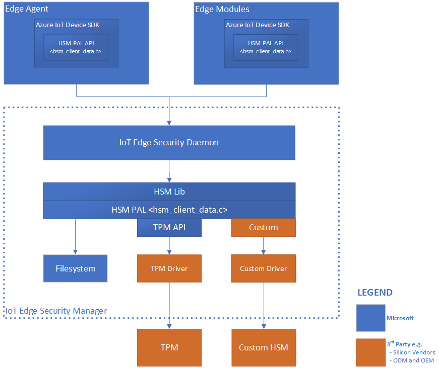

# Azure IoT Edge Security Manager

The Azure IoT Edge Security Manager (ESM) is a well-bounded security core for protecting the IoT Edge device and all its components by abstracting the secure silicon hardware. It is the focal point for security hardening and provides Original Device Manufacturers (OEM) the opportunity to harden their devices based on their choice of hardware root of trust or Hardware Secure Modules (HSM).

ESM aims to defend the interity of the IoT Edge device and all inherent software operations.  It does so by transitioning trust from an underlying hardware root of trust where available to securely boostrap the Edge runtime to a trusted operational state, and then continue to monitor the integrity of operations within the device.  The IoT Edge Security Manager in essence comprises software working in conjunction with secure silicon hardware where available and enabled to help deliver the highest security assurances possible.  

The responsibilities of the Edge Security Manager includes (but not limited to):

1. Secured and measured bootstrapping of the Azure IoT Edge device.
2. Device identity provisioning and transition of trust where applicable.
3. Host and protect device components of cloud services like Device Provisioning Service.
4. Securely provision IoT Edge modules with module unique identity.
5. Gatekeeper to device hardware root of trust through notary services.
6. Monitor the integrity of Egde operations at runtime.

IoT Edge Security Manager comprises three major components:

1. IoT Edge security daemon.
2. Hardware security module platform abstraction Layer (HSM PAL).
3. Optional but highly recommended hardware silicon root of trust or HSM.

## The IoT Edge Security Daemon

IoT Edge security daemon is the software responsible for the logical operations of Edge Security Manager (ESM).  It comprises a significant portion of the trusted computing base of the IoT Edge device. 

### Design Principles

To adequately and practically perform its responsibilities, it is designed to comply with the following core principles:

#### Maximize Operational Integrity

The Edge Security Daemon is designed to operate with the highest integrity possible for any given root of trust hardware. As such, it is designed to be measured and monitored statically and at runtime to resist tampering of any form.  

Given physical accessibility is always a consideration for IoT devices in general, hardware root of trust will play an important role in defending the integrity of the IoT Edge security Daemon.  Hardware root of trust come in two forms:

- Secure Elements for the protection of sensitive information like secrets and cryptographic keys.
- Secure Enclaves for the protection of sensitive information like secrets and cryptographic keys, as well as sensitive logic like metering and trusted I/O.

Existence of these two models for utilizing hardware root of trust gives rise to two kinds of execution environments:

- The Standard or Rich Execution Environment (REE) that rely on the use of Secure Elements to protect sensitive information.
- The Trusted Execution environment (TEE) that rely on the use of Secure Enclave technology to protect sensitive information and offer protection to software execution.

For devices using secure enclaves as hardware root of trust, sensitive logic within the Edge Security Daemon is expected to be protected whithin the enclave while other portions like those that partake in secure marshalling of communicaitons between REE and TEE can reside outside of the TEE.  In anycase, it is expected of Original Design Manufacturers (ODM) and Original Equipment Manufacturers (OEM) to extend trust from their HSM to measure and defend the operational integrity of the Edge Security Daemon at boot and runtime.

#### Minimize Bloat and Churn

Another core principle for the Edge Security Daemon is to minimize churn.  For the highest level of trust, the Edge Security Daemon is designed to couple tightly with the device hardware root of trust where available, and operate as native code.  It is common for these types of realizations to update the daemon software through the hardware root of trust's secure update paths (as opposed to OS provided update mechanisms), which can be challenging depending on specific hardware and deployment scenario.  While security renewal is strong recommendation for IoT devices, it stands to reason that excessive update requirements or large update payloads can expand the threat surface for many reasons.  Examples inlcude skipping of updates to maximize operatinal availability or root of trust hardware too constrained to process large update payloads.  As such, the Edge Security Daemon is designed for the minimal necessary essetials to keep the footprint and hence the trusted computing base small and minimize update requirements.

### Architecture of IoT Edge Security Daemon

The IoT Edge Security Daemon is architected to take advantage of any available hardware root of trust technology for security hardening.  Moreso, it is architected to allow for split-world operation between a Standard/Rich Execution Environment (REE) and a Trusted Execution Environment (TEE) to take advantage of hardware technology that offer trusted execution environments (TEE).  Core to the architecture of the IoT Edge Security Daemon are role specific interfaces  to enable the interplay of major components of Edge to assure the integrity of the IoT Edge device and it's operations.

#### Cloud Interface

The cloud interface allows IoT Edge Security Daemon to access cloud services such as cloud compliments to device security like security renewal.  For example, IoT Edge Security Daemon currently uses this interface to access the Azure IoT Hub [Device Provisioning Service (DPS)](https://docs.microsoft.com/en-us/azure/iot-dps/) for device identity lifecycle management.  

#### Management API

IoT Security Daemon offers a Registration API, which is called by the Edge Agent when creating/starting/stopping/removing an edge module. The IoT Edge Security Daemon stores “registrations” for all active modules. These registrations map a module’s identity to some properties of the module. A few examples for these properties are the process identifier (pid) of the process running in the container or the hash of the docker container’s contents.

These properties are used by the workload API (described below) to attest that the caller is authorized to perform an action.

This is a privileged API, callable only from the Edge Agent.  Since the IoT Security Daemon bootstraps and starts the Edge Agent, it can create an implicit registration for the Edge Agent, after it has attested that the Edge Agent has not been tampered with. The same attestation process that the workload API uses is used to restrict access to the registration API to only the Edge Agent.

#### Container API

IoT Edge Daemon offers the Container Interface to interact with the container system in use like Moby and Docker for module instantiation.

#### Workload API

The workload API is a IoT Edge Security Daemon API which is accessible by all active modules, including the Edge Agent. It provides proof of identity, in the form a HSM rooted signed token or X509 certificate, and corresponding trust bundle to a module. The trust bundle contains CA certificates for all of the other servers that the modules should trust.  The IoT Edge Security Daemon uses an attestation process to guard this API. When a module calls this API, the IoT Edge Security Daemon attempts to find a registration for the identity. If successful, it uses the properties of the registration to measure the module. If the result of the measurement process matches the registration, a new HSM rooted signed token or X509 certificate is generated, and the corresponding CA certificates (trust bundle) are returned to the module.  The module uses this certificate to connect to IoT Hub, other modules, or start a server. 

### Integration and Maintenance

Microsoft maintains the main code base for the [IoT Edge Security Daemon on GitHub](https://github.com/Azure/iotedge/tree/master/edgelet).

#### Installation and Updates

Being a native process, installation and updates of the IoT Edge Security Daemon is managed through the operating system's package management system.  However, it is expected that IoT Edge devices with hardware root of trust and provide additional hardening to the integrity of the daemon by managing it's lifecycle through the devices secure boot and updates management systems.  It is left to devices makers to explore these avenues in accordance with their respective device capabilities.

#### Versioning

The IoT Edge runtime tracks and reports the version of the IoT Edge Security Daemon. The version is reported as the *runtime.platform.version" attribute of the Edge Agent module reported property.

### The Hardware Security Module Platform Abstraction Layer (HSM PAL)

The HSM PAL abstracts all root of trust hardware to isolate the developer or user of IoT Edge from their complexities.  It comprises a combination of Application User Interface (API) and trans domain communications procedures e.g. communication between a standard execution environment and a secure enclave.  The actual implementation of the HSM PAL depends on the specific secure hardware in use.  Its existence enables the use of virtually any secure silicon hardware across the IoT ecosystem.

### The Secure Silicon Root of Trust Hardware

This is the secure silicon that provides the hardware root of trust for the silicon device.  This includes Trusted Platform Module (TPM), embedded Secure Element (eSM), ARM Trustzone, Intel SGX, and custom secure silicon technologies.  The use of secure silicon root of trust in devices is optional with potential rational explained by Device Security Promises, but is highly recommended as the IoT threat surface continues to expand with growth in computation analytical technologies.

## Edge Security Manager Integration and Maintenance

One major goal of the IoT Edge Security Manager is to identity and isolate the components chattered with definding the security and integrity of the Azure IoT Edge platform for custom hardening.  As such it is expected of third parties like device makers to make use of custom security features available with their device hardware.  See next steps section below on links to example on how to harden the Azure IoT Security Manager with the Trusted Platform Module (TPM) on Linux and Windows platforms.  These examples uses software or virtual TPMs but directly applies to using discrete TPM devices.  

## Next steps

Read the blog on [Securing the intelligent edge](https://azure.microsoft.com/en-us/blog/securing-the-intelligent-edge/).

Create and provision an Edge device with a [virtual TPM on a Linux virtual machine](https://docs.microsoft.com/en-us/azure/iot-edge/how-to-auto-provision-simulated-device-linux).

Create and provision a [simulated TPM Edge device on Windows](https://docs.microsoft.com/en-us/azure/iot-edge/how-to-auto-provision-simulated-device-windows).

<!-- Links -->
[lnk-edge-blog]: https://azure.microsoft.com/blog/securing-the-intelligent-edge/ 