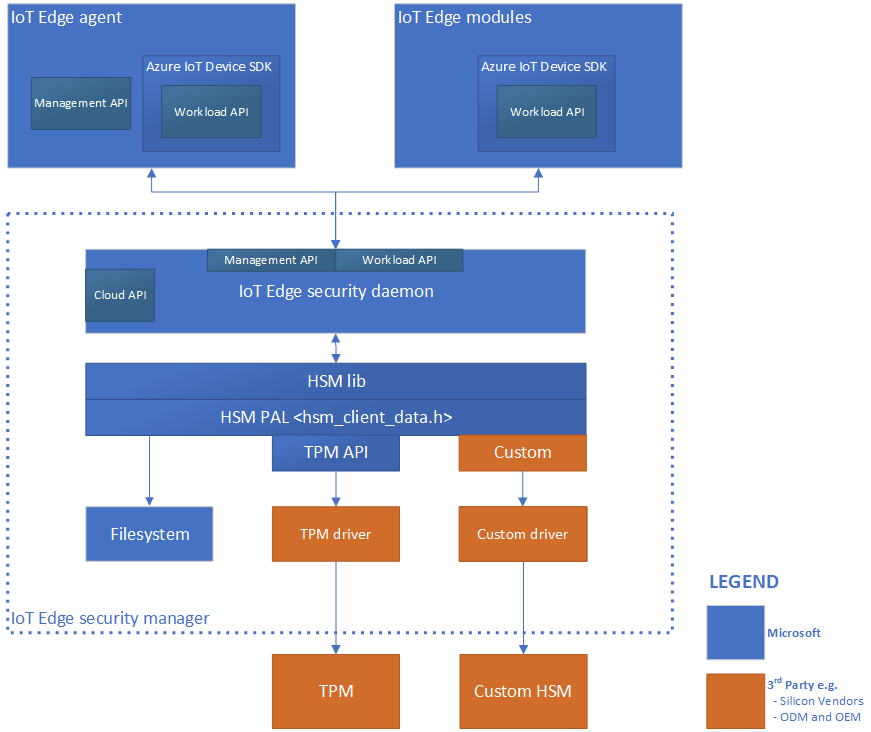
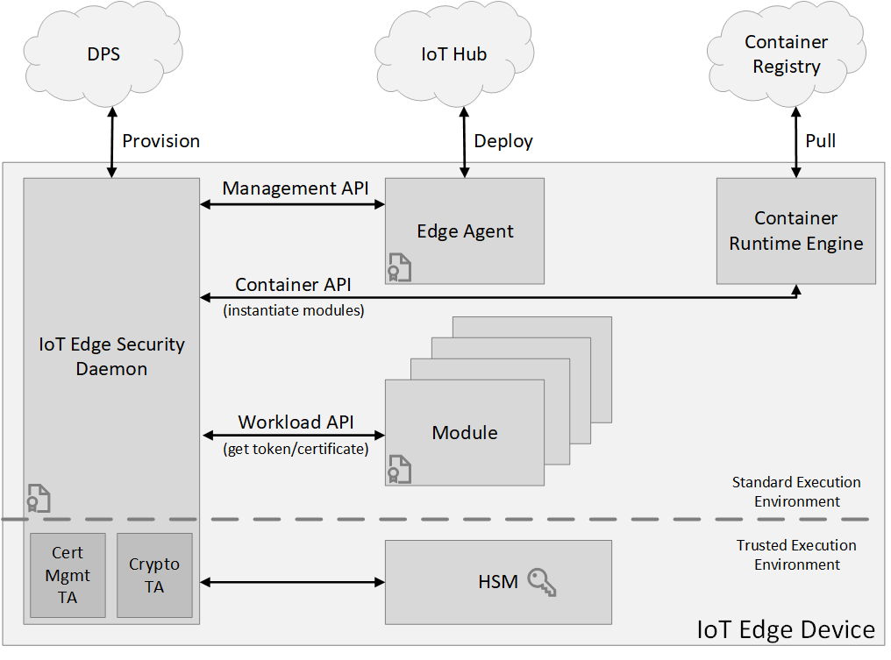

# Azure IoT Edge security manager

The Azure IoT Edge security manager is a well-bounded security core for protecting the IoT Edge device and all its components by abstracting the secure silicon hardware. It is the focal point for security hardening and provides technology integration point to original device manufacturers (OEM).

IoT Edge security manager aims to defend the integrity of the IoT Edge device and all inherent software operations.  It does so by transitioning trust from underlying hardware root of trust hardware (if available) to securely bootstrap IoT Edge runtime and continue to monitor the integrity of its operations.  The IoT Edge security manager is software working along with secure silicon hardware (where available) to help deliver the highest security assurances possible.  

The responsibilities of the IoT Edge security manager include, but aren't limited to:

* Secured and measured bootstrapping of the Azure IoT Edge device.
* Device identity provisioning and transition of trust where applicable.
* Host and protect device components of cloud services like Device Provisioning Service.
* Securely provision IoT Edge modules with unique identities.
* Gatekeeper to device hardware root of trust through notary services.
* Monitor the integrity of IoT Edge operations at runtime.

IoT Edge security manager includes three components:

* IoT Edge security daemon.
* Hardware security module platform abstraction Layer (HSM PAL).
* Optional but highly recommended hardware silicon root of trust or HSM.

## The IoT Edge security daemon

IoT Edge security daemon is the software responsible for the logical operations of IoT Edge security manager. It is a significant portion of the trusted computing base of the IoT Edge device. 

### Design principles

The IoT Edge security daemon follows two core principles: maximize operational integrity, and minimize bloat and churn.

#### Maximize operational integrity

IoT Edge security daemon operates with the highest integrity possible within the defense capability of any given root of trust hardware. With proper integration, the root of trust hardware measures and monitors the security daemon statically and at runtime to resist tampering.

Physical access is always a threat to IoT devices. Hardware root of trust plays an important role in defending the integrity of the IoT Edge security daemon.  Hardware root of trust come in two flavors:

* secure elements for the protection of sensitive information like secrets and cryptographic keys.
* secure enclaves for the protection of secrets like keys, and sensitive workloads like metering and billing.

Two kinds of execution environments exist to utilize hardware root of trust:

* The standard or rich execution environment (REE) that rely on the use of secure elements to protect sensitive information.
* The trusted execution environment (TEE) that rely on the use of secure enclave technology to protect sensitive information and offer protection to software execution.

For devices using secure enclaves as hardware root of trust, sensitive logic within IoT Edge security daemon is expected to reside within the enclave.  Non-sensitive portions of the security daemon can reside outside of the TEE.  In any case, it is expected of original design manufacturers (ODM) and original equipment manufacturers (OEM) to extend trust from their HSM to measure and defend the integrity of the IoT Edge security daemon at boot and runtime.

#### Minimize bloat and churn

Another core principle for the IoT Edge security daemon is to minimize churn.  For the highest level of trust, the IoT Edge security daemon can tightly couple with the device hardware root of trust and operate as native code.  It is common for these types of realizations to update the daemon software through the hardware root of trust's secure update paths (as opposed to OS provided update mechanisms), which can be challenging depending on specific hardware and deployment scenario.  While security renewal is strong recommendation for IoT devices, it stands to reason that excessive update requirements or large update payloads can expand the threat surface in many ways.  Examples include skipping of updates to maximize operational availability or root of trust hardware too constrained to process large update payloads.  As such, the design of IoT Edge security daemon is concise to keep the footprint and hence the trusted computing base small and to minimize update requirements.

### Architecture of IoT Edge security daemon

The IoT Edge security daemon is architected to take advantage of any available hardware root of trust technology for security hardening.  It also allows for split-world operation between a Standard/Rich Execution Environment (REE) and a Trusted Execution Environment (TEE) when hardware technologies offer trusted execution environments. Role-specific interfaces enable the interplay of major components of IoT Edge to assure the integrity of the IoT Edge device and its operations.

#### Cloud interface

The cloud interface allows IoT Edge security daemon to access cloud services such as cloud compliments to device security like security renewal.  For example, IoT Edge security daemon currently uses this interface to access the Azure IoT Hub [Device Provisioning Service (DPS)](https://docs.microsoft.com/azure/iot-dps/) for device identity lifecycle management.  

#### Management API

IoT Edge security daemon offers a management API, which is called by the IoT Edge agent when creating/starting/stopping/removing an edge module. The IoT Edge security daemon stores “registrations” for all active modules. These registrations map a module’s identity to some properties of the module. A few examples for these properties are the process identifier (pid) of the process running in the container or the hash of the docker container’s contents.

These properties are used by the workload API (described below) to attest that the caller is authorized to perform an action.

The Management API is a privileged API, callable only from the IoT Edge agent.  Since the IoT Edge security daemon bootstraps and starts the IoT Edge agent, it can create an implicit registration for the IoT Edge agent, after it has attested that the IoT Edge agent has not been tampered with. The same attestation process that the workload API uses is used to restrict access to the management API to only the IoT Edge agent.

#### Container API

IoT Edge security daemon offers the container interface to interact with the container system in use like Moby and Docker for module instantiation.

#### Workload API

The workload API is an IoT Edge security daemon API accessible to all modules, including IoT Edge agent. It provides proof of identity, either an HSM rooted signed token or X509 certificate, and corresponding trust bundle to a module. The trust bundle contains CA certificates for all the other servers that the modules should trust.

IoT Edge security daemon uses an attestation process to guard this API. When a module calls this API, IoT Edge security daemon attempts to find a registration for the identity. If successful, it uses the properties of the registration to measure the module. If the result of the measurement process matches the registration, a new HSM rooted signed token or X509 certificate is generated. The corresponding CA certificates (trust bundle) are returned to the module.  The module uses this certificate to connect to IoT Hub, other modules, or start a server. When the signed token or certificate nears expiration, it is the responsibility of the module to request a new certificate. 

### Integration and maintenance

Microsoft maintains the main code base for the [IoT Edge security daemon on GitHub](https://github.com/Azure/iotedge/tree/master/edgelet).

#### Installation and updates

Installation and updates of the IoT Edge security daemon are managed through the operating system's package management system. IoT Edge devices with hardware root of trust should provide additional hardening to the integrity of the daemon by managing its lifecycle through the secure boot and updates management systems.  It is left to devices makers to explore these avenues in accordance with their respective device capabilities.

#### Versioning

The IoT Edge runtime tracks and reports the version of the IoT Edge security daemon. The version is reported as the *runtime.platform.version* attribute of the IoT Edge agent module reported property.

### Hardware security module platform abstraction layer (HSM PAL)

The HSM PAL abstracts all root of trust hardware to isolate the developer or user of IoT Edge from their complexities.  It comprises a combination of Application Programming Interface (API) and trans domain communications procedures, for example communication between a standard execution environment and a secure enclave.  The actual implementation of the HSM PAL depends on the specific secure hardware in use. Its existence enables the use of virtually any secure silicon hardware.

## Secure silicon root of trust hardware

Secure silicon is necessary to anchor trust inside the IoT Edge device hardware.  Secure silicon come in variety to include Trusted Platform Module (TPM), embedded Secure Element (eSE), ARM TrustZone, Intel SGX, and custom secure silicon technologies.  The use of secure silicon root of trust in devices is highly recommended given the threats associated with physically accessibility of IoT devices.

## IoT Edge security manager integration and maintenance

The IoT Edge security manager aims to identify and isolate the components that defend the security and integrity of the Azure IoT Edge platform for custom hardening. Third parties, like device makers, should make use of custom security features available with their device hardware.  See next steps section for links that demonstrate how to harden the Azure IoT security manager with the Trusted Platform Module (TPM) on Linux and Windows platforms. These examples use software or virtual TPMs but directly apply to using discrete TPM devices.  

## Next steps

Read the blog on [Securing the intelligent edge](https://azure.microsoft.com/blog/securing-the-intelligent-edge/).

Create and provision an [IoT Edge device with a virtual TPM on a Linux virtual machine](how-to-auto-provision-simulated-device-linux.md).

Create and provision an [IoT Edge device with a simulated TPM on Windows](how-to-auto-provision-simulated-device-windows.md).
