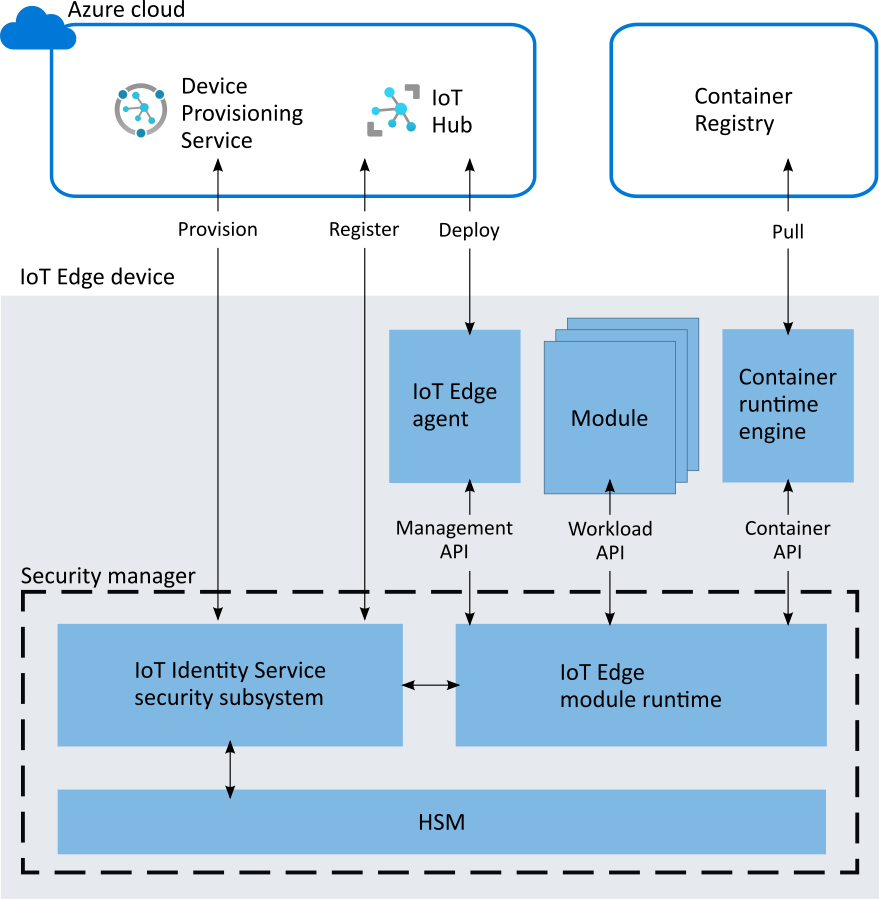

# Azure IoT Edge security manager

[!INCLUDE [iot-edge-version-1.4](includes/iot-edge-version-1.4.md)]

The Azure IoT Edge security manager is a well-bounded security core for protecting the IoT Edge device and all its components by abstracting the secure silicon hardware. The security manager is the focal point for security hardening and provides technology integration point to original equipment manufacturers (OEM).

The security manager abstracts the secure silicon hardware on an IoT Edge device and provides an extensibility framework for additional security services.

The IoT Edge security manager aims to defend the integrity of the IoT Edge device and all inherent software operations. The security manager transitions trust from underlying hardware root of trust hardware (if available) to bootstrap the IoT Edge runtime and monitor ongoing operations.  The IoT Edge security manager is software working along with secure silicon hardware (where available) to help deliver the highest security assurances possible.  

Additionally, the IoT Edge security manager provides a safe framework for security service extensions through host-level modules. These services include security monitoring and updates that require agents inside the device with privileged access to some components of the device. The extensibility framework ensures that such integrations consistently uphold overall system security.

The responsibilities of the IoT Edge security manager include, but aren't limited to:

* Bootstrap the Azure IoT Edge device.
* Control access to the device hardware root of trust through notary services.
* Monitor the integrity of IoT Edge operations at runtime.
* Provision the device identity and manage transition of trust where applicable.
* Ensure safe operation of client agents for services including Device Update for IoT Hub and Microsoft Defender for IoT.

The IoT Edge security manager consists of three components:

* The IoT Edge module runtime
* Hardware security module (HSM) abstractions through standard implementations such as PKCS#11 and Trusted Platform Module (TPM)
* A hardware silicon root of trust or HSM (optional, but highly recommended)

## Changes in version 1.2 and later

In versions 1.0 and 1.1 of IoT Edge, a component called the **security daemon** was responsible for the logical security operations of the security manager. In the update to version 1.2, several key responsibilities were delegated to the [Azure IoT Identity Service](https://azure.github.io/iot-identity-service/) security subsystem. Once these security-based tasks were removed from the security daemon, its name no longer made sense. To better reflect the work that this component does in version 1.2 and beyond, we renamed it to the **module runtime**.

## The IoT Edge module runtime

The IoT Edge module runtime delegates trust from the [Azure IoT Identity Service](https://azure.github.io/iot-identity-service/) security subsystem to protect the IoT Edge container runtime environment. One service, now delegated to Azure IoT Identity Service, is the automated certificate enrollment and renewal service through an EST server. To see how this works and create a sample EST server made for an IoT Edge device, try the [Configure Enrollment over Secure Transport Server for Azure IoT Edge](tutorial-configure-est-server.md) tutorial.

The module runtime is responsible for the logical security operations of the security manager. It represents a significant portion of the trusted computing base of the IoT Edge device. The module runtime uses security services from the IoT Identity Service, which is in turn hardened by the device manufacturer's choice of hardware security module (HSM). We strongly recommend the use of HSMs for device hardening.

### Design principles

IoT Edge follows two core principles: maximize operational integrity, and minimize bloat and churn.

#### Maximize operational integrity

The IoT Edge module runtime operates with the highest integrity possible within the defense capability of any given root of trust hardware. With proper integration, the root of trust hardware measures and monitors the security daemon statically and at runtime to resist tampering.

Malicious physical access to devices is always a threat in IoT. Hardware root of trust plays an important role in defending the integrity of the IoT Edge device.  Hardware root of trust come in two varieties:

* Secure elements for the protection of sensitive information like secrets and cryptographic keys.
* Secure enclaves for the protection of secrets like keys, and sensitive workloads like confidential machine learning models and metering operations.

Two kinds of execution environments exist to use hardware root of trust:

* The standard or rich execution environment (REE) that relies on the use of secure elements to protect sensitive information.
* The trusted execution environment (TEE) that relies on the use of secure enclave technology to protect sensitive information and offer protection to software execution.

For devices using secure enclaves as hardware root of trust, sensitive logic within the IoT Edge module runtime should be inside the enclave.  Non-sensitive portions of the module runtime can be outside of the TEE.  In all cases, we strongly recommend that original design manufacturers (ODM) and original equipment manufacturers (OEM) extend trust from their HSM to measure and defend the integrity of the IoT Edge module runtime at boot and runtime.

#### Minimize bloat and churn

Another core principle for the IoT Edge module runtime is to minimize churn.  For the highest level of trust, the IoT Edge module runtime can tightly couple with the device hardware root of trust and operate as native code.  In these cases, it's common to update the IoT Edge software through the hardware root of trust's secure update paths rather than the operating system's update mechanisms, which can be challenging.  Security renewal is recommended for IoT devices, but excessive update requirements or large update payloads can expand the threat surface in many ways. For example, you may be tempted to skip some updates in order to maximize device availability. As such, the design of the IoT Edge module runtime is concise to keep the well-isolated trusted computing base small to encourage frequent updates.

### Architecture

The IoT Edge module runtime takes advantage of any available hardware root of trust technology for security hardening.  It also allows for split-world operation between a standard/rich execution environment (REE) and a trusted execution environment (TEE) when hardware technologies offer trusted execution environments. Role-specific interfaces enable the major components of IoT Edge to assure the integrity of the IoT Edge device and its operations.

#### Cloud interface

The cloud interface enables access to cloud services that complement device security.  For example, this interface allows access to the [Device Provisioning Service](../iot-dps/index.yml) for device identity lifecycle management.  

#### Management API

The management API is called by the IoT Edge agent when creating/starting/stopping/removing an IoT Edge module. The module runtime stores "registrations" for all active modules. These registrations map a module's identity to some properties of the module. For example, these module properties include the process identifier (pid) of the process running in the container and the hash of the docker container's contents.

These properties are used by the workload API (described below) to verify that the caller is authorized for an action.

The management API is a privileged API, callable only from the IoT Edge agent.  Since the IoT Edge module runtime bootstraps and starts the IoT Edge agent, it verifies that the IoT Edge agent hasn't been tampered with, then it can create an implicit registration for the IoT Edge agent. The same attestation process that the workload API uses also restricts access to the management API to only the IoT Edge agent.

#### Container API

The container API interacts with the container system in use for module management, like Moby or Docker.

#### Workload API

The workload API is accessible to all modules. It provides proof of identity, either as an HSM rooted signed token or an X509 certificate, and the corresponding trust bundle to a module. The trust bundle contains CA certificates for all the other servers that the modules should trust.

The IoT Edge module runtime uses an attestation process to guard this API. When a module calls this API, the module runtime attempts to find a registration for the identity. If successful, it uses the properties of the registration to measure the module. If the result of the measurement process matches the registration, a new proof of identity is generated. The corresponding CA certificates (trust bundle) are returned to the module.  The module uses this certificate to connect to IoT Hub, other modules, or start a server. When the signed token or certificate nears expiration, it's the responsibility of the module to request a new certificate.

### Integration and maintenance

Microsoft maintains the main code base for the [IoT Edge module runtime](https://github.com/Azure/iotedge/tree/master/edgelet) and the [Azure IoT identity service](https://github.com/Azure/iot-identity-service) on GitHub.

When you read the IoT Edge codebase, remember that the **module runtime** evolved from the **security daemon**. The codebase may still contain references to the security daemon.

#### Installation and updates

Installation and updates of the IoT Edge module runtime are managed through the operating system's package management system. IoT Edge devices with hardware root of trust should provide additional hardening to the integrity of the module runtime by managing its lifecycle through the secure boot and updates management systems. Device makers should explore these avenues based on their respective device capabilities.

#### Versioning

The IoT Edge runtime tracks and reports the version of the IoT Edge module runtime. The version is reported as the *runtime.platform.version* attribute of the IoT Edge agent module reported property.

## Hardware security module

The IoT Edge security manager implements the Trusted Platform Module and PKCS#11 interface standards for integrating hardware security modules (HSMs). With these standards, virtually any HSM, including those with proprietary interfaces, can be integrated. We strongly recommend using HSMs for security hardening.

## Secure silicon root of trust hardware

Secure silicon is necessary to anchor trust inside the IoT Edge device hardware.  Secure silicon come in variety to include Trusted Platform Module (TPM), embedded Secure Element (eSE), Arm TrustZone, Intel SGX, and custom secure silicon technologies.  The use of secure silicon root of trust in devices is recommended given the threats associated with physical accessibility of IoT devices.

The IoT Edge security manager aims to identify and isolate the components that defend the security and integrity of the Azure IoT Edge platform for custom hardening. Third parties, like device makers, should make use of custom security features available with their device hardware.  

Learn how to harden the Azure IoT security manager with the Trusted Platform Module (TPM) using software or virtual TPMs:  

Create and provision an IoT Edge device with a virtual TPM on [Linux](how-to-provision-devices-at-scale-linux-tpm.md) or [Linux on Windows](how-to-provision-devices-at-scale-linux-on-windows-tpm.md).

## Next steps

To learn more about securing your IoT Edge devices, read the following blog posts:

* [Securing the intelligent edge](https://azure.microsoft.com/blog/securing-the-intelligent-edge/).
* [The blueprint to securely solve the elusive zero-touch provisioning of IoT devices at scale](https://azure.microsoft.com/blog/the-blueprint-to-securely-solve-the-elusive-zerotouch-provisioning-of-iot-devices-at-scale/)
* [Solving IoT device security at scale through standards](https://azure.microsoft.com/blog/solving-iot-device-security-at-scale-through-standards/)
