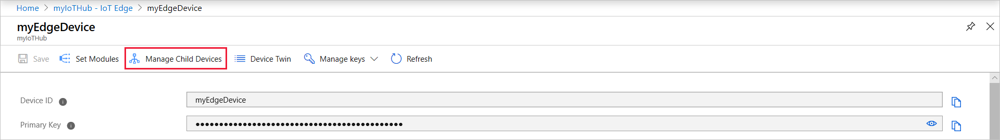

# Understand extended offline capabilities for IoT Edge devices, modules, and child devices

Azure IoT Edge supports extended offline operations on your IoT Edge devices, and enables offline operations on non-IoT Edge child devices too. As long as an IoT Edge device has had one opportunity to connect to IoT Hub, it and any child devices can continue to function with intermittent or no internet connection. 


## How it works

When an IoT Edge device goes into offline mode, the IoT Edge hub takes on three roles. First, it stores any messages that would go upstream and saves them until the device reconnects. Second, it acts on behalf of IoT Hub to authenticate modules and child devices so that they can continue to operate. Third, it enables communication between child devices that normally would go through IoT Hub. 

The following example shows how an IoT Edge scenario operates in offline mode:

1. **Configure devices**

   IoT Edge devices automatically have offline capabilities enabled. To extend that capability to other IoT devices, you need to declare a parent-child relationship between the devices in IoT Hub. Then, you configure the child devices to trust their assigned parent device and route the device-to-cloud communications through the parent as a gateway. 

2. **Sync with IoT Hub**

   At least once after installation of the IoT Edge runtime, the IoT Edge device needs to be online to sync with IoT Hub. In this sync, the IoT Edge device gets details about any child devices assigned to it. The IoT Edge device also securely updates its local cache to enable offline operations and retrieves settings for local storage of telemetry messages. 

3. **Go offline**

   While disconnected from IoT Hub, the IoT Edge device, its deployed modules, and any children IoT devices can operate indefinitely. Modules and child devices can start and restart by authenticating with the IoT Edge hub while offline. Telemetry bound upstream to IoT Hub is stored locally. Communication between modules or between child IoT devices is maintained through direct methods or messages. 

4. **Reconnect and resync with IoT Hub**

   Once the connection with IoT Hub is restored, the IoT Edge device syncs again. Locally stored messages are delivered in the same order in which they were stored. Any differences between the desired and reported properties of the modules and devices are reconciled. The IoT Edge device updates any changes to its set of assigned child IoT devices.

## Restrictions and limits

The extended offline capabilities described in this article are available in [IoT Edge version 1.0.4 or higher](https://github.com/Azure/azure-iotedge/releases). Earlier versions have a subset of offline features. Existing IoT Edge devices that don't have extended offline capabilities can't be upgraded by changing the runtime version, but must be reconfigured with a new IoT Edge device identity to gain these features. 

Extended offline support is available in all regions where IoT Hub is available, **except** East US.

Only non-IoT Edge devices can be added as child devices. 

IoT Edge devices and their assigned child devices can function indefinitely offline after the initial, one-time sync. However, storage of messages depends on the time to live (TTL) setting and the available disk space for storing the messages. 

## Set up parent and child devices

For an IoT Edge device to extend its extended offline capabilities to child IoT devices, you need to complete two steps. First, declare the parent-child relationships in the Azure portal. Second, create a trust relationship between the parent device and any child devices, then configure device-to-cloud communications to go through the parent as a gateway. 

### Assign child devices

Child devices can be any non-IoT Edge device registered to the same IoT Hub. Parent devices can have multiple child devices, but a child device only has one parent. There are three options to set child devices to an edge device: through the Azure portal, using the Azure CLI, or using the IoT Hub service SDK. 

The following sections provide examples of how you can declare the parent/child relationship in IoT Hub for existing IoT devices. If you're creating new device identities for your child devices, see [Authenticate a downstream device to Azure IoT Hub](how-to-authenticate-downstream-device.md) for more information.

#### Option 1: IoT Hub Portal

You can declare the parent-child relationship when creating a new device. Or for existing devices, you can declare the relationship from the device details page of either the parent IoT Edge device or the child IoT device. 

   


#### Option 2: Use the `az` command-line tool

Using the [Azure command-line interface](https://docs.microsoft.com/cli/azure/?view=azure-cli-latest) with [IoT extension](https://github.com/azure/azure-iot-cli-extension) (v0.7.0 or newer), you can manage parent child relationships with the [device-identity](https://docs.microsoft.com/cli/azure/ext/azure-cli-iot-ext/iot/hub/device-identity?view=azure-cli-latest) subcommands. The example below uses a query to assign all non-IoT Edge devices in the hub to be child devices of an IoT Edge device. 

```shell
# Set IoT Edge parent device
egde_device="edge-device1"

# Get All IoT Devices
device_list=$(az iot hub query \
        --hub-name replace-with-hub-name \
        --subscription replace-with-sub-name \
        --resource-group replace-with-rg-name \
        -q "SELECT * FROM devices WHERE capabilities.iotEdge = false" \
        --query 'join(`, `, [].deviceId)' -o tsv)

# Add all IoT devices to IoT Edge (as child)
az iot hub device-identity add-children \
  --device-id $egde_device \
  --child-list $device_list \
  --hub-name replace-with-hub-name \
  --resource-group replace-with-rg-name \
  --subscription replace-with-sub-name 
```

You can modify the [query](../iot-hub/iot-hub-devguide-query-language.md) to select a different subset of devices. The command may take several seconds if you specify a large set of devices.

#### Option 3: Use IoT Hub Service SDK 

Finally, you can manage parent child relationships programmatically using either C#, Java or Node.js IoT Hub Service SDK. Here is an [example of assigning a child device](https://aka.ms/set-child-iot-device-c-sharp) using the C# SDK.

### Set up the parent device as a gateway

You can think of a parent/child relationship as a transparent gateway, where the child device has its own identity in IoT Hub but communicates through the cloud via its parent. For secure communication, the child device needs to be able to verify that the parent device comes from a trusted source. Otherwise, third-parties could set up malicious devices to impersonate parents and intercept communications. 

One way to create this trust relationship is described in detail in the following articles: 
* [Configure an IoT Edge device to act as a transparent gateway](how-to-create-transparent-gateway.md)
* [Connect a downstream (child) device to an Azure IoT Edge gateway](how-to-connect-downstream-device.md)

## Specify DNS servers 

To improve robustness, it is highly recommended you specify the DNS server addresses used in your environment. See two options to [set the DNS server in the troubleshooting article](troubleshoot.md#resolution-7).

## Optional offline settings

If your devices go offline, the IoT Edge parent device stores all device-to-cloud messages until the connection is reestablished. The IoT Edge hub module manages the storage and forwarding of offline messages. For devices that may go offline for extended periods of time, optimize performance by configuring two IoT Edge hub settings. 

First, increase the time to live setting so that the IoT Edge hub will keep messages long enough for your device to reconnect. Then, add additional disk space for message storage. 

### Time to live

The time to live setting is the amount of time (in seconds) that a message can wait to be delivered before it expires. The default is 7200 seconds (two hours). The maximum value is only limited by the maximum value of an integer variable, which is around 2 billion. 

This setting is a desired property of the IoT Edge hub, which is stored in the module twin. You can configure it in the Azure portal or directly in the deployment manifest. 

```json
"$edgeHub": {
    "properties.desired": {
        "schemaVersion": "1.0",
        "routes": {},
        "storeAndForwardConfiguration": {
            "timeToLiveSecs": 7200
        }
    }
}
```

### Additional offline storage

Messages are stored by default in the IoT Edge hub's container filesystem. If that amount of storage isn't sufficient for your offline needs, you can dedicate local storage on the IoT Edge device. Create an environment variable for the IoT Edge hub that points to a storage folder in the container. Then, use the create options to bind that storage folder to a folder on the host machine. 

You can configure environment variables and the create options for the IoT Edge hub module in the Azure portal in the **Configure advanced Edge Runtime settings** section. Or, you can configure it directly in the deployment manifest. 

```json
"edgeHub": {
    "type": "docker",
    "settings": {
        "image": "mcr.microsoft.com/azureiotedge-hub:1.0",
        "createOptions": {
            "HostConfig": {
                "Binds": ["<HostStoragePath>:<ModuleStoragePath>"],
                "PortBindings": {
                    "8883/tcp": [{"HostPort":"8883"}],
                    "443/tcp": [{"HostPort":"443"}],
                    "5671/tcp": [{"HostPort":"5671"}]
                }
            }
        }
    },
    "env": {
        "storageFolder": {
            "value": "<ModuleStoragePath>"
        }
    },
    "status": "running",
    "restartPolicy": "always"
}
```

Replace `<HostStoragePath>` and `<ModuleStoragePath>` with your host and module storage path; both host and module storage path must be an absolute path. In the create options, bind the host and module storage paths together. Then, create an environment variable that points to the module storage path.  

For example, `"Binds":["/etc/iotedge/storage/:/iotedge/storage/"]` means the directory **/etc/iotedge/storage** on your host system is mapped to the directory **/iotedge/storage/** on the container. Or another example for Windows systems, `"Binds":["C:\\temp:C:\\contemp"]` means the directory **C:\\temp** on your host system is mapped to the directory **C:\\contemp** on the container. 

You can also find more details about create options from [docker docs](https://docs.docker.com/engine/api/v1.32/#operation/ContainerCreate).

## Next steps

Learn more about how to set up a transparent gateway for your parent/child device connections: 

* [Configure an IoT Edge device to act as a transparent gateway](how-to-create-transparent-gateway.md)
* [Authenticate a downstream device to Azure IoT Hub](how-to-authenticate-downstream-device.md)
* [Connect a downstream device to an Azure IoT Edge gateway](how-to-connect-downstream-device.md)
