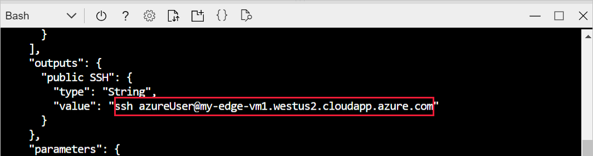

# Quickstart: Deploy your first IoT Edge module to a virtual Linux device

Test out Azure IoT Edge in this quickstart by deploying containerized code to a virtual Linux IoT Edge device. IoT Edge allows you to remotely manage code on your devices so that you can send more of your workloads to the edge. For this quickstart, we recommend using an Azure virtual machine for your IoT Edge device, which allows you to quickly create a test machine with the IoT Edge service installed and then delete it when you're finished.

In this quickstart you learn how to:

1. Create an IoT Hub.
2. Register an IoT Edge device to your IoT hub.
3. Install and start the IoT Edge runtime on your virtual device.
4. Remotely deploy a module to an IoT Edge device.


This quickstart walks you through creating a Linux virtual machine that's configured to be an IoT Edge device. Then, you deploy a module from the Azure portal to your device. The module used in this quickstart is a simulated sensor that generates temperature, humidity, and pressure data. The other Azure IoT Edge tutorials build upon the work you do here by deploying additional modules that analyze the simulated data for business insights.

If you don't have an active Azure subscription, create a [free account](https://azure.microsoft.com/free) before you begin.

[!INCLUDE [cloud-shell-try-it.md](../../includes/cloud-shell-try-it.md)]

You use the Azure CLI to complete many of the steps in this quickstart, and Azure IoT has an extension to enable additional functionality.

Add the Azure IoT extension to the cloud shell instance.

   ```azurecli-interactive
   az extension add --name azure-iot
   ```

[!INCLUDE [iot-hub-cli-version-info](../../includes/iot-hub-cli-version-info.md)]

## Prerequisites

Cloud resources:

* A resource group to manage all the resources you use in this quickstart. We use the example resource group name **IoTEdgeResources** throughout this quickstart and the following tutorials.

   ```azurecli-interactive
   az group create --name IoTEdgeResources --location westus2
   ```

## Create an IoT hub

Start the quickstart by creating an IoT hub with Azure CLI.


The free level of IoT Hub works for this quickstart. If you've used IoT Hub in the past and already have a hub created, you can use that IoT hub.

The following code creates a free **F1** hub in the resource group **IoTEdgeResources**. Replace `{hub_name}` with a unique name for your IoT hub.

   ```azurecli-interactive
   az iot hub create --resource-group IoTEdgeResources --name {hub_name} --sku F1 --partition-count 2
   ```

   If you get an error because there's already one free hub in your subscription, change the SKU to **S1**. Each subscription can only have one free IoT hub. If you get an error that the IoT Hub name isn't available, it means that someone else already has a hub with that name. Try a new name.

## Register an IoT Edge device

Register an IoT Edge device with your newly created IoT hub.


Create a device identity for your IoT Edge device so that it can communicate with your IoT hub. The device identity lives in the cloud, and you use a unique device connection string to associate a physical device to a device identity.

Since IoT Edge devices behave and can be managed differently than typical IoT devices, declare this identity to be for an IoT Edge device with the `--edge-enabled` flag.

1. In the Azure cloud shell, enter the following command to create a device named **myEdgeDevice** in your hub.

   ```azurecli-interactive
   az iot hub device-identity create --device-id myEdgeDevice --edge-enabled --hub-name {hub_name}
   ```

   If you get an error about iothubowner policy keys, make sure that your cloud shell is running the latest version of the azure-iot extension.

2. View the connection string for your device, which links your physical device with its identity in IoT Hub. It contains the name of your IoT hub, the name of your device, and then a shared key that authenticates connections between the two. We'll refer to this connection string again in the next section when you set up your IoT Edge device.

   ```azurecli-interactive
   az iot hub device-identity show-connection-string --device-id myEdgeDevice --hub-name {hub_name}
   ```

   

## Configure your IoT Edge device

Create a virtual machine with the Azure IoT Edge runtime on it.


The IoT Edge runtime is deployed on all IoT Edge devices. It has three components. The *IoT Edge security daemon* starts each time an IoT Edge device boots and bootstraps the device by starting the IoT Edge agent. The *IoT Edge agent* facilitates deployment and monitoring of modules on the IoT Edge device, including the IoT Edge hub. The *IoT Edge hub* manages communications between modules on the IoT Edge device, and between the device and IoT Hub.

During the runtime configuration, you provide a device connection string. This is the string that you retrieved from the Azure CLI. This string associates your physical device with the IoT Edge device identity in Azure.

### Deploy the IoT Edge device

This section uses an Azure Resource Manager template to create a new virtual machine and install the IoT Edge runtime on it. If you want to use your own Linux device instead, you can follow the installation steps in [Install the Azure IoT Edge runtime on Linux](how-to-install-iot-edge-linux.md), then return to this quickstart.

Use the following CLI command to create your IoT Edge device based on the prebuilt [iotedge-vm-deploy](https://github.com/Azure/iotedge-vm-deploy) template.

* For bash or cloud shell users, copy the following command into a text editor, replace the placeholder text with your information, then copy into your bash or cloud shell window:

   ```azurecli-interactive
   az deployment group create \
   --resource-group IoTEdgeResources \
   --template-uri "https://aka.ms/iotedge-vm-deploy" \
   --parameters dnsLabelPrefix='my-edge-vm' \
   --parameters adminUsername='azureUser' \
   --parameters deviceConnectionString=$(az iot hub device-identity show-connection-string --device-id myEdgeDevice --hub-name <REPLACE_WITH_HUB_NAME> -o tsv) \
   --parameters authenticationType='password' \
   --parameters adminPasswordOrKey="<REPLACE_WITH_PASSWORD>"
   ```

* For PowerShell users, copy the following command into your PowerShell window, then replace the placeholder text with your own information:

   ```azurecli
   az deployment group create `
   --resource-group IoTEdgeResources `
   --template-uri "https://aka.ms/iotedge-vm-deploy" `
   --parameters dnsLabelPrefix='my-edge-vm1' `
   --parameters adminUsername='azureUser' `
   --parameters deviceConnectionString=$(az iot hub device-identity show-connection-string --device-id myEdgeDevice --hub-name <REPLACE_WITH_HUB_NAME> -o tsv) `
   --parameters authenticationType='password' `
   --parameters adminPasswordOrKey="<REPLACE_WITH_PASSWORD>"
   ```

This template takes the following parameters:

| Parameter | Description |
| --------- | ----------- |
| **resource-group** | The resource group in which the resources will be created. Use the default **IoTEdgeResources** that we've been using throughout this article or provide the name of an existing resource group in your subscription. |
| **template-uri** | A pointer to the Resource Manager template that we're using. |
| **dnsLabelPrefix** | A string that will be used to create the virtual machine's hostname. Use the example **my-edge-vm** or provide a new string. |
| **adminUsername** | A username for the admin account of the virtual machine. Use the example **azureUser** or provide a new username. |
| **deviceConnectionString** | The connection string from the device identity in IoT Hub, which is used to configure the IoT Edge runtime on the virtual machine. The CLI command within this parameter grabs the connection string for you. Replace the placeholder text with your IoT hub name. |
| **authenticationType** | The authentication method for the admin account. This quickstart uses **password** authentication, but you can also set this parameter to **sshPublicKey**. |
| **adminPasswordOrKey** | The password or value of the SSH key for the admin account. Replace the placeholder text with a secure password. Your password must be at least 12 characters long and have three of four of the following: lowercase characters, uppercase characters, digits, and special characters. |

Once the deployment is complete, you should receive JSON-formatted output in the CLI that contains the SSH information to connect to the virtual machine. Copy the value of the **public SSH** entry of the **outputs** section:

   

### View the IoT Edge runtime status

The rest of the commands in this quickstart take place on your IoT Edge device itself, so that you can see what's happening on the device. If you're using a virtual machine, connect to that machine now using the admin username that you set up and the DNS name that was output by the deployment command. You can also find the DNS name on your virtual machine's overview page in the Azure portal. Use the following command to connect to your virtual machine. Replace `{admin username}` and `{DNS name}` with your own values.

   ```console
   ssh {admin username}@{DNS name}
   ```

Once connected to your virtual machine, verify that the runtime was successfully installed and configured on your IoT Edge device.

1. Check to see that the IoT Edge security daemon is running as a system service.

   ```bash
   sudo systemctl status iotedge
   ```

   

   >[!TIP]
   >You need elevated privileges to run `iotedge` commands. Once you sign out of your machine and sign back in the first time after installing the IoT Edge runtime, your permissions are automatically updated. Until then, use `sudo` in front of the commands.

2. If you need to troubleshoot the service, retrieve the service logs.

   ```bash
   journalctl -u iotedge
   ```

3. View all the modules running on your IoT Edge device. Since the service just started for the first time, you should only see the **edgeAgent** module running. The edgeAgent module runs by default and helps to install and start any additional modules that you deploy to your device.

   ```bash
   sudo iotedge list
   ```

   

Your IoT Edge device is now configured. It's ready to run cloud-deployed modules.

## Deploy a module

Manage your Azure IoT Edge device from the cloud to deploy a module that will send telemetry data to IoT Hub.


[!INCLUDE [iot-edge-deploy-module](../../includes/iot-edge-deploy-module.md)]

## View generated data

In this quickstart, you created a new IoT Edge device and installed the IoT Edge runtime on it. Then, you used the Azure portal to deploy an IoT Edge module to run on the device without having to make changes to the device itself.

In this case, the module that you pushed generates sample environment data that you can use for testing later. The simulated sensor is monitoring both a machine and the environment around the machine. For example, this sensor might be in a server room, on a factory floor, or on a wind turbine. The message includes ambient temperature and humidity, machine temperature and pressure, and a timestamp. The IoT Edge tutorials use the data created by this module as test data for analytics.

Open the command prompt on your IoT Edge device again, or use the SSH connection from Azure CLI. Confirm that the module deployed from the cloud is running on your IoT Edge device:

   ```bash
   sudo iotedge list
   ```

   

View the messages being sent from the temperature sensor module:

   ```bash
   sudo iotedge logs SimulatedTemperatureSensor -f
   ```

   >[!TIP]
   >IoT Edge commands are case-sensitive when referring to module names.

   

You can also watch the messages arrive at your IoT hub by using the [Azure IoT Hub extension for Visual Studio Code](https://marketplace.visualstudio.com/items?itemName=vsciot-vscode.azure-iot-toolkit).

## Clean up resources

If you want to continue on to the IoT Edge tutorials, you can use the device that you registered and set up in this quickstart. Otherwise, you can delete the Azure resources that you created to avoid charges.

If you created your virtual machine and IoT hub in a new resource group, you can delete that group and all the associated resources. Double check the contents of the resource group to make sure that there's nothing you want to keep. If you don't want to delete the whole group, you can delete individual resources instead.

Remove the **IoTEdgeResources** group.

```azurecli-interactive
az group delete --name IoTEdgeResources
```

## Next steps

In this quickstart, you created an IoT Edge device and used the Azure IoT Edge cloud interface to deploy code onto the device. Now, you have a test device generating raw data about its environment.

The next step is to set up your local development environment so that you can start creating IoT Edge modules that run your business logic.

> [!div class="nextstepaction"]
> [Start developing IoT Edge modules for Linux devices](tutorial-develop-for-linux.md)
